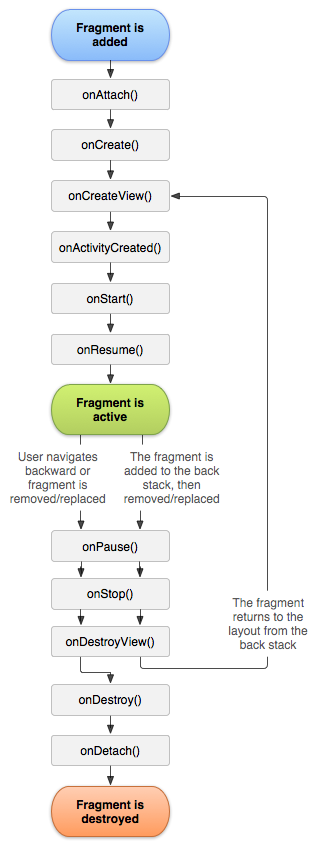
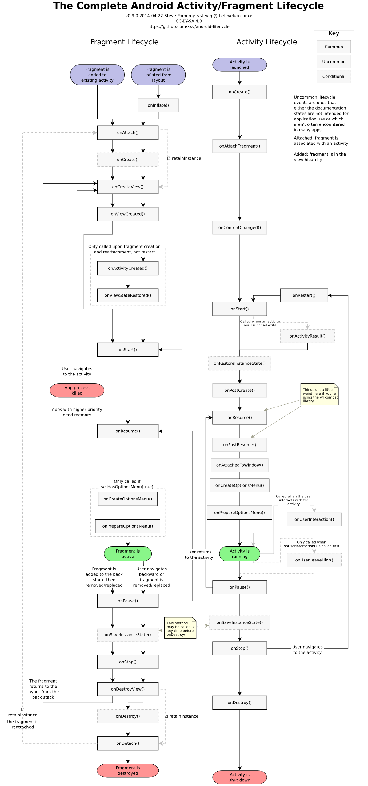
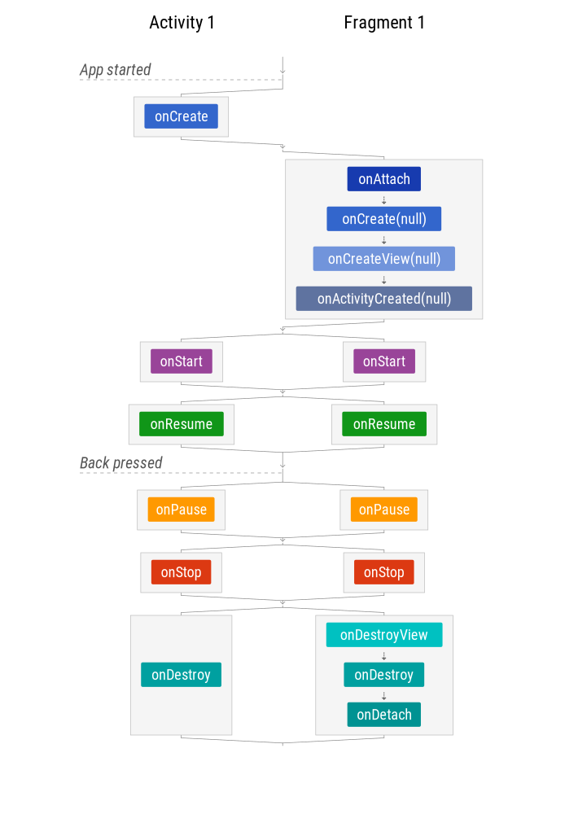

---
# Android Architecture
---
## What is Clean Architecture?
-   Clean Architecture separates responsibilities into layers.
-   It improves testability and maintainability.
-   It should be used according to project complexity, not as a rule for
    creating unnecessary classes.

```text
UI
 ↓
ViewModel
 ↓
UseCase
 ↓
Repository
 ↓
Data Sources
```

For a small feature, several layers may be unnecessary. For a large
banking application, clear boundaries become more valuable.
---
## What is the Repository pattern?
-   A Repository hides where data comes from.
-   It can coordinate API, database, cache, and other sources.

```kotlin
interface UserRepository {
    fun observeUser(): Flow<User>
}
```

The ViewModel does not need to know whether data came from Room, REST,
GraphQL, or memory.
---
## What is a UseCase?
-   A UseCase represents a business operation.
-   It keeps business rules out of the ViewModel.

```kotlin
class TransferMoneyUseCase(
    private val repository: PaymentRepository
) {
    suspend operator fun invoke(
        from: String,
        to: String,
        amount: Long
    ) = repository.transfer(from, to, amount)
}
```

Do not create a UseCase for every trivial getter just to follow a
pattern.
---
## What is dependency injection?
-   Dependency Injection means an object receives dependencies instead
    of constructing them internally.
-   It improves testing and separation of concerns.

```kotlin
class UserViewModel(
    private val repository: UserRepository
)
```

The ViewModel does not create `UserRepository()` itself.
---
## What are Hilt scopes?
The scope should match the required lifetime. Common scopes include:

```text
SingletonComponent
ActivityRetainedComponent
ViewModelComponent
ActivityComponent
FragmentComponent
```

A dependency that is only needed by one ViewModel should not
automatically become a global singleton.
---
## How do you test Flow and StateFlow?
- Use a Flow testing library such as Turbine where appropriate.
- Test important state transitions rather than internal implementation details.
- Example:
```kotlin
viewModel.state.test {
    assertEquals(Loading, awaitItem())
    assertEquals(Success(user), awaitItem())
}
```
---
## You need to fetch data from both the local Room database and network. How do you design this?
Use Repository with a fallback logic:

-   First try Room DB (cached data).
-   If data is old/missing, fetch from API.
-   Save new data in the Room.

This ensures:

-   Fast response (local DB)
-   Always fresh data (network)
---
## In MVVM, who should handle click events and why?
- The ViewModel should handle logic, not the Activity/Fragment.
- Keeps code testable and follows separation of concerns.
- UI calls `viewModel.onLoginClicked()`
- ViewModel checks input, performs API call
- Emits success/error state via LiveData or StateFlowx
---
## How would you secure a local database?
-   Minimize sensitive data.
-   Encrypt sensitive database content when required.
-   Protect encryption keys using appropriate secure key-management
    mechanisms.
-   Restrict access.
-   Avoid logging database contents.
-   Consider backup behavior and logout/data-retention requirements.
---
## How do you handle search in a ViewModel?
- `mapLatest` cancels the previous suspend search when a newer query
arrives.
- For a Flow-returning search function, use `flatMapLatest`.
- Example:
```kotlin
private val query = MutableStateFlow("")

val results = query
    .debounce(300)
    .distinctUntilChanged()
    .mapLatest { text ->
        repository.search(text)
    }
```
---
## What is a database transaction?
-  A transaction groups operations so they succeed or fail together
    according to the database's transaction guarantees.
- This is important when multiple pieces of local state must remain
consistent.
```text
Update account
Update transaction
Update balance
        ↓
    Transaction
```
---
## Why we should use MVP / MVVM architectures?
- To avoid too much logic code in the UI layer and god activities
- Reusable code that's easier to test
- Avoid duplicated code between common views
- Easier to maintain
- We can test logic without using instrumentation tests.
---
## Why the View should be implemented with an interface in MVP?
- To decouple the code from the implementation view.
- To abstract the framework used to write our presentation layer, regardless of any external dependency.
- To be able to easily change the implementation of view if needed.
- To follow the SOLID dependency rule to improve unit testability and in order to follow the dependency rule, high-level concepts (such as the presenter implementation) can't depend on low-level details (like the implementation view).
---
## Difference between MVC & MVP & MVVM & MVI?
| Factor | MVC | MVP | MVVM | MVI |
|---|---|---|---|---|
| Full Name | Model-View-Controller | Model-View-Presenter | Model-View-ViewModel | Model-View-Intent |
| Main Goal | Separate UI, input handling, and data | Move presentation logic out of View | Separate UI from presentation state/logic | Unidirectional, predictable state management |
| Data Flow | Usually mixed / flexible | View ↔ Presenter ↔ Model | View ↔ ViewModel ↔ Model | Intent → ViewModel/Reducer → State → View |
| Direction | Often bidirectional | Mostly bidirectional | Mostly View → VM → View | Strictly unidirectional |
| UI State | Usually held by View | Presenter manages some state | ViewModel owns UI state | Single source of truth in State |
| Business/UI Logic | Controller/View | Presenter | ViewModel | ViewModel + Reducer/State logic |
| Android Fit | Legacy/simple apps | Legacy Android apps | Very common | Excellent for complex stateful UIs |
| Lifecycle Handling | Usually manual | Presenter lifecycle must be handled | ViewModel survives configuration changes | ViewModel + StateFlow handles lifecycle well |
| Testability | Low to medium | High | High | Very high |
| Complexity | Low | Medium | Medium | Higher |
| Boilerplate | Low | Medium | Medium | Medium to high |
| Predictability | Low to medium | Medium | High | Very high |
| State Management | Weak | Manual | Strong | Very strong |
| Recommended for New Android Apps | Usually no | Usually no | Yes | Yes for complex state |
| Best For | Small/legacy applications | Separating presentation logic | Most modern Android apps | Complex state-driven applications |

---
## Usecases of OkHttp Interceptor
- **Application interceptors** add headers, logging, or common request behavior.
- **Network interceptors** observe the actual network request and response.
- Keep authentication refresh logic in an `Authenticator` when a `401` response should trigger a token refresh.
---
## Usecases of HTTP Polling and WebSocket
- **Polling** repeatedly asks the server for updates and is simple but wasteful.
- **WebSocket** keeps a two-way connection for near real-time updates.
- Use **SSE** when the server mainly sends one-way events.
- Choose based on latency, battery, scale, and reconnect behavior.
---
## What is Android Architecture?
- It defines a way to structure code into layers.
- Helps separate UI, data, and business logic.
- Makes the code easy to maintain, test, and scale.
---
## What is Repository in MVVM?
- The Repository is responsible for fetching data.
- It abstracts the data sources (API, Room database, Firebase, etc.) from the ViewModel. This separation makes it easy to manage and test data logic.
---
## What are UseCases in Clean Architecture?
- A UseCase contains a single specific business logic (e.g., GetUserDetails).
- Keeps the ViewModel clean by handling complex logic inside it.
- Lies in the domain layer in Clean Architecture.
- Reusable and testable units of code.
---
# Android Fundamentals
---
## How would you implement offline-first behavior?
- I would design the application as offline-first, where Room acts as the local source of truth and the UI observes it using Flow. The repository coordinates Room and the remote API. All local mutations are written to Room immediately and also added to a persistent outbox or sync queue in the same database transaction. WorkManager performs synchronization when network connectivity is available.

- For conflict resolution, I would use optimistic concurrency with a server-generated version or revision number. When a client sends an update, it includes the version it last read. If the server version has changed, the server rejects the update as a conflict instead of silently overwriting the newer data. The conflict resolver can then apply last-write-wins, server-wins, client-wins, field-level merging, or business-specific rules depending on the data. For sensitive business operations, I would keep the server authoritative.

- I would also use idempotency keys so retries don't duplicate operations, exponential backoff for transient failures, and WorkManager for reliable background synchronization. In a multi-module architecture, feature modules depend on domain abstractions, while data modules own Room, networking, and synchronization. This keeps offline behavior, synchronization, and conflict handling isolated and testable."

```text
Interview keywords to remember
Offline First
      ↓
Room = Source of Truth
      ↓
Flow / StateFlow
      ↓
Repository
      ↓
Outbox Pattern
      ↓
WorkManager
      ↓
Push + Pull Sync
      ↓
Optimistic Concurrency
      ↓
Version / Revision
      ↓
Conflict Detection
      ↓
Conflict Resolution
      ↓
Idempotency
      ↓
Retry + Exponential Backoff
```
---
## What is an HTTP interceptor?
- An interceptor can inspect or modify requests and responses.
- Common uses include headers, authentication, logging, and metrics.
- Never log authorization headers, tokens, or sensitive customer
information.
- Example:
```text
Request
  ↓
Interceptor
  ↓
Network
  ↓
Response
```
---
## How should authentication tokens be stored?
-   Avoid plain SharedPreferences for sensitive credentials.
-   Minimize what is stored.
-   Use Android Keystore-backed mechanisms and approved secure storage
    approaches.
-   Clear sensitive state when required during logout.
-   Never log tokens.

```text
Login
 ↓
Authentication server
 ↓
Access token
 ↓
Secure storage
 ↓
API request
```
---
## What is the difference between 401 and 403?
-   `401 Unauthorized` generally means authentication is missing or
    invalid.
-   `403 Forbidden` means the caller is authenticated but not allowed to
    perform the operation.

```text
401 → "Who are you?"
403 → "I know who you are, but you cannot do this."
```
---
## What is `collectAsStateWithLifecycle()`?
-   It collects a Flow from Compose while respecting the lifecycle.
-   It avoids unnecessary collection while the UI is not active.
- It is generally preferred over manually collecting a Flow directly from
composition.
- Example:
```kotlin
val state by viewModel.state
    .collectAsStateWithLifecycle()
```
---
## What is process death?
-   Android can kill the application process when resources are needed.
-   A ViewModel does not survive process death.
-   Important state must be restored through saved-state mechanisms or
    recreated from persistent storage.
- Do not assume ViewModel means permanent state.
---
## What is the difference between Activity context and Application context?
-   Activity context is tied to an Activity lifecycle.
-   Application context lives as long as the application process.
- Do not store an Activity context in a long-lived singleton because it
can cause a memory leak.
- Use Application context for application-wide dependencies when
appropriate.
---
## How do you handle flaky tests?
-   Find the root cause instead of repeatedly rerunning.
-   Remove arbitrary sleeps.
-   Use deterministic synchronization.
-   Check test isolation.
-   Check race conditions.
-   Control coroutine dispatchers.
-   Separate product failures from environment failures.

```text
Flaky test
   ↓
Timing?
Isolation?
Environment?
Concurrency?
Product bug?
   ↓
Fix root cause
```
---
## What are CI quality gates?
Possible gates include:

-   Compilation
-   Unit tests
-   Instrumentation tests
-   Lint
-   Static analysis
-   Security scanning
-   Dependency checks
-   Required code review

A quality gate should prevent known high-risk problems from reaching
release.
---
## What is modularization?
-   Modularization divides a large codebase into meaningful modules.
-   It improves ownership, dependency boundaries, build performance, and
    reuse.
- Do not create modules for every small class.
- Example:
```text
:app

:feature-login
:feature-dashboard
:feature-payments

:core-network
:core-database
:core-ui
:core-security
```
---
## What are shared libraries in Android?
- Shared libraries contain functionality used by multiple features or
teams.
- They should have stable APIs and avoid unnecessary feature-specific
dependencies.
- Examples:
```text
Design system
Networking
Authentication
Logging
Analytics
Security utilities
```
---
## What is Android startup performance?
- Startup performance is the time needed before the application becomes
usable.
- Common problems:
    1.   Heavy Application initialization
    2.   Synchronous disk I/O
    3.   Large dependency initialization
    4.   Unnecessary SDK initialization
    5.   Expensive database work
- Use profiling and startup metrics before optimizing.
---
## What is Macrobenchmark?
-   Macrobenchmark measures larger user journeys on real Android devices
    or emulators.
-   It is useful for startup, scrolling, and other performance
    scenarios.
- Example:
```text
Launch app
 ↓
Navigate
 ↓
Scroll
 ↓
Measure performance
```
---
## What is feature flagging?
-  A feature flag controls whether functionality is enabled.
-  It allows deployment and release to be separated.
-  It supports gradual rollout and quick disablement
- Example:
```kotlin
if (featureFlags.newPaymentFlow) {
    NewPaymentScreen()
} else {
    OldPaymentScreen()
}
```
---
## What is a phased rollout?
- Instead of releasing to everyone immediately:
```text
1%
 ↓
5%
 ↓
10%
 ↓
25%
 ↓
50%
 ↓
100%
```
- Monitor:
    1.   Crash rate
    2.   ANR
    3.   API errors
    4.   Performance
    5.   Business metrics
- Stop or roll back if important metrics degrade.
---
## What is operational readiness?
- Before release, define:
    1.   Monitoring
    2.   Alerts
    3.   Rollback process
    4.   Feature flag strategy
    5.   Ownership
    6.   Runbook
    7.   Known failure modes
- A feature is not production-ready simply because the code works locally.
---
## What is a runbook?
- A runbook explains what to do when an operational problem occurs.
```text
Problem
 ↓
Detection
 ↓
Investigation
 ↓
Mitigation
 ↓
Rollback
 ↓
Recovery
```
- For example, a crash spike after release should have a documented rollback or feature-disable procedure.
---
## What is crash-free rate?
-   It measures how many users or sessions complete without crashes.
-   It is a useful stability metric.
- Track it by:
```text
App version
Device
OS version
Feature
Release cohort
```
- A single overall percentage can hide problems affecting a specific
group.
---
## How do you handle pagination?
- For simple offset pagination:
```text
page=1
page=2
page=3
```
- For more reliable APIs, cursor pagination can be better:
```text
cursor=A
 ↓
nextCursor=B
 ↓
nextCursor=C
```
- For Android, Paging 3 can manage loading, retry, refresh, and
presentation state.
---
## How do you handle configuration changes (like screen rotation) in Android without losing data?
- ViewModel stores UI-related data across configuration changes.
- When screen rotates:
```text
Activity/Fragment is destroyed and recreated
 ↓
ViewModel is not destroyed
 ↓
ViewModel retains the data and passes it again to the UI.
```
- Example: In a profile screen, if user scrolls halfway and rotates the screen, without ViewModel the screen will reload from start. But with ViewModel, the profile data and scroll position can be restored smoothly.
---
## What is the difference between retry and refresh?
-   Retry repeats a failed operation.
-   Refresh requests the latest state/data again.
- A retry should be used carefully with writes.
- For financial operations, use idempotency and server-side transaction
semantics before retrying.
---
## What is idempotency?
-   An operation is idempotent when repeating the same request does not
    create additional unintended effects.
-   It is critical for payment and transaction workflows.
```text
POST payment + idempotencyKey=ABC
POST payment + idempotencyKey=ABC
```
- The server can recognize that both requests represent the same
operation.
---
## How do you use AI coding assistants safely?
-   Use only organization-approved AI tools.
-   Do not provide confidential source code or customer data unless
    explicitly permitted.
-   Treat generated code as untrusted suggestions.
-   Review the code.
-   Run tests.
-   Run static analysis and security checks.
-   Validate behavior against requirements.
```text
AI suggestion
    ↓
Developer review
    ↓
Tests
    ↓
Static/security analysis
    ↓
Code review
    ↓
Merge
```
---
## What are the risks of AI-generated code?
- Possible risks:
    1.   Incorrect APIs
    2.   Security vulnerabilities
    3.   Poor architecture
    4.   Hallucinated behavior
    5.   License/IP concerns
    6.   Sensitive data exposure
    7.   Hidden edge cases
- The developer remains responsible for the final code.
---
## How would you respond if AI generated insecure token storage?
- Do not merge it.
```text
Generated code
 ↓
Security review
 ↓
Identify insecure storage
 ↓
Replace with approved secure approach
 ↓
Add tests
 ↓
Run security/static checks
 ↓
Code review
```
- AI can accelerate implementation but cannot replace engineering
judgment.
---
## How do you handle an architecture disagreement?
-   Understand the other proposal.
-   Compare trade-offs.
-   Use requirements and measurable constraints.
-   Prototype when uncertainty is high.
-   Align with the team.
-   Document important decisions.
- Avoid making the discussion about who is technically right.
---
## What delivery metrics matter for an Android team?
- Important metrics include:
    1.   Cycle time
    2.   Deployment frequency
    3.   Defect escape rate
    4.   Crash-free users
    5.   ANR rate
    6.   Build duration
    7.   Test stability
    8.   Release rollback rate
- Do not optimize one metric alone.
- For example, reducing cycle time by skipping tests can increase
production defects.
---
## How would you reduce Android app startup time?
-   Remove unnecessary initialization from `Application`.
-   Lazy-load noncritical dependencies.
-   Avoid synchronous disk/database work on startup.
-   Defer analytics/SDK initialization where allowed.
-   Use Baseline Profiles.
-   Measure using startup benchmarks and production telemetry.
- The first step should be profiling, not guessing.
---
## How do you handle sensitive data in logs?
- Never log:
```text
Passwords
Access tokens
Refresh tokens
PINs
Full account numbers
Sensitive customer data
```
- Use safe identifiers and structured logging where appropriate.
- Production logging should follow security and privacy policies.
---
## What is screenshot protection?
- Android can restrict screenshots for sensitive screens using appropriate
window flags.
```kotlin
window.setFlags(
    WindowManager.LayoutParams.FLAG_SECURE,
    WindowManager.LayoutParams.FLAG_SECURE
)
```
- Use it where the security requirement calls for preventing screenshots
or screen capture.
---
## How do you reduce memory usage?
-   Avoid holding Activity/View references in long-lived objects.
-   Load images at appropriate sizes.
-   Avoid unnecessary large collections.
-   Close resources appropriately.
-   Use lifecycle-aware components.
-   Profile before optimizing.
---
## What is a good Android testing strategy?

```text
Unit tests
   ↓
Business logic / ViewModel

Integration tests
   ↓
Repository / DB / networking boundaries

UI tests
   ↓
Critical user journeys
```

---
## What is a quality gate you would add to CI?

```text
Compile
 ↓
Lint
 ↓
Static analysis
 ↓
Unit tests
 ↓
Security/dependency checks
```

For release:
```text
Instrumentation/UI tests
 ↓
Release build
 ↓
Signing
 ↓
Artifact verification
 ↓
Deployment
```

---
## How do you avoid overengineering?

```text
What problem does this abstraction solve?
Will the project need it?
Does it improve testability or maintainability?
Does the complexity justify the benefit?
```

---
## How do you handle one-time events such as navigation?
- Keep durable screen state separate from transient events.
```kotlin
data class UiState(
    val account: Account? = null,
    val isLoading: Boolean = false
)

sealed interface UiEvent {
    data object NavigateBack : UiEvent
    data class ShowMessage(val text: String) : UiEvent
}
```
- Use an appropriate event stream such as SharedFlow and collect it
lifecycle-safely.
---
## How do you prevent duplicate navigation events after rotation?
-   Do not model navigation as a simple persistent Boolean.
-   Treat navigation as a transient event or derive navigation from
    durable state.
-   Ensure the event consumption model is lifecycle-aware.
---
## What is the role of Android SDK knowledge in modern Android?
-   Lifecycle
-   Context
-   Activity
-   Services
-   Permissions
-   Saved state
-   Background execution
-   Notifications
-   Configuration changes
-   OS behavior
---
## What is your approach when supporting multiple Android OS versions?
-   Use supported APIs according to min/target SDK.
-   Guard newer APIs with version checks when required.
-   Test behavior across important OS/device combinations.
-   Avoid assuming behavior is identical across versions.
-   Monitor production issues by OS version.
```kotlin
if (Build.VERSION.SDK_INT >= Build.VERSION_CODES.X) {
    // New API
}
```

---
## What does "high-quality user experience across devices and OS versions" mean?

-   Responsive layouts
-   Accessibility
-   Correct lifecycle behavior
-   Reliable offline/error states
-   Good startup and rendering performance
-   Proper font scaling
-   Device/OS compatibility
-   Safe background behavior
-   Consistent navigation

---
## How would you approach a moderately complex feature from requirements to production?
```text
Requirements
 ↓
Clarify edge cases
 ↓
Architecture/design
 ↓
Security review
 ↓
Implementation
 ↓
Unit tests
 ↓
Integration/UI tests
 ↓
CI quality gates
 ↓
Phased release
 ↓
Monitoring
 ↓
Post-release review
```

---
## What is the `Application` class and how should teams use it safely?
- Application is the process-level entry point of an Android app. Android creates one Application instance when the app process starts.
- Use if for global initialization such as DI, logging, analytics, database, or networking.
- Avoid storing mutable UI/business state in it.
- Example:
```text
class MyApplication : Application() {

    override fun onCreate() {
        super.onCreate()

        // Initialize app-wide dependencies
        Timber.plant(Timber.DebugTree())
    }
}
```
- Register It:

```
<application
    android:name=".MyApplication"
    ... />
```

---
## Describe classic Android application architecture components.
- **Activities:** foreground UI entry.
- **Services:** background work (with modern restrictions).
- **Broadcast receivers:** subscribe to events (explicit vs implicit carefully).
- **Content providers:** structured cross-app data with permissions.
- **Intents:** messaging between components.
- **Resources:** localization, density, configuration qualifiers.
---
## Intents: explicit vs implicit; Intent filters; PendingIntent; sticky broadcasts (legacy).
| Concept              | Short Explanation                                                                                                              | Example                                                       |
| -------------------- | ------------------------------------------------------------------------------------------------------------------------------ | ------------------------------------------------------------- |
| **Explicit Intent**  | Specifies the exact component to launch.                                                                                       | `Intent(this, SecondActivity::class.java)`                    |
| **Implicit Intent**  | Specifies an action, and Android finds a suitable component.                                                                   | `Intent(Intent.ACTION_VIEW, Uri.parse("https://google.com"))` |
| **Intent Filter**    | Declares which implicit intents a component can handle.                                                                        | `<intent-filter>` with `ACTION_VIEW`                          |
| **PendingIntent**    | Gives another app/system permission to execute an Intent **later on your app's behalf**. Common in notifications, alarms, etc. | `PendingIntent.getActivity(...)`                              |
| **Sticky Broadcast** | Broadcast whose last value remains available after delivery. **Legacy/deprecated approach; avoid for new apps.**               | `sendStickyBroadcast()` ❌                                     |

---
## `START_NOT_STICKY` vs `START_STICKY` vs `START_REDELIVER_INTENT`
| Mode                     | If Service is killed           | `Intent` after restart             | Typical use                    |
| ------------------------ | ------------------------------ | ---------------------------------- | ------------------------------ |
| `START_NOT_STICKY`       | **Don't recreate** the Service | No new Intent                      | One-time/background task       |
| `START_STICKY`           | **Recreate** the Service       | Usually `null`                     | Long-running service           |
| `START_REDELIVER_INTENT` | **Recreate** the Service       | **Original Intent is redelivered** | Must finish a specific command |

---
## Launch modes: `standard`, `singleTop`, `singleTask`, `singleInstance` (corrected interview explanation)
| Launch Mode      | New Instance?         | Existing Instance Reused?   | `onNewIntent()` | Typical Use                    |
| ---------------- | --------------------- | --------------------------- | --------------- | ------------------------------ |
| `standard`       | ✅ Always              | ❌                           | ❌               | Default, normal screens        |
| `singleTop`      | ⚠️ Only if not on top | ✅ If already on top         | ✅               | Notifications, detail screens  |
| `singleTask`     | ❌                     | ✅ Existing instance in task | ✅               | Main/root Activity, deep links |
| `singleInstance` | ❌                     | ✅ One dedicated task        | ✅               | Special isolated Activity      |

---
## Processes vs threads vs tasks
| Concept     | What it represents                  | Main purpose                | Example                        |
| ----------- | ----------------------------------- | --------------------------- | ------------------------------ |
| **Process** | OS-level execution container        | Memory & resource isolation | Your app's Linux process       |
| **Thread**  | Unit of execution inside a process  | Execute code                | Main thread, background thread |
| **Task**    | Collection/back stack of Activities | Manage user navigation      | `Login → Home → Details`       |

---
## Thread safety primitives (volatile/synchronized caveat)
#### volatile
- Ensures changes are visible across threads, but does not guarantee atomicity.
- Example:
```kotlin
@Volatile var isRunning = true
```
#### synchronized
- Allows only one thread at a time to access a critical section.
- Example:
```kotlin
synchronized(lock) {
    count++
}
```
---
## Parcelable vs Serializable (performance & security framing)
#### Parcelable
- Android-specific, generally faster and more efficient because it manually writes data to a Parcel.
- Example:
```kotlin
@Parcelize
data class User(val id: Int, val name: String) : Parcelable
```

#### Serializable
- Standard Java mechanism, easier but slower due to reflection/object serialization overhead.
- Example:
```kotlin
data class User(val id: Int, val name: String) : Serializable
```
---
## compileSdk vs targetSdk vs minSdk
|                               | `compileSdk`                  | `targetSdk`                     | `minSdk`                                 |
| ----------------------------- | ----------------------------- | ------------------------------- | ---------------------------------------- |
| **Purpose**                   | Compile the app               | Define target Android behavior  | Define minimum supported Android version |
| **Affects build?**            | ✅ Yes                         | ❌ Not directly                  | ✅ Yes                                    |
| **Affects runtime behavior?** | ❌ No                          | ✅ Yes                           | ✅ Yes                                    |
| **Can use newer APIs?**       | ✅ Yes                         | Not necessarily                 | Only with version checks                 |
| **Example**                   | `36`                          | `36`                            | `24`                                     |
| **Meaning**                   | Build against Android 16 APIs | App targets Android 16 behavior | Supports Android 7.0+                    |

---
## Fragment Lifecycle
 
---
## What is the correlation between activity and fragment life cycle?
Here is how Activity's and Fragment's lifecyle are called together:<br/>
    
---
## Difference between adding/replacing `fragment` in `backstack`?
|                   | **Add Fragment**                  | **Replace Fragment**                      |
| ----------------- | --------------------------------- | ----------------------------------------- |
| What happens      | Adds a new Fragment on top        | Removes current Fragment and adds new one |
| Existing Fragment | Usually remains in container      | Removed from container                    |
| UI                | Both can remain in hierarchy      | Only new Fragment is visible              |
| Back stack        | Can add transaction to back stack | Can add transaction to back stack         |
| Common use        | Multiple fragments together       | Screen-to-screen navigation               |

<br>
<p align="center">
  
  
</p>
    
---
## What is the difference between Dialog and DialogFragment?
|                       | **Dialog**               | **DialogFragment**                   |
| --------------------- | ------------------------ | ------------------------------------ |
| Type                  | Window/UI component      | Fragment that hosts a Dialog         |
| Lifecycle             | Managed manually         | Managed by Fragment lifecycle        |
| Configuration changes | Can be problematic       | Better handling                      |
| Back stack            | ❌ No Fragment back stack | ✅ Can integrate with FragmentManager |
| Recommended           | Simple/temporary dialogs | Complex or lifecycle-aware dialogs   |

---
## What is the difference between `apply()` and `commit()` in `sharedPreferences`?
|                                          | `apply()`    | `commit()`                   |
| ---------------------------------------- | ------------ | ---------------------------- |
| **Write**                                | Asynchronous | Synchronous                  |
| **Return value**                         | `Unit`       | `Boolean`                    |
| **Blocks calling thread?**               | ❌ No         | ✅ Yes                        |
| **Can cause UI delay?**                  | Less likely  | Yes, if used on main thread  |
| **Know immediately if write succeeded?** | ❌ No         | ✅ Yes                        |
| **Recommended**                          | ✅ Usually    | Only when result is required |

---
## What is Pending Intent in Android?
- Pending Intent is an intent which you want to trigger at some time in future, even when your application is not alive. 
- This intent can be used by other application which allows it to execute that intent with the same permissions as of our application.
- PendingIntent uses the following methods to handle the different types of intents:
- Example:
```kotlin
Intent intent = new Intent(this, AnyActivity.class);

// Creating a pending intent and wrapping our intent
PendingIntent pendingIntent = PendingIntent.getActivity(this, 1, intent, PendingIntent.FLAG_UPDATE_CURRENT);
try {
    // Perform the operation associated with our pendingIntent
    pendingIntent.send();
} catch (PendingIntent.CanceledException e) {
    e.printStackTrace();
}
```
```kotlin
PendingIntent.getActivity();   // Retrieves a PendingIntent to start an Activity
PendingIntent.getBroadcast(); // Retrieves a PendingIntent to perform a Broadcast
PendingIntent.getService();  // Retrieves a PendingIntent to start a Service
```
---
## How to know `configChange` happens in `onDestroy()` function?
Once an activity is in the process of finishing then `isFinishing()` method is returned `true` value, otherwise `false` when the system is temporarily destroying the instance of the activity.

---
## What is thread-safe mean? How we can make our code thread-safe?
- Thread-safe means code can be safely accessed by multiple threads simultaneously without causing incorrect or inconsistent results.
- How to achieve it:
    1. Use synchronized / locks
    2. Use AtomicInteger, AtomicBoolean, etc.
    3. Use thread-safe collections
    4. Prefer immutable data
    5. Use Kotlin coroutines with proper synchronization
- Example:
```kotlin
synchronized(lock) {
    count++
}
```
---
## AIDL vs Messenger Queue
|               | **AIDL**                           | **Messenger**                  |
| ------------- | ---------------------------------- | ------------------------------ |
| Communication | IPC between processes              | IPC between processes          |
| Calls         | **Concurrent / multiple requests** | **Sequential queue**           |
| Threading     | Can handle multiple threads        | Requests handled one at a time |
| Complexity    | More complex                       | Simpler                        |
| Best for      | High-performance IPC               | Simple request/response IPC    |

```text
AIDL:
Client → Request 1 ─┐
Client → Request 2 ─┼→ Service
Client → Request 3 ─┘   (can process concurrently)
```
```text
Messenger:
Client → Request 1 → Request 2 → Request 3 → Service
                       (queued)
```

---
## What is a ThreadPool? And is it more effective than using several separate Threads?
- A ThreadPool is a group of reusable threads that execute tasks from a queue.
```text
Tasks → Queue → ThreadPool → Threads
          ↓
       Reuse threads
```
- ThreadPool is usually better than creating separate threads because it:
    1. Reuses threads
    2. Reduces thread creation overhead
    3. Controls the number of concurrent tasks
    4. Prevents creating too many threads
- Example:
```kotlin
val executor = Executors.newFixedThreadPool(4)
executor.submit { doWork() }
```

---
## What is a JobScheduler?
- JobScheduler schedules deferrable background work using conditions such as network or charging.
- The system controls the exact execution time to protect battery.
- Prefer WorkManager for most app-level persistent jobs.
---
## Livedata Setvalue vs Postvalue
- `setValue()` updates LiveData immediately and must run on the main thread.
- `postValue()` schedules an update from a background thread.
- Several quick `postValue()` calls may be coalesced, so the latest value can win.
---
## What is renderscript?
- RenderScript was an Android API for compute-heavy operations.
- It is deprecated and should not be used for new code.
- Consider Kotlin, optimized libraries, GPU APIs, or the NDK for current needs.
---
## FlatBuffers vs JSON.
- JSON is text-based, human-readable, and easy to debug.
- FlatBuffers is a compact binary format with fast access and low parsing overhead.
- Use FlatBuffers for performance-sensitive structured data; use JSON for flexible APIs and readability.
---
## Log.v(), Log.d(), Log.i(), Log.w(), Log.e() - When to use each one?

- `VERBOSE`: very detailed development diagnostics.
- `DEBUG`: developer troubleshooting.
- `INFO`: important normal application events.
- `WARN`: unexpected but recoverable conditions.
- `ERROR`: failures that need investigation.
- Never log tokens, passwords, or personal data.

---
## Understanding scope storage in android
- Scoped storage limits broad access to shared external files.
- Use app-specific storage for private files.
- Use MediaStore for shared photos, videos, and audio.
- Use the Storage Access Framework when the user selects documents.
---
## Solve out of memory error
- Capture a heap dump and identify the object retaining excessive memory.
- Load large images at the display size and use an image-loading library.
- Avoid holding Activity or View references in long-lived objects.
- Page large datasets and release caches when memory is low.
---
## Reason for the exit in Android Application
- The user may finish the Activity or remove the task.
- The system may kill the process to reclaim memory.
- A crash, force-stop, or device restart can also end the process.
- Save important state because process death can happen without a final callback.
---
## Android Jetpack component
- Jetpack is a collection of Android libraries and guidance.
- It includes lifecycle, ViewModel, Room, Navigation, WorkManager, Compose, and more.
- These components reduce boilerplate and encourage lifecycle-aware design.
---
## Arraymap vs Sparsh Array
|          | `ArrayMap`                  | `SparseArray`                   |
| -------- | --------------------------- | ------------------------------- |
| Key      | Any object                  | `Int`                           |
| Stores   | Key → Value                 | Int → Value                     |
| Memory   | Less than `HashMap`         | Less than `HashMap<Integer, V>` |
| Best for | Small maps with object keys | Small maps with integer keys    |
| Example  | `ArrayMap<String, User>`    | `SparseArray<User>`             |

---
## Java Android Multithreading programming
- Keep blocking work off the main thread.
- Use coroutines with structured concurrency for new Kotlin code.
- Use executors for controlled Java-style task pools.
- Protect shared mutable state with synchronization or atomic types.

---
## How can you prevent creating another instance of singleton using `clone()` method?
The preferred way to prevent creating another instance of a singleton is by not implementing Cloneable interface and if you do just throw an exception from `clone()` method".

---
## What is the onTrimMemory() method?
- onTrimMemory() is a callback that tells your app the system is under memory pressure and your app should release unnecessary memory.
- Example: 
```kotlin
override fun onTrimMemory(level: Int) {
    super.onTrimMemory(level)

    if (level >= TRIM_MEMORY_BACKGROUND) {
        imageCache.clear()
    }
}
```

---
## Why is it recommended to use only the default constructor to create a Fragment?
- The reason why you should be passing parameters through bundle is because when the system restores a fragment (e.g on config change), it will automatically restore your bundle. 
- This way you are guaranteed to restore the state of the fragment correctly to the same state the fragment was initialised with.

---
## What are retained fragments
- By default, Fragments are destroyed and recreated along with their parent Activity’s when a configuration change occurs. 
- Calling ```setRetainInstance(true)``` allows us to bypass this destroy-and-recreate cycle, signaling the system to retain the current instance of the fragment when the activity is recreated.<br>

---
## What is Toast in Android?
Android Toast can be used to display information for the short period of time. A toast contains message to be displayed quickly and disappears after sometime.

---
## What is the difference between a regular .png and a nine-patch image?
|              | **PNG**                | **Nine-Patch**                     |
| ------------ | ---------------------- | ---------------------------------- |
| Extension    | `.png`                 | `.9.png`                           |
| Scaling      | Entire image scales    | Specific areas stretch             |
| Text/content | Can distort background | Keeps corners/borders intact       |
| Best for     | Icons, fixed images    | Buttons, chat bubbles, backgrounds |

---
## What is a singleton class in Android?
- A singleton class is a class which can create only an object that can be shared all other classes.
- Example:
```kotlin
private static volatile RESTService instance;

protected RESTService(Context context) {
    super(context);
}

public static RESTService getInstance(Context context) {
    if (instance == null) {
        synchronized (RESTService.class) {
            if (instance == null) instance = new RESTService(context);
        }
    }
    return instance;
}
```

---
## How to handle multi-touch in android
- Handle pointer IDs, not only pointer indexes.
- Process `ACTION_DOWN`, `ACTION_POINTER_DOWN`, movement, and pointer-up events correctly.
- Use `scaleGestureDetector` for pinch-to-zoom.
- Test different pointer orders and cancellation events.
---
## What is Alarm Manager?
- AlarmManager is a class which helps scheduling your Application code to run at some point of time or at particular time intervals in future. 
- When an alarm goes off, the Intent that had been registered for it is broadcast by the system, automatically starting the target application if it is not already running. 
- Registered alarms are retained while the device is asleep (and can optionally wake the device up if they go off during that time), but will be cleared if it is turned off and rebooted.

---
## How to Work With Geofences?
- Request location permission and explain the feature clearly.
- Register a geofence with latitude, longitude, radius, and transition types.
- Receive transitions through a `PendingIntent` and validate the event.
- Use reasonable expiration, debounce events, and respect battery limits.

---
## What are SOLID principles and how do they apply in Android?
| Principle                     | Meaning                                      | Android Example                                                           |
| ----------------------------- | -------------------------------------------- | ------------------------------------------------------------------------- |
| **S – Single Responsibility** | One class should have one responsibility     | `ViewModel` handles UI state, `Repository` handles data                   |
| **O – Open/Closed**           | Open for extension, closed for modification  | Use interfaces to add new API implementations                             |
| **L – Liskov Substitution**   | Child should be replaceable for parent       | Implementations of a `Repository` interface should behave correctly       |
| **I – Interface Segregation** | Prefer small, focused interfaces             | `UserReader` and `UserWriter` instead of one huge interface               |
| **D – Dependency Inversion**  | Depend on abstractions, not concrete classes | ViewModel depends on `UserRepository` interface, not `UserRepositoryImpl` |

---
## HTTP polling vs WebSocket vs SSE
|                  | **HTTP Polling**           | **WebSocket**                   | **SSE**                    |
| ---------------- | -------------------------- | ------------------------------- | -------------------------- |
| Communication    | Client repeatedly requests | Two-way communication           | Server → Client            |
| Real-time        | ❌ Less efficient           | ✅ Yes                           | ✅ Yes                      |
| Connection       | Repeated HTTP requests     | Persistent connection           | Persistent HTTP connection |
| Server can push? | ❌ No                       | ✅ Yes                           | ✅ Yes                      |
| Client can send? | ✅ Yes                      | ✅ Yes                           | ⚠️ Via normal HTTP         |
| Best for         | Occasional updates         | Chat, trading, live interaction | Notifications, live feeds  |

---
## Geofences
**Geofencing** fires when the user enters or leaves regions. Triggers can be **delayed** or **missed** by OS optimization—design **confirmation UX** (e.g. open app to refresh) instead of assuming perfect firing.

---
## Scoped storage & MediaStore strategy
|                   | **Scoped Storage**                     | **MediaStore**                            |
| ----------------- | -------------------------------------- | ----------------------------------------- |
| Purpose           | Restricts app access to shared storage | Access shared media                       |
| Introduced        | Android 10                             | Older API, modernized with scoped storage |
| App files         | Use app-specific storage               | Use for shared media                      |
| Other apps' files | Limited access                         | Controlled access through MediaStore      |

---
## Scan works on one phone, not another — what do you check?
- **Permissions** and **OS version** differences.
- **Scan mode** (`LOW_LATENCY` vs `LOW_POWER`) and **throttling** (especially **background**).
- **Filter** too strict (wrong service UUID).
- **Advertising interval** very long—user must wait.
- OEM **BLE stack** bugs—always have a **second device** and **firmware** version in bug reports.
- **Stop scanning** as soon as you have a target device to save **battery** and avoid **rate limits**.

---
## Device found but connection fails — common causes?
- Peripheral **already connected** elsewhere (phone, hub).
- **Stale GATT** / need fresh **`connectGatt`** after **`close()`**.
- Wrong **transport** (LE vs dual-mode confusion).
- **Bonding** state mismatch or **encrypted** characteristic without bond.
- Firmware **connection parameter** refusal—needs **logs** and **sniffer** (HCI snoop / nRF Connect).

---
## How do you securely store sensitive data in an Android app?
- Never store sensitive data (passwords, tokens, keys) in plain text.

| Data Type | Correct Storage | Wrong Storage |
|-----------|----------------|---------------|
| Auth tokens | `EncryptedSharedPreferences` | `SharedPreferences` (plain) |
| Cryptographic keys | Android Keystore | Hardcoded strings / assets |
| Structured sensitive data | Encrypted Room (SQLCipher) | Plain Room / SQLite |
| API keys | Server-side; `BuildConfig` for non-secret config | `strings.xml`, source code |

- **`EncryptedSharedPreferences` setup:**
```kotlin
val masterKey = MasterKey.Builder(context)
    .setKeyScheme(MasterKey.KeyScheme.AES256_GCM).build()
val prefs = EncryptedSharedPreferences.create(
    context, "secure_prefs", masterKey,
    EncryptedSharedPreferences.PrefKeyEncryptionScheme.AES256_SIV,
    EncryptedSharedPreferences.PrefValueEncryptionScheme.AES256_GCM
)
```
- **Android Keystore:** generates and stores keys inside secure hardware (TEE/SE). Keys never leave the hardware in plaintext — even a root-level attacker cannot extract them.
---
## What is a Class and Object in Android?
#### Class
- A class is like a blueprint or template for creating objects.
- It defines properties (variables) and behaviors (functions/methods).
- In Android (Kotlin/Java), you use classes to structure your app.
- Defines what an object will have and do.
- Doesn’t occupy memory by itself until an object is created.

#### Object
- An object is a real instance of a class.
- It occupies memory and can use the properties and functions defined in the class.
- Object is the actual entity created from the class blueprint.
- You can create multiple objects from the same class, each with different data.
---
## What is LiveData?
- Lifecycle-aware observable data holder.
- UI observes LiveData to get automatic updates.
- Prevents memory leaks as it only updates when the UI is active.

---
## What is CI/CD for Android?
```text
Pull Request
    ↓
Compile
    ↓
Lint / Static Analysis
    ↓
Unit Tests
    ↓
Instrumentation Tests
    ↓
Security Checks
    ↓
Build AAB
    ↓
Sign
    ↓
Release
```

---
## How can you improve Android build time?
-   Gradle configuration
-   Build cache
-   Configuration cache
-   Parallel execution
-   Dependency graph
-   Modularization
-   Incremental builds
-   Avoiding unnecessary annotation processing
-   CI caching

---
## How should Android signing be handled in CI/CD?
-   Keep signing credentials outside source control.
-   Use a secure secret manager.
-   Restrict access.
-   Separate debug and release credentials where appropriate.
-   Audit release access.
```text
CI
 ↓
Secure signing credentials
 ↓
Signed AAB
 ↓
Release
```

---
## How would you improve app stability?
```text
Monitor
 ↓
Identify top crashes/ANRs
 ↓
Prioritize by user impact
 ↓
Fix root cause
 ↓
Add regression test
 ↓
Release gradually
 ↓
Monitor again
```

---
## What is the difference between deployment and release?
-   Deployment means code is made available to an environment.
-   Release means functionality is made available to users.
- Feature flags allow:
```text
Code deployed
     ↓
Feature disabled
     ↓
Feature validated
     ↓
Feature enabled gradually
```

---
## What do you mean by Gradle wrapper?
- The Gradle wrapper is the most suitable way to initiate a Gradle build. 
- A Gradle wrapper is a Window’s batch script which has a shell script for the OS (operating system). 
- Once you start the Gradle build via the wrapper, you will see an auto download which runs the build.

---
## Explain the build process in Android:
- First step involves compiling the resources folder (/res) using the aapt (android asset packaging tool) tool. These are compiled to a single class file called R.java. This is a class that just contains constants.
-  Second step involves the java source code being compiled to .class files by javac, and then the class files are converted to Dalvik bytecode by the "dx" tool, which is included in the sdk 'tools'. The output is classes.dex.
-  The final step involves the android apkbuilder which takes all the input and builds the apk (android packaging key) file.
---
## How to reduce apk size?
- Enable proguard in your project by adding following lines to your release build type.
- Enable shrinkResources.
- Strip down all the unused locale resources by adding required resources name in “resConfigs”.
- Convert all the images to the webp or vector drawables.
---
## How to reduce build time of an Android app?
- Measure slow tasks with Gradle build scans or profiling.
- Enable build caching, configuration cache, and parallel execution where safe.
- Prefer incremental compilation and KSP where supported.
- Reduce unnecessary dependencies and avoid a large shared module.
---
## Build types vs product flavors vs build variants
|                   | **Build Type**                   | **Product Flavor**               | **Build Variant**                   |
| ----------------- | -------------------------------- | -------------------------------- | ----------------------------------- |
| **Purpose**       | How to build the app             | Which version/environment of app | Actual combination of type + flavor |
| **Common values** | `debug`, `release`               | `free`, `paid`, `dev`, `prod`    | `devDebug`, `prodRelease`           |
| **Controls**      | Debugging, signing, minification | App-specific features/config     | Final APK/AAB configuration         |
| **Example**       | `release`                        | `UK`                             | `UKRelease`                         |

---
## Gradle `implementation` vs `api`
|                               | `implementation`   | `api`                           |
| ----------------------------- | ------------------ | ------------------------------- |
| Dependency visibility         | Internal to module | Exposed to consumers            |
| Consumer can directly use it? | ❌ No               | ✅ Yes                           |
| Build performance             | ✅ Better           | ❌ Can be slower                 |
| Recommended                   | ✅ Default choice   | When dependency must be exposed |

---
## CI/CD benefits & feature branching
- Automation gives **faster releases**, **consistent quality gates**, and **smaller rollout risk**. **Trunk-based** development with **feature flags** usually scales better than long-lived branches.
- **Short-lived branches + flags** beat months-long **integration branches**.

---
## What is CI/CD in Android development and why does it matter?
**CI (Continuous Integration):** Every code push to the shared repo automatically triggers a build and test run. Catches regressions before they reach other developers.

**CD (Continuous Delivery):** Once code passes CI, it is automatically packaged (APK/AAB) and distributed to test environments (e.g. Firebase App Distribution, internal Play track).

**Continuous Deployment:** Automatically publishes to production (Google Play) after all quality checks pass — rare in mobile due to review cycles.

**Why it matters:**
- Faster feedback loops — broken builds caught in minutes, not at code review
- Consistent builds — no "it works on my machine"; scripted and version-controlled
- Reduced manual work — no manual test runs, APK generation, or Play uploads
- Early bug detection — tests run on every PR, not just before release

**Common Android CI/CD stack:**

| Tool | Role |
|------|------|
| **GitHub Actions / Bitrise / CircleCI** | Build orchestration |
| **Fastlane** | Sign, build flavors, upload to Play/TestFlight |
| **Firebase App Distribution** | Beta distribution |
| **Gradle Build Scan** | Build performance analysis |
| **Detekt / Ktlint** | Static analysis quality gates |

---
## What is Gradle and how does project-level vs module-level `build.gradle` differ?
- **Gradle** is Android's build system: compiles Kotlin/Java, packages resources, runs ProGuard/R8, and resolves dependencies. Defined via `build.gradle` (Groovy) or `build.gradle.kts` (Kotlin DSL).

| | `build.gradle` (Project-level) | `build.gradle` (Module-level) |
|--|-------------------------------|-------------------------------|
| **Scope** | Entire project | Specific app or library module |
| **Contains** | Plugin classpath, repo URLs, Gradle version | `compileSdk`, `dependencies`, build types, product flavors |
| **Changes affect** | All modules | Only this module |

-  **Build Variants = Build Type + Product Flavor**
    1.  **Build types:** `debug` (debuggable, no shrink) · `release` (minified, signed)
    2.  **Product flavors:** `free` / `paid` · `staging` / `production`
    3. **Variant:** `freeDebug`, `paidRelease`
- Use flavors for: different API base URLs · feature flags · white-label apps.

---
## What is WorkManager?
-   WorkManager is used for deferrable, persistent background work.
-   It is useful when work should survive app restarts.

```kotlin
WorkManager
    ↓
Sync database
Upload logs
Periodic refresh
```
- Do not use it for immediate UI-bound work.
---
## Service vs WorkManager?
-   Service is for specific foreground/background service use cases.
-   WorkManager is for persistent deferrable work.
-   Foreground services require appropriate Android restrictions and
    user-visible notifications.
---
## BroadcastReceiver / LocalBroadcastManager legacy note
- System broadcasts for many OS events; **implicit broadcasts** heavily restricted.
- **LocalBroadcastManager** deprecated—use in-process flows (`Flow`, direct listeners, `LiveData` scoped properly).

---
## What is RecyclerView optimization?
Important practices include:

-   Use `ListAdapter` and `DiffUtil`.
-   Use stable item identity.
-   Avoid heavy work in `onBindViewHolder`.
-   Avoid unnecessary nested layouts.
-   Load images efficiently.
-   Do not perform database/network work on the main thread.

```kotlin
submitList(newUsers)
```

`DiffUtil` calculates changes instead of blindly refreshing everything.
---
## How to handle multiple screen sizes?
It's a long debate but in a very nutshell, you can do it in these ways:
- Use flexible layout like `ConstraintLayout` unless create alternative layout in different layout folders. (e.g. layout-sw480, layout-sw600, layout-sw720 ...)
- Provide different bitmap drawables for different screen densities or use vector assets.
- Be aware of the screen orientation change approach in your application.
If you don't want to handle it enforce to use just one orientation (portrait or landscape) through declaring it in the manifest file.
---
## What is the difference between margin and padding?
- **Padding** is space inside a view, between its content and its edge.
- **Margin** is space outside a view, between it and neighboring views.

---
## What do `sw`, `w`, and `h` mean in Android resource qualifiers?
- `layout-sw600dp` means the smallest available width is at least 600dp.
- `layout-w600dp` checks the current available width.
- `layout-h600dp` checks the current available height.
- Prefer `sw` for layouts that should work across orientation changes.

---
## What are the major differences between `ListView` and `RecyclerView`?
- `RecyclerView` uses a `ViewHolder` by design and supports layout managers.
- It gives better control over animations, item decoration, and list types.
- `ListView` is simpler but is a legacy choice for most new screens.
---
## How do `Handler`, `Looper`, `MessageQueue`, and `HandlerThread` work together?
- A `Looper` reads work from a `MessageQueue`.
- A `Handler` posts messages or tasks to that queue.
- A `HandlerThread` is a background thread that owns its own looper.
- Remove callbacks and quit the looper when the work is no longer needed.

```kotlin
val thread = HandlerThread("worker").apply { start() }
val handler = Handler(thread.looper)
handler.post { /* background work */ }
```
---
## What are `ExecutorService` and thread pools, and when should you use them?
- `ExecutorService` runs tasks using reusable worker threads.
- A bounded pool avoids creating too many threads and wasting battery.
- Shut down owned executors, or prefer structured coroutines for new Kotlin code.

```kotlin
val executor = Executors.newFixedThreadPool(2)
executor.execute { /* background work */ }
executor.shutdown()
```
---
## How do started, bound, foreground, and background services differ?
- A **started service** continues until stopped or terminated.
- A **bound service** exposes work while a client is connected.
- A **foreground service** shows a notification and is used for user-visible ongoing work.
- Deferrable work should normally use WorkManager; `IntentService` is deprecated.
---
## When should you use a service, a thread, `AsyncTask`, or WorkManager?
- Use a thread or coroutine for short work owned by a current screen or scope.
- Do not use `AsyncTask` in new code; it is deprecated and not lifecycle-safe.
- Use a foreground service for user-visible ongoing work.
- Use WorkManager for deferrable, persistent work that should survive app restarts.WorkManager for persistent deferrable work.
---
## What is the Adapter pattern, and when is it useful outside lists?
- An Adapter converts one interface into another expected by the caller.
- It is useful when integrating a legacy API, SDK, or incompatible data model.
- A `RecyclerView.Adapter` is a UI-specific use, but the design pattern is broader.
---
## What is `SnapHelper` in `RecyclerView`?
- `SnapHelper` aligns an item after scrolling stops.
- `PagerSnapHelper` makes a list behave like a page-by-page carousel.
- It is useful for horizontal cards, onboarding, and media carousels.
---
## What are WorkManager states, constraints, periodic work, and observation?
- Work can be `ENQUEUED`, `RUNNING`, `SUCCEEDED`, `FAILED`, `BLOCKED`, or `CANCELLED`.
- Constraints control conditions such as network availability or charging.
- `PeriodicWorkRequest` is for recurring work; its timing is inexact and has a platform minimum interval.
- Observe work with `WorkInfo` using LiveData or Flow.

```kotlin
val request = PeriodicWorkRequestBuilder<SyncWorker>(
    15, TimeUnit.MINUTES
).setConstraints(
    Constraints.Builder()
        .setRequiredNetworkType(NetworkType.CONNECTED)
        .build()
).build()
```
---
## What are the important Dagger/Hilt annotations?
- `@Inject` marks a constructor or field for injection.
- `@Module` groups dependency providers; `@Provides` creates an object and `@Binds` maps an implementation to an interface.
- `@Component` connects modules and injection targets.
- `@Scope` controls lifetime; `@Qualifier` distinguishes two objects of the same type.
- `@BindsInstance` supplies a runtime value when creating a component.
---
## How do you upload multipart form data or an image with Retrofit?
- Use `@Multipart` and `MultipartBody.Part` for the file.
- Add text fields with `@Part`.
- Validate size and type before upload, and handle cancellation and retries.

```kotlin
@Multipart
@POST("profile/photo")
suspend fun uploadPhoto(
    @Part photo: MultipartBody.Part,
    @Part("caption") caption: RequestBody
): Response<Unit>
```

---
## How do `FLAG_ACTIVITY_CLEAR_TOP` and `FLAG_ACTIVITY_CLEAR_TASK` differ?
- `CLEAR_TOP` returns to an existing activity and removes activities above it.
- `CLEAR_TASK` clears the whole task and must be used with `NEW_TASK` when starting the replacement activity.
- Use them deliberately for logout, deep links, and authentication flows.
---
## How do you access data through a `ContentProvider`?
- A provider exposes data through URI-based `query`, `insert`, `update`, and `delete` operations.
- Use `ContentResolver` from the client app.
- Protect exported providers with permissions and validate all inputs.

```kotlin
val cursor = contentResolver.query(uri, projection, null, null, null)
```
---
## How do `FragmentPagerAdapter` and `FragmentStatePagerAdapter` differ?
- `FragmentPagerAdapter` keeps visited fragment instances and is suited to a small, mostly fixed number of pages.
- `FragmentStatePagerAdapter` saves state and removes fragment instances that are not needed, so it scales better for many pages.
- In new code, prefer ViewPager2 with its current adapter APIs.
---
## How do `ConstraintLayout`, `LinearLayout`, `RelativeLayout`, and `FrameLayout` differ?
- `ConstraintLayout` expresses relationships with constraints and can reduce nested layout depth.
- `LinearLayout` arranges children in a row or column and is simple for small groups.
- `RelativeLayout` is a legacy relationship-based layout; use it mainly when maintaining old code.
- `FrameLayout` is useful for a single child or overlays such as a loading layer.

---
## Handler, Looper, MessageQueue, HandlerThread
- **Main looper** pumps UI messages; `Handler` posts runnables/messages; misuse leaks activities via non-static inner classes.
- **HandlerThread** is a long-lived thread with its own looper—great for camera/pipeline work with explicit quit.

---
# Networking
---
## How should API errors be handled?
- Different errors should have different behavior.
```text
401 → authentication problem
403 → authorization problem
404 → resource missing
429 → rate limit
5xx → server problem
timeout → network problem
```

- For an initial load with no cache, show an error and retry.
- For a refresh with cached data, keep existing data and show a
non-blocking error.
---
## What happens when an API request times out?
-   The client does not necessarily know whether the server processed
    the request.
-   Retrying blindly can duplicate operations.
-   This is especially dangerous for payments.
- For financial transactions, use an idempotency key or transaction
identifier.
```text
Client → Payment(idempotencyKey=ABC)
        ↓
Server processes payment
        ↓
Network timeout
        ↓
Client retries with same key
        ↓
Server recognizes duplicate
```
---
## What is REST?
-   REST commonly exposes resources through HTTP.
-   HTTP methods communicate intent.

```text
GET    /accounts/123
POST   /payments
PUT    /profile/123
PATCH  /profile/123
DELETE /saved-payee/123
```

REST is simple and widely supported.
---
## What is GraphQL?
-   GraphQL allows clients to request the fields they need.
-   It can reduce over-fetching and under-fetching.
-   It requires more consideration around caching, query complexity, and
    error handling.

```graphql
query {
    account(id: "123") {
        id
        balance
        transactions {
            id
            amount
        }
    }
}
```
---
## What is secure networking?
-   Use HTTPS/TLS.
-   Validate certificates correctly.
-   Never disable hostname or certificate validation.
-   Avoid sensitive information in URLs when possible.
-   Protect authentication credentials.
-   Do not log secrets or PII.

```text
App
 ↓ HTTPS/TLS
API
```
---
## How do you prevent duplicate API requests?
-   `distinctUntilChanged`
-   `debounce`
-   `flatMapLatest`
-   Request deduplication
-   Caching
-   Coordinated token refresh
-   Idempotency on server-side write operations

---
## You have two API calls that must run in parallel and update UI when both complete. How do you implement this?
Use Kotlin Coroutines with `async` and `await`.

```kotlin
viewModelScope.launch {
    val userDeferred = async { api.getUser() }
    val postsDeferred = async { api.getPosts() }
    val user = userDeferred.await()
    val posts = postsDeferred.await()
    _uiState.value = Success(user, posts)
}
```

---
## What is onSavedInstanceState() and onRestoreInstanceState() in activity?
- **onSavedInstanceState()** - This method is used to store data before pausing the activity.
- **onRestoreInstanceState()** - This method is used to recover the saved state of an activity when the activity is recreated after destruction. 

---
## How to upload an image file in Retrofit 2?
- Use a `@Multipart` endpoint and send the image as `MultipartBody.Part`.
- Set the correct media type and validate size before upload.
- Handle progress, cancellation, authentication, and retry behavior.

---
## Retrofit — why return `Response<T>` (or `Result`) instead of bare `T`?
- **`Response<T>`** exposes **HTTP status**, **headers**, and **error body**—needed when **200 ≠ business success** (envelope: `{ "success": false, "errorCode": "…" }`). Parse the body in the **data layer** and map to **`Result`/sealed** types; never push **raw HTTP** exceptions to Compose.
- Example:
```kotlin
@GET("user/{id}")
suspend fun getUser(@Path("id") id: String): Response<UserDto>
```

---
# Android Security
---
## What is certificate pinning?
-   TLS normally validates the server certificate chain.
-   Certificate pinning adds an additional check against an expected
    certificate or public key.

```text
App
 ↓
TLS validation
 ↓
Pinned certificate/public key check
 ↓
Server
```

It can reduce certain MITM risks.

The trade-off is operational complexity during certificate rotation. It
should be used according to the threat model and security policy.
---
## What is the Android Keystore?
-   Android Keystore provides a secure mechanism for managing
    cryptographic keys.
-   Keys can be hardware-backed on supported devices.
-   Applications can use it for encryption/signing operations without
    exposing key material directly.
---
## What is certificate transparency?
-   Certificate Transparency provides public logs of issued
    certificates.
-   It helps detect improperly issued certificates.
-   It complements, rather than replaces, normal TLS validation.
---
## Why do android apps need to ask permission like `INTERNET` or `LOCATION`?
- Android permissions protect sensitive resources and user privacy. Apps must declare what they need in the manifest, and some permissions also require runtime user approval.
- Compare:
| Permission             | Why needed                                         |
| ---------------------- | -------------------------------------------------- |
| `INTERNET`             | Allows the app to communicate with network servers |
| `ACCESS_FINE_LOCATION` | Allows precise device location                     |
| `CAMERA`               | Allows camera access                               |
| `READ_MEDIA_IMAGES`    | Allows access to user photos                       |


---
## What are the permission protection levels in Android?
| Protection Level | Meaning                                                                                               | Example                          |
| ---------------- | ----------------------------------------------------------------------------------------------------- | -------------------------------- |
| **Normal**       | Low-risk permission, automatically granted                                                            | `INTERNET`                       |
| **Dangerous**    | Accesses sensitive data/features, requires runtime user approval                                      | `CAMERA`, `ACCESS_FINE_LOCATION` |
| **Signature**    | Granted only if requesting app is signed with the same certificate as the app defining the permission | Custom IPC permission            |

---
## Android Keystore — how do you store passwords/secrets?
Put **keys** in the **Android Keystore** so raw key material is harder to extract. For **small secrets** at rest, use **EncryptedSharedPreferences** or **EncryptedFile** (AndroidX Security) instead of **plain SharedPreferences**.

### Useful links

- [Learn more](https://developer.android.com/privacy-and-security/keystore)
- [Learn more](https://medium.com/@josiassena/using-the-android-keystore-system-to-store-sensitive-information-3a56175a454b)
- [Learn more](https://source.android.com/docs/security/features/keystore)
- [Learn more](https://www.linkedin.com/feed/update/urn:li:activity:7240434808684716032/)
- [Learn more](https://blog.mindorks.com/how-to-encrypt-data-safely-on-device-and-use-the-androidkeystore)


> Keep **keys out of app data dirs**; add **biometric / passcode** gates when the threat model says so.
---
- [Learn more](https://blog.mindorks.com/how-to-encrypt-data-safely-on-device-and-use-the-androidkeystore)

Interview Answer:
> Put **keys** in the **Android Keystore** so raw key material is harder to extract.
---
## Detecting rooted/tampered devices?
**Heuristics** (e.g. **`su`**, unusual partitions) plus libraries like **RootBeer** can hint at **root** or **tampering**. Expect **false positives** and **false negatives**—many teams treat this as **risk scoring** on the server, not a hard block, unless policy requires otherwise.

### Useful links

- [Learn more](https://github.com/scottyab/rootbeer)
- [Learn more](https://stackoverflow.com/a/35628977/3424919)


> Root detection is usually **risk scoring**, not a perfect gate.
---
- [Learn more](https://stackoverflow.com/a/35628977/3424919)

Interview Answer:
> *Heuristics** (e.g.
---
## Permission protection levels (`normal`, `dangerous`, `signature`, `signature|privileged`)
- **Normal:** granted at install; low risk.
- **Dangerous:** needs **runtime** prompt and a **clear UX** reason.
- **Signature / privileged:** for **same signing key** or **system** partners—not for random third-party apps.

Know the difference between **`<uses-permission>`** (your app requests) and declaring a **custom `<permission>`** for other apps.

### Useful links

- [Learn more](https://stackoverflow.com/questions/14450839/uses-permission-vs-permission-for-android-permissions-in-the-manifest-xml-file)


> **Dangerous** permissions need **user trust** and a **fallback** if denied.
---
- [Learn more](https://stackoverflow.com/questions/14450839/uses-permission-vs-permission-for-android-permissions-in-the-manifest-xml-file)

Interview Answer:
> **Normal:** granted at install; low risk.
---
## WebView security checklist
Treat **WebView** like a small browser: **disable JavaScript bridges** you do not need, **validate** URLs before loading, avoid **mixed content**, **update** WebView/System WebView, and keep **file access** off unless required.


> WebView is a **real attack surface**—lock it down by default.

Interview Answer:
> Treat **WebView** like a small browser: **disable JavaScript bridges** you do not need, **validate** URLs before loading, avoid **mixed content**, **update** WebView/System WebView, and keep **file access** off unless required.
---
## Supply chain security for Gradle dependencies
Use **dependency locking** or reproducible resolution, verify **checksums** where possible, **private** artifact repos, bots for **updates**, and treat **R8 mapping** as sensitive. Know what **transitive** libraries you ship.


> Your **dependency graph** is part of the **threat model**.

Interview Answer:
> Use **dependency locking** or reproducible resolution, verify **checksums** where possible, **private** artifact repos, bots for **updates**, and treat **R8 mapping** as sensitive.
---
## Can you stop reverse engineering of an Android app?
You **cannot** make an APK impossible to inspect—you **raise cost**: **R8/ProGuard** (real rules, tested on release), **remove debug logs** in release, **no hardcoded secrets** (assume extraction), **server-side** validation of business rules, optional **tamper / signature checks** for **high-risk** apps knowing **false positives**.


> Goal is **deterrence + server truth**, not **perfect secrecy** on the client.

Interview Answer:
> You **cannot** make an APK impossible to inspect—you **raise cost**: **R8/ProGuard** (real rules, tested on release), **remove debug logs** in release, **no hardcoded secrets** (assume extraction), **server-side** validation of business rules, optional **tamper / signature…
---
## Android Keystore — KeyMint/Keymaster, TEE, StrongBox, and how do you know a key is hardware-backed?
Keystore is an API over **KeyMint/Keymaster**; crypto may run in **software**, **TEE**, or **StrongBox** (dedicated chip). **Hardware-backed** means key material does not leave that boundary for **private** ops. **Do not assume:** query **`KeyInfo.isInsideSecureHardware`** (and **StrongBox** availability if you require it) after creation; **telemetry** fragmentation on low-end devices. **Trade-off:** HW keys can be **slower** and **limited** count; handle **fallback** product policy.


> **Verify** backing—Android may **silently** use **software**.

Interview Answer:
> Keystore is an API over **KeyMint/Keymaster**; crypto may run in **software**, **TEE**, or **StrongBox** (dedicated chip).
---
## Keystore mistakes and biometric / lock screen changes?
Storing **tokens** in **plain** prefs; treating Keystore as “**storage**” instead of **crypto provider**; ignoring **invalidation**. Keys can be **invalidated** when biometrics **re-enroll** or policy changes—expect **`KeyPermanentlyInvalidatedException`**, **delete** alias, **wipe** dependent ciphertext, **force** re-auth. Use **`setInvalidatedByBiometricEnrollment`** / **`setUserAuthenticationRequired`** when product demands **step-up**.


> Keys can **disappear**—design **recovery**, not **crash**.

Interview Answer:
> Storing **tokens** in **plain** prefs; treating Keystore as “**storage**” instead of **crypto provider**; ignoring **invalidation**.
---
## MITM beyond TLS — what layers do high-risk apps add?
**Certificate pinning** (with **backup pins**—see earlier card). Optional **request signing** (**HMAC**, **nonce**, **timestamp**) for **anti-replay**—**server** validates. **Device binding** / **integrity** signals (**Play Integrity**) feed **risk** decisions **server-side**. **Cleartext** blocked in **`networkSecurityConfig`**.


> **TLS** is **baseline**, not the whole **fraud** story.

Interview Answer:
> *Certificate pinning** (with **backup pins**—see earlier card).
---
## Permissions — secure runtime habits?
**Just-in-time** requests with **clear** rationale; **re-check** before **sensitive** ops (user can **revoke** in settings); **degrade** gracefully. **Custom** permissions for **signature** **partners** only with **clear** docs.


> **Grant** state is **volatile**—never **cache “forever granted”** in your head.

Interview Answer:
> *Just-in-time** requests with **clear** rationale; **re-check** before **sensitive** ops (user can **revoke** in settings); **degrade** gracefully.
---
## Android security strategy in one layered picture?
**Keystore** + **encrypted** prefs/files/DB → **TLS** + optional **pinning** → **minimal** **secrets** on device → **R8** + **runtime** **hardening** where justified → **logout** and **revocation** → **manifest** **hygiene** → **server** **truth** for **money** and **authorization**. **Blast radius** reduction beats **perfect** **client**.


> Say **layers + failure modes**—staff interviews reward **honesty** about **limits**.

Interview Answer:
> *Keystore** + **encrypted** prefs/files/DB → **TLS** + optional **pinning** → **minimal** **secrets** on device → **R8** + **runtime** **hardening** where justified → **logout** and **revocation** → **manifest** **hygiene** → **server** **truth** for **money** and…
---
## How do you ensure DB security & integrity (health/finance examples)?
Use **encryption at rest** when required, **validate** inputs and schemas, enforce **auth** on the server (never trust the client alone), **encrypt backups**, and use **least privilege** for any shared providers.


> **Client-side encryption** pairs with **server authorization**—one without the other is weak.

Interview Answer:
> Use **encryption at rest** when required, **validate** inputs and schemas, enforce **auth** on the server (never trust the client alone), **encrypt backups**, and use **least privilege** for any shared providers.
---
## EncryptedSharedPreferences — when and how (Jetpack Security)?
For **small** secrets (tokens, flags) under ~**1–2 MB** total. **MasterKey** lives in **Android Keystore**; values use **AES-GCM** with random IVs; **keys** of entries use **SIV-style** deterministic encryption for lookup. **Slower** than plain prefs—do not store **large** blobs. **Never** log values.

### Code example

```kotlin
val masterKey = MasterKey.Builder(context)
    .setKeyScheme(MasterKey.KeyScheme.AES256_GCM)
    .build()

val securePrefs = EncryptedSharedPreferences.create(
    context,
    "secure_prefs",
    masterKey,
    EncryptedSharedPreferences.PrefKeyEncryptionScheme.AES256_SIV,
    EncryptedSharedPreferences.PrefValueEncryptionScheme.AES256_GCM,
)
```


> Jetpack Crypto = **Keystore-wrapped keys** + **AES**—not a separate “magic vault.”

Interview Answer:
> For **small** secrets (tokens, flags) under ~**1–2 MB** total.
---
## Key rotation for local encryption?
**Version** key aliases (`storage_v2`); on upgrade **re-encrypt** data with **new** key or **wipe** and **resync** from server. Plan **Keystore** cleared (user cleared credentials)—**force** re-login and **reprovision**.


> Rotation is a **migration**—test **upgrade** path like any **schema** change.

Interview Answer:
> *Version** key aliases (`storage_v2`); on upgrade **re-encrypt** data with **new** key or **wipe** and **resync** from server.
---
## BLE permissions on Android 12+ — what breaks if you forget them?
You need runtime **`BLUETOOTH_SCAN`** and **`BLUETOOTH_CONNECT`** (and sometimes **`BLUETOOTH_ADVERTISE`** if you advertise). On **older** OS versions, **fine location** was often required for **scanning** because scan results could be abused for location—**know the version matrix** for your `targetSdk`.

**Manifest + runtime request** must match your use case (never scan on a permission you do not hold). **`neverForLocation`** flag on scan when applicable documents intent.


> **Android 12+** = explicit **`BLUETOOTH_*`** runtime grants; do not assume “location permission” alone.

Interview Answer:
> You need runtime **`BLUETOOTH_SCAN`** and **`BLUETOOTH_CONNECT`** (and sometimes **`BLUETOOTH_ADVERTISE`** if you advertise).
---
## What is certificate pinning and when do you use it?
**Certificate pinning** hardcodes your server's public key (or certificate hash) in the app so it only trusts *your* server, ignoring any CA-signed certificate that doesn't match.

**Without pinning:** A compromised CA or MITM proxy (even Burp Suite in corporate networks) can present a valid-looking certificate → your app accepts it → traffic decrypted.

**With pinning:** Even a valid CA-signed certificate from an attacker is rejected if the public key doesn't match the pinned value.

```kotlin
// OkHttp CertificatePinner
val pinner = CertificatePinner.Builder()
    .add("api.yourapp.com", "sha256/AAAAAAAAAAAAAAAAAAAAAAAAAAAAAAAAAAAAAAAAAAA=")
    .add("api.yourapp.com", "sha256/BBBBBBBBB...") // backup pin
    .build()
OkHttpClient.Builder().certificatePinner(pinner).build()
```

**Trade-offs to discuss in interviews:**
- **Pro:** Strong MITM protection in hostile networks
- **Con:** Certificate rotation requires app update or remote config for new pins; breaking change if not managed carefully
- **When to use:** Financial apps, healthcare, apps processing PII — when MITM is a real threat model
- **Alternative:** Network Security Config (`res/xml/network_security_config.xml`) for simpler pinning without code changes


> Pin the **public key hash** (not full cert) with a **backup pin** and a **rotation plan** — pinning without rotation is a future outage waiting to happen.

Interview Answer:
> *Certificate pinning** hardcodes your server's public key (or certificate hash) in the app so it only trusts *your* server, ignoring any CA-signed certificate that doesn't match.
---
## How do you protect API keys and prevent reverse engineering?
**API Key Protection — layers of defense:**
1. **Don't hardcode in source** — never in `strings.xml`, Kotlin constants, or git-committed config
2. **`BuildConfig` + Gradle** — inject from environment variables in CI; not in source control
3. **Server-side proxying** — app calls your backend; backend holds the real third-party key
4. **NDK (native code)** — harder to reverse than JVM bytecode, not impossible

**Prevent Reverse Engineering:**
- **ProGuard / R8** — obfuscates class/method names, removes dead code, shrinks APK
- **R8 full mode** — more aggressive than ProGuard; enabled in release builds by default in modern AGP
- **Tamper detection** — verify APK signature at runtime; detect rooted devices (SafetyNet → Play Integrity API)
- **Root detection** — use Play Integrity API; don't implement basic `su` file checks alone (trivially bypassed)

```kotlin
// build.gradle release block
buildTypes {
    release {
        isMinifyEnabled = true
        isShrinkResources = true
        proguardFiles(getDefaultProguardFile("proguard-android-optimize.txt"), "proguard-rules.pro")
    }
}
```

**What ProGuard/R8 does NOT protect:**
- Logic that is still present in bytecode (just renamed)
- Plaintext strings, URLs, keys embedded in code
- SSL traffic before reaching your server


> API key security = **never in source + server proxying + obfuscation**. R8 is obfuscation, not encryption — pair it with key management and Play Integrity for defense-in-depth.
---
<!-- Source: docs/android/android-engineering.md -->

Interview Answer:
> *API Key Protection — layers of defense:** 1.
---
## Keystores in CI — how do mature teams avoid leaking signing material?
Prefer **Play App Signing**: Google holds **app signing key**; your **upload key** lives in **CI secrets** (Vault, GitHub Actions secrets, etc.), injected as **env vars** or **ephemeral** files—**never** commit. **Rotate** upload key on compromise without breaking installed apps. **Least privilege:** only release jobs can decrypt.

### Code example

```kotlin
signingConfigs {
    create("release") {
        storeFile = file(System.getenv("KEYSTORE_PATH") ?: error("KEYSTORE_PATH"))
        storePassword = System.getenv("KEYSTORE_PASSWORD")
        keyAlias = System.getenv("KEY_ALIAS")
        keyPassword = System.getenv("KEY_PASSWORD")
    }
}
```


> **Upload key** in secrets; **app signing key** with Play—know **what leaks** vs what **revokes**.

Interview Answer:
> Prefer **Play App Signing**: Google holds **app signing key**; your **upload key** lives in **CI secrets** (Vault, GitHub Actions secrets, etc.), injected as **env vars** or **ephemeral** files—**never** commit.
---
## API security with sensitive data
Cover **TLS**, **pinning** if needed, **token lifecycle**, **least privilege** scopes, **encryption at rest** on device, **OWASP Mobile** awareness, **key rotation**, and **abuse detection** on the server.


> Security is **process + design**, not one library you drop in once.

Interview Answer:
> Cover **TLS**, **pinning** if needed, **token lifecycle**, **least privilege** scopes, **encryption at rest** on device, **OWASP Mobile** awareness, **key rotation**, and **abuse detection** on the server.
---
## Data security in databases
Discuss **encryption**, **integrity**, **authenticated APIs**, **backup** protection, and **least privilege** access—on **client and server**.


> Defense in depth across **device + backend**.

Interview Answer:
> Discuss **encryption**, **integrity**, **authenticated APIs**, **backup** protection, and **least privilege** access—on **client and server**.
---
## What is Android Keystore and why is it used?
Android Keystore is a secure container that helps store cryptographic keys. These keys can be used for encryption, decryption, or signing without exposing them directly to the app.
It ensures that:
- Keys cannot be extracted.
- Operations happen in secure hardware (if available).
- Your app remains safe even if rooted.

Interview Answer:
> Android Keystore is a secure container that helps store cryptographic keys.
---
## What are common security risks in Android apps?
Some common risks:
- Storing data in plain text.
- Using HTTP instead of HTTPS.
- Hardcoding API keys in code.
- Not validating inputs (leading to injection attacks).
- Using outdated libraries with vulnerabilities.

Interview Answer:
> Some common risks: Storing data in plain text.
---
## How can you protect your API keys in Android?
- Don’t hardcode keys in code or strings.xml.
- Use BuildConfig with Gradle to store API keys.
- Store keys on the server and use token-based auth.
- Use NDK (native C++) for critical keys (not fully secure but harder to reverse).

Interview Answer:
> Don’t hardcode keys in code or strings.xml.
---
## How can you prevent reverse engineering of your APK?
- Use ProGuard or R8 to obfuscate the code.
- Remove unused code and classes.
- Avoid storing logic or secrets in the app.
- Sign APKs with release keystore.
- Monitor unauthorized APKs using Play Store Console.

Interview Answer:
> Use ProGuard or R8 to obfuscate the code.
---
# Jetpack Compose
---
## What are stable and unstable types in Compose?
-   Compose uses stability information to reason about whether
    parameters are likely to change.
-   Stable parameters can help Compose skip unnecessary recomposition.
-   Mutable or poorly designed types can make stability harder to
    determine.

Prefer immutable UI models where possible.

```kotlin
data class UserUiModel(
    val id: String,
    val name: String
)
```

The goal is not to add annotations blindly. The data model should
actually satisfy the stability contract.

Interview Answer:
> Compose uses stability information to reason about whether parameters are likely to change.
---
## How do you make a Compose screen accessible?
Use:

-   Meaningful semantics
-   Content descriptions where needed
-   Correct roles
-   Adequate touch targets
-   Good contrast
-   Font scaling support
-   Proper focus order
-   TalkBack validation

```kotlin
Modifier.semantics {
    contentDescription = "Account balance"
}
```

Do not add content descriptions to elements where the visible text
already provides the correct semantics.

Interview Answer:
> Use: Meaningful semantics Content descriptions where needed Correct roles Adequate touch targets Good contrast Font scaling support Proper focus order TalkBack validation Do not add content descriptions to elements where the visible text already provides the correct semantics.
---
## In Jetpack Compose, how do you preserve scroll position when the user navigates back?
Use `rememberLazyListState()` in Composable:

```kotlin
val listState = rememberLazyListState()
LazyColumn(state = listState) { ... }
```

Interview Answer:
> Use `rememberLazyListState()` in Composable:
---
## Jetpack Compose — declarative UI, recomposition, state, navigation, performance, testing
- **Compose** builds UI from **`@Composable`** functions that describe the screen from **state**. When state changes, Compose **recomposes** (re-runs) the affected parts of the tree—not the whole app.
- **State:** `remember` / `rememberSaveable` for local UI; **ViewModel + StateFlow** for screen truth. Keep **business rules** out of composables when possible.
- **Modifiers:** Ordered chains describe layout, clicks, semantics—order matters.
- **Interop:** `AndroidView` / `ComposeView` bridges **Views** and **Compose**.
- **Navigation:** Navigation-Compose with **routes** and **deep links**.
- **Performance:** Stable parameters, **keys** in lazy lists, **`derivedStateOf`**, and **recomposition counts** in debug.
- **Side effects:** `LaunchedEffect`, `DisposableEffect`, `SideEffect` tie work to lifecycle.
- **Theming:** `MaterialTheme` and composition locals.
- **A11y:** semantics, content descriptions, focus order.
- **Testing:** Compose test APIs and **semantics** (prefer **`testTag`** discipline).

Interview Answer:
> **Compose** builds UI from **`@Composable`** functions that describe the screen from **state**.
---
## Compose testing — how is it different from Espresso?
Compose tests use a **semantic tree** (roles, text, **`testTag`**) instead of **View IDs**. Synchronization differs from Espresso—follow **Compose testing** guidance (see `android-architecture.md`).

> Compose favors **semantic matchers**, not fragile **view hierarchy** IDs.

Interview Answer:
> Compose tests use a **semantic tree** (roles, text, **`testTag`**) instead of **View IDs**.
---
## Jetpack Compose Performance Issue — Excessive Recompositions
Modern app fully built in Jetpack Compose. Users report: UI feels laggy during interactions, animations stutter, CPU spikes during scrolling. Recomposition count is very high; even small state updates trigger full-screen recomposition. Recent changes: shared UI state in ViewModel, large data objects passed to composables, multiple `collectAsState()` calls added. **How would you debug and fix?**

> Treat this as a **state architecture problem**, not a UI rendering problem. Compose performance is directly tied to how state is structured and consumed.

#### Measure Recompositions Before Changing Code
- **Layout Inspector** (Android Studio) → "Recomposition counts" view — shows how many times each composable recomposed in a session
- **Composition tracing** — `Trace` calls + Perfetto to see recompositions in system trace
- **CPU Profiler** — confirm CPU spikes correlate with scrolls/interactions
- Goal: identify *which* composables recompose, and whether it is **localized** (good) or **cascading** (bad)

#### Identify Root Causes in This Scenario

| Root Cause | Symptom |
|-----------|---------|
| Unstable/large objects as params | Composable recomposes even when data hasn't changed |
| Shared state causing global recomposition | Scroll one item → whole screen redraws |
| Multiple `collectAsState()` | Each emission triggers separate recomposition wave |
| Missing `remember` | Expensive object re-created every recomposition |
| Lambdas recreated in composable body | Child composables never skip even with same params |

#### Identify Root Causes 
- Passing unstable or large objects as parameters 
- Shared state causing global recomposition 
- Multiple collectAsState() causing redundant updates 
- Missing remember or incorrect state scoping 

#### Fix State Design 
- Hoist and Scope State Properly 
- Avoid global state for entire screen 
- Break state into smaller, independent pieces 
- Use Stable Data Structures 
- Ensure models are immutable 
- Avoid passing mutable lists or objects 
- Avoid Passing Large Objects 
Instead of: 
- Passing full UI model 
Pass: 
- Only required fields 

#### Optimize State Collection
- collectAsState() calls 
Use: 
- Combine flows in ViewModel 
- Expose single UI state

#### Use remember and derivedStateOf 
- Cache expensive calculations 
- Avoid recomputation 

#### Reduce Recomposition Scope 
- Break UI into smaller composables 
- Ensure only affected composables recompose 

#### Advanced Optimization 
- Use key() for stable identity 
- Avoid lambda recreation inside composables 

#### Validation 
- Compare recomposition counts 
- Measure FPS improvement 
- Track CPU usage 

Interview Answer: 
> Compose performance issues are not UI problems — they are state architecture  problems, and solving them requires precise control over state flow and recomposition boundaries.
---
## What is Jetpack Compose?
Jetpack Compose is Android’s modern UI toolkit that lets you build UI using Kotlin code instead of XML.
- It’s declarative, meaning you describe what the UI should look like, and the system updates it automatically when the data changes.
- It replaces traditional XML + View-based UI system.
- Offers less boilerplate, better state handling, and Kotlin-first approach.

Interview Answer:
> Jetpack Compose is Android’s modern UI toolkit that lets you build UI using Kotlin code instead of XML.
---
## What is a Composable function?
A Composable is a special Kotlin function marked with `@Composable` that describes part of the UI.

*Example:*
```kotlin
@Composable
fun Greeting(name: String) {
    Text(text = "Hello, $name")
}
```
You can call one composable inside another to build complex UIs.

Interview Answer:
> A Composable is a special Kotlin function marked with `@Composable` that describes part of the UI.
---
## What is recomposition in Jetpack Compose?
Recomposition is when Compose redraws parts of the UI because data/state has changed.
- Only the part of the UI where data changed is recomposed.
- Compose optimizes this to avoid redrawing everything.

*Example:* If you update a count value shown in a Text, only that Text composable will recompose.

Interview Answer:
> Recomposition is when Compose redraws parts of the UI because data/state has changed.
---
## What is State in Compose?
State holds data that changes over time and triggers recomposition.
You can use `remember` and `mutableStateOf`:
```kotlin
val count = remember { mutableStateOf(0) }
```
When `count.value` changes, any UI that depends on it will update automatically.

Interview Answer:
> State holds data that changes over time and triggers recomposition.
---
## What is remember and rememberSaveable?
- `remember` stores state during recomposition but resets on configuration changes (like rotation).
- `rememberSaveable` stores state across recomposition and configuration changes using Bundle.

Use `rememberSaveable` for things like text input or selection state that should survive screen rotation.

Interview Answer:
> `remember` stores state during recomposition but resets on configuration changes (like rotation).
---
## What is Modifier in Jetpack Compose?
Modifier is used to modify or decorate a composable — like setting padding, background, size, click behavior, etc.

*Example:*
```kotlin
Text(
    text = "Hello",
    modifier = Modifier
        .padding(16.dp)
        .background(Color.Yellow)
)
```
Modifiers are chained and read from left to right.

Interview Answer:
> Modifier is used to modify or decorate a composable — like setting padding, background, size, click behavior, etc.
---
## What is a Scaffold in Jetpack Compose?
Scaffold is a layout component that provides basic structure like:
- TopBar
- BottomBar
- FloatingActionButton
- Drawer
- SnackbarHost

*Example:*
```kotlin
Scaffold(
    topBar = { TopAppBar(title = { Text("Home") }) },
    floatingActionButton = { FloatingActionButton(onClick = {}) { Text("+") } }
) {
    // Content
}
```
Useful for material design layouts.

Interview Answer:
> Scaffold is a layout component that provides basic structure like: TopBar BottomBar FloatingActionButton Drawer SnackbarHost Example:* Useful for material design layouts.
---
## What is SideEffect in Jetpack Compose?
- In Jetpack Compose, a SideEffect is any operation that affects something outside of the Compose UI tree.
- Compose functions are pure by default, meaning they should not change anything outside themselves.
- SideEffect lets you perform actions that interact with external systems safely during recomposition.

#### Why It’s Needed
- Compose functions can recompose multiple times, so directly performing side-effects (like updating a variable, logging, or showing a toast) can cause bugs or repeated actions.
- SideEffect APIs provide a safe way to run external operations exactly when Compose recomposes.

#### Common Examples of SideEffects
- Updating a state in ViewModel
- Showing a Toast message
- Logging events
- Triggering analytics events

Interview Answer:
> In Jetpack Compose, a SideEffect is any operation that affects something outside of the Compose UI tree.
---
# Unit and UI Testing
---
## What is unit testing?
-   Unit tests verify small pieces of logic.
-   They are usually fast and run on the JVM.

Good candidates:

```text
ViewModel
UseCase
Mapper
Validator
Business rules
```

Example:

```kotlin
@Test
fun `invalid amount returns error`() {
    // arrange
    // act
    // assert
}
```

Interview Answer:
> Unit tests verify small pieces of logic.
---
## What is an instrumentation test?
-   It runs with Android framework/device support.
-   It is useful for integration with Android components, databases, and
    other platform behavior.

```text
Test
 ↓
Emulator/device
 ↓
Android framework
```

Interview Answer:
> It runs with Android framework/device support.
---
## What is a UI test?
-   UI tests verify user-visible behavior.
-   Compose provides testing APIs based on semantics.

```kotlin
composeTestRule
    .onNodeWithText("Pay")
    .performClick()
```

Test important user journeys rather than every internal implementation
detail.

Interview Answer:
> UI tests verify user-visible behavior.
---
## What is the difference between a mock and a fake?
-   Mock simulates behavior and often verifies interactions.
-   Fake is a simplified working implementation.

```kotlin
class FakeUserRepository : UserRepository {
    override suspend fun getUser() = User("1", "Kiran")
}
```

Fakes can make tests less coupled to implementation details.

Interview Answer:
> Mock simulates behavior and often verifies interactions.
---
## How do you test coroutines?
Use `runTest` and test dispatchers.

```kotlin
@Test
fun `load user updates state`() = runTest {
    viewModel.loadUser()

    // assert state
}
```

Avoid real delays and real background dispatchers in deterministic unit
tests.

Interview Answer:
> Use `runTest` and test dispatchers.
---
## What is the Android test pyramid?
A useful approach is:

```text
        UI tests
       /        \
 Integration tests
   /              \
       Unit tests
```

Use many fast unit tests, fewer integration tests, and a smaller number
of critical end-to-end UI tests.

Interview Answer:
> A useful approach is: Use many fast unit tests, fewer integration tests, and a smaller number of critical end-to-end UI tests.
---
## How do you decide what to UI test?
Prioritize:
-   Login
-   Payments
-   Navigation
-   Critical business journeys
-   Accessibility-critical behavior
-   Important regression scenarios

Do not put every business rule into UI tests. Keep most logic in fast
unit tests.

Interview Answer:
> Prioritize: Login Payments Navigation Critical business journeys Accessibility-critical behavior Important regression scenarios Do not put every business rule into UI tests.
---
## What is Espresso
- Espresso is an Android UI testing framework.
- It finds views through matchers and performs actions with `ViewActions`.
- It checks results with assertions and synchronizes with the UI thread.


### Useful links

- [Learn more](https://medium.com/mindorks/android-testing-part-1-espresso-basics)
---
- [Learn more](https://medium.com/mindorks/android-testing-part-1-espresso-basics)

Interview Answer:
> Espresso tests user-visible View-based UI interactions with synchronized actions and assertions.
---
## What is Screenshot testing
*  [Learn more](https://github.com/facebook/screenshot-tests-for-android)
*  [Learn more](https://facebook.github.io/screenshot-tests-for-android/#getting-started)


### Useful links

- [Learn more](https://github.com/facebook/screenshot-tests-for-android)
- [Learn more](https://facebook.github.io/screenshot-tests-for-android/#getting-started)
---
- [Learn more](https://facebook.github.io/screenshot-tests-for-android/#getting-started)

Interview Answer:
> [Learn more](https://github.com/facebook/screenshot-tests-for-android) [Learn more](https://facebook.github.io/screenshot-tests-for-android/#getting-started) [Learn more](https://github.com/facebook/screenshot-tests-for-android) [Learn…
---
## Explain the test pyramid on mobile.
Most tests should be **fast unit tests** (pure logic, ViewModels with fakes). Fewer **integration tests** hit real **Room**, **Retrofit + MockWebServer**, or navigation. **UI tests** (Espresso / Compose) are the smallest top—slow and flaky if overused—save them for **critical flows** and run on **labs** for OEM quirks.

Diagram: `assets/test_pyramid.png`

Interview Answer:
> Most tests should be **fast unit tests** (pure logic, ViewModels with fakes).
---
## Common Espresso failures and anti-patterns?
**Top causes:** missing sync for **real** async, **animations** on, **`Thread.sleep`**, **RecyclerView** binding races, **ambiguous** matchers, tests that **depend on order**. Replace sleeps with **idling**, **fakes**, or **architecture** fixes.

> **`Thread.sleep` in a UI test** is a **code-review fail** unless you document an impossible alternative (rare).

Interview Answer:
> *Top causes:** missing sync for **real** async, **animations** on, **`Thread.sleep`**, **RecyclerView** binding races, **ambiguous** matchers, tests that **depend on order**.
---
## Screenshot testing
**Screenshot tests** catch **visual** regressions in CI. You need **stable fonts, locale, and timing** so images are comparable. Keep the **golden set small** or maintenance hurts.

- Useful links
- [Learn more](https://github.com/facebook/screenshot-tests-for-android)
- [Learn more](https://facebook.github.io/screenshot-tests-for-android/#getting-started)

Interview Answer:
> *Screenshot tests** catch **visual** regressions in CI.
---
## UI + unit testing strategy
**Pyramid** shape, **deterministic CI**, **screenshots** for a small golden UI set, **MockWebServer** for APIs, **TDD** where it pays back.


> **Killing flakes** is a senior skill—not “rerun until green.”

Interview Answer:
> *Pyramid** shape, **deterministic CI**, **screenshots** for a small golden UI set, **MockWebServer** for APIs, **TDD** where it pays back.
---
## What is Unit Testing in Android?
Unit testing is the practice of testing individual components or functions in isolation to ensure they behave correctly.
- In Android, we typically use JUnit for unit testing.
- Unit tests run on the JVM and are fast because they don't require a device/emulator.

Interview Answer:
> Unit testing is the practice of testing individual components or functions in isolation to ensure they behave correctly.
---
## What is the difference between Unit Tests and Instrumentation Tests in Android?
| Unit Test | Instrumentation Test |
| :--- | :--- |
| Runs on JVM | Runs on a real device/emulator |
| Fast | Slower due to UI/device interaction |
| Tests logic in isolation | Tests integration, UI, and end-to-end |
| Uses JUnit/Mockito | Uses Espresso, UI Automator, etc. |

Interview Answer:
> | Unit Test | Instrumentation Test | | :--- | :--- | | Runs on JVM | Runs on a real device/emulator | | Fast | Slower due to UI/device interaction | | Tests logic in isolation | Tests integration, UI, and end-to-end | | Uses JUnit/Mockito | Uses Espresso, UI Automator, etc.
---
## Which tools/libraries are used for Unit Testing in Android?
- **JUnit** – Base library for writing tests.
- **Mockito / MockK** – For mocking dependencies.
- **Truth / AssertJ / Hamcrest** – Assertion libraries.
- **Robolectric** – Allows you to run Android SDK code in JVM unit tests.
- **Turbine** – For testing Kotlin Flow.
- **Kotlin Test DSL** – For idiomatic Kotlin test writing.

Interview Answer:
> **JUnit** – Base library for writing tests.
---
# Bluetooth Low Energy
---
## What is the problem with a huge common module?
A giant `common` module can become a dumping ground.

```text
feature A → common
feature B → common
feature C → common
```

Soon everything depends on everything.

Prefer focused modules such as:

```text
core-network
core-database
core-ui
core-security
```

with clear responsibilities.

Interview Answer:
> A giant `common` module can become a dumping ground.
---
# Performance and Reliability
---
## What is a memory leak?
-   A memory leak occurs when objects remain reachable even though they
    are no longer needed.
-   Android commonly sees leaks from lifecycle misuse.

Examples:

```text
Singleton
   ↓
Activity
   ↓
Activity cannot be collected
```

Use LeakCanary and Memory Profiler to investigate.

Interview Answer:
> A memory leak occurs when objects remain reachable even though they are no longer needed.
---
## What are Baseline Profiles?
-   Baseline Profiles tell Android which code paths are important.
-   They can improve startup and runtime performance by enabling
    ahead-of-time optimization for important paths.

For critical flows such as application startup and login, they can
provide measurable benefits.

Interview Answer:
> Baseline Profiles tell Android which code paths are important.
---
## What is ANR rate?
-   It measures application-not-responding events.
-   It is an important Android stability metric.
-   Monitor it together with startup, rendering, and crash metrics.

A release with good crash numbers can still be unhealthy if ANRs
increase.

Interview Answer:
> It measures application-not-responding events.
---
## What is overdraw?
-   Overdraw occurs when the same screen pixel is drawn multiple times.
-   Excessive overdraw can increase rendering cost.

Avoid unnecessary backgrounds and deeply nested layouts.

Use Android Studio's rendering/profiling tools to investigate.

Interview Answer:
> Overdraw occurs when the same screen pixel is drawn multiple times.
---
## What is the difference between a crash and an ANR?
-   Crash terminates the application process or component due to an
    unhandled failure.
-   ANR means the application is not responding to user/system
    interaction within required time limits.

```text
Crash → application failure
ANR   → application unresponsive
```

Both should be monitored in production.

Interview Answer:
> Crash terminates the application process or component due to an unhandled failure.
---
## Battery optimizationn for Android
- **Lead:** [Link](https://blog.mindorks.com/battery-optimization-for-android-apps-f4ef6170ff70)batteru
- **Resource:** See links below.


### Useful links

- [Learn more](https://blog.mindorks.com/battery-optimization-for-android-apps-f4ef6170ff70)


> [Link](https://blog.mindorks.com/battery-optimization-for-android-apps-f4ef6170ff70)batteru
---
- [Learn more](https://blog.mindorks.com/battery-optimization-for-android-apps-f4ef6170ff70)

Interview Answer:
> **Lead:** [Link](https://blog.mindorks.com/battery-optimization-for-android-apps-f4ef6170ff70)batteru **Resource:** See links below.
---
## Bitmap pooling in android?
Bitmap pooling is a simple technique, that aims to reuse bitmaps instead of creating new ones every time. When you need a bitmap, you check a bitmap stack to see if there are any bitmaps available. If there are not bitmaps available you create a new bitmap otherwise you pop a bitmap from the stack and reuse it. Then when you are done with the bitmap, you can put it on a stack.


### Useful links

- [Learn more](https://outcomeschool.com/blog/bitmap-pool)
---
- [Learn more](https://outcomeschool.com/blog/bitmap-pool)

Interview Answer:
> Bitmap pooling is a simple technique, that aims to reuse bitmaps instead of creating new ones every time.
---
## How you load your `Bitmaps`? What do you do for loading large bitmaps?
- Decode images close to their display size.
- Use an image library with memory and disk caching.
- Prefer thumbnails, sampling, and appropriate formats.
- Avoid keeping many full-resolution bitmaps in memory.


### Useful links

- [Learn more](https://android.jlelse.eu/loading-large-bitmaps-efficiently-in-android-66826cd4ad53)
---
- [Learn more](https://android.jlelse.eu/loading-large-bitmaps-efficiently-in-android-66826cd4ad53)

Interview Answer:
> Resize and sample large images, use caching, and load them only when needed.
---
## What is an Application Not Responding (ANR) error, and how can you prevent them from occurring in an app?
An ANR dialog appears when your UI has been unresponsive for more than 5 seconds, usually because you’ve blocked the main thread. To avoid encountering ANR errors, you should move as much work off the main thread as possible.<br>


> An ANR dialog appears when your UI has been unresponsive for more than 5 seconds, usually because you’ve blocked the main thread.

Interview Answer:
> An ANR dialog appears when your UI has been unresponsive for more than 5 seconds, usually because you’ve blocked the main thread.
---
## How would you implement swipe animation in Android
<br>


### Code example

```xml
<set xmlns:android="http://schemas.android.com/apk/res/android"
    android:shareInterpolator="false">
    <translate
        android:fromXDelta="-100%"
        android:toXDelta="0%"
        android:fromYDelta="0%"
        android:toYDelta="0%"
        android:duration="700" />
</set>
```

Interview Answer:
> <br>
---
## Shimmer effect animation placeholder
- Shimmer is a temporary loading effect shown while content is unavailable.
- Keep it lightweight and stop it when content or an error appears.
- Prefer clear skeleton layouts that resemble the final content.


### Useful links

- [Learn more](https://blog.mindorks.com/using-shimmer-effect-placeholder-in-android/)
---
- [Learn more](https://blog.mindorks.com/using-shimmer-effect-placeholder-in-android/)

Interview Answer:
> Use shimmer only as a short loading placeholder and remove it when loading finishes.
---
## How do you create a Memory Leak in Android?
By passing the context to static block (class or method), we can create a Memory Leak.


> By passing the context to static block (class or method), we can create a Memory Leak.

Interview Answer:
> By passing the context to static block (class or method), we can create a Memory Leak.
---
## How do you avoid a Memory Leak in Android?
By making the objects eligible for GC (Garbage Collection) after a class (Activity or Fragment) is destroyed. We can also use Weak References like WeakHashMaps to loosely hold the data and make it easily available to GC.


> By making the objects eligible for GC (Garbage Collection) after a class (Activity or Fragment) is destroyed.

Interview Answer:
> By making the objects eligible for GC (Garbage Collection) after a class (Activity or Fragment) is destroyed.
---
## How do you identify a Memory Leak in Android?
By using Profiler in Android Studio or by using LeakCanary Library in Android.


> By using Profiler in Android Studio or by using LeakCanary Library in Android.

Interview Answer:
> By using Profiler in Android Studio or by using LeakCanary Library in Android.
---
## How do you reduce battery consumption?
1. Never poll the server for updates.
    2. Sync only when required. Ideally, sync when phone is on Wi-Fi and plugged in.
    3. Defer your work using WorkManager.
    4. Compress your data
    5. Defer non immediate requests until the phone is plugged in or wifi is turned on. The Wi-Fi radio uses significantly less battery than the mobile radio.


> 1. Never poll the server for updates. 2. Sync only when required. Ideally, sync when phone is on Wi-Fi and plugged in. 3. Defer your work using WorkManager. 4. Compress your data 5. Defer non immediate requests until the…

Interview Answer:
> 1.
---
## How do you improve battery while fetching location for an app?
1. By changing Accuracy -> we can use setPriority() to PRIORITY_LOW_POWER
    2. By changing Frequency of fetching location -> we can use setInterval() to specify the time interval
    3. By increasing latency -> After our call, we can wait for longer time - we can use setMaxWaitTime() to set large timeout.

  ### Dagger 2 Related Questions:


> 1. By changing Accuracy -> we can use setPriority() to PRIORITY_LOW_POWER 2. By changing Frequency of fetching location -> we can use setInterval() to specify the time interval 3. By increasing latency -> After our call,…

Interview Answer:
> 1.
---
## What is ANR and how do you prevent it as a tech lead?
**ANR** means “Application Not Responding.” The system shows a dialog when your app stops responding for too long—about **5 seconds** on the main thread while the user is interacting. Broadcast receivers and services have their own time limits too.

The main thread draws the UI and handles touches. If it is busy parsing JSON, doing heavy database work, or waiting on locks, input piles up and you get an ANR.

What to do: move slow work off the main thread (background threads, coroutines with the right dispatcher), keep the UI path fast, and use profiling (Android Studio, Perfetto) instead of guessing.


> **Profile the main thread** with Android Studio or Perfetto—don’t guess where time goes.

Interview Answer:
> *ANR** means “Application Not Responding.” The system shows a dialog when your app stops responding for too long—about **5 seconds** on the main thread while the user is interacting.
---
## Bitmap loading, large images, and bitmap pooling
Large bitmaps blow the heap if you decode them at full resolution. Use **`inJustDecodeBounds`** first to read dimensions, then set **`inSampleSize`** (or use `ImageDecoder`, Coil, Glide) so the decoded bitmap matches the **on-screen size**.

**Bitmap pooling** reuses bitmap memory for another decode of the same size. It helps allocation pressure but you must respect **lifecycle** and dimensions—wrong reuse causes corruption or crashes.

### Useful links

- [Learn more](https://outcomeschool.com/blog/bitmap-pool)
- [Learn more](https://android.jlelse.eu/loading-large-bitmaps-efficiently-in-android-66826cd4ad53)


> **Read image size first**, then **downsample** to what the UI actually needs.
---
- [Learn more](https://android.jlelse.eu/loading-large-bitmaps-efficiently-in-android-66826cd4ad53)

Interview Answer:
> Large bitmaps blow the heap if you decode them at full resolution.
---
## Battery optimization — engineering checklist
Radios (mobile data, Wi‑Fi) cost battery even after a small request because of **tail time**—the modem stays awake. **Batch** network work, avoid tight polling, and use **WorkManager** for deferrable jobs. Compress payloads when it helps.

For **location**, balance accuracy, interval, and max wait—higher accuracy and frequent updates drain faster. Follow current **background execution** rules.

### Useful links

- [Learn more](https://blog.mindorks.com/battery-optimization-for-android-apps-f4ef6170ff70)
- [Learn more](https://android-developers.googleblog.com/2018/10/modern-background-execution-in-android.html)


> **Batching network work** usually beats many tiny requests for battery.
---
- [Learn more](https://android-developers.googleblog.com/2018/10/modern-background-execution-in-android.html)

Interview Answer:
> Radios (mobile data, Wi‑Fi) cost battery even after a small request because of **tail time**—the modem stays awake.
---
## Memory leaks — create, avoid, detect
A leak keeps objects alive when they should be collected—often by holding a **`Context`** (especially an **Activity**) in a static field, a long-lived **listener**, a **Handler** tied to the Activity, or a thread that outlives the screen.

**Avoid** leaks by scoping work to **lifecycle** (clear listeners, cancel jobs, don’t store Activity in singletons). **WeakReference** is a last resort, not the default fix.

**LeakCanary** and the **Android Studio Profiler** help you find what is still referenced.

### Useful links

- [Learn more](https://www.geeksforgeeks.org/memory-leaks-in-android/)


> **Cancel work and drop references** when screens go away—especially for Activities and Fragments.
---
- [Learn more](https://www.geeksforgeeks.org/memory-leaks-in-android/)

Interview Answer:
> A leak keeps objects alive when they should be collected—often by holding a **`Context`** (especially an **Activity**) in a static field, a long-lived **listener**, a **Handler** tied to the Activity, or a thread that outlives the screen.
---
## Shimmer placeholders
**Shimmer** (or skeleton placeholders) improves **perceived** performance: the user sees structure while content loads. Keep animations **light** so they do not steal GPU or CPU from real work.

### Useful links

- [Learn more](https://blog.mindorks.com/using-shimmer-effect-placeholder-in-android/)


> Skeleton UI should **match the final layout** so content does not jump when it arrives.
---
- [Learn more](https://blog.mindorks.com/using-shimmer-effect-placeholder-in-android/)

Interview Answer:
> *Shimmer** (or skeleton placeholders) improves **perceived** performance: the user sees structure while content loads.
---
## Swipe animation XML example
This **translate** animation slides content in from the left over **700 ms** (legacy `View` animation XML).

### Code example

```xml
<set xmlns:android="http://schemas.android.com/apk/res/android"
  android:shareInterpolator="false">
 <translate android:fromXDelta="-100%" android:toXDelta="0%"
          android:fromYDelta="0%" android:toYDelta="0%"
          android:duration="700"/>
 </set>
```


> For modern motion, prefer **physics or spring-based** animations when you can; XML tweens are fine for simple legacy Views.

Interview Answer:
> This **translate** animation slides content in from the left over **700 ms** (legacy `View` animation XML).
---
## Main-thread blocking and jank — how do you find and fix them?
**Jank** = missed **frame deadline** (~**16.7 ms** @ 60 Hz, ~**8 ms** @ 120 Hz). **Tools:** **CPU** / **System Trace (Perfetto)**, **Frame Timeline**, **Layout Inspector**, **StrictMode** in **debug** (see earlier card). Hunt **disk**, **network**, **JSON/XML parse**, **Room** on **main**, **synchronized** contention.

**Compose:** avoid creating **formatters** / **regex** / **heavy** objects **every recomposition**—cache with **`remember(keys)`** or **precompute** in **ViewModel**.

### Code example

```kotlin
@Composable
fun TxRow(tx: Tx) {
    val label = remember(tx.date) {
        SimpleDateFormat("dd MMM", Locale.US).format(tx.date)
    }
    Text(label)
}
```


> **Measure** the main thread—Compose jank is often **recomposition**, not **drawing**.

Interview Answer:
> *Jank** = missed **frame deadline** (~**16.7 ms** @ 60 Hz, ~**8 ms** @ 120 Hz).
---
## Network and database work — what shows up in profiling?
Split **RTT** vs **parse** vs **DB insert** in **CPU trace**. Fixes: **pagination**, **batch** writes, **indexes** on **filter columns**, **background** parse, **Room** `@Transaction` where appropriate, **avoid** N+1 queries. UI reads **observe** DB **Flow** on **main** but **queries** run on **Room’s** executors—still watch **main-thread** `allowMainThreadQueries` abuse.


> **Scroll stutter** is often **JSON + DB** on the **wrong** dispatcher or **unbounded** queries.

Interview Answer:
> Split **RTT** vs **parse** vs **DB insert** in **CPU trace**.
---
## Which profiling tools do you use day to day vs deep dives?
**Daily:** **Android Studio Profiler** (CPU/memory), **Layout Inspector**, **logcat** / **FrameMetrics**. **Deep:** **Perfetto**, **Startup Profiler**, **Macrobenchmark** (startup/scroll), **LeakCanary** in **debug**, **Play Console vitals** (ANR, **excessive wakeups**) in **production**. **StrictMode** stays **non-release**.


> Staff answers name **traces** and **metrics**, not only “we profile sometimes.”

Interview Answer:
> *Daily:** **Android Studio Profiler** (CPU/memory), **Layout Inspector**, **logcat** / **FrameMetrics**.
---
## Push (FCM) and location/sensors — battery mistakes?
**FCM:** treat **high priority** as **expensive** (wakeups)—use for **user-visible** events; **collapse keys**; avoid **waking** for **pure analytics**. **Location:** lowest **acceptable** **accuracy/interval**, **stop** updates in **onPause** when possible, **fused** provider, **geofence** over **tight polling**. **Sensors:** **unregister** listeners; **batch** when API allows.


> Every **high-priority push** and **GPS fix** is **battery spend**—budget it.

Interview Answer:
> *FCM:** treat **high priority** as **expensive** (wakeups)—use for **user-visible** events; **collapse keys**; avoid **waking** for **pure analytics**.
---
## Describe a performance troubleshooting story on Android.
Use **STAR**: **Situation** (slow app, big APK, bad reviews). **Task** (find hotspots without guessing). **Action** (Android Studio CPU/memory/network profilers, main-thread audit, caching, async boundaries, R8/shrinkResources, image pipeline). **Result** (startup ms, jank frames, APK size, crash-free rate—**real numbers**).


> Interviewers want **how you thought** and **what improved**, with **numbers**.

Interview Answer:
> Use **STAR**: **Situation** (slow app, big APK, bad reviews).
---
## How do you approach mentoring engineers?
-   Understand their current approach first.
-   Explain trade-offs rather than only giving the answer.
-   Pair when needed.
-   Give actionable code-review feedback.
-   Document repeated patterns.
-   Encourage ownership.

The goal is to improve both the immediate code and the engineer's future
decision-making.

Interview Answer:
> Understand their current approach first.
---
## How do you lead a moderately complex Android initiative?
```text
Requirements
 ↓
Technical risks
 ↓
Architecture
 ↓
Break into tasks
 ↓
Implementation
 ↓
Testing
 ↓
Code review
 ↓
Release
 ↓
Monitoring
```

A senior engineer should think beyond implementation and consider
reliability, security, testing, delivery, and operational support.

Interview Answer:
> A senior engineer should think beyond implementation and consider reliability, security, testing, delivery, and operational support.
---
## Git collaboration & branching
Compare **trunk-based** vs **GitFlow** honestly; mention **PR** quality gates, **CODEOWNERS**, **protected** branches.


> Branching should match **release cadence** and **team size**.

Interview Answer:
> Compare **trunk-based** vs **GitFlow** honestly; mention **PR** quality gates, **CODEOWNERS**, **protected** branches.
---
## Code reviews example
Share a review where you caught a **security** or **correctness** issue **constructively** and followed up after merge.


> Reviews shape **team culture**, not only code.

Interview Answer:
> Share a review where you caught a **security** or **correctness** issue **constructively** and followed up after merge.
---
## SDLC as a Tech Lead — where do you actually spend ownership time?
Treat SDLC as **risk reduction**, not a poster: **discovery** (NFRs: security, perf, scale—push back on vague scope); **design** (contracts, diagrams, trade-offs); **build** (standards, branching, **quality gates**); **test** (meaningful coverage, not vanity %); **release** (flags, rollout %, rollback); **run** (debt and incidents on the **backlog**). When requirements **shift**, re-scope **explicitly**—time, risk, phased delivery—no silent creep.


> Leads **surface uncertainty early**; they do not pretend the plan is frozen.

Interview Answer:
> Treat SDLC as **risk reduction**, not a poster: **discovery** (NFRs: security, perf, scale—push back on vague scope); **design** (contracts, diagrams, trade-offs); **build** (standards, branching, **quality gates**); **test** (meaningful coverage, not vanity %); **release**…
---
## Agile in practice — how do you keep ceremonies from becoming theater?
Optimize for **outcomes**: planning uses **capacity + risk**, stories carry **acceptance criteria** and **tech notes**, blockers surface **without blame**. Standups coordinate **unblocking**, not status to the lead. **Metrics that matter:** defect **escape**, **cycle time**, **predictability**, **burnout** signals—**velocity** alone is noise without **quality**.


> Good Agile is **feedback and delivery**, not **ticket velocity** worship.

Interview Answer:
> Optimize for **outcomes**: planning uses **capacity + risk**, stories carry **acceptance criteria** and **tech notes**, blockers surface **without blame**.
---
## Technical debt — how do you prioritize without stopping the roadmap?
Make debt **visible** and **classified**: **blocking** (fix now), **risky** (scheduled), **cosmetic** (only when touching the file). Tie asks to **business** language: slower delivery, **crash** / **security** exposure, **onboarding** cost. **Product** funds debt when it is **cost/risk**, not “I dislike this package.”


> **Debt is a portfolio**—trade-offs documented beat heroic weekend rewrites.

Interview Answer:
> Make debt **visible** and **classified**: **blocking** (fix now), **risky** (scheduled), **cosmetic** (only when touching the file).
---
## Mentoring — how does it differ for junior / mid / senior?
**Junior:** small tasks, **pairing**, frequent feedback, fundamentals. **Mid:** **feature ownership**, design discussions, **trade-off** coaching. **Senior:** **system** scope, cross-team **initiatives**, decision **accountability**. Success = team needs you **less** for the same class of problem. **Underperformance:** diagnose (**skill vs clarity vs motivation**), written expectations, support window, **escalate** early if flat—compassionate and **fair**.


> Mentorship is **scaling people**, not **being the hero**.

Interview Answer:
> *Junior:** small tasks, **pairing**, frequent feedback, fundamentals.
---
## Code reviews — when a senior disagrees with your comment?
Welcome **debate** on **merits**; if their **risk** argument wins, **merge** and move on. If residual risk stays, **document** the decision (ADR / comment). **Authority ≠ correctness**—but **shipping** with known risk must be **explicit**.


> Reviews are **risk conversation**, not **ego**.

Interview Answer:
> Welcome **debate** on **merits**; if their **risk** argument wins, **merge** and move on.
---
# SDK Integrations
---
## How can I get continuous location updates in android like in Google Maps?
- Use the Fused Location Provider.
- Choose interval and priority based on the feature’s accuracy need.
- Request background location only when clearly required.
- Stop updates when the lifecycle or feature no longer needs them.


### Useful links

- [Learn more](https://stackoverflow.com/a/41500910/3424919)
---
- [Learn more](https://stackoverflow.com/a/41500910/3424919)

Interview Answer:
> Use Fused Location Provider with an appropriate priority and lifecycle-aware start/stop behavior.
---
## Continuous location like Maps — constraints?
Use the **Fused Location Provider**, **batch** updates when you can, and use a **foreground service** when the platform requires it for continuous tracking. Be **transparent** in the UI about **why** you need location and respect **Play policy**.

### Useful links

- [Learn more](https://stackoverflow.com/a/41500910/3424919)


> Location is **trust + policy + UX**, not only an API call.
---
- [Learn more](https://stackoverflow.com/a/41500910/3424919)

Interview Answer:
> Use the **Fused Location Provider**, **batch** updates when you can, and use a **foreground service** when the platform requires it for continuous tracking.
---
## Integrating Firebase end-to-end — what do staff engineers watch?
- **Realtime Database vs Firestore:** different **consistency**, **offline**, and **security rules** ergonomics—pick for your **query patterns** and scale.
- **FCM:** **token** rotation, avoid **topic** abuse, know **background delivery** changes by Android version.
- **Analytics / Crashlytics:** **PII** boundaries, **sampling**, upload **mapping/dSYM** so stack traces deobfuscate.
- **Remote Config:** ship **safe defaults** and **kill switches** so bad values do not brick users.

**Example:** Regulated apps combine **auth**, **messaging**, and **analytics** with **compliance** reviews—not “drop in SDK and forget.”


> Firebase is **fast to adopt** and **easy to mis-govern** without rules, reviews, and ownership.

Interview Answer:
> **Realtime Database vs Firestore:** different **consistency**, **offline**, and **security rules** ergonomics—pick for your **query patterns** and scale.
---
## Google Maps & geo features at scale
Plan for **marker clustering**, **geofencing**, **background location** policy, **billing**, and **API key restriction** (by app signing + package). Snapshot or **visual** tests help **map overlays** not drift.


> **Lock down API keys** and **respect Play policy**—non-negotiable for maps at scale.

Interview Answer:
> Plan for **marker clustering**, **geofencing**, **background location** policy, **billing**, and **API key restriction** (by app signing + package).
---
## CMS-driven mobile UI — architecture?
Treat server payloads as **untrusted**: **version** your schema, ship **fallback** bundles, **sign** or **validate** payloads, support **incremental sync**, and guard **A/B** experiments. **Cache** templates for **offline**.


> CMS JSON is **input**—validate, version, and fail safe.

Interview Answer:
> Treat server payloads as **untrusted**: **version** your schema, ship **fallback** bundles, **sign** or **validate** payloads, support **incremental sync**, and guard **A/B** experiments.
---
## Headless CMS (AEM, Contentful, Sanity, etc.) on Android — content-driven architecture?
**Headless** = content **authoring** separate from **presentation**; mobile consumes **JSON/GraphQL**. Flow: **fetch** payload → **map** to **domain** models (never bind **raw** JSON in UI) → **render** by **component type** using a **registry** (`"carousel"` → `CarouselRenderer`). **Business rules** stay in the **app**; CMS supplies **copy**, **ordering**, **visibility**—not **payment** logic.

**Failure handling:** **timeouts**, **partial JSON**, **unknown types** → **skip** component + **log** / **analytics**, **do not** crash. **Boot** from **disk** cache; **refresh** in background; **stale-but-usable** for marketing screens; **hardcoded** fallback for **critical** legal/onboarding if required.

**Versioning:** include **`contentVersion`/`schemaVersion`** in payloads; app supports **N** and **N−1**; **breaking** changes ship with **min app version** or **feature flag**.

**Security:** **HTTPS** + **pinning** when threat model requires; **sanitize** rich text (**no** raw `WebView` HTML from CMS without **server** cleaning); **allowlist** **CTA** actions to **app-defined** routes—**never** let CMS invent **arbitrary deep links** into **auth/payment** flows. Mitigate **cache poisoning** with **short TTL**, **signed** payloads, or **version hash** validation.

**Performance:** **prefetch** home/marketing, **compress**, **lazy** heavy blocks, **CDN** + **OkHttp** cache where safe; in **Compose**, stable **keys** and **avoid** recomposing whole trees on every CMS tick.


> CMS controls **content**, not **money or auth**; **registry + versioning + safe fallbacks** keep ships boring.

Interview Answer:
> *Headless** = content **authoring** separate from **presentation**; mobile consumes **JSON/GraphQL**.
---
## Play Billing / IAP (add-on)
**Acknowledge** purchases, make the **backend idempotent**, run **fraud checks**, and use **server notifications**—never trust the client as the only source of truth for money.


> **Server validation** owns the business truth for purchases.

Interview Answer:
> *Acknowledge** purchases, make the **backend idempotent**, run **fraud checks**, and use **server notifications**—never trust the client as the only source of truth for money.
---
## Firebase integration experience (Realtime DB, FCM, Analytics)
Be ready to talk about **data modeling**, **indexes**, **security rules**, **notification** segments, **analytics** event design, **Crashlytics** triage, and **Remote Config** experiments—and how each choice affects **privacy** and **cost**.


> Tie Firebase decisions to **privacy, cost, and reliability**, not “we use Firebase.”

Interview Answer:
> Be ready to talk about **data modeling**, **indexes**, **security rules**, **notification** segments, **analytics** event design, **Crashlytics** triage, and **Remote Config** experiments—and how each choice affects **privacy** and **cost**.
---
## Google Maps / geo experience
Balance **accuracy vs battery**, handle **geofence** imperfection, clear **privacy** prompts, and **enterprise** billing/API limits.


> Location is **policy + UX + engineering** together.

Interview Answer:
> Balance **accuracy vs battery**, handle **geofence** imperfection, clear **privacy** prompts, and **enterprise** billing/API limits.
---
## Challenging project (maps + realtime)
Highlight **concurrency**, **consistency**, **offline**, and **performance** trade-offs you navigated.


> Depth on **one** hard problem beats ten shallow ones.

Interview Answer:
> Highlight **concurrency**, **consistency**, **offline**, and **performance** trade-offs you navigated.
---
# Scenario-Based Questions
---
## How would you handle network and database consistency?
A common approach is:

```text
API
 ↓
Repository
 ↓
Database
 ↓
UI
```

The database becomes the observable source of truth.

On successful API response, update the database in a transaction when
multiple related records must remain consistent.

Interview Answer:
> A common approach is: The database becomes the observable source of truth.
---
## How would you handle a server response that is successful but local database update fails?
-   Do not pretend the operation completed locally.
-   Capture the failure.
-   Retry or recover according to the feature's consistency
    requirements.
-   Keep the UI state accurate.
-   Log safe diagnostic information.
-   Consider transactional persistence for related writes.

The repository should define the consistency behavior rather than
leaving it to the UI.
---
## How would you design a banking account dashboard?
```text
Compose/XML
    ↓
ViewModel
    ↓
UseCase
    ↓
Repository
   ↙    ↘
Room    API
```

-   UI observes immutable StateFlow.
-   Repository coordinates local and remote data.
-   Room can act as the local source of truth.
-   API refreshes local data.
-   Sensitive data is minimized and protected.
-   Errors are represented explicitly.
-   Tests cover business logic, integration, and critical UI flows.
---
## How do you investigate a crash?
A good process is:

```text
Crash report
 ↓
Stack trace
 ↓
Affected version/device
 ↓
Reproduction
 ↓
Root cause
 ↓
Fix
 ↓
Regression test
 ↓
Monitor release
```

Look for crash clustering rather than treating every stack trace
independently.
---
## How would you design an Android payment flow?
```text
UI
 ↓
ViewModel
 ↓
UseCase
 ↓
Repository
 ↓
Payment API
```

Important considerations:

-   Authentication
-   Authorization
-   Input validation
-   Secure networking
-   Idempotency
-   Transaction state
-   Timeout handling
-   Error recovery
-   Auditability
-   Monitoring

Interview Answer:
> For payment requests, never blindly retry after an ambiguous timeout.
---
## How would you handle a token refresh?
Typical flow:

```text
API request
 ↓
401
 ↓
Refresh token
 ↓
New access token
 ↓
Retry original request
```

But concurrency matters.

If five requests receive `401` simultaneously, avoid launching five
refresh requests.

Use a coordinated refresh mechanism so only one refresh occurs and other
requests wait for the result.
---
## How would you design a large Android application for multiple teams?
Use modularization with clear ownership.

```text
app
 ├── feature-login
 ├── feature-accounts
 ├── feature-payments
 ├── feature-profile
 │
 ├── core-network
 ├── core-database
 ├── core-security
 └── core-ui
```

Define dependency rules so feature modules do not depend directly on
unrelated features.

Interview Answer:
> Use modularization with clear ownership.
---
## How would you design error states in Android UI?
Use explicit state.

```kotlin
sealed interface UiState {
    data object Loading : UiState
    data class Success(val data: Account) : UiState
    data class Error(val message: String) : UiState
}
```

For more complex screens, model partial states rather than forcing
everything into only Loading/Success/Error.
---
## Is there any scenario where onDestoy() will be called without calling onPause() and onStop()?
If we call finish() method inside onCreate() of our Activity, then onDestroy() will be called directly.

---
## Scenario: Crash Spike Due to Lifecycle Issues (Fragment + Coroutines) 
You are working on a modular app with multiple teams contributing. 
After a recent release: 
- Crash rate increased significantly 
- Common crash: 
IllegalStateException: Fragment not attached to a context 
Observations: 
- Occurs during navigation or screen rotation 
- App uses: 
○ Fragments 
○ Coroutines 
○ ViewBinding 
Recent changes: 
- Async API calls added inside fragments 
- Navigation refactoring 
How would you debug and fix this? 

> I would approach this as a lifecycle misalignment problem between UI components and async operations. 

#### Understand Crash Context
- When does crash occur? → navigation, rotation 
- Which thread? → usually main thread 
- What operation triggers it? → UI update after async call 
#### Root Cause Identification 
Typical issue: 
- Coroutine launched in Fragment scope 
- Fragment destroyed 
- Coroutine still running 
- On completion → tries to access UI or context 
#### Fix Strategy — Lifecycle Awareness 
a. Use viewLifecycleOwner Scope 
```kotlin
lifecycleScope.launch { ... } 
Use: 
viewLifecycleOwner.lifecycleScope.launch { ... } 
This ensures coroutine is cancelled when view is destroyed. 
```
b. Use repeatOnLifecycle 
```kotlin
For flows: 
viewLifecycleOwner.lifecycleScope.launch { 
repeatOnLifecycle(Lifecycle.State.STARTED) { 
flow.collect { ... } 
} 
}
```
#### Avoid Direct Context Usage Before accessing context: 
- Check if fragment is attached 
- Or use requireContext() only when safe 
- Cancel Jobs Properly 
- Store coroutine jobs
- Cancel them in onDestroyView() if needed 
#### Navigation Safety 
- Avoid triggering navigation after Fragment is destroyed 
- Use safe navigation patterns 
#### Architectural Fix 
- Move business logic to ViewModel 
- Fragment should only observe state 
#### Validation 
- Rapid navigation 
- Screen rotation 
- Background/foreground 
- Ensure no crashes 

Interview Answer: 
> This issue arises from mixing asynchronous work with lifecycle-unaware components, and the fix requires strict lifecycle-scoped execution. 
---
## Scenario: Deep Link Handling Breaking Navigation
E-commerce app. Users report: deep links open the wrong screen, app crashes when opened via link, back navigation behaves incorrectly. App uses Navigation Component, multiple entry points (home, product, offer pages), some deep links have query params. How would you fix?

> Treat this as a **navigation state reconstruction problem**. Deep links bypass normal user flow — the app must reconstruct a correct, coherent back stack from a cold or warm start.

#### Understand the Three Deep Link Entry Scenarios

Cold start (app not running)
```text
App process created
 ↓
deep link intent delivered
 ↓
must construct full back stack
```
Warm start (app in background)
```text
Existing task restored
 ↓
deep link intent delivered
 ↓
must navigate to correct
```
App already in foreground
```text
Current task active
 ↓
`onNewIntent()` called
 ↓
must navigate without duplicating back stack
```

#### Validate Deep Link Declaration in Manifest
-   `autoVerify="true"` enables **App Links** (no disambiguation dialog on Android 6+)
-   Without verified App Links, Android may show a chooser or open in browser
```xml
<activity android:name=".MainActivity">
    <intent-filter android:autoVerify="true">
        <action android:name="android.intent.action.VIEW"/>
        <category android:name="android.intent.category.DEFAULT"/>
        <category android:name="android.intent.category.BROWSABLE"/>
        <data android:scheme="https" android:host="www.yourapp.com"/>
    </intent-filter>
</activity>
```

#### Declare Deep Links in Navigation Graph
-   Navigation Component automatically constructs the back stack from `<deepLink>` declarations
-   Argument types are validated at build time (Safe Args)
```xml
<!-- nav_graph.xml -->
<fragment android:id="@+id/productDetailFragment" ...>
    <deepLink
        android:id="@+id/deepLink"
        app:uri="https://www.yourapp.com/product/{productId}"
        app:action="android.intent.action.VIEW"/>
    <argument android:name="productId" app:argType="string"/>
</fragment>
```

#### Validate Parameters Before Navigation
-   Deep link URLs from notifications, SMS, or QR codes can be malformed or tampered
-   Always validate: non-null, correct format, within expected range
```kotlin
// In NavController / ViewModel: never trust raw deep link params
val productId = args.productId
if (productId.isBlank() || productId.length > 50) {
    // navigate to error screen or fallback to home
    findNavController().navigate(R.id.homeFragment)
    return
}
```

#### Fix Back Stack for Cold Start
- `NavDeepLinkBuilder` adds Home → Category → Product to the back stack automatically
- User pressing Back from a cold-start deep link navigates correctly, not to empty task
```kotlin
// NavDeepLinkBuilder: manually construct back stack for cold-start deep links
val pendingIntent = NavDeepLinkBuilder(context)
    .setGraph(R.navigation.nav_graph)
    .setDestination(R.id.productDetailFragment)
    .setArguments(bundleOf("productId" to productId))
    .createPendingIntent()
```

#### Handle `onNewIntent` for Foreground Case
```kotlin
// MainActivity
override fun onNewIntent(intent: Intent) {
    super.onNewIntent(intent)
    navController.handleDeepLink(intent)  // Navigation Component handles routing
}
```

#### Avoid Duplicate Fragments on Back Stack
```kotlin
// When navigating to deep link destination that may already be in stack
navController.navigate(deepLinkUri, NavOptions.Builder()
    .setPopUpTo(R.id.homeFragment, false)  // clear stack back to home first
    .build()
)
```

One-time events pattern:
```kotlin
// ViewModel
private val _events = Channel<UiEvent>(Channel.BUFFERED)
val events = _events.receiveAsFlow()

// Collect in Fragment (lifecycle-safe)
viewLifecycleOwner.lifecycleScope.launch {
    repeatOnLifecycle(Lifecycle.State.STARTED) {
        vm.events.collect { event -> handleEvent(event) }
    }
}
```

#### Prevent Crashes
- Validate data before navigation 
- Handle missing parameters gracefully 

#### Testing Strategy 
- App closed 
- App in background 
- App in foreground 

Interview Answer:
> Deep linking is not just routing — it’s about reconstructing app state correctly, and requires careful navigation and validation logic.
---
## Scenario: API Layer Instability — Retries, Failures, Token Expiry
You are on a fintech app with millions of daily transactions. Users report: random API failures, some requests succeed on retry, occasional logouts. Monitoring shows: HTTP 401 and 500 spikes, duplicate API calls, token refresh logic recently changed. Constraints: no duplicate financial transactions, backend has rate limits, network is unstable (Tier-2/3 cities). How would you design and fix this?

> Treat this as a **network reliability + distributed consistency** problem — not a simple "add retry" fix, especially with financial data.

#### Categorize Failures First
-   **Client-side:** timeouts, retry storms, duplication bugs
-   **Auth:** 401 → token expiry, refresh race condition
-   **Server-side:** 500 errors, rate limit responses (429)
-   Separating these prevents one fix masking another problem

#### Fix Token Refresh — Single-Flight Pattern
-   Multiple requests fail with 401 simultaneously → each independently triggers token refresh → **race condition** → multiple refresh calls → all fail or produce duplicate tokens
-   **Fix:** One active refresh request at a time; others suspend and wait for the result

```kotlin
class TokenAuthenticator(private val tokenRepo: TokenRepository) : Authenticator {
    private val refreshMutex = Mutex()

    override fun authenticate(route: Route?, response: Response): Request? {
        return runBlocking {
            refreshMutex.withLock {
                // Check if another coroutine already refreshed
                val currentToken = tokenRepo.getToken()
                if (currentToken != response.request.header("Authorization")) {
                    return@withLock response.request.newBuilder()
                        .header("Authorization", "Bearer $currentToken").build()
                }
                val newToken = tokenRepo.refreshToken() ?: return@withLock null
                response.request.newBuilder()
                    .header("Authorization", "Bearer $newToken").build()
            }
        }
    }
}
```

#### Prevent Duplicate Financial Transactions — Idempotency Keys
-   Generate a **UUID per transaction request** on the client side before the call
-   Include it as a header: `X-Idempotency-Key: <uuid>`
-   Server deduplicates: if same key received again → return cached result, do not re-process
-   Even on network retry, the transaction processes exactly once

#### Retry Strategy — Not All APIs Are Equal
-   **GET requests and safe POSTs:** retry with exponential backoff
-   **Financial mutation APIs:** only retry with idempotency key; never blind retry
-   Retry config: `maxRetries = 3`, backoff = 2^attempt seconds, jitter to spread load
-   Stop retry if: 4xx (except 401/408/429) → likely client error, not transient

#### OkHttp Network Layer Hardening
```kotlin
OkHttpClient.Builder()
    .connectTimeout(10, TimeUnit.SECONDS)
    .readTimeout(30, TimeUnit.SECONDS)
    .writeTimeout(15, TimeUnit.SECONDS)
    .addInterceptor(LoggingInterceptor())     // redacted in production
    .addInterceptor(RetryInterceptor(max = 3))
    .authenticator(TokenAuthenticator(tokenRepo))
    .build()
```

#### Rate Limit Awareness
-   On 429 response: read `Retry-After` header, back off that long before retrying
-   Queue pending requests in memory during rate-limit window
-   Exponential backoff prevents retry storms that amplify rate limit problems

#### Offline Request Queue _(for poor connectivity markets)_
-   Queue mutation requests locally in Room with status `PENDING`
-   WorkManager job retries with network constraint — sends when connected
-   Mark transaction as `SYNCING` in UI while queued

#### Observability
-   Structured logging per request: `requestId`, `attemptNumber`, `statusCode`, `durationMs`
-   Track metrics: retry rate · 401 frequency · duplicate request detection · token refresh cadence
-   Alert if retry rate exceeds 5% of requests — early warning of upstream issues

#### Validation
-   Simulate: 401 mid-session · network drop · concurrent requests all expiring at once
-   Verify: no duplicate charges in transaction log · correct token refresh exactly once
-   Load test: 1000 concurrent requests all expiring → single refresh, clean recovery

Interview Answer:
> Fintech API reliability = **idempotency + single-flight auth + controlled retry**. Every financial mutation must be safe to retry without side effects.
---
## Scenario: Slow Build Time in Multi-Module Project
Large Android codebase: 50+ modules, multiple teams, CI build ~25 minutes, local build ~10–12 minutes. Small changes trigger full rebuilds. Developers are losing productivity. **How would you optimize?**

Treat this as a **build system scalability problem**, not just "add more RAM to the CI box."

#### Measure Build Bottlenecks First _(data beats guessing)_
- Run `./gradlew build --scan` → get a **Gradle Build Scan** URL
- Identify: slowest tasks · which tasks are not incremental · cache miss rate
- Check if CI and local share any remote cache (often they don't)

#### Identify Root Causes
- Poor module boundaries → one change invalidates many modules
- Too many inter-module `implementation` dependencies → wide invalidation graph
- `KAPT` annotation processing → slow, non-incremental by nature
- Non-incremental tasks that run every time (e.g. custom Gradle tasks doing file I/O)

#### Modularization Strategy
- Feature-based module structure: `:feature:login`, `:feature:dashboard`, `:core:network`
- Reduce coupling: features should depend on `:core` interfaces, not each other
- Eliminate circular dependencies (use `./gradlew :module:dependencies` to audit)

#### Incremental Build Optimization
- Ensure `kapt.incremental.apt=true` in `gradle.properties`
- Avoid modifying shared/core modules frequently — changes ripple everywhere
- Enable `org.gradle.caching=true` in `gradle.properties`

#### Replace KAPT with KSP
- KAPT compiles Java stubs → slow and non-incremental
- KSP (Kotlin Symbol Processing) is 2× faster for supported libraries (Room, Hilt, Moshi)
- Migrate one library at a time; most major libs support KSP now

#### Enable Build Cache
- Local + Remote cache 
- Avoid recompilation of unchanged code 

#### Parallel Execution 
- Enable parallel builds 
- Optimize Gradle workers 

#### Dependency Optimization 
- Remove unused dependencies 
- Avoid large libraries 

#### CI Optimization 
- Use remote build cache 
- Run only affected modules 

Conclusion:
> Build time issues are usually due to poor modular boundaries and lack of incremental build optimization, and solving them requires both architectural and tooling improvements. 
---
## How do you investigate an ANR?
First determine what the main thread was doing.

Look at:

-   ANR traces
-   Android Vitals
-   Play Console
-   StrictMode
-   Perfetto
-   CPU profiler

Typical causes:

```text
Main thread
   ↓
Disk I/O
Network
Large computation
Lock contention
Binder call
```

Move appropriate work away from the main thread and fix the underlying
bottleneck.

Interview Answer:
> First determine what the main thread was doing.
---
## How do you investigate a production performance regression?
```text
Metric regression
 ↓
Identify affected version
 ↓
Compare with previous release
 ↓
Find affected devices/OS
 ↓
Inspect traces and telemetry
 ↓
Reproduce
 ↓
Fix
 ↓
Benchmark
 ↓
Gradual release
```

Measure before and after the change.

Interview Answer:
> Measure before and after the change.
---
## How do you investigate UI jank?
Look for:

-   Long work on the main thread
-   Expensive composition
-   Excessive recomposition
-   Large list rendering
-   Image decoding
-   Layout complexity

Use:

```text
Compose/Layout Inspector
CPU profiler
Perfetto
Macrobenchmark
Frame timing
```

Interview Answer:
> Look for: Long work on the main thread Expensive composition Excessive recomposition Large list rendering Image decoding Layout complexity Use:
---
## OOM mitigation
**OutOfMemoryError** often comes from **bitmaps** and **unbounded caches**—not from “the heap number is too small.” Downsample images, cap cache size, and **evict** on memory pressure.

Profile with **heap dumps** when OOMs happen in production-like conditions. Native-heavy apps also need to watch **native** memory.

### Useful links

- [Learn more](https://blog.mindorks.com/practical-guide-to-solve-out-of-memory-error-in-android-application)


> OOM is usually **images and cache policy**, not “just increase the heap.”
---
- [Learn more](https://blog.mindorks.com/practical-guide-to-solve-out-of-memory-error-in-android-application)

Interview Answer:
> *OutOfMemoryError** often comes from **bitmaps** and **unbounded caches**—not from “the heap number is too small.” Downsample images, cap cache size, and **evict** on memory pressure.
---
## STAR — performance or ANR incident?
Use **real** **Situation/Task/Action/Result** with **tools** (**trace**, **heap dump**, **fix**, **verification**). Replace **fabricated** percentages with **what you measured** or **qualitative** outcome unless you own the **number**.


> Tie stories to **artifacts** (trace file, **PR**, **dashboard**).

Interview Answer:
> Use **real** **Situation/Task/Action/Result** with **tools** (**trace**, **heap dump**, **fix**, **verification**).
---
## Battery anti-patterns you see in production?
**Tight polling**, **infinite retry** without **backoff**, **multiple SDKs** duplicating **sync**, **wake locks** left on, **implicit** **broadcast** **receivers**, **FGS** **abuse**, **WorkManager** **15-minute** spam. **Audit SDKs** with **Play vitals** / **Battery Historian**; **batch** **network**; **respect** **Doze**.


> Much drain is **integration**, not your **for-loop**—**inventory SDKs** like **prod code**.

Interview Answer:
> *Tight polling**, **infinite retry** without **backoff**, **multiple SDKs** duplicating **sync**, **wake locks** left on, **implicit** **broadcast** **receivers**, **FGS** **abuse**, **WorkManager** **15-minute** spam.
---
## Scenario: Memory Leak Causing Gradual App Slowdown
You are working on a large-scale social media app (~20M MAU). Users report: app becomes slow after 15–20 minutes, scrolling lags, eventually OOM-killed. Monitoring shows: memory grows continuously, GC frequency very high, issue prominent on feed screen. Recent changes: new feed redesign (RecyclerView), image loading optimizations, singleton analytics manager added. **How would you investigate and fix end-to-end?**

Treat this as a **progressive memory leak** (lifecycle mismanagement), not an immediate crash — degradation correlates with user interaction over time.

#### Confirm Leak vs Expected Growth
- Memory grows linearly without release → leak
- Memory grows then stabilizes → expected caching behavior (not a bug)
- Tools: **Android Studio Memory Profiler**, heap dumps at intervals **LeakCanary** (auto-detection)
- If objects are retained after screen destruction → confirms leak

#### Identify Leak Source via Heap Analysis
- Capture heap dump → analyze **dominator tree** (which objects retain memory) and **reference chain** (why GC can't collect them)
- Typical suspects here: RecyclerView Adapter holding Activity/Fragment reference · ViewHolder retaining heavy objects · Singleton analytics manager holding `Context` · Image loader caching incorrectly

#### Investigate RecyclerView Layer
- Is adapter holding a strong reference to `Context`?
- Are listeners cleared in `onViewRecycled()`?
- Does ViewHolder store any long-lived references?
- Are new objects being created inside `onBindViewHolder()` on every scroll pass?

#### Analyze Singleton / Shared Components
- Is it storing Activity context instead of Application context?
- Is it holding references to views, callbacks, or lifecycle owners?
- **Fix:** Replace Activity context with `applicationContext`; never store UI references in a singleton

#### Image Loading & Caching Layer
- Are images cleared properly on view recycle?
- Is image loading lifecycle-aware (e.g. Glide tied to Fragment lifecycle)?
- Validate cache size and eviction policy — unbounded cache = leak

#### GC Pressure Optimization
- Reduce object creation inside the scroll path
- Reuse objects where possible (object pools for frequent allocations)
- Avoid unnecessary boxing/unboxing

#### Fix Strategy Summary
- Remove strong references causing leaks
- Enforce proper lifecycle cleanup (`onViewRecycled`, `onDestroyView`)
- Optimize adapter and ViewHolder — no Context refs, no listeners left attached
- Fix singleton misuse — Application context, no UI refs
- Tune image caching — bounded, lifecycle-aware

#### Validation
- Compare heap dumps before and after fix
- Memory stabilizes over extended session
- GC frequency drops measurably
- Run long-session soak test (30–60 min on real device)

#### Long-Term Prevention
- LeakCanary integrated in all debug builds (CI gates on new leaks)
- Code review checklist: "Does this hold a Context longer than its scope?"
- Architectural boundary rule: no UI references in data layer components

> Memory leaks are **systemic lifecycle mismanagement** — fix at the architectural level, not one-off patches. LeakCanary in CI is your canary in the coal mine.

Interview Answer:
> You are working on a large-scale social media app (~20M MAU).
---
## Scenario: Battery Drain Due to Background Work
You are working on a fitness tracking app. Users report significant battery drain; the app appears at the top of battery usage. The app uses location tracking, background sync, and periodic API polling. **How would you diagnose and fix?**

> Treat this as a **resource efficiency + background execution policy** problem, not a single bug.

#### Measure Before Changing Anything
- **Battery Historian** — visualize wake locks, alarms, wakeups over time
- **Android Profiler (CPU / Network)** — identify which code is running and when
- Identify: CPU wake-up frequency · network calls per hour · wake lock duration

#### Identify Problematic Components**
- Frequent location updates (high accuracy at short intervals drains most)
- Continuous foreground service running even when not needed
- Aggressive periodic polling (pulling data every minute when push notifications could serve)

#### Fix Strategy

### Replace Services with WorkManager for deferrable tasks
- WorkManager respects Doze, App Standby, and battery constraints
- Use `Constraints.Builder()` — run only on Wi-Fi, when charging, etc.
- Only use Foreground Service when **active user-facing** work is happening (e.g. live workout tracking)

### Optimize Location Updates
- Switch from `PRIORITY_HIGH_ACCURACY` → `PRIORITY_BALANCED_POWER_ACCURACY` when precision not critical
- Reduce update interval; use geofencing for region-based triggers instead of continuous polling
- Use `FusedLocationProviderClient` (not raw GPS)

### Eliminate Polling — Use Push
- Replace periodic API polling with FCM push notifications
- Batch network calls — consolidate multiple small requests into one scheduled job
- Use `WorkManager` periodic work (min 15 min interval) instead of `AlarmManager` for non-critical sync

### Respect Doze Mode
- Do not use `WAKE_LOCK` unless absolutely necessary
- Use `setAndAllowWhileIdle()` only for critical alarms
- Never keep CPU awake for background work that can be deferred

### Validation
- Measure battery stats before/after using Battery Historian
- Run 8-hour real-device soak test; compare mAh consumed
- Confirm app dropped from top battery consumers list

Interview Answer:
> Battery drain = **misusing background execution**. Align with Android's power management system — WorkManager, bounded location, and push over poll.
---
## Scenario: Large List Data Loading Causing OOM
Marketplace app. Users report crashes when scrolling large product lists. Observations: entire dataset loaded at once, images are high-resolution, no pagination. **How would you fix?**

> Treat this as a **memory management + data loading strategy** problem — you must never load unbounded data into memory.

#### Identify Root Causes
- Entire dataset in memory → linear memory growth → OOM
- High-res images decoded at original size → single image can be 10–20 MB in RAM
- No lazy loading → RecyclerView has nothing to throw away

#### Introduce Pagination with Paging 3
- Load data in pages (e.g. 20 items at a time)
- Paging 3 handles: loading states · retry · Room integration · LazyColumn/RecyclerView adapter
```kotlin
// PagingSource example
class ProductPagingSource(private val api: ProductApi) : PagingSource<Int, Product>() {
    override suspend fun load(params: LoadParams<Int>): LoadResult<Int, Product> {
        val page = params.key ?: 1
        return try {
            val response = api.getProducts(page, params.loadSize)
            LoadResult.Page(response.items, prevKey = if (page == 1) null else page - 1, nextKey = page + 1)
        } catch (e: Exception) { LoadResult.Error(e) }
    }
}
```

#### Optimize Images
- Never decode at original resolution for a thumbnail — use `inSampleSize` or image loaders
- Use Coil/Glide with explicit `size()` constraint matching the view dimensions
- Use WebP or AVIF format — same quality, 30–50% smaller than JPEG/PNG
- Implement placeholder + loading states so UI stays responsive

#### RecyclerView Optimization
- `setHasStableIds(true)` if IDs are stable — improves DiffUtil efficiency
- Use `DiffUtil.ItemCallback` for surgical updates (no `notifyDataSetChanged()`)
- Avoid creating new objects in `onBindViewHolder` — allocate in `onCreateViewHolder`

#### Memory Cache Strategy
- Use disk cache + bounded in-memory cache (Glide/Coil do this by default)
- Set explicit max memory cache size relative to available heap
- Clear cache on `onTrimMemory(TRIM_MEMORY_RUNNING_CRITICAL)`

#### Validation
- Profile with Android Studio Memory Profiler during scroll
- Confirm heap stays bounded (does not grow with list size)
- Test with 10,000-item dataset on a low-end device (2 GB RAM)

Interview Answer:
> OOM in lists = **unbounded data + unbounded images**. Paging 3 for data, downsized image loading, and bounded caches for memory — control flow at every layer.
---