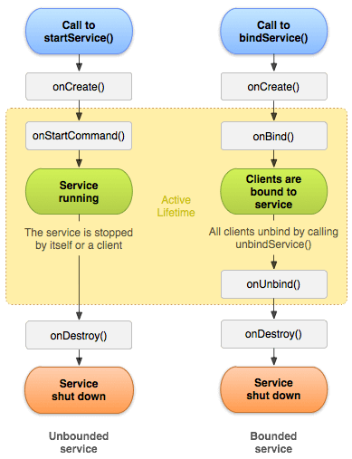
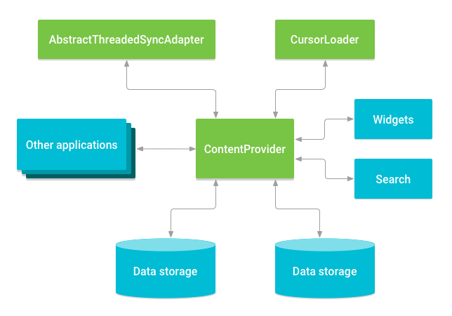

# Android
---

# Architecture

## What is MVVM?

-   MVVM separates UI from presentation state and business/data logic.
-   View observes state from ViewModel.
-   ViewModel survives configuration changes.
-   Repository abstracts data access.

``` text
Compose/XML
    ↓
ViewModel
    ↓
UseCase
    ↓
Repository
    ↓
API / Database
```

A ViewModel should expose UI-friendly state rather than exposing
implementation details of the repository.

---

---
# Android
---

## What is MVVM?

-   MVVM separates UI from presentation state and business/data logic.
-   View observes state from ViewModel.
-   ViewModel survives configuration changes.
-   Repository abstracts data access.

``` text
Compose/XML
    ↓
ViewModel
    ↓
UseCase
    ↓
Repository
    ↓
API / Database
```

A ViewModel should expose UI-friendly state rather than exposing
implementation details of the repository.

---

## What is Clean Architecture?

-   Clean Architecture separates responsibilities into layers.
-   It improves testability and maintainability.
-   It should be used according to project complexity, not as a rule for
    creating unnecessary classes.

``` text
UI
 ↓
ViewModel
 ↓
UseCase
 ↓
Repository
 ↓
Data Sources
```

For a small feature, several layers may be unnecessary. For a large
banking application, clear boundaries become more valuable.

---

## What is the Repository pattern?

-   A Repository hides where data comes from.
-   It can coordinate API, database, cache, and other sources.

``` kotlin
interface UserRepository {
    fun observeUser(): Flow<User>
}
```

The ViewModel does not need to know whether data came from Room, REST,
GraphQL, or memory.

---

## What is a UseCase?

-   A UseCase represents a business operation.
-   It keeps business rules out of the ViewModel.

``` kotlin
class TransferMoneyUseCase(
    private val repository: PaymentRepository
) {
    suspend operator fun invoke(
        from: String,
        to: String,
        amount: Long
    ) = repository.transfer(from, to, amount)
}
```

Do not create a UseCase for every trivial getter just to follow a
pattern.

---

## How would you design a banking account dashboard?

``` text
Compose/XML
    ↓
ViewModel
    ↓
UseCase
    ↓
Repository
   ↙    ↘
Room    API
```

-   UI observes immutable StateFlow.
-   Repository coordinates local and remote data.
-   Room can act as the local source of truth.
-   API refreshes local data.
-   Sensitive data is minimized and protected.
-   Errors are represented explicitly.
-   Tests cover business logic, integration, and critical UI flows.

---

## How would you implement offline-first behavior?

-   Read cached data first.
-   Display it immediately.
-   Refresh from the network.
-   Save successful data locally.
-   Let the UI observe the local source of truth.

``` text
API
 ↓
Room
 ↓
UI
```

If refresh fails but cached data exists, keep showing cached data and
expose a refresh error.

Do not cache sensitive financial data unless there is a clear
requirement.

---

## How should API errors be handled?

Different errors should have different behavior.

``` text
401 → authentication problem
403 → authorization problem
404 → resource missing
429 → rate limit
5xx → server problem
timeout → network problem
```

For an initial load with no cache, show an error and retry.

For a refresh with cached data, keep existing data and show a
non-blocking error.

---

## What happens when an API request times out?

-   The client does not necessarily know whether the server processed
    the request.
-   Retrying blindly can duplicate operations.
-   This is especially dangerous for payments.

For financial transactions, use an idempotency key or transaction
identifier.

``` text
Client → Payment(idempotencyKey=ABC)
        ↓
Server processes payment
        ↓
Network timeout
        ↓
Client retries with same key
        ↓
Server recognizes duplicate
```

This prevents accidental duplicate processing when supported by the
backend design.

---

## Networking and Security

## What is REST?

-   REST commonly exposes resources through HTTP.
-   HTTP methods communicate intent.

``` text
GET    /accounts/123
POST   /payments
PUT    /profile/123
PATCH  /profile/123
DELETE /saved-payee/123
```

REST is simple and widely supported.

---

## What is GraphQL?

-   GraphQL allows clients to request the fields they need.
-   It can reduce over-fetching and under-fetching.
-   It requires more consideration around caching, query complexity, and
    error handling.

``` graphql
query {
    account(id: "123") {
        id
        balance
        transactions {
            id
            amount
        }
    }
}
```

---

## What is an HTTP interceptor?

-   An interceptor can inspect or modify requests and responses.
-   Common uses include headers, authentication, logging, and metrics.

``` text
Request
  ↓
Interceptor
  ↓
Network
  ↓
Response
```

Never log authorization headers, tokens, or sensitive customer
information.

---

## How should authentication tokens be stored?

-   Avoid plain SharedPreferences for sensitive credentials.
-   Minimize what is stored.
-   Use Android Keystore-backed mechanisms and approved secure storage
    approaches.
-   Clear sensitive state when required during logout.
-   Never log tokens.

``` text
Login
 ↓
Authentication server
 ↓
Access token
 ↓
Secure storage
 ↓
API request
```

The exact storage approach should follow the application's security
requirements and organizational standards.

---

## What is the difference between 401 and 403?

-   `401 Unauthorized` generally means authentication is missing or
    invalid.
-   `403 Forbidden` means the caller is authenticated but not allowed to
    perform the operation.

``` text
401 → "Who are you?"
403 → "I know who you are, but you cannot do this."
```

---

## What is certificate pinning?

-   TLS normally validates the server certificate chain.
-   Certificate pinning adds an additional check against an expected
    certificate or public key.

``` text
App
 ↓
TLS validation
 ↓
Pinned certificate/public key check
 ↓
Server
```

It can reduce certain MITM risks.

The trade-off is operational complexity during certificate rotation. It
should be used according to the threat model and security policy.

---

## What is OWASP MASVS?

-   OWASP MASVS is a security standard for mobile applications.
-   It covers areas such as secure storage, authentication, network
    communication, cryptography, platform interaction, and resilience.

For an Android banking application, use it as a security checklist
rather than treating security as a final testing step.

---

## What is secure networking?

-   Use HTTPS/TLS.
-   Validate certificates correctly.
-   Never disable hostname or certificate validation.
-   Avoid sensitive information in URLs when possible.
-   Protect authentication credentials.
-   Do not log secrets or PII.

``` text
App
 ↓ HTTPS/TLS
API
```

---

## How do you protect secrets?

Never commit secrets to Git.

Avoid:

``` kotlin
const val API_SECRET = "real-secret"
```

Prefer secure CI/CD secret management and server-side handling where
possible.

Remember that anything shipped inside an APK should generally be
considered potentially discoverable.

---

## Compose and UI

## What is MVVM state management?

A ViewModel can expose a single immutable UI state.

``` kotlin
data class ScreenState(
    val isLoading: Boolean = false,
    val data: Account? = null,
    val error: String? = null
)
```

Then:

``` kotlin
private val _state = MutableStateFlow(ScreenState())
val state = _state.asStateFlow()
```

This gives the UI one predictable state source.

---

## What is state hoisting in Compose?

-   State hoisting means moving state to the caller.
-   The composable receives state and callbacks.

``` kotlin
@Composable
fun UserCard(
    user: User,
    onClick: () -> Unit
) {
    // UI only
}
```

Benefits:

-   Reusable
-   Easier to test
-   Easier to preview
-   Easier to control from ViewModel

---

## What causes recomposition in Compose?

-   Compose tracks state read by composables.
-   When observed state changes, affected composables can recompose.

``` kotlin
var count by remember {
    mutableStateOf(0)
}

Text("$count")
```

When `count` changes, the UI reading `count` is eligible for
recomposition.

Recomposition does not mean the entire application is redrawn.

---

## What is `remember`?

-   `remember` keeps a value across recompositions.
-   It does not normally survive process death.

``` kotlin
val state = remember {
    mutableStateOf("")
}
```

Use it for UI-local state.

---

## What is `rememberSaveable`?

-   It can restore suitable state across configuration changes and
    saved-state restoration.
-   It is useful for small UI state such as text input or selected tabs.

``` kotlin
var query by rememberSaveable {
    mutableStateOf("")
}
```

Do not use it as a replacement for ViewModel state for complex business
state.

---

## What is `LaunchedEffect`?

-   `LaunchedEffect` starts a coroutine tied to the composition.
-   It is useful for lifecycle-aware side effects initiated by entering
    composition or changing a key.

``` kotlin
LaunchedEffect(userId) {
    viewModel.loadUser(userId)
}
```

When the key changes, the previous effect is cancelled and a new one
starts.

---

## What is the XML equivalent of `LaunchedEffect`?

There is no exact one-to-one equivalent.

For XML/View-based screens, use lifecycle-aware mechanisms such as:

``` kotlin
lifecycleScope.launch {
    repeatOnLifecycle(Lifecycle.State.STARTED) {
        viewModel.state.collect { state ->
            render(state)
        }
    }
}
```

For one-time initialization, use lifecycle methods such as
`onViewCreated` when appropriate.

---

## What is `DisposableEffect`?

-   It is used when an effect needs cleanup.

``` kotlin
DisposableEffect(Unit) {
    registerListener()

    onDispose {
        unregisterListener()
    }
}
```

Use it for listeners, observers, or other resources that need explicit
cleanup.

---

## What is `derivedStateOf`?

-   It creates state derived from other state.
-   It can prevent unnecessary recompositions when the derived result
    has not changed.

``` kotlin
val showButton by remember {
    derivedStateOf {
        listState.firstVisibleItemIndex > 0
    }
}
```

Use it when derived state changes less frequently than its inputs.

---

## Why are keys important in LazyColumn?

-   Keys help Compose identify items across updates.
-   Without stable keys, Compose may associate state with the wrong item
    when list positions change.

``` kotlin
LazyColumn {
    items(
        users,
        key = { it.id }
    ) { user ->
        UserRow(user)
    }
}
```

Stable unique keys are especially important when rows have remembered
state or animations.

---

## How do you optimize Compose performance?

Check:

-   Unnecessary recomposition
-   Unstable parameters
-   Large composables
-   Expensive work during composition
-   Missing LazyColumn keys
-   Incorrect state ownership
-   Unnecessary object creation

Profile before optimizing.

Useful tools include Layout Inspector, CPU profiling, Macrobenchmark,
and production metrics.

---

## What are stable and unstable types in Compose?

-   Compose uses stability information to reason about whether
    parameters are likely to change.
-   Stable parameters can help Compose skip unnecessary recomposition.
-   Mutable or poorly designed types can make stability harder to
    determine.

Prefer immutable UI models where possible.

``` kotlin
data class UserUiModel(
    val id: String,
    val name: String
)
```

The goal is not to add annotations blindly. The data model should
actually satisfy the stability contract.

---

## What is `collectAsStateWithLifecycle()`?

-   It collects a Flow from Compose while respecting the lifecycle.
-   It avoids unnecessary collection while the UI is not active.

``` kotlin
val state by viewModel.state
    .collectAsStateWithLifecycle()
```

It is generally preferred over manually collecting a Flow directly from
composition.

---

## How do you make a Compose screen accessible?

Use:

-   Meaningful semantics
-   Content descriptions where needed
-   Correct roles
-   Adequate touch targets
-   Good contrast
-   Font scaling support
-   Proper focus order
-   TalkBack validation

``` kotlin
Modifier.semantics {
    contentDescription = "Account balance"
}
```

Do not add content descriptions to elements where the visible text
already provides the correct semantics.

---

## How do you build responsive Android UI?

-   Avoid hardcoded dimensions where possible.
-   Support different screen sizes and orientations.
-   Use adaptive layouts and window size information.
-   Design for phones, tablets, foldables, and landscape.

``` text
Phone
  ↓
Single-column layout

Tablet
  ↓
Multi-pane layout
```

For XML, use resource qualifiers where appropriate.

---

## Platform Components and Lifecycle

## What is the Activity lifecycle?

Important callbacks include:

``` text
onCreate
 ↓
onStart
 ↓
onResume
 ↓
onPause
 ↓
onStop
 ↓
onDestroy
```

`onCreate` is used for initialization.

`onStart` means visible.

`onResume` means the Activity is in the foreground and interactive.

`onStop` means it is no longer visible.

---

## What happens during configuration change?

For example, during rotation:

``` text
Activity
 ↓
destroyed
 ↓
recreated
```

The ViewModel normally survives the configuration change.

UI state should be stored in the appropriate place:

``` text
remember          → recomposition
rememberSaveable  → saved UI state
ViewModel         → screen/business state
SavedStateHandle  → state that should survive process recreation where supported
```

---

## What is process death?

-   Android can kill the application process when resources are needed.
-   A ViewModel does not survive process death.
-   Important state must be restored through saved-state mechanisms or
    recreated from persistent storage.

Do not assume ViewModel means permanent state.

---

## What is the difference between Activity context and Application context?

-   Activity context is tied to an Activity lifecycle.
-   Application context lives as long as the application process.

Do not store an Activity context in a long-lived singleton because it
can cause a memory leak.

Use Application context for application-wide dependencies when
appropriate.

---

## Background Work and UI Performance

## What is WorkManager?

-   WorkManager is used for deferrable, persistent background work.
-   It is useful when work should survive app restarts.

``` kotlin
WorkManager
    ↓
Sync database
Upload logs
Periodic refresh
```

Do not use it for immediate UI-bound work.

---

## Service vs WorkManager?

-   Service is for specific foreground/background service use cases.
-   WorkManager is for persistent deferrable work.
-   Foreground services require appropriate Android restrictions and
    user-visible notifications.

Choose based on the actual background execution requirement.

---

## What is RecyclerView optimization?

Important practices include:

-   Use `ListAdapter` and `DiffUtil`.
-   Use stable item identity.
-   Avoid heavy work in `onBindViewHolder`.
-   Avoid unnecessary nested layouts.
-   Load images efficiently.
-   Do not perform database/network work on the main thread.

``` kotlin
submitList(newUsers)
```

`DiffUtil` calculates changes instead of blindly refreshing everything.

---

## Dependency Injection and Testing

## What is dependency injection?

-   Dependency Injection means an object receives dependencies instead
    of constructing them internally.
-   It improves testing and separation of concerns.

``` kotlin
class UserViewModel(
    private val repository: UserRepository
)
```

The ViewModel does not create `UserRepository()` itself.

---

## What are Hilt scopes?

Common scopes include:

``` text
SingletonComponent
ActivityRetainedComponent
ViewModelComponent
ActivityComponent
FragmentComponent
```

The scope should match the required lifetime.

A dependency that is only needed by one ViewModel should not
automatically become a global singleton.

---

## What is unit testing?

-   Unit tests verify small pieces of logic.
-   They are usually fast and run on the JVM.

Good candidates:

``` text
ViewModel
UseCase
Mapper
Validator
Business rules
```

Example:

``` kotlin
@Test
fun `invalid amount returns error`() {
    // arrange
    // act
    // assert
}
```

---

## What is an instrumentation test?

-   It runs with Android framework/device support.
-   It is useful for integration with Android components, databases, and
    other platform behavior.

``` text
Test
 ↓
Emulator/device
 ↓
Android framework
```

---

## What is a UI test?

-   UI tests verify user-visible behavior.
-   Compose provides testing APIs based on semantics.

``` kotlin
composeTestRule
    .onNodeWithText("Pay")
    .performClick()
```

Test important user journeys rather than every internal implementation
detail.

---

## What is the difference between a mock and a fake?

-   Mock simulates behavior and often verifies interactions.
-   Fake is a simplified working implementation.

``` kotlin
class FakeUserRepository : UserRepository {
    override suspend fun getUser() = User("1", "Kiran")
}
```

Fakes can make tests less coupled to implementation details.

---

## How do you test coroutines?

Use `runTest` and test dispatchers.

``` kotlin
@Test
fun `load user updates state`() = runTest {
    viewModel.loadUser()

    // assert state
}
```

Avoid real delays and real background dispatchers in deterministic unit
tests.

---

## How do you test Flow and StateFlow?

Use a Flow testing library such as Turbine where appropriate.

``` kotlin
viewModel.state.test {
    assertEquals(Loading, awaitItem())
    assertEquals(Success(user), awaitItem())
}
```

Test important state transitions rather than internal implementation
details.

---

## Why should Dispatchers be injectable?

Hardcoding dispatchers makes unit tests harder to control.

Instead:

``` kotlin
class Repository(
    private val ioDispatcher: CoroutineDispatcher
)
```

Production:

``` kotlin
Dispatchers.IO
```

Test:

``` kotlin
StandardTestDispatcher(testScheduler)
```

This makes asynchronous behavior deterministic.

---

## What is the Android test pyramid?

A useful approach is:

``` text
        UI tests
       /        \
 Integration tests
   /              \
       Unit tests
```

Use many fast unit tests, fewer integration tests, and a smaller number
of critical end-to-end UI tests.

---

## How do you handle flaky tests?

-   Find the root cause instead of repeatedly rerunning.
-   Remove arbitrary sleeps.
-   Use deterministic synchronization.
-   Check test isolation.
-   Check race conditions.
-   Control coroutine dispatchers.
-   Separate product failures from environment failures.

``` text
Flaky test
   ↓
Timing?
Isolation?
Environment?
Concurrency?
Product bug?
   ↓
Fix root cause
```

---

## Build, Modularization, and Release

## What is CI/CD for Android?

A typical pipeline is:

``` text
Pull Request
    ↓
Compile
    ↓
Lint / Static Analysis
    ↓
Unit Tests
    ↓
Instrumentation Tests
    ↓
Security Checks
    ↓
Build AAB
    ↓
Sign
    ↓
Release
```

The exact stages depend on the organization.

---

## What are CI quality gates?

Possible gates include:

-   Compilation
-   Unit tests
-   Instrumentation tests
-   Lint
-   Static analysis
-   Security scanning
-   Dependency checks
-   Required code review

A quality gate should prevent known high-risk problems from reaching
release.

---

## How can you improve Android build time?

Look at:

-   Gradle configuration
-   Build cache
-   Configuration cache
-   Parallel execution
-   Dependency graph
-   Modularization
-   Incremental builds
-   Avoiding unnecessary annotation processing
-   CI caching

Measure before changing the build system.

---

## How should Android signing be handled in CI/CD?

-   Keep signing credentials outside source control.
-   Use a secure secret manager.
-   Restrict access.
-   Separate debug and release credentials where appropriate.
-   Audit release access.

``` text
CI
 ↓
Secure signing credentials
 ↓
Signed AAB
 ↓
Release
```

---

## What are build variants?

Build variants allow different configurations such as:

``` text
debug
release
staging
production
```

They can use different API endpoints, logging settings, and feature
configurations.

Never allow development configuration to accidentally ship in
production.

---

## What is modularization?

-   Modularization divides a large codebase into meaningful modules.
-   It improves ownership, dependency boundaries, build performance, and
    reuse.

``` text
:app

:feature-login
:feature-dashboard
:feature-payments

:core-network
:core-database
:core-ui
:core-security
```

Do not create modules for every small class.

---

## What is the problem with a huge common module?

A giant `common` module can become a dumping ground.

``` text
feature A → common
feature B → common
feature C → common
```

Soon everything depends on everything.

Prefer focused modules such as:

``` text
core-network
core-database
core-ui
core-security
```

with clear responsibilities.

---

## What are shared libraries in Android?

Shared libraries contain functionality used by multiple features or
teams.

Examples:

``` text
Design system
Networking
Authentication
Logging
Analytics
Security utilities
```

They should have stable APIs and avoid unnecessary feature-specific
dependencies.

---

## Reliability and Observability

## How do you investigate an ANR?

First determine what the main thread was doing.

Look at:

-   ANR traces
-   Android Vitals
-   Play Console
-   StrictMode
-   Perfetto
-   CPU profiler

Typical causes:

``` text
Main thread
   ↓
Disk I/O
Network
Large computation
Lock contention
Binder call
```

Move appropriate work away from the main thread and fix the underlying
bottleneck.

---

## What is a memory leak?

-   A memory leak occurs when objects remain reachable even though they
    are no longer needed.
-   Android commonly sees leaks from lifecycle misuse.

Examples:

``` text
Singleton
   ↓
Activity
   ↓
Activity cannot be collected
```

Use LeakCanary and Memory Profiler to investigate.

---

## How do you investigate a crash?

A good process is:

``` text
Crash report
 ↓
Stack trace
 ↓
Affected version/device
 ↓
Reproduction
 ↓
Root cause
 ↓
Fix
 ↓
Regression test
 ↓
Monitor release
```

Look for crash clustering rather than treating every stack trace
independently.

---

## What is Android startup performance?

Startup performance is the time needed before the application becomes
usable.

Common problems:

-   Heavy Application initialization
-   Synchronous disk I/O
-   Large dependency initialization
-   Unnecessary SDK initialization
-   Expensive database work

Use profiling and startup metrics before optimizing.

---

## What are Baseline Profiles?

-   Baseline Profiles tell Android which code paths are important.
-   They can improve startup and runtime performance by enabling
    ahead-of-time optimization for important paths.

For critical flows such as application startup and login, they can
provide measurable benefits.

---

## What is Macrobenchmark?

-   Macrobenchmark measures larger user journeys on real Android devices
    or emulators.
-   It is useful for startup, scrolling, and other performance
    scenarios.

``` text
Launch app
 ↓
Navigate
 ↓
Scroll
 ↓
Measure performance
```

It complements unit and UI tests.

---

## What is feature flagging?

-   A feature flag controls whether functionality is enabled.
-   It allows deployment and release to be separated.

``` kotlin
if (featureFlags.newPaymentFlow) {
    NewPaymentScreen()
} else {
    OldPaymentScreen()
}
```

It supports gradual rollout and quick disablement.

---

## What is a phased rollout?

Instead of releasing to everyone immediately:

``` text
1%
 ↓
5%
 ↓
10%
 ↓
25%
 ↓
50%
 ↓
100%
```

Monitor:

-   Crash rate
-   ANR
-   API errors
-   Performance
-   Business metrics

Stop or roll back if important metrics degrade.

---

## What is operational readiness?

Before release, define:

-   Monitoring
-   Alerts
-   Rollback process
-   Feature flag strategy
-   Ownership
-   Runbook
-   Known failure modes

A feature is not production-ready simply because the code works locally.

---

## What is a runbook?

A runbook explains what to do when an operational problem occurs.

``` text
Problem
 ↓
Detection
 ↓
Investigation
 ↓
Mitigation
 ↓
Rollback
 ↓
Recovery
```

For example, a crash spike after release should have a documented
rollback or feature-disable procedure.

---

## What is crash-free rate?

-   It measures how many users or sessions complete without crashes.
-   It is a useful stability metric.

Track it by:

``` text
App version
Device
OS version
Feature
Release cohort
```

A single overall percentage can hide problems affecting a specific
group.

---

## What is ANR rate?

-   It measures application-not-responding events.
-   It is an important Android stability metric.
-   Monitor it together with startup, rendering, and crash metrics.

A release with good crash numbers can still be unhealthy if ANRs
increase.

---

## How would you improve app stability?

Use a loop:

``` text
Monitor
 ↓
Identify top crashes/ANRs
 ↓
Prioritize by user impact
 ↓
Fix root cause
 ↓
Add regression test
 ↓
Release gradually
 ↓
Monitor again
```

Avoid fixing only the visible symptom.

---

## Advanced Production Scenarios

## How would you design an Android payment flow?

``` text
UI
 ↓
ViewModel
 ↓
UseCase
 ↓
Repository
 ↓
Payment API
```

Important considerations:

-   Authentication
-   Authorization
-   Input validation
-   Secure networking
-   Idempotency
-   Transaction state
-   Timeout handling
-   Error recovery
-   Auditability
-   Monitoring

For payment requests, never blindly retry after an ambiguous timeout.

---

## How would you handle a token refresh?

Typical flow:

``` text
API request
 ↓
401
 ↓
Refresh token
 ↓
New access token
 ↓
Retry original request
```

But concurrency matters.

If five requests receive `401` simultaneously, avoid launching five
refresh requests.

Use a coordinated refresh mechanism so only one refresh occurs and other
requests wait for the result.

---

## How do you prevent duplicate API requests?

Possible approaches:

-   `distinctUntilChanged`
-   `debounce`
-   `flatMapLatest`
-   Request deduplication
-   Caching
-   Coordinated token refresh
-   Idempotency on server-side write operations

The solution depends on whether the requests are reads, writes, or user
actions.

---

## How do you handle pagination?

For simple offset pagination:

``` text
page=1
page=2
page=3
```

For more reliable APIs, cursor pagination can be better:

``` text
cursor=A
 ↓
nextCursor=B
 ↓
nextCursor=C
```

For Android, Paging 3 can manage loading, retry, refresh, and
presentation state.

---

## How do you handle configuration changes (like screen rotation) in Android without losing data?
ViewModel stores UI-related data across configuration changes.
When screen rotates:
- Activity/Fragment is destroyed and recreated.
- ViewModel is not destroyed.
- ViewModel retains the data and passes it again to the UI.

*Example:* In a profile screen, if user scrolls halfway and rotates the screen, without ViewModel the screen will reload from start. But with ViewModel, the profile data and scroll position can be restored smoothly.

---

## You have two API calls that must run in parallel and update UI when both complete. How do you implement this?
Use Kotlin Coroutines with `async` and `await`.

```kotlin
viewModelScope.launch {
    val userDeferred = async { api.getUser() }
    val postsDeferred = async { api.getPosts() }
    val user = userDeferred.await()
    val posts = postsDeferred.await()
    _uiState.value = Success(user, posts)
}
```
This way, both calls run in parallel and UI updates after both are done.

---

## You need to fetch data from both the local Room database and network. How do you design this?
Use Repository with a fallback logic:
1. First try Room DB (cached data).
2. If data is old/missing, fetch from API.
3. Save new data in the Room.

This ensures:
- Fast response (local DB)
- Always fresh data (network)

---

## A user opens an app with no internet. How do you show offline data?
Use Room as the local cache.
- Repository checks connectivity.
- If offline, fetch from Room.
- If online, fetch from API and update Room.

Show “You’re offline” toast/snackbar while loading cached data.

---

## In MVVM, who should handle click events and why?
The ViewModel should handle logic, not the Activity/Fragment.
- UI calls `viewModel.onLoginClicked()`
- ViewModel checks input, performs API call
- Emits success/error state via LiveData or StateFlow

Keeps code testable and follows separation of concerns.

---

## In Jetpack Compose, how do you preserve scroll position when the user navigates back?
Use `rememberLazyListState()` in Composable:

```kotlin
val listState = rememberLazyListState()
LazyColumn(state = listState) { ... }
```

---

## What is the difference between retry and refresh?

-   Retry repeats a failed operation.
-   Refresh requests the latest state/data again.

A retry should be used carefully with writes.

For financial operations, use idempotency and server-side transaction
semantics before retrying.

---

## What is idempotency?

-   An operation is idempotent when repeating the same request does not
    create additional unintended effects.
-   It is critical for payment and transaction workflows.

``` text
POST payment + idempotencyKey=ABC
POST payment + idempotencyKey=ABC
```

The server can recognize that both requests represent the same
operation.

---

## How do you use AI coding assistants safely?

-   Use only organization-approved AI tools.
-   Do not provide confidential source code or customer data unless
    explicitly permitted.
-   Treat generated code as untrusted suggestions.
-   Review the code.
-   Run tests.
-   Run static analysis and security checks.
-   Validate behavior against requirements.

``` text
AI suggestion
    ↓
Developer review
    ↓
Tests
    ↓
Static/security analysis
    ↓
Code review
    ↓
Merge
```

---

## What are the risks of AI-generated code?

Possible risks:

-   Incorrect APIs
-   Security vulnerabilities
-   Poor architecture
-   Hallucinated behavior
-   License/IP concerns
-   Sensitive data exposure
-   Hidden edge cases

The developer remains responsible for the final code.

---

## How would you respond if AI generated insecure token storage?

Do not merge it.

``` text
Generated code
 ↓
Security review
 ↓
Identify insecure storage
 ↓
Replace with approved secure approach
 ↓
Add tests
 ↓
Run security/static checks
 ↓
Code review
```

AI can accelerate implementation but cannot replace engineering
judgment.

---

## How do you approach mentoring engineers?

-   Understand their current approach first.
-   Explain trade-offs rather than only giving the answer.
-   Pair when needed.
-   Give actionable code-review feedback.
-   Document repeated patterns.
-   Encourage ownership.

The goal is to improve both the immediate code and the engineer's future
decision-making.

---

## How do you lead a moderately complex Android initiative?

``` text
Requirements
 ↓
Technical risks
 ↓
Architecture
 ↓
Break into tasks
 ↓
Implementation
 ↓
Testing
 ↓
Code review
 ↓
Release
 ↓
Monitoring
```

A senior engineer should think beyond implementation and consider
reliability, security, testing, delivery, and operational support.

---

## How do you handle an architecture disagreement?

-   Understand the other proposal.
-   Compare trade-offs.
-   Use requirements and measurable constraints.
-   Prototype when uncertainty is high.
-   Align with the team.
-   Document important decisions.

Avoid making the discussion about who is technically right.

---

## What delivery metrics matter for an Android team?

Important metrics include:

-   Cycle time
-   Deployment frequency
-   Defect escape rate
-   Crash-free users
-   ANR rate
-   Build duration
-   Test stability
-   Release rollback rate

Do not optimize one metric alone.

For example, reducing cycle time by skipping tests can increase
production defects.

---

## How do you investigate a production performance regression?

``` text
Metric regression
 ↓
Identify affected version
 ↓
Compare with previous release
 ↓
Find affected devices/OS
 ↓
Inspect traces and telemetry
 ↓
Reproduce
 ↓
Fix
 ↓
Benchmark
 ↓
Gradual release
```

Measure before and after the change.

---

## How would you reduce Android app startup time?

-   Remove unnecessary initialization from `Application`.
-   Lazy-load noncritical dependencies.
-   Avoid synchronous disk/database work on startup.
-   Defer analytics/SDK initialization where allowed.
-   Use Baseline Profiles.
-   Measure using startup benchmarks and production telemetry.

The first step should be profiling, not guessing.

---

## How do you handle sensitive data in logs?

Never log:

``` text
Passwords
Access tokens
Refresh tokens
PINs
Full account numbers
Sensitive customer data
```

Use safe identifiers and structured logging where appropriate.

Production logging should follow security and privacy policies.

---

## Security and Performance Deep Dives

## What is screenshot protection?

Android can restrict screenshots for sensitive screens using appropriate
window flags.

``` kotlin
window.setFlags(
    WindowManager.LayoutParams.FLAG_SECURE,
    WindowManager.LayoutParams.FLAG_SECURE
)
```

Use it where the security requirement calls for preventing screenshots
or screen capture.

---

## What is the Android Keystore?

-   Android Keystore provides a secure mechanism for managing
    cryptographic keys.
-   Keys can be hardware-backed on supported devices.
-   Applications can use it for encryption/signing operations without
    exposing key material directly.

It is not a general database. It is a key-management mechanism.

---

## What is certificate transparency?

-   Certificate Transparency provides public logs of issued
    certificates.
-   It helps detect improperly issued certificates.
-   It complements, rather than replaces, normal TLS validation.

---

## How would you secure a local database?

-   Minimize sensitive data.
-   Encrypt sensitive database content when required.
-   Protect encryption keys using appropriate secure key-management
    mechanisms.
-   Restrict access.
-   Avoid logging database contents.
-   Consider backup behavior and logout/data-retention requirements.

---

## What is overdraw?

-   Overdraw occurs when the same screen pixel is drawn multiple times.
-   Excessive overdraw can increase rendering cost.

Avoid unnecessary backgrounds and deeply nested layouts.

Use Android Studio's rendering/profiling tools to investigate.

---

## How do you reduce memory usage?

-   Avoid holding Activity/View references in long-lived objects.
-   Load images at appropriate sizes.
-   Avoid unnecessary large collections.
-   Close resources appropriately.
-   Use lifecycle-aware components.
-   Profile before optimizing.

---

## How do you investigate UI jank?

Look for:

-   Long work on the main thread
-   Expensive composition
-   Excessive recomposition
-   Large list rendering
-   Image decoding
-   Layout complexity

Use:

``` text
Compose/Layout Inspector
CPU profiler
Perfetto
Macrobenchmark
Frame timing
```

---

## What is the difference between a crash and an ANR?

-   Crash terminates the application process or component due to an
    unhandled failure.
-   ANR means the application is not responding to user/system
    interaction within required time limits.

``` text
Crash → application failure
ANR   → application unresponsive
```

Both should be monitored in production.

---

## How do you decide what to UI test?

Prioritize:

-   Login
-   Payments
-   Navigation
-   Critical business journeys
-   Accessibility-critical behavior
-   Important regression scenarios

Do not put every business rule into UI tests. Keep most logic in fast
unit tests.

---

## What is a good Android testing strategy?

``` text
Unit tests
   ↓
Business logic / ViewModel

Integration tests
   ↓
Repository / DB / networking boundaries

UI tests
   ↓
Critical user journeys
```

This gives good confidence without making the entire suite slow and
fragile.

---

## What is a quality gate you would add to CI?

A practical PR gate could be:

``` text
Compile
 ↓
Lint
 ↓
Static analysis
 ↓
Unit tests
 ↓
Security/dependency checks
```

For release:

``` text
Instrumentation/UI tests
 ↓
Release build
 ↓
Signing
 ↓
Artifact verification
 ↓
Deployment
```

---

## What is release rollback?

Rollback means stopping or reversing a problematic release.

Use:

-   Phased rollout
-   Feature flags
-   Previous stable version
-   Server-side kill switches where available

The safest rollback strategy depends on whether the problem is in the
app, backend, or configuration.

---

## What is the difference between deployment and release?

-   Deployment means code is made available to an environment.
-   Release means functionality is made available to users.

Feature flags allow:

``` text
Code deployed
     ↓
Feature disabled
     ↓
Feature validated
     ↓
Feature enabled gradually
```

This reduces release risk.

---

## Architecture and UX Scenarios

## How would you design a large Android application for multiple teams?

Use modularization with clear ownership.

``` text
app
 ├── feature-login
 ├── feature-accounts
 ├── feature-payments
 ├── feature-profile
 │
 ├── core-network
 ├── core-database
 ├── core-security
 └── core-ui
```

Define dependency rules so feature modules do not depend directly on
unrelated features.

---

## How do you avoid overengineering?

Ask:

``` text
What problem does this abstraction solve?
Will the project need it?
Does it improve testability or maintainability?
Does the complexity justify the benefit?
```

A simple feature does not need five architectural layers just because a
pattern exists.

---

## How would you design error states in Android UI?

Use explicit state.

``` kotlin
sealed interface UiState {
    data object Loading : UiState
    data class Success(val data: Account) : UiState
    data class Error(val message: String) : UiState
}
```

For more complex screens, model partial states rather than forcing
everything into only Loading/Success/Error.

---

## How do you handle one-time events such as navigation?

Keep durable screen state separate from transient events.

``` kotlin
data class UiState(
    val account: Account? = null,
    val isLoading: Boolean = false
)

sealed interface UiEvent {
    data object NavigateBack : UiEvent
    data class ShowMessage(val text: String) : UiEvent
}
```

Use an appropriate event stream such as SharedFlow and collect it
lifecycle-safely.

---

## How do you prevent duplicate navigation events after rotation?

-   Do not model navigation as a simple persistent Boolean.
-   Treat navigation as a transient event or derive navigation from
    durable state.
-   Ensure the event consumption model is lifecycle-aware.

The exact implementation depends on the navigation architecture.

---

## How do you handle search in a ViewModel?

For a suspend search function:

``` kotlin
private val query = MutableStateFlow("")

val results = query
    .debounce(300)
    .distinctUntilChanged()
    .mapLatest { text ->
        repository.search(text)
    }
```

`mapLatest` cancels the previous suspend search when a newer query
arrives.

For a Flow-returning search function, use `flatMapLatest`.

---

## How would you handle network and database consistency?

A common approach is:

``` text
API
 ↓
Repository
 ↓
Database
 ↓
UI
```

The database becomes the observable source of truth.

On successful API response, update the database in a transaction when
multiple related records must remain consistent.

---

## What is a database transaction?

-   A transaction groups operations so they succeed or fail together
    according to the database's transaction guarantees.

``` text
Update account
Update transaction
Update balance
        ↓
    Transaction
```

This is important when multiple pieces of local state must remain
consistent.

---

## How would you handle a server response that is successful but local database update fails?

-   Do not pretend the operation completed locally.
-   Capture the failure.
-   Retry or recover according to the feature's consistency
    requirements.
-   Keep the UI state accurate.
-   Log safe diagnostic information.
-   Consider transactional persistence for related writes.

The repository should define the consistency behavior rather than
leaving it to the UI.

---

## Platform Compatibility and Delivery

## What is the role of Android SDK knowledge in modern Android?

Even with Compose, developers need to understand:

-   Lifecycle
-   Context
-   Activity
-   Services
-   Permissions
-   Saved state
-   Background execution
-   Notifications
-   Configuration changes
-   OS behavior

Compose changes UI development, not the underlying Android platform
model.

---

## What is your approach when supporting multiple Android OS versions?

-   Use supported APIs according to min/target SDK.
-   Guard newer APIs with version checks when required.
-   Test behavior across important OS/device combinations.
-   Avoid assuming behavior is identical across versions.
-   Monitor production issues by OS version.

``` kotlin
if (Build.VERSION.SDK_INT >= Build.VERSION_CODES.X) {
    // New API
}
```

---

## What does "high-quality user experience across devices and OS versions" mean?

It includes:

-   Responsive layouts
-   Accessibility
-   Correct lifecycle behavior
-   Reliable offline/error states
-   Good startup and rendering performance
-   Proper font scaling
-   Device/OS compatibility
-   Safe background behavior
-   Consistent navigation

Quality is more than visual correctness.

---

## How would you approach a moderately complex feature from requirements to production?

``` text
Requirements
 ↓
Clarify edge cases
 ↓
Architecture/design
 ↓
Security review
 ↓
Implementation
 ↓
Unit tests
 ↓
Integration/UI tests
 ↓
CI quality gates
 ↓
Phased release
 ↓
Monitoring
 ↓
Post-release review
```

This demonstrates ownership beyond writing code.

---

## Legacy Android Reference


---

## What is the **`Application` class** and how should teams use it safely?

The **`Application`** class is created once **per app process**, before your activities and most other components. It is the usual place to register **process-wide** setup: crash reporting, dependency injection roots, image loader singletons, and callbacks like **`onTrimMemory`**.

Because it lives as long as the process, **never store an `Activity` here** (that leaks the whole screen). Also avoid **heavy work in `onCreate`**—it slows **cold start**. Prefer **lazy** initialization and real background APIs for anything expensive.

**Examples that fit:** crash SDK init, DI container, bounded image pipeline. **Poor fit:** blocking feature-flag fetches on the main thread.

### Useful links

- [Project skeleton reference:](https://github.com/gbajaj/interviewready)  


> `Application` is for **process scope**, not “hide globals”.

---

- [Learn more](https://github.com/gbajaj/interviewready)
## What is **`Context`** — compare **Activity / Application / Service** contexts.

**`Context`** is Android’s handle to the environment: **resources**, **package name**, **SharedPreferences**, starting **components**, and more. You almost always receive one from the framework.

**Activity `Context`** is tied to a **screen** and carries **UI theme** information—you need it for things like **`AlertDialog`**. **`applicationContext`** lives for the **whole app** and is safer for **long-lived** objects (for example a singleton image loader), but it is **not** a substitute when the UI needs a real **Activity** context.

**Rule of thumb:** keep references as **short-lived** as possible. Storing the wrong `Context` in a static field is a classic **memory leak**.

### Useful links

- [Learn more](https://amitshekhar.me/blog/context-in-android-application)  


> **Scope your context** to the shortest correct lifetime.

---

- [Learn more](https://amitshekhar.me/blog/context-in-android-application)
## Describe classic **Android application architecture components**.

- **Activities:** foreground UI entry.
- **Services:** background work (with modern restrictions).
- **Broadcast receivers:** subscribe to events (explicit vs implicit carefully).
- **Content providers:** structured cross-app data with permissions.
- **Intents:** messaging between components.
- **Resources:** localization, density, configuration qualifiers.


> Modern apps still host these primitives—**Jetpack wraps**, doesn’t erase them.

---

## Explain **`Activity` lifecycle**, **`onCreate` vs `onStart`**, and **`setContentView` placement**.

- **Lifecycle:** `onCreate` → `onStart` → `onResume` (foreground interactive) → `onPause` → `onStop` → `onDestroy`; `onRestart` when returning from stopped.
- **`onCreate` vs `onStart`:** `onCreate` once per creation; `onStart` whenever user-visible again.
- **`setContentView`:** expensive inflation—do in `onCreate` (or `setContent` in Compose activity) not on every resume.
- **Edge case:** `finish()` inside `onCreate` can skip intermediate callbacks—know ordering for teardown hooks.

### Code example

Lifecycle diagrams:

 


> Lifecycle is a **contract** with the system—don’t fight it with silent work in `onResume`.

---

## **Fragments:** lifecycle, correlation with Activity, default constructor rule, back stack, `add` vs `replace`, `DialogFragment` vs `Dialog`.

- **Why fragments:** reusable panes, master/detail, modular screens within one activity.
- **Lifecycle:** `onAttach` → `onCreate` → `onCreateView` → `onViewCreated` → `onStart` → `onResume` → … → `onDestroyView` → `onDestroy` → `onDetach`.
- **Host correlation:** fragment transitions interleave with activity lifecycle—test configuration changes.
- **Default constructor + args:** system recreates fragments; use `arguments` `Bundle` for params.
- **Back stack:** `addToBackStack()` for back navigation expectations.
- **`add` vs `replace`:** `replace` typically tears down replaced fragment views; `add` stacks fragments—back behavior and lifecycle callbacks differ (see diagrams linked above).
- **`DialogFragment`:** lifecycle-aware dialog hosting; survives rotation better than raw `Dialog`.

### Useful links / diagrams

- Fragment lifecycle images:
-  </br>
- Combined lifecycle diagram:
- 
- Back stack diagrams:
  - [Learn more](https://user-images.githubusercontent.com/18071333/109423939-88001a80-7a07-11eb-995e-b7d16c5e51bb.png)
  - [Learn more](https://user-images.githubusercontent.com/18071333/109423948-95b5a000-7a07-11eb-8aa6-840f01beb236.png)
  - [Learn more](https://user-images.githubusercontent.com/18071333/109423954-9d754480-7a07-11eb-9e45-ea95fa038feb.png)
  - [Learn more](https://user-images.githubusercontent.com/18071333/109424405-7ae42b00-7a09-11eb-94b1-a2d648d7d33e.png)
  - [Learn more](https://user-images.githubusercontent.com/18071333/109424414-86cfed00-7a09-11eb-848c-0948dc8fceab.png)
- [Fragment back stack listener:](https://why-android.com/2016/03/29/learn-how-to-use-the-onbackstackchangedlistener/)
- [Official fragment creation doc:](https://developer.android.com/guide/components/fragments#Creating)


> If back navigation feels random, your **transactions** are inconsistent.

---

- [Learn more](https://developer.android.com/guide/components/fragments#Creating)
## **Intents:** explicit vs implicit; **Intent filters**; **PendingIntent**; **sticky broadcasts** (legacy).

- **Explicit:** class + package—inside your app.
- **Implicit:** action + category + data—system resolves; declare `<intent-filter>` carefully to avoid exported surface surprises.
- **PendingIntent:** delegates future execution with original app identity; mind **mutability flags** (Android 12+), request codes, and **immutable** requirements.
- **Sticky:** historical `sendStickyBroadcast`—largely obsolete/restricted; prefer modern APIs.


> PendingIntents are **security boundaries**—treat them like public APIs.

---

## `START_NOT_STICKY` vs `START_STICKY` vs `START_REDELIVER_INTENT`

- **NOT_STICKY:** don’t resurrect unless pending work exists.
- **STICKY:** restart with `null` intent unless pending starts exist—good for long-lived “wait for work” services (still prefer modern alternatives).
- **REDELIVER_INTENT:** replay last intent after kill—downloads/uploads.


> Maps directly to **user-visible correctness** vs **cost**.

---

## **Launch modes:** `standard`, `singleTop`, `singleTask`, `singleInstance` (corrected interview explanation)

- **standard:** new instance per start (within task rules).
- **singleTop:** reuse top if same activity at top; otherwise new.
- **`singleTask`:** affinity + task rules: if an instance exists in the task, clears above it and routes via `onNewIntent` (simplified—verify manifest `taskAffinity` interactions).
- **`singleInstance`:** activity is alone in its task; subsequent launches route elsewhere—use rarely (widgets/VoIP entry points).
- **Correction note:** Some informal examples online confuse `singleTask` vs `singleInstance` stack pictures—always verify with official docs + logging in a sample app.


> Launch modes interact with **taskAffinity**, **intent flags**, and **deep links**—debug empirically.

---

## **Processes vs threads vs tasks**

- **Process:** isolated memory; components default same process; override with `android:process` for isolation (IPC cost).
- **Thread:** execution unit inside process; **main thread** is UI + event dispatch.
- **Task:** user-facing back stack of activities—NOT identical to process.


> “App in background” often means **activity stopped**, process may still live.

---

## **Services:** started vs bound; foreground vs background; **IntentService** deprecation; **threads**.

- **Started service:** `startService`—runs until stopped; on main thread unless you offload.
- **Bound service:** client-server interface while bound.
- **Foreground:** notification + user-visible; required for many long tasks.
- **Background restrictions:** post-O, prefer **WorkManager** for deferrable work.
- **IntentService:** serial worker thread service—**deprecated**; migrate to WorkManager / coroutines + foreground where needed.
- **Threads:** manual threads lack lifecycle—coroutines/executors with cancellation policies.

### Useful links

- [Services overview:](https://developer.android.com/guide/components/services)  
- [IntentService deprecation:](https://developer.android.com/reference/android/app/IntentService)  
- [Service vs IntentService blog:](https://blog.mindorks.com/service-vs-intentservice-in-android)  
- [Modern background:](https://android-developers.googleblog.com/2018/10/modern-background-execution-in-android.html)  
- [Headless fragment vs Service:](https://stackoverflow.com/questions/22799759/what-is-the-difference-between-a-headless-fragment-and-a-service-in-android)  
- [Update UI from background service:](https://medium.com/@anitaa_1990/how-to-update-an-activity-from-background-service-or-a-broadcastreceiver-6dabdb5cef74)  


> If it must outlive UI, justify **foreground** or **WorkManager**.

---

- [Learn more](https://medium.com/@anitaa_1990/how-to-update-an-activity-from-background-service-or-a-broadcastreceiver-6dabdb5cef74)
## **Handler, Looper, MessageQueue, HandlerThread**

- **Main looper** pumps UI messages; `Handler` posts runnables/messages; misuse leaks activities via non-static inner classes.
- **HandlerThread** is a long-lived thread with its own looper—great for camera/pipeline work with explicit quit.

### Useful links

- [Looper/Handler deep dive:](https://medium.com/@ankit.sinhal/messagequeue-and-looper-in-android-3a18c7fc9181)  
- [Mindorks core article:](https://blog.mindorks.com/android-core-looper-handler-and-handlerthread-bd54d69fe91a)  


> Prefer **structured concurrency** for new code; understand Handlers to debug legacy.

---

- [Learn more](https://blog.mindorks.com/android-core-looper-handler-and-handlerthread-bd54d69fe91a)
## **Thread safety** primitives (volatile/synchronized caveat)

- `volatile` does not compose arbitrary atomicity for read-modify-write; use `Atomic*` or synchronized blocks.
- **Example:** `boolean flag` toggled from multiple threads.


> Concurrency bugs are **intermittent**—design invariants.

---

## **ExecutorService / thread pools**

- Reuse pools; bounded queues; shutdown gracefully on process teardown.

### Useful links

- [Learn more](https://www.javatpoint.com/java-executorservice)  
- [Java multithreading on Android:](https://blog.mindorks.com/java-android-multithreaded-programming-runnable-callable-future-executor)  


> Unbounded thread creation is a **battery + latency** trap.

---

- [Learn more](https://blog.mindorks.com/java-android-multithreaded-programming-runnable-callable-future-executor)
## **AIDL vs Messenger** (upgrade from oversimplified notes)

- **AIDL:** typed IPC for frequent, rich cross-process calls; generates stubs; requires threading discipline.
- **Messenger:** `Handler`-backed lightweight IPC using `Message` queues—great for simple command/response.
- AIDL complexity vs Messenger throughput limits.


> Pick Messenger unless you **need** a typed high-throughput IPC contract.

---

## **BroadcastReceiver** / **LocalBroadcastManager** legacy note

- System broadcasts for many OS events; **implicit broadcasts** heavily restricted.
- **LocalBroadcastManager** deprecated—use in-process flows (`Flow`, direct listeners, `LiveData` scoped properly).

### Useful links

- [BroadcastReceiver primer:](https://stackoverflow.com/questions/5296987/what-is-broadcastreceiver-and-when-we-use-it)  
- [LocalBroadcastManager (deprecated reference):](https://developer.android.com/reference/android/support/v4/content/LocalBroadcastManager.html)  


> Avoid **broadcast-as-eventbus** in new code.

---

- [Learn more](https://developer.android.com/reference/android/support/v4/content/LocalBroadcastManager.html)
## **Loader** API?

- Deprecated; use **ViewModel + coroutines/Flow + repository**.


> If you maintain legacy loaders, plan **migration**.

---

## **WorkManager** — when and links

- Deferrable guaranteed work with constraints; not for immediate UI-critical async.
- **Links:**
  - [Learn more](https://flexiple.com/android/android-workmanager-tutorial-getting-started)  
  - [Learn more](https://blog.mindorks.com/integrating-work-manager-in-android)  
  - [How it works:](https://www.kodeco.com/20689637-scheduling-tasks-with-android-workmanager)  


> WorkManager is **not a replacement** for foreground music playback.

---

## **Parcelable vs Serializable** (performance & security framing)

- **Parcelable:** designed for Android IPC performance (prefer `@Parcelize`).
- **Serializable:** Java reflection; more allocations—avoid on hot paths.


> **Parcelize** reduces boilerplate and mistakes.

---

## **Saved state**, rotation, **`ViewModel` + `SavedStateHandle`**, `onSaveInstanceState`

- ViewModel survives config change but **not** process death; persist small UI in saved state; large data in storage.
- [**Runtime changes:** official doc:](https://developer.android.com/guide/topics/resources/runtime-changes)  


> **Process death** always wins—design idempotent restoration.

---

## **compileSdk vs targetSdk vs minSdk**

- **compileSdk:** compile-time API surface.
- **targetSdk:** behavior toggles for compatibility modes; raising it triggers review of behavior changes.
- [**Link:**](https://stackoverflow.com/questions/26694108/what-is-the-difference-between-compilesdkversion-and-targetsdkversion)  


> Raising **targetSdk** is a **QA project**, not a one-line change.

---

## **View hierarchy & custom views & layouts**

- `View` leaf, `ViewGroup` container; `ConstraintLayout` reduces depth; `FrameLayout` for overlays; `LinearLayout`/`RelativeLayout` legacy trade-offs.
- Custom view steps (attrs → constructors → measure/layout/draw) are covered in the legacy section below.
- **Links:**
  - [ConstraintLayout:](https://blog.mindorks.com/using-constraint-layout-in-android-531e68019cd)  
  - [Sample:](https://github.com/anitaa1990/ConstraintLayout-Sample)  
  - [Article:](https://android.jlelse.eu/learning-to-implement-constraintlayout-in-android-8ddc69fe0a1a)  
  - [Custom views tutorial:](https://code.tutsplus.com/tutorials/android-sdk-creating-custom-views--mobile-14548)  


> Depth == **measure/layout cost**—flatten aggressively.

---

## **ViewPager vs ViewPager2**

- ViewPager2 built on RecyclerView; better for RTL + orientation + fragments.

### Useful links

- [Official migration:](https://developer.android.com/develop/ui/views/animations/vp2-migration)  


> All new code: **ViewPager2**.

---

- [Learn more](https://developer.android.com/develop/ui/views/animations/vp2-migration)
## **AsyncTask** pitfalls (legacy)

- Not lifecycle-aware; leaks + wrong activity updates on rotation; cancel + retain patterns are obsolete—use structured concurrency.

### Useful links

- [Retain fragment gist (legacy):](https://gist.github.com/vamsitallapudi/26030c15829d7be8118e42b1fcd0fa42)  


> If you see AsyncTask in production, schedule **removal**.

---

- [Learn more](https://gist.github.com/vamsitallapudi/26030c15829d7be8118e42b1fcd0fa42)
## **ART vs Dalvik / why Java bytecode isn’t executed directly**

- Android executes **DEX** on ART; historically JIT/AOT evolution—know profiles, baseline profiles, R8 impact.

### Useful links

- [ART vs Dalvik:](https://blog.mindorks.com/what-are-the-differences-between-dalvik-and-art/#:~:text=What%20is%20ART%3F,like%20in%20case%20of%20Dalvik)  


> Performance story today includes **baseline profiles + R8**.

---

- [Learn more](https://blog.mindorks.com/what-are-the-differences-between-dalvik-and-art/#:~:text=What%20is%20ART%3F,like%20in%20case%20of%20Dalvik)
## **StrictMode, logging levels, Jetpack pointer**

- StrictMode for dev-only main-thread violations.
- [Log level guidance:](https://stackoverflow.com/questions/7959263/android-log-v-log-d-log-i-log-w-log-e-when-to-use-each-one)  
- [Jetpack overview:](https://blog.mindorks.com/what-is-android-jetpack-and-why-should-we-use-it)  
- [Architecture components:](https://blog.mindorks.com/what-are-android-architecture-components/)  


> Operational hygiene matters in **staff** interviews too.

---

## Android **code style** links

- [Learn more](https://blog.mindorks.com/android-code-style-and-guidelines-d5f80453d5c7)  
- [Architecture components LinkedIn post:](https://www.linkedin.com/feed/update/urn:li:activity:7244987022665252864)  


> Consistency enables **scale**.

---

## Android Project Reference

## Android project skeleton

Use the links below as the primary source; rehearse a short spoken summary.


### Useful links

- [Learn more](https://github.com/gbajaj/interviewready)


> Bookmark **Android project skeleton**, read the linked reference, and be ready to explain trade-offs with one example.


---

- [Learn more](https://github.com/gbajaj/interviewready)
## Android Code Style And Guidelines.

Use the links below as the primary source; rehearse a short spoken summary.


### Useful links

- [Learn more](https://blog.mindorks.com/android-code-style-and-guidelines-d5f80453d5c7)


> Bookmark **Android Code Style And Guidelines**, read the linked reference, and be ready to explain trade-offs with one example.


---

- [Learn more](https://blog.mindorks.com/android-code-style-and-guidelines-d5f80453d5c7)
## Android Architecture Components

Use the links below as the primary source; rehearse a short spoken summary.


### Useful links

- [Learn more](https://www.linkedin.com/feed/update/urn:li:activity:7244987022665252864)


> Bookmark **Android Architecture Components**, read the linked reference, and be ready to explain trade-offs with one example.


---

- [Learn more](https://www.linkedin.com/feed/update/urn:li:activity:7244987022665252864)
## What is an Application class?

The Application class in Android is the base class within an Android app that contains all other components such as activities and services. The Application class, or any subclass of the Application class, is instantiated before any other class when the process for your application/package is created.


> The Application class in Android is the base class within an Android app that contains all other components such as activities and services.


---

## What is Context?

Use the links below as the primary source; rehearse a short spoken summary.


### Useful links

- [Learn more](https://amitshekhar.me/blog/context-in-android-application)


> Bookmark **What is Context**, read the linked reference, and be ready to explain trade-offs with one example.


---

- [Learn more](https://amitshekhar.me/blog/context-in-android-application)
## What is the Android Application Architecture?

- Activities - Provides the window in which the app draws its UI</br>
      - Services − It will perform background functionalities</br>
      - Intent − It will perform the inter connection between activities and the data passing mechanism</br>
      - Resource Externalization − strings and graphics</br>
      - Notification − light,sound,icon,notification,dialog box,and toast</br>
      - Content Providers − It will share the data between applications</br>


> Explain **What is the Android Application Architecture** in your own words—prioritize structure and trade-offs over raw bullet memorization.


---

## What is an Activity?

An activity provides the window in which the app draws its UI. This window typically fills the screen, but may be smaller than the screen and float on top of other windows. Generally, one activity implements one screen in an app. For instance, one of an app’s activities may implement a Preferences screen, while another activity implements a Select Photo screen.


> An activity provides the window in which the app draws its UI.


---

## Activity Lifecycle


> Know **Activity Lifecycle** cold for interviews—add one production example.


---

## Lifecycle of an Activity

* ```OnCreate()```: This is when the view is first created. This is normally where we create views, get data from bundles etc.</br>
* ```OnStart()```: Called when the activity is becoming visible to the user. Followed by onResume() if the activity comes to the foreground, or onStop() if it becomes hidden.</br>
* ```OnResume()```: Called when the activity will start interacting with the user. At this point your activity is at the top of the activity stack, with user input going to it.</br>
* ```OnPause()```: Called as part of the activity lifecycle when an activity is going into the background, but has not (yet) been killed.</br>
* ```OnStop()```: Called when you are no longer visible to the user.</br>
* ```OnDestroy()```: Called when the activity is finishing</br>
* ```OnRestart()```: Called after your activity has been stopped, prior to it being started again</br>


> Explain **Lifecycle of an Activity** in your own words—prioritize structure and trade-offs over raw bullet memorization.


---

## Is there any scenario where onDestoy() will be called without calling onPause() and onStop()?

If we call finish() method inside onCreate() of our Activity, then onDestroy() will be called directly.


> If we call finish() method inside onCreate() of our Activity, then onDestroy() will be called directly.


---

## What’s the difference between onCreate() and onStart()?

* The onCreate() method is called once during the Activity lifecycle, either when the application starts, or when the Activity has been destroyed and then recreated, for example during a configuration change.</br>
* The onStart() method is called whenever the Activity becomes visible to the user, typically after onCreate() or onRestart().</br>


> Explain **What’s the difference between onCreate() and onStart()** in your own words—prioritize structure and trade-offs over raw bullet memorization.


---

## Why would you do the setContentView() in onCreate() of Activity class?

As onCreate() of an Activity is called only once, this is the point where most initialization should go. It is inefficient to set the content in onResume() or onStart() (which are called multiple times) as the setContentView() is a heavy operation.</br>


> As onCreate() of an Activity is called only once, this is the point where most initialization should go.


---

## What is `Fragment`?

A `Fragment` is a piece of an activity which enable more modular activity design. A fragment has its layout, its behavior, and its life cycle callbacks. You can add or remove fragments in an activity while the activity is running. You can combine multiple fragments in a single activity to build a multi-pane UI. A fragment can also be used in multiple activities. The fragment life cycle is closely related to its host activity which means when the activity is paused, all the fragments available in the activity will also be stopped.


> A `Fragment` is a piece of an activity which enable more modular activity design.


---

## Fragment Lifecycle

 


> Know **Fragment Lifecycle** cold for interviews—add one production example.


---

## What is the correlation between activity and fragment life cycle?

Here is how Activity's and Fragment's lifecyle are called together:<br/>
    


> Here is how Activity's and Fragment's lifecyle are called together:


---

## How to pass items to `fragment`?

Using `Bundle` you can pass items to the fragment.


> Using `Bundle` you can pass items to the fragment.


---

## How would you communicate between two `fragments`?

There are several ways to communicate two fragments. Using `interfaces` are a common way to do that. You can connect two fragments through interfaces that are implemented in the parent activity.


> There are several ways to communicate two fragments.


---

## Difference between adding/replacing `fragment` in `backstack`?

- `replace` removes the existing `fragment` and adds a new `fragment`. This means when you press back button the fragment that got replaced will be created with its onCreateView being invoked.
- `add` retains the existing fragments and adds a new `fragment` that means existing fragment  will be active and they wont be in 'paused' state hence when a back button is pressed onCreateView is not called for the existing fragment(the fragment which was there before new fragment was added).
      In terms of fragment’s life cycle events `onPause()`, `onResume()`, `onCreateView()` and other life cycle events will be invoked in case of `replace` but they wont be invoked in case of `add`. </br>
     <br>
     <br>
     <br><br>
      <p align="center">
          
          
      </p>
      <br>


### Useful links

- [Learn more](https://user-images.githubusercontent.com/18071333/109423939-88001a80-7a07-11eb-995e-b7d16c5e51bb.png)
- [Learn more](https://user-images.githubusercontent.com/18071333/109423948-95b5a000-7a07-11eb-8aa6-840f01beb236.png)
- [Learn more](https://user-images.githubusercontent.com/18071333/109423954-9d754480-7a07-11eb-9e45-ea95fa038feb.png)
- [Learn more](https://user-images.githubusercontent.com/18071333/109424405-7ae42b00-7a09-11eb-94b1-a2d648d7d33e.png)
- [Learn more](https://user-images.githubusercontent.com/18071333/109424414-86cfed00-7a09-11eb-848c-0948dc8fceab.png)


> Explain **Difference between adding/replacing `fragment` in `backstack`** in your own words—prioritize structure and trade-offs over raw bullet memorization.


---

- [Learn more](https://user-images.githubusercontent.com/18071333/109424414-86cfed00-7a09-11eb-848c-0948dc8fceab.png)
## What is the difference between Dialog and DialogFragment?

- **Dialog** is a small window that prompts the user to make a decision or enter additional information. Instead, `dialogFragment` is a fragment that displays a dialog windows and contains a dialog object. </br>
- **DialogFragment** does various things to keep the fragment's lifecycle driving it, instead of the Dialog. Dialogs are generally autonomous entities -- they are their own window, receiving their own input events, and often deciding on their own when to disappear. DialogFragment needs to ensure that what is happening with the Fragment and Dialog states remains consistent. To do this, it watches for dismiss events from the dialog and takes care of removing its own state when they happen.


> Explain **What is the difference between Dialog and DialogFragment** in your own words—prioritize structure and trade-offs over raw bullet memorization.


---

## What is the difference between `apply()` and `commit()` in `sharedPreferences`?

- `commit()` writes the data **synchronously** and returns a boolean value of success or failure depending on the result immediately.
- `apply()` is **asynchronous** and it won’t return any boolean response. Also if there is an `apply()` outstanding and we perform another `commit()`, The `commit()` will be blocked until the `apply()` is not completed.


> Explain **What is the difference between `apply()` and `commit()` in `sharedPreferences`** in your own words—prioritize structure and trade-offs over raw bullet memorization.


---

## What is a Loader in Android?

Note: (Loader is Deprecated. We Have to use combination of ViewModels and LiveData instead of using Loaders) A Loader is used to fetch the data from a Content provider and cache the results across the configuration changes to avoid duplicate queries. Loader does it by running on separate threads and handling the lifecycle changes (so no need of asynctasks or new thread creations or manual handling of life cycle changes). Few implementations of Loaders like CursorLoader can implement an observer (called ContentObserver) to monitor any data changes and can then trigger a reload.


> Note: (Loader is Deprecated. We Have to use combination of ViewModels and LiveData instead of using Loaders) A Loader is used to fetch the data from a Content provider and cache the results across the configuration chang…


---

## What is an Intent Filter?

Intent filters are a very powerful feature of the Android platform. They provide the ability to launch an activity based not only on an explicit request, but also an implicit one. For example, an explicit request might tell the system to “Start the Send Email activity in the Gmail app". By contrast, an implicit request tells the system to “Start a Send Email screen in any activity that can do the job." When the system UI asks a user which app to use in performing a task, that’s an intent filter at work. Here's an example of how to declare Intent Filter in AndroidManifest:


### Code example

```xml
<activity android:name=".ExampleActivity" android:icon="@drawable/app_icon">
    <intent-filter>
        <action android:name="android.intent.action.SEND" />
        <category android:name="android.intent.category.DEFAULT" />
        <data android:mimeType="text/plain" />
    </intent-filter>
</activity>
```


> Intent filters are a very powerful feature of the Android platform.


---

## What is an Intent? What are the different types of Intents?

It is a kind of message or information that is passed between different components of Android. It is used to launch an activity, display a web page, send SMS, send email, etc. There are two types of intents in android: </br>

There are two types of intents: </br>
  a) **Implicit Intent** - Implicit intents do not name a specific component, but instead declare a general action to perform, which allows a component from another app to handle it. For example, if you want to show the user a location on a map, you can use an implicit intent to request that another capable app show a specified location on a map. </br>

  b) **Explicit Intent** - Explicit intents specify which application will satisfy the intent, by supplying either the target app's package name or a fully-qualified component class name. You'll typically use an explicit intent to start a component in your own app, because you know the class name of the activity or service you want to start. For example, you might start a new activity within your app in response to a user action, or start a service to download a file in the background.


> It is a kind of message or information that is passed between different components of Android.


---

## What is Pending Intent in Android?

Pending Intent is an intent which you want to trigger at some time in future, even when your application is not alive. This intent can be used by other application which allows it to execute that intent with the same permissions as of our application.  </br>


PendingIntent uses the following methods to handle the different types of intents:


### Code example

```java
Intent intent = new Intent(this, AnyActivity.class);

// Creating a pending intent and wrapping our intent
PendingIntent pendingIntent = PendingIntent.getActivity(this, 1, intent, PendingIntent.FLAG_UPDATE_CURRENT);
try {
    // Perform the operation associated with our pendingIntent
    pendingIntent.send();
} catch (PendingIntent.CanceledException e) {
    e.printStackTrace();
}
```

```java
PendingIntent.getActivity();   // Retrieves a PendingIntent to start an Activity
PendingIntent.getBroadcast(); // Retrieves a PendingIntent to perform a Broadcast
PendingIntent.getService();  // Retrieves a PendingIntent to start a Service
```


> Pending Intent is an intent which you want to trigger at some time in future, even when your application is not alive.


---

## What is the difference between START_NOT_STICKY, START_STICKY AND START_REDELIVER_INTENT?

**START_NOT_STICKY:** <br>
      If the system kills the service after onStartCommand() returns, do not recreate the service unless there are pending intents to deliver. This is the safest option to avoid running your service when not necessary and when your application can simply restart any unfinished jobs.

**START_STICKY:** <br>
      If the system kills the service after onStartCommand() returns, recreate the service and call onStartCommand(), but do not redeliver the last intent. Instead, the system calls onStartCommand() with a null intent unless there are pending intents to start the service. In that case, those intents are delivered. This is suitable for media players (or similar services) that are not executing commands but are running indefinitely and waiting for a job.

**START_REDELIVER_INTENT:** <br>
      If the system kills the service after onStartCommand() returns, recreate the service and call onStartCommand() with the last intent that was delivered to the service. Any pending intents are delivered in turn. This is *suitable for services that are actively performing a job that should be immediately resumed, such as downloading a file.*


> **NOT_STICKY** avoids resurrecting the service without pending work; **STICKY** restarts and often delivers a `null` intent; **REDELIVER_INTENT** replays the last intent—use it when a job must resume after process death.


---

## What is the StrictMode?

Use the links below as the primary source; rehearse a short spoken summary.


### Useful links

- [Learn more](https://blog.mindorks.com/use-strictmode-to-find-things-you-did-by-accident-in-android-development-4cf0e7c8d997)


> Bookmark **What is the StrictMode**, read the linked reference, and be ready to explain trade-offs with one example.


---

- [Learn more](https://blog.mindorks.com/use-strictmode-to-find-things-you-did-by-accident-in-android-development-4cf0e7c8d997)
## Launch modes in Android?

**Standard**:  </br>It creates a new instance of an activity in the task from which it was started. Multiple instances of the activity can be created and multiple instances can be added to the same or different tasks.  </br>
Example: Suppose there is an activity stack of A -> B -> C. Now if we launch B again with the launch mode as “standard”, the new stack will be A -> B -> C -> B.  </br>

**SingleTop**:  </br>It is the same as the standard, except if there is a previous instance of the activity that exists in the top of the stack, then it will not create a new instance but rather send the intent to the existing instance of the activity. </br>
Example: Suppose there is an activity stack of A -> B. Now if we launch C with the launch mode as “singleTop”, the new stack will be A -> B -> C as usual. Now if there is an activity stack of A -> B -> C. If we launch C again with the launch mode as “singleTop”, the new stack will still be A -> B -> C.  </br>

**SingleTask**:  </br>A new task will always be created and a new instance will be pushed to the task as the root one. So if the activity is already in the task, the intent will be redirected to onNewIntent() else a new instance will be created. At a time only one instance of activity will exist.  </br>
Example: Suppose there is an activity stack of A -> B -> C -> D. Now if we launch D with the launch mode as “singleTask”, the new stack will be A -> B -> C -> D as usual. Now if there is an activity stack of A -> B -> C -> D.  If we launch activity B again with the launch mode as “singleTask”, the new activity stack will be A -> B. Activities C and D will be destroyed.  </br>

**SingleInstance**:  </br>Same as single task but the system does not launch any activities in the same task as this activity. If new activities are launched, they are done so in a separate task.  </br>
Example: Suppose there is an activity stack of A -> B -> C -> D. If we launch activity B again with the launch mode as “singleTask”, the new activity stack will be: Task1 — A -> B -> C  and Task2 — D </br>


> **Standard**: It creates a new instance of an activity in the task from which it was started.


---

## How do you declare the launch mode in your application?

via manifest, in activity's tag. For Eg., -> android:launchMode="singleTask"


> via manifest, in activity's tag. For Eg., -> android:launchMode="singleTask"


---

## What is a RetainFragment / Headless Fragment?

Generally, Fragments are destroyed and recreated along with their parent Activity’s whenever a configuration change occurs. Calling setRetainInstance(true) allows us to bypass this destroy-and-recreate cycle, notifying the system to retain the current instance of the fragment when the activity is recreated.


> Generally, Fragments are destroyed and recreated along with their parent Activity’s whenever a configuration change occurs.


---

## What are Processes in Android?

Everytime an Android App starts, the Android System creates a New Process for this Application with a Single thread of Execution. By default all the components of the same application runs in the same process. While most apps donot change this behavior, some apps like games, might want to run in different processes. Then we can use *android:process* attribute in our AndroidManifest.xml to specify the process name.


> Everytime an Android App starts, the Android System creates a New Process for this Application with a Single thread of Execution.


---

## Compilesdkversion vs Targetsdkversion

Use the links below as the primary source; rehearse a short spoken summary.


### Useful links

- [Learn more](https://stackoverflow.com/questions/26694108/what-is-the-difference-between-compilesdkversion-and-targetsdkversion)


> Bookmark **Compilesdkversion vs Targetsdkversion**, read the linked reference, and be ready to explain trade-offs with one example.


---

- [Learn more](https://stackoverflow.com/questions/26694108/what-is-the-difference-between-compilesdkversion-and-targetsdkversion)
## What is onSavedInstanceState() and onRestoreInstanceState() in activity?

- **onSavedInstanceState()** - This method is used to store data before pausing the activity.
- **onRestoreInstanceState()** - This method is used to recover the saved state of an activity when the activity is recreated after destruction. Both the ```onCreate()``` and ```onRestoreInstanceState()``` callback methods receive the same Bundle that contains the instance state information. But because the ```onCreate()``` method is called whether the system is creating a new instance of your activity or recreating a previous one, you must check whether the state Bundle is null before you attempt to read it. If it is null, then the system is creating a new instance of the activity, instead of restoring a previous one that was destroyed.


> Explain **What is onSavedInstanceState() and onRestoreInstanceState() in activity** in your own words—prioritize structure and trade-offs over raw bullet memorization.


---

## When should you use a Fragment rather than an Activity?

- When there are ui components that are going to be used across multiple activities.
- When there are multiple views that can be displayed side by side (viewPager tabs)
- When you have data that needs to be persisted across Activity restarts (such as retained fragments)</br>


> Explain **When should you use a Fragment rather than an Activity** in your own words—prioritize structure and trade-offs over raw bullet memorization.


---

## ViewPager vs ViewPager2

Use the links below as the primary source; rehearse a short spoken summary.


### Useful links

- [Learn more](https://developer.android.com/develop/ui/views/animations/vp2-migration)


> Bookmark **ViewPager vs ViewPager2**, read the linked reference, and be ready to explain trade-offs with one example.


---

- [Learn more](https://developer.android.com/develop/ui/views/animations/vp2-migration)
## What is the difference between FragmentPagerAdapter vs FragmentStatePagerAdapter?

- **FragmentPagerAdapter:** Each fragment visited by the user will be stored in the memory but the view will be destroyed. When the page is revisited, then the view will be recreated not the instance of the fragment. This can result in a significant amount of memory being used. FragmentPagerAdapter should be used when we need to store the whole fragment in memory. FragmentPagerAdapter calls ```detach(Fragment)``` on the transaction instead of ```remove(Fragment)```.
- **FragmentStatePagerAdapter:** the fragment instance is destroyed when it is not visible to the User, except the saved state of the fragment. This results in using only a small amount of Memory and can be useful for handling larger data sets. Should be used when we have to use dynamic fragments, like fragments with widgets, as their data could be stored in the savedInstanceState.Also it won't affect the performance even if there are large number of fragments.</br>


> Explain **What is the difference between FragmentPagerAdapter vs FragmentStatePagerAdapter** in your own words—prioritize structure and trade-offs over raw bullet memorization.


---

## View & ViewGroup

- **View**: View objects are the basic building blocks of User Interface(UI) elements in Android. View is a simple rectangle box which responds to the user's actions. Examples are EditText, Button, CheckBox etc. View refers to the ```android.view.View``` class, which is the base class of all UI classes.
- **ViewGroup**: ViewGroup is the invisible container. It holds View and ViewGroup. For example, LinearLayout is the ViewGroup that contains Button(View), and other Layouts also. ViewGroup is the base class for Layouts.</br>


> Explain **View & ViewGroup** in your own words—prioritize structure and trade-offs over raw bullet memorization.


---

## Why do android apps need to ask permission like `INTERNET` or `LOCATION`?

The Android platform takes advantage of the Linux user-based protection to identify and isolate app resources called sandbox. This isolates apps from each other and protects apps and the system from malicious apps. If an app needs to use some system resources (like internet, or location sensor,..) or needs to connect other apps (like IAB library), it should request this access. Then android OS give this request and get permission to access the resource. If you want to use system resources, request the permission under the `<uses-permission>` tag in the `android-manifest.xml` file.


> The Android platform takes advantage of the Linux user-based protection to identify and isolate app resources called sandbox.


---

## Differences between `serializable` and `Parcelable`?

Serializable is a standard java interface but not a part of the Android SDK. Just by implementating this interface your POJO will be ready to jump from one activity to another. So what's the problem with Serializable? Serializable use reflection during the process and lots of additional temp objects created along the way and it may cause garbage collection to occue more often. That is why the serializable is more than 10x slower than Parcelable.


> Serializable is a standard java interface but not a part of the Android SDK.


---

## Why `serializable` body is empty? How is it doing?

Yes, It's empty because the Java reflection API is performed for marshaling operations (by JVM). This helps identify the Java object's member and behavior but also ends up creating a lot of garbage objects.


> Yes, It's empty because the Java reflection API is performed for marshaling operations (by JVM).


---

## Which method in `fragment` runs only once?

According to the [documentation](https://developer.android.com/guide/components/fragments#Creating), the `onCreate()` method is called once a fragment is created. Within your implementation, you should initialize essential components of the fragment that you want to retain when the fragment is paused or stopped, then resumed.


### Useful links

- [documentation](https://developer.android.com/guide/components/fragments#Creating)


> According to the [documentation](https://developer.


---

- [Learn more](https://developer)
## How to know `configChange` happens in `onDestroy()` function?

Once an activity is in the process of finishing then `isFinishing()` method is returned `true` value, otherwise `false` when the system is temporarily destroying the instance of the activity.


> Once an activity is in the process of finishing then `isFinishing()` method is returned `true` value, otherwise `false` when the system is temporarily destroying the instance of the activity.


---

## How to handle multiple screen sizes?

It's a long debate but in a very nutshell, you can do it in these ways:
- Use flexible layout like `ConstraintLayout` unless create alternative layout in different layout folders. (e.g. layout-sw480, layout-sw600, layout-sw720 ...)    
- Provide different bitmap drawables for different screen densities or use vector assets.
- Be aware of the screen orientation change approach in your application.
If you don't want to handle it enforce to use just one orientation (portrait or landscape) through declaring it in the manifest file.

for complete reading, see the [official documentation](https://developer.android.com/training/multiscreen/screensizes).


### Useful links

- [official documentation](https://developer.android.com/training/multiscreen/screensizes)


> It's a long debate but in a very nutshell, you can do it in these ways: - Use flexible layout like `ConstraintLayout` unless create alternative layout in different layout folders.


---

- [Learn more](https://developer.android.com/training/multiscreen/screensizes)
## What is the difference between margin and padding?

- **Padding** will be space added inside the container, for instance, if it is a button, padding will be added inside the button.       
- **Margin** will be space added outside the container.


> Explain **What is the difference between margin and padding** in your own words—prioritize structure and trade-offs over raw bullet memorization.


---

## What is `sw` keyword in `layout-sw600` folder meaning?

The `sw` keywrod which stands on "smallest width" is an screen size qualifier that allow you to provide alternative layouts for screens that have a minimum width measured in dp.
The smallest width qualifier specifies the smallest of the screen's two sides, regardless of the device's current orientation, so it's a simple way to specify the overall screen size available for your layout. Here is some useful values:

  - **320dp:** a typical phone screen (240x320 ldpi, 320x480 mdpi, 480x800 hdpi, etc).
  - **480dp:** a large phone screen ~5" (480x800 mdpi).
  - **600dp:** a 7” tablet (600x1024 mdpi).
  - **720dp:** a 10” tablet (720x1280 mdpi, 800x1280 mdpi, etc).


> The `sw` keywrod which stands on "smallest width" is an screen size qualifier that allow you to provide alternative layouts for screens that have a minimum width measured in dp.


---

## What is the difference between `sw` and `w` and `h` as postfix in order to define the resources folder?

- `sw`: The smallest width qualifier specifies the smallest of the screen's two sides, regardless of the device's current orientation,
- `w`: The width qualifier specifies the available width. For example, if you have a two-pane layout, you might want to use that whenever the screen provides at least 600dp of width, which might change depending on whether the device is in landscape or portrait orientation. Notice that this qualifier is orientation related.
- `h`: The height qualifier specifies the available height. This is equivalent to `w` qualifier but is used when the available height is a concern.

The major difference between these qualifiers is responding to orientation change. The `sw` isn't orientation sensitive but the two others are orientation sensitive. It means that if the screen is 480*800 in dp, then in `sw` always `layout-sw480` folder is loaded but in `w`, for portrait mode, `layout-w480`, and landscape mode, `layout-w800` folder is loaded.


> Explain **What is the difference between `sw` and `w` and `h` as postfix in order to define the resour…** in your own words—prioritize structure and trade-offs over raw bullet memorization.


---

## What are the major differences between `ListView` and `RecyclerView`?

- **ViewHolder Pattern**: `Recyclerview` implements the ViewHolders pattern whereas it is not mandatory in a ListView. A `ViewHolder` object stores each of the component views inside the tag field of the Layout, so you can immediately access them without the need to look them up repeatedly. In `ListView`, the code might call `findViewById()` frequently during the scrolling of `ListView`, which can slow down performance. Even when the `Adapter` returns an inflated view for recycling, you still need to look up
the elements and update them. A way around repeated use of `findViewById()`  is to use the "view holder" design pattern.

- **LayoutManager**: In a `ListView`, the only type of view available is the `vertical` ListView. A `RecyclerView` decouples list from its container so we can put list items easily at run time in the different containers (linearLayout, gridLayout) by setting LayoutManager.

- **Item Animator**: `ListViews` are lacking in support of good animations,
      but the `RecyclerView` brings a whole new dimension to it.


> Explain **What are the major differences between `ListView` and `RecyclerView`** in your own words—prioritize structure and trade-offs over raw bullet memorization.


---

## How do we save and restore an activity's state during screen rotation?

We can use onSavedInstanceState(bundle:Bundle) to save the activity's state inside a bundle. Then we can use onRestoreInstanceState(bundle) to restore the state of activity.


> We can use onSavedInstanceState(bundle:Bundle) to save the activity's state inside a bundle.


---

## How to handle crashing of AsyncTask during screen rotation?

One way is by cancelling the AsyncTask by using cancel() method on its instance. It will call onCancelled() method of AsyncTask where we can do some clean-up activities like hiding progress bar etc.  </br>
The best way to handle AsyncTask crash is to create a RetainFragment, i.e., a fragment without UI as shown in the list below: https://gist.github.com/vamsitallapudi/26030c15829d7be8118e42b1fcd0fa42  </br>
We can also avoid this crash by using 2 Alternatives -  </br>
1) Using RxJava by subscribing and unsubscribing at onResume() and onPause() methods respectively. </br>
2) Using LiveData - lifecycle aware component.


### Useful links

- [Learn more](https://gist.github.com/vamsitallapudi/26030c15829d7be8118e42b1fcd0fa42)


> One way is by cancelling the AsyncTask by using cancel() method on its instance.


---

- [Learn more](https://gist.github.com/vamsitallapudi/26030c15829d7be8118e42b1fcd0fa42)
## How does the activity respond when orientation is changed?

According to the [documentation](https://developer.android.com/guide/topics/resources/runtime-changes), Some device configurations can change during runtime (such as screen orientation, keyboard availability, and when the user enables multi-window mode). When such a change occurs, Android restarts the running `Activity` ( `onDestroy()` is called, followed by `onCreate()`). The restart behavior is designed to help your application adapt to new configurations by automatically reloading your application with alternative resources that match the new device configuration.


### Useful links

- [documentation](https://developer.android.com/guide/topics/resources/runtime-changes)


> According to the [documentation](https://developer.


---

- [Learn more](https://developer)
## How to prevent the data from reloading when orientation is changed?

The most basic approach would be to use a combination of `ViewModels` and `onSaveInstanceState()`. A `ViewModel` is LifeCycle-Aware. In other words, a `ViewModel` will not be destroyed if its owner is destroyed for a configuration change (e.g. rotation). The new instance of the owner will just re-connected to the existing `ViewModel`. So if you rotate an `Activity` three times, you have just created three different `Activity` instances, but you only have one `ViewModel`. So the common practice is to store data in the `ViewModel` class (since it persists data during configuration changes) and use `OnSaveInstanceState()` to store small amounts of UI data.


> The most basic approach would be to use a combination of `ViewModels` and `onSaveInstanceState()`.


---

## What is the relationship between the life cycle of an `AsyncTask` and an `Activity`? What problems can this result in? How can these problems be avoided?

An AsyncTask is not tied to the life cycle of the Activity that contains it. So, for example, if you start an AsyncTask inside an Activity and the user rotates the device, the Activity will be destroyed (and a new Activity instance will be created) but the AsyncTask will not die but instead goes on living until it completes.  </br>
Then, when the AsyncTask does complete, rather than updating the UI of the new Activity, it updates the former instance of the Activity (i.e. the one in which it was created but that is not displayed anymore!). This can lead to an Exception (of the type java.lang.IllegalArgumentException: View not attached to window manager if you use, for instance, findViewById to retrieve a view inside the Activity).  </br>
There’s also the potential for this to result in a memory leak since the AsyncTask maintains a reference to the Activity, which prevents the Activity from being garbage collected as long as the AsyncTask remains alive. </br>
For these reasons, using AsyncTasks for long-running background tasks is generally a bad idea. Rather, for long-running background tasks, a different mechanism (such as a service) should be employed.


> An AsyncTask is not tied to the life cycle of the Activity that contains it.


---

## Headless fragment vs Service

Use the links below as the primary source; rehearse a short spoken summary.


### Useful links

- [Learn more](https://stackoverflow.com/questions/22799759/what-is-the-difference-between-a-headless-fragment-and-a-service-in-android)


> Bookmark **Headless fragment vs Service**, read the linked reference, and be ready to explain trade-offs with one example.


---

- [Learn more](https://stackoverflow.com/questions/22799759/what-is-the-difference-between-a-headless-fragment-and-a-service-in-android)
## Service Lifecycle




> Know **Service Lifecycle** cold for interviews—add one production example.


---

## Difference between `Activity` and `Service`?

- **Activity:** An activity is the entry point for interacting with the user. It represents a single screen with a user interface.
- **Service:** A service is a general-purpose entry point for keeping an app running in the background for all kinds of reasons. It is a component that runs in the background to perform long-running operations or to perform work for remote processes. A service does not provide a user interface.


> Explain **Difference between `Activity` and `Service`** in your own words—prioritize structure and trade-offs over raw bullet memorization.


---

## How would you update the UI of an activity from a background service

Use the links below as the primary source; rehearse a short spoken summary.


### Useful links

- [Learn more](https://medium.com/@anitaa_1990/how-to-update-an-activity-from-background-service-or-a-broadcastreceiver-6dabdb5cef74)


> Bookmark **How would you update the UI of an activity from a background service**, read the linked reference, and be ready to explain trade-offs with one example.


---

- [Learn more](https://medium.com/@anitaa_1990/how-to-update-an-activity-from-background-service-or-a-broadcastreceiver-6dabdb5cef74)
## What is thread-safe mean? How we can make our code thread-safe?

Thread safety in java is the process to make our program safe to use in multithreaded environment, there are different ways through which we can make our program thread safe.
- Synchronization
- Use of Atomic Wrapper, For example AtomicInteger.
- Use of locks from java.util.concurrent.locks package.
- Using thread safe collection classes
- Using volatile keyword.

Note that if two threads are both reading and writing to a shared variable, then using the volatile keyword for that is not enough. You need to use a synchronized in that case to guarantee that the reading and writing of the variable is atomic. Reading or writing a volatile variable does not block threads reading or writing. For this to happen you must use the synchronized keyword around critical sections.


> Thread safety in java is the process to make our program safe to use in multithreaded environment, there are different ways through which we can make our program thread safe.


---

## What are Handlers?

Handlers are objects for managing threads. It receives messages and writes code on how to handle the message. They run outside of the activity’s lifecycle, so they need to be cleaned up properly or else you will have thread leaks. Handlers allow communicating between the background thread and the main thread. Handler delivers messages and runnables to the message queue and execute them as they come out of the message queue. We will generally use handler class when we want to repeat task every few seconds.


> Handlers are objects for managing threads.


---

## What is HandlerThread?

Use the links below as the primary source; rehearse a short spoken summary.


### Useful links

- [Learn more](https://medium.com/@ankit.sinhal/messagequeue-and-looper-in-android-3a18c7fc9181)


> Bookmark **What is HandlerThread**, read the linked reference, and be ready to explain trade-offs with one example.


---

- [Learn more](https://medium.com/@ankit.sinhal/messagequeue-and-looper-in-android-3a18c7fc9181)
## What is a Message?

Message contains a description and arbitrary data object that can be sent to a Handler. Basically its used to process / send some data across threads.


> Message contains a description and arbitrary data object that can be sent to a Handler.


---

## AIDL vs Messenger Queue

* AIDL is for purpose when you've to go application level communication for data and control sharing, a scenario depicting it can be : An app requires list of all contacts from Contacts app (content part lies here) plus it also wants to show the call's duration and you can also disconnect it from that app (control part lies here).
* In Messenger queues you're more IN the application and working on threads and processes to manage the queue having messages so no Outside services interference here.
* Messenger is needed if you want to bind a remote service (e.g. running in another process).


> Explain **AIDL vs Messenger Queue** in your own words—prioritize structure and trade-offs over raw bullet memorization.


---

## What is the difference between `Foreground` and `Background` and `Bounded` service?

- **Foreground Service:** A foreground `service` performs some operation that is noticeable to the user. For example, we can use a foreground service to play an audio track. A `Notification` must be displayed to the user.
- **Background Service:** A background `service` performs an operation that isn’t directly noticed by the user. In Android API level 26 and above, there are restrictions to using background services and it is recommended to use WorkManager in these cases
- **Bound Service:** A `service` is bound when an application component binds to it by calling `bindService()`. A bound service offers a client-server interface that allows components to interact with the `service`, send requests, receive results. A bound service runs only as long as another application component is bound to it. [Read More](https://developer.android.com/guide/components/services)


### Useful links

- [Read More](https://developer.android.com/guide/components/services)


> Explain **What is the difference between `Foreground` and `Background` and `Bounded` service** in your own words—prioritize structure and trade-offs over raw bullet memorization.


---

- [Learn more](https://developer.android.com/guide/components/services)
## Bound Service vs UnBounded service?

**A Bound service** is started by using method bindService(). As mentioned above system destroys bound service when no application component is accessing it. A Bound Service will stop automatically by the system when all the Application Components bound to it are unbinded.</br>
**Unbounded service (started service)** is started by using a method called startService(). Once started, it will run indefinitely even if the application component that started it is destroyed.


> **A Bound service** is started by using method bindService().


---

## Difference between `Intent` and `IntentService`?

- `Service` is the base class for Android services that can be extended to create any service. A class that directly extends `Service` runs on the main thread so it will block the UI (if there is one) and should therefore either be used only for short tasks or should make use of other threads for longer tasks.
- `IntentService` is a subclass of `Service` that handles asynchronous requests (expressed as `Intents`) on demand. Clients send requests through `startService(Intent)` calls. The service is started as needed, handles each `Intent` in turn using a worker thread, and stops itself when it runs out of work. [Read More on Mindorks's blog]("https://blog.mindorks.com/service-vs-intentservice-in-android")


### Useful links

- [Learn more](https://blog.mindorks.com/service-vs-intentservice-in-android)


> Explain **Difference between `Intent` and `IntentService`** in your own words—prioritize structure and trade-offs over raw bullet memorization.


---

- [Learn more](https://blog.mindorks.com/service-vs-intentservice-in-android)
## Difference between Service, Intent Service, AsyncTask & Threads

* **Android service** is a component that is used to perform operations on the background such as playing music. It doesn’t has any UI (user interface). The service runs in the background indefinitely even if application is destroyed. A class that directly extends Service runs on the main thread so it will block the UI (if there is one). This might cause ANR errors and hould therefore either be used only for short tasks or should make use of other threads for longer tasks. To stop a service from an activity we can call stopService(Intent intent) method. To Stop a service from itself, we can call stopSelf() method.</br>
* **AsyncTask** allows you to perform asynchronous work on your user interface. It performs the blocking operations in a worker thread and then publishes the results on the UI thread, without requiring you to handle threads and/or handlers yourself.</br>
* **IntentService** is a base class for Services that handle asynchronous requests (expressed as Intents) on demand. Clients send requests through startService(Intent) calls; the service is started as needed, handles each Intent in turn using a worker thread, and stops itself after its job is done. The IntentService can be used in long tasks usually with no communication to Main Thread. If communication is required, can use Main Thread handler or broadcast intents. Another case of use is when callbacks are needed (Intent triggered tasks).</br>
* A **thread** is a single sequential flow of control within a program. it should be used to separate long running operations from main thread so that performance is improved. But it can't be cancelled elegantly and it can't handle configuration changes of Android. You can't update UI from Thread. </br>


> Explain **Difference between Service, Intent Service, AsyncTask & Threads** in your own words—prioritize structure and trade-offs over raw bullet memorization.


---

## When to use AsyncTask and when to use services?

Services are useful when you want to run code even when your application's Activity isn't open. AsyncTask is a helper class used to run some code in a separate thread and publish results in main thread. Usually AsyncTask is used for small operations and services are used for long running operations.


> Services are useful when you want to run code even when your application's Activity isn't open.


---

## What is an Intent Service? What is the method that differentiates it to make Service run in background?

IntentService is a subclass of Service that can perform tasks using worker thread unlike service that blocks main thread. The additional method of IntentService is -
**<i>onHandleIntent(Intent)</i>** which helps the IntentService to run a particular code block declared inside it, in worker/background thread. The speciality of Intent Service is if there are more tasks given to it, IntentService will pass those intents one by one to the Worker thread. So if there are multiple download operations to be handled, They will be performed in a sequential order. Only one request will be processed at a time.
**Note:** IntentService is deprecated from API 30. This is due to background restrictions imposed from API level 26. It is now recommended to use WorkManager or JobIntentService. For more Info, [Click Here](https://developer.android.com/reference/android/app/IntentService)


### Useful links

- [Click Here](https://developer.android.com/reference/android/app/IntentService)


> IntentService is a subclass of Service that can perform tasks using worker thread unlike service that blocks main thread.


---

- [Learn more](https://developer.android.com/reference/android/app/IntentService)
## When to use a service and when to use a thread?

We will use a Thread when we want to perform background operations when application is running in foreground. We will use a service even when the application is not running.


> We will use a Thread when we want to perform background operations when application is running in foreground.


---

## What is Java ExecutorService

Use the links below as the primary source; rehearse a short spoken summary.


### Useful links

- [Learn more](https://www.javatpoint.com/java-executorservice)


> Bookmark **What is Java ExecutorService**, read the linked reference, and be ready to explain trade-offs with one example.


---

- [Learn more](https://www.javatpoint.com/java-executorservice)
## What is a ThreadPool? And is it more effective than using several separate Threads?

* Creating and destroying threads has a high CPU usage, so when we need to perform lots of small, simple tasks concurrently, the overhead of creating our own threads can take up a significant portion of the CPU cycles and severely affect the final response time.
* ThreadPool consists of a task queue and a group of worker threads, which allows it to run multiple parallel instances of a task.


> Explain **What is a ThreadPool? And is it more effective than using several separate Threads** in your own words—prioritize structure and trade-offs over raw bullet memorization.


---

## Modern background execution

Use the links below as the primary source; rehearse a short spoken summary.


### Useful links

- [Learn more](https://android-developers.googleblog.com/2018/10/modern-background-execution-in-android.html)


> Bookmark **Modern background execution**, read the linked reference, and be ready to explain trade-offs with one example.


---

- [Learn more](https://android-developers.googleblog.com/2018/10/modern-background-execution-in-android.html)
## What is a Job Scheduling?

* Job Scheduling api, as the name suggests, allows to schedule jobs while letting the system optimize based on memory, power, and connectivity conditions.
* The JobScheduler supports batch scheduling of jobs. The Android system can combine jobs so that battery consumption is reduced. JobManager makes handling uploads easier as it handles automatically the unreliability of the network. It also survives application restarts. 
* Scenarios:
* Tasks that should be done once the device is connect to a power supply
* Tasks that require network access or a Wi-Fi connection.
* Task that are not critical or user facing
* Tasks that should be running on a regular basis as batch where the timing is not critical
* [Reference](http://www.vogella.com/tutorials/AndroidTaskScheduling/article.html#schedulingtasks) </br>


### Useful links

- [Reference](http://www.vogella.com/tutorials/AndroidTaskScheduling/article.html#schedulingtasks)


> Explain **What is a Job Scheduling** in your own words—prioritize structure and trade-offs over raw bullet memorization.


---

- [Learn more](http://www.vogella.com/tutorials/AndroidTaskScheduling/article.html#schedulingtasks)
## What is a BroadcastReceiver?

Use the links below as the primary source; rehearse a short spoken summary.


### Useful links

- [Learn more](https://stackoverflow.com/questions/5296987/what-is-broadcastreceiver-and-when-we-use-it)


> Bookmark **What is a BroadcastReceiver**, read the linked reference, and be ready to explain trade-offs with one example.


---

- [Learn more](https://stackoverflow.com/questions/5296987/what-is-broadcastreceiver-and-when-we-use-it)
## What is a LocalBroadcastManager?

Use the links below as the primary source; rehearse a short spoken summary.


### Useful links

- [Learn more](https://developer.android.com/reference/android/support/v4/content/LocalBroadcastManager.html)


> Bookmark **What is a LocalBroadcastManager**, read the linked reference, and be ready to explain trade-offs with one example.


---

- [Learn more](https://developer.android.com/reference/android/support/v4/content/LocalBroadcastManager.html)
## What is a JobScheduler?

Use the links below as the primary source; rehearse a short spoken summary.


### Useful links

- [Learn more](http://www.vogella.com/tutorials/AndroidTaskScheduling/article.html)


> Bookmark **What is a JobScheduler**, read the linked reference, and be ready to explain trade-offs with one example.


---

- [Learn more](http://www.vogella.com/tutorials/AndroidTaskScheduling/article.html)
## What is Workmanager?

*  [Learn more](https://flexiple.com/android/android-workmanager-tutorial-getting-started)
 *  [Learn more](https://blog.mindorks.com/integrating-work-manager-in-android)


### Useful links

- [Learn more](https://flexiple.com/android/android-workmanager-tutorial-getting-started)
- [Learn more](https://blog.mindorks.com/integrating-work-manager-in-android)


> Explain **What is Workmanager** in your own words—prioritize structure and trade-offs over raw bullet memorization.


---

- [Learn more](https://blog.mindorks.com/integrating-work-manager-in-android)
## How Workmanager works?

Use the links below as the primary source; rehearse a short spoken summary.


### Useful links

- [Learn more](https://www.kodeco.com/20689637-scheduling-tasks-with-android-workmanager)


> Bookmark **How Workmanager works**, read the linked reference, and be ready to explain trade-offs with one example.


---

- [Learn more](https://www.kodeco.com/20689637-scheduling-tasks-with-android-workmanager)
## Stateflow vs LiveData

Use the links below as the primary source; rehearse a short spoken summary.


### Useful links

- [Learn more](https://scalereal.com/android/2020/05/22/stateflow-end-of-livedata.html)


> Bookmark **Stateflow vs LiveData**, read the linked reference, and be ready to explain trade-offs with one example.


---

- [Learn more](https://scalereal.com/android/2020/05/22/stateflow-end-of-livedata.html)
## Livedata vs ObservableField

Use the links below as the primary source; rehearse a short spoken summary.


### Useful links

- [Learn more](https://blog.mindorks.com/livedata-vs-observable-in-android)


> Bookmark **Livedata vs ObservableField**, read the linked reference, and be ready to explain trade-offs with one example.


---

- [Learn more](https://blog.mindorks.com/livedata-vs-observable-in-android)
## Livedata Setvalue vs Postvalue

Use the links below as the primary source; rehearse a short spoken summary.


### Useful links

- [Learn more](https://medium.com/@shashankmohabia/livedata-setvalue-vs-postvalue-91ec550b4c80)


> Bookmark **Livedata Setvalue vs Postvalue**, read the linked reference, and be ready to explain trade-offs with one example.


---

- [Learn more](https://medium.com/@shashankmohabia/livedata-setvalue-vs-postvalue-91ec550b4c80)
## What is renderscript?

Use the links below as the primary source; rehearse a short spoken summary.


### Useful links

- [Learn more](https://blog.mindorks.com/comparing-android-ndk-and-renderscript-1a718c01f6fe)


> Bookmark **What is renderscript**, read the linked reference, and be ready to explain trade-offs with one example.


---

- [Learn more](https://blog.mindorks.com/comparing-android-ndk-and-renderscript-1a718c01f6fe)
## FlatBuffers vs JSON.

Use the links below as the primary source; rehearse a short spoken summary.


### Useful links

- [Learn more](https://blog.mindorks.com/why-consider-flatbuffer-over-json-2e4aa8d4ed07)


> Bookmark **FlatBuffers vs JSON**, read the linked reference, and be ready to explain trade-offs with one example.


---

- [Learn more](https://blog.mindorks.com/why-consider-flatbuffer-over-json-2e4aa8d4ed07)
## What is `contentProvider` and what is typically used for?

A `ContentProvider` provides data from one application to another, when requested. It manages access to a structured set of data. It provides mechanisms for defining data security. [Learn more](https://medium.com/@sanjeevy133/an-idiots-guide-to-android-content-providers-part-1-970cba5d7b42).
    For further reading see the [official android documentation]("https://developer.android.com/guide/topics/providers/content-provider-basics" "Android official documentation")

  


### Useful links

- [Learn more](https://medium.com/@sanjeevy133/an-idiots-guide-to-android-content-providers-part-1-970cba5d7b42)
- [Learn more](https://developer.android.com/guide/topics/providers/content-provider-basics)


> A `ContentProvider` provides data from one application to another, when requested.


---

## What is the difference between `implementation` and `api`?

These two keywords work the same when you want to add a new library but the main difference occurs when using it in the internal library. Let's explain it with an example. Consider your app has a library called 'libraryA'. This library is also dependant on another library called 'libraryB'. the dependency flow will be : `app -> libraryA -> libraryB` . If the libraryB is declared in libraryA with keyword `implementation`, so your app module does not know anything about the classes of libraryB. So you can't access and use any classes of libraryB. If you want to do that, you must declare libraryB in the libraryA Gradle file with keyword `api`. For more information read [this medium link]("https://medium.com/mindorks/implementation-vs-api-in-gradle-3-0-494c817a6fa").


### Useful links

- [Learn more](https://medium.com/mindorks/implementation-vs-api-in-gradle-3-0-494c817a6fa)


> These two keywords work the same when you want to add a new library but the main difference occurs when using it in the internal library.


---

- [Learn more](https://medium.com/mindorks/implementation-vs-api-in-gradle-3-0-494c817a6fa)
## What do you mean by Gradle wrapper?

The Gradle wrapper is the most suitable way to initiate a Gradle build. A Gradle wrapper is a Window’s batch script which has a shell script for the OS (operating system). Once you start the Gradle build via the wrapper, you will see an auto download which runs the build.


> The Gradle wrapper is the most suitable way to initiate a Gradle build.


---

## When to use Adapter pattern? (Not for RecyclerView or ListView)

Use Adapter pattern when you need to make two class work with incompatible interfaces. Adapter pattern can also be used to encapsulate third party code so that your application only depends upon Adapter, which can adapt itself when third party code changes or you moved to a different third party library.


> Use Adapter pattern when you need to make two class work with incompatible interfaces.


---

## In singleton pattern whether it is better to make the whole `getInstance()` method synchronized or just critical section is enough? Which one is preferable?

Synchronization of whole `getInstance()` method is costly and is only needed during the initialization on singleton instance, to stop creating another instance of Singleton.  Therefore it is better to only synchronize critical section and not the whole method.


> Synchronization of whole `getInstance()` method is costly and is only needed during the initialization on singleton instance, to stop creating another instance of Singleton.


---

## Log.v(), Log.d(), Log.i(), Log.w(), Log.e() - When to use each one?

Use the links below as the primary source; rehearse a short spoken summary.


### Useful links

- [Learn more](https://stackoverflow.com/questions/7959263/android-log-v-log-d-log-i-log-w-log-e-when-to-use-each-one)


> Bookmark **Log.v(), Log.d(), Log.i(), Log.w(), Log.e() - When to use each one**, read the linked reference, and be ready to explain trade-offs with one example.


---

- [Learn more](https://stackoverflow.com/questions/7959263/android-log-v-log-d-log-i-log-w-log-e-when-to-use-each-one)
## Understanding scope storage in android

Use the links below as the primary source; rehearse a short spoken summary.


### Useful links

- [Learn more](https://blog.mindorks.com/understanding-the-scoped-storage-in-android)


> Bookmark **Understanding scope storage in android**, read the linked reference, and be ready to explain trade-offs with one example.


---

- [Learn more](https://blog.mindorks.com/understanding-the-scoped-storage-in-android)
## Solve out of memory error

Use the links below as the primary source; rehearse a short spoken summary.


### Useful links

- [Learn more](https://blog.mindorks.com/practical-guide-to-solve-out-of-memory-error-in-android-application)


> Bookmark **Solve out of memory error**, read the linked reference, and be ready to explain trade-offs with one example.


---

- [Learn more](https://blog.mindorks.com/practical-guide-to-solve-out-of-memory-error-in-android-application)
## What is ART? Difference between ART and Dalvik

Use the links below as the primary source; rehearse a short spoken summary.


### Useful links

- [Learn more](https://blog.mindorks.com/what-are-the-differences-between-dalvik-and-art/#:~:text=What%20is%20ART%3F,like%20in%20case%20of%20Dalvik)


> Bookmark **What is ART? Difference between ART and Dalvik**, read the linked reference, and be ready to explain trade-offs with one example.


---

- [Learn more](https://blog.mindorks.com/what-are-the-differences-between-dalvik-and-art/#:~:text=What%20is%20ART%3F,like%20in%20case%20of%20Dalvik)
## Battery optimizationn for Android

- **Lead:** [Link](https://blog.mindorks.com/battery-optimization-for-android-apps-f4ef6170ff70)batteru
- **Resource:** See links below.


### Useful links

- [Learn more](https://blog.mindorks.com/battery-optimization-for-android-apps-f4ef6170ff70)


> [Link](https://blog.mindorks.com/battery-optimization-for-android-apps-f4ef6170ff70)batteru


---

- [Learn more](https://blog.mindorks.com/battery-optimization-for-android-apps-f4ef6170ff70)
## Reason for the exit in Android Application

Use the links below as the primary source; rehearse a short spoken summary.


### Useful links

- [Learn more](https://blog.mindorks.com/reason-of-exit-in-android-application/)


> Bookmark **Reason for the exit in Android Application**, read the linked reference, and be ready to explain trade-offs with one example.


---

- [Learn more](https://blog.mindorks.com/reason-of-exit-in-android-application/)
## Android Jetpack component

Use the links below as the primary source; rehearse a short spoken summary.


### Useful links

- [Learn more](https://blog.mindorks.com/what-is-android-jetpack-and-why-should-we-use-it)


> Bookmark **Android Jetpack component**, read the linked reference, and be ready to explain trade-offs with one example.


---

- [Learn more](https://blog.mindorks.com/what-is-android-jetpack-and-why-should-we-use-it)
## Android Architecture Component

Use the links below as the primary source; rehearse a short spoken summary.


### Useful links

- [Learn more](https://blog.mindorks.com/what-are-android-architecture-components/)


> Bookmark **Android Architecture Component**, read the linked reference, and be ready to explain trade-offs with one example.


---

- [Learn more](https://blog.mindorks.com/what-are-android-architecture-components/)
## How ViewModel work internally?

Use the links below as the primary source; rehearse a short spoken summary.


### Useful links

- [Learn more](https://blog.mindorks.com/android-viewmodels-under-the-hood)


> Bookmark **How ViewModel work internally**, read the linked reference, and be ready to explain trade-offs with one example.


---

- [Learn more](https://blog.mindorks.com/android-viewmodels-under-the-hood)
## Arraymap vs Sparsh Array

Use the links below as the primary source; rehearse a short spoken summary.


### Useful links

- [Learn more](https://blog.mindorks.com/android-app-optimization-using-arraymap-and-sparsearray-f2b4e2e3dc47)


> Bookmark **Arraymap vs Sparsh Array**, read the linked reference, and be ready to explain trade-offs with one example.


---

- [Learn more](https://blog.mindorks.com/android-app-optimization-using-arraymap-and-sparsearray-f2b4e2e3dc47)
## Java Android Multithreading programming

Use the links below as the primary source; rehearse a short spoken summary.


### Useful links

- [Learn more](https://blog.mindorks.com/java-android-multithreaded-programming-runnable-callable-future-executor)


> Bookmark **Java Android Multithreading programming**, read the linked reference, and be ready to explain trade-offs with one example.


---

- [Learn more](https://blog.mindorks.com/java-android-multithreaded-programming-runnable-callable-future-executor)
## How can you prevent creating another instance of singleton using `clone()` method?

The preferred way to prevent creating another instance of a singleton is by not implementing Cloneable interface and if you do just throw an exception from `clone()` method "_not to create a clone of singleton class_".


> The preferred way to prevent creating another instance of a singleton is by not implementing Cloneable interface and if you do just throw an exception from `clone()` method "_not to create a clone of singleton class_".


---

## When will you prefer to use a Factory Pattern?

The factory pattern is preferred in the following cases:
      - A class does not know which class of objects it must create
      - Factory pattern can be used where we need to create an object of any one of sub-classes depending on the data provided
      - you can use factory pattern where you have to create an object of any one of sub-classes depending on the given data


> The factory pattern is preferred in the following cases: - A class does not know which class of objects it must create - Factory pattern can be used where we need to create an object of any one of sub-classes depending o…


---

## Why use a factory class to instantiate a class when we can use new operator?

Factory classes provide flexibility in terms of design. Below are some of the
    benefits of factory class:
      - Factory design pattern results in more decoupled code as it allows us to
        hide creational logic from dependent code
      - It allows us to introduce an [Inversion of Control]("https://www.codeproject.com/Articles/592372/Dependency-Injection-DI-vs-Inversion-of-Control-IO" "What is IoC?") container
      - It gives you a lot more flexibility when it comes time to change the
        application as our creational logic is hidden from dependant code


### Useful links

- [Learn more](https://www.codeproject.com/Articles/592372/Dependency-Injection-DI-vs-Inversion-of-Control-IO)


> Factory classes provide flexibility in terms of design.


---

- [Learn more](https://www.codeproject.com/Articles/592372/Dependency-Injection-DI-vs-Inversion-of-Control-IO)
## which pattern is used when we need to decouple an abstraction from its implementation?

When we want to decouple an abstraction from its implementation in order that two can vary independently we use **bridge pattern**.


> When we want to decouple an abstraction from its implementation in order that two can vary independently we use **bridge pattern**.


---

## What is ABI Management?

Different Android handsets use different CPUs, which in turn support different instruction sets. Each combination of CPU and instruction sets has its own Application Binary Interface, or ABI. The ABI defines, with great precision, how an  application's machine code is supposed to interact with the system at runtime. You must specify an ABI for each CPU  architecture you want your app to work with. You can checkout the full specifcations [here](https://developer.android.com/ndk/guides/abis)</br>


### Useful links

- [here](https://developer.android.com/ndk/guides/abis)


> Different Android handsets use different CPUs, which in turn support different instruction sets.


---

- [Learn more](https://developer.android.com/ndk/guides/abis)
## Why bytecode cannot be run in Android?

Android uses DVM (Dalvik Virtual Machine ) rather using JVM(Java Virtual Machine).</br>


> Android uses DVM (Dalvik Virtual Machine ) rather using JVM(Java Virtual Machine).


---

## What are Android Runtime (ART) and Dalvik?

Android Runtime (ART) and Dalvik are both execution environments for running Android applications, but they have some key differences:<br>

 **Dalvik:** It was the default runtime environment used by Android devices up until version 4.4 KitKat. Dalvik utilizes a Just-In-Time (JIT) compiler, which means it compiles the code at runtime, as needed. This approach is efficient in terms of memory usage because only the parts of the code that are needed are compiled.<br>
 **ART:** Introduced as an experimental feature in KitKat and later becoming the default runtime in Android 5.0 Lollipop, ART uses an Ahead-Of-Time (AOT) compiler. With AOT, the entire application code is compiled during installation, which improves app performance, especially startup times, because the code is already compiled to native instructions that the device’s CPU can execute directly.<br>

      Here are some of the features and differences between ART and Dalvik:
 **Compilation Approach**:
        - **Dalvik** compiles only the necessary parts of the code at runtime (JIT).
        - **ART** compiles the entire application code at install time (AOT).<br>

 **Performance**:
        - **Dalvik** may experience lag during execution as it compiles code on the fly.
        - **ART** provides faster execution of applications due to pre-compilation.<br>

 **Storage and Booting Time**:
        - **Dalvik** has a smaller memory footprint and boots faster compared to ART.
        - **ART** requires more storage space because it compiles the entire code during installation.<br>

 **Battery Performance and Garbage Collection**:
        - **ART** improves battery performance and has better garbage collection capabilities, leading to improved memory management<br>

      Both ART and Dalvik are compatible with running DEX (Dalvik Executable) bytecode, which is the format Android apps are compiled into. This means apps developed for Dalvik should generally work when running with ART, although some techniques that work on Dalvik do not work on ART.


> Android Runtime (ART) and Dalvik are both execution environments for running Android applications, but they have some key differences: **Dalvik:** It was the default runtime environment used by Android devices up until version 4.


---

## What is a BuildType in Gradle? And what can you use it for?

* Build types define properties that Gradle uses when building and packaging your Android app.
* A build type defines how a module is built, for example whether ProGuard is run.
* A product flavor defines what is built, such as which resources are included in the build.
* Gradle creates a build variant for every possible combination of your project’s product flavors and build types.</br>


> Explain **What is a BuildType in Gradle? And what can you use it for** in your own words—prioritize structure and trade-offs over raw bullet memorization.


---

## Are you familiar with ProGuard/DexGuard/R8 Minification?

ProGuard, DexGuard, and R8 are tools used in Android development to optimize and protect the application code. Here’s a brief overview of each:<br>

**ProGuard:** It is an open-source tool that shrinks, optimizes, and obfuscates Java code. It removes unused code and resources, making the APK smaller. ProGuard also makes the code more difficult to reverse-engineer by renaming classes, fields, and methods with non-descriptive names.<br>

**DexGuard:**: A commercial tool that offers more advanced protection features than ProGuard. It provides stronger encryption and obfuscation techniques, and it can also protect against static and dynamic analysis, making it harder for attackers to tamper with or reverse-engineer the application.<br>

**R8:** The latest official code shrinker and minifier from Google, which is integrated into Android Studio. R8 combines shrinking, desugaring, dexing, and obfuscation into one step. It’s designed to be backward-compatible with ProGuard, meaning it can use ProGuard configuration files. R8 improves build times and results in smaller APK sizes compared to ProGuard.


> ProGuard, DexGuard, and R8 are tools used in Android development to optimize and protect the application code.


---

## What is the difference between a process and a thread?

**Process**:
          - Runs in its own instance of the virtual machine.
          - Contains components like activities, services, and broadcast receivers.
          - Can be specified to run certain components in separate processes via `AndroidManifest.xml`.
          - Managed by the Android system, which may shut down processes to conserve resources.
          - Each process is isolated from others, ensuring that one process does not interfere with another.<br>

 **Thread**:
          - The smallest unit of execution within a process.
          - The main thread handles UI and event dispatching.
          - Additional threads can be created for background work.
          - Threads within the same process share the same memory space


> **Process**: - Runs in its own instance of the virtual machine.


---

## What is the difference between a process and a task?

- A **process** is about the execution and management of resources at the system level.
      - A **task** is about the user’s journey through a sequence of activities within or across applications.


> Explain **What is the difference between a process and a task** in your own words—prioritize structure and trade-offs over raw bullet memorization.


---

## What is AAPT?

AAPT2 (Android Asset Packaging Tool) is a build tool that Android Studio and Android Gradle Plugin use to compile and package your app’s resources. AAPT2 parses, indexes, and compiles the resources into a binary format that is optimized for the Android platform.


> AAPT2 (Android Asset Packaging Tool) is a build tool that Android Studio and Android Gradle Plugin use to compile and package your app’s resources.


---

## Explain the build process in Android:

* First step involves compiling the resources folder (/res) using the aapt (android asset packaging tool) tool. These are compiled to a single class file called R.java. This is a class that just contains constants.
 * Second step involves the java source code being compiled to .class files by javac, and then the class files are converted to Dalvik bytecode by the "dx" tool, which is included in the sdk 'tools'. The output is classes.dex. 
 * The final step involves the android apkbuilder which takes all the input and builds the apk (android packaging key) file.</br>


> Explain **Explain the build process in Android:** in your own words—prioritize structure and trade-offs over raw bullet memorization.


---

## What is Manifest file and R.java file in Android?

* **Manifest**: Every application must have an AndroidManifest.xml file (with precisely that name) in its root directory. The manifest presents essential information about the application to the Android system, information the system must have before it can run any of the application's code. It contains information of your package, including components of the application such as activities, services, broadcast receivers, content providers etc.
 * **R.Java**: It is an auto-generated file by aapt (Android Asset Packaging Tool) that contains resource IDs for all the resources of res/ directory. </br>

* **How does the activity respond when the user rotates the screen?** </br>
     When the screen is rotated, the current instance of activity is destroyed a new instance of the Activity is created in the new orientation. The onRestart() method is invoked first when a screen is rotated. The other lifecycle methods get invoked in the similar flow as they were when the activity was first created.</br>


> Explain **What is Manifest file and R.java file in Android** in your own words—prioritize structure and trade-offs over raw bullet memorization.


---

## Mention two ways to clear the back stack of Activities when a new Activity is called using intent

The first approach is to use a FLAG_ACTIVITY_CLEAR_TOP flag. The second way is by using FLAG_ACTIVITY_CLEAR_TASK and FLAG_ACTIVITY_NEW_TASK in conjunction.</br>


> The first approach is to use a FLAG_ACTIVITY_CLEAR_TOP flag.


---

## What’s the difference between FLAG_ACTIVITY_CLEAR_TASK and FLAG_ACTIVITY_CLEAR_TOP?

* **FLAG_ACTIVITY_CLEAR_TASK** is used to clear all the activities from the task including any existing instances of the class invoked. The Activity launched by intent becomes the new root of the otherwise empty task list. This flag has to be used in conjunction with FLAG_ ACTIVITY_NEW_TASK.</br>
 * **FLAG_ACTIVITY_CLEAR_TOP** on the other hand, if set and if an old instance of this Activity exists in the task list then barring that all the other activities are removed and that old activity becomes the root of the task list. Else if there’s no instance of that activity then a new instance of it is made the root of the task list. Using FLAG_ACTIVITY_NEW_TASK in conjunction is a good practice, though not necessary.</br>


> Explain **What’s the difference between FLAG_ACTIVITY_CLEAR_TASK and FLAG_ACTIVITY_CLEAR_TOP** in your own words—prioritize structure and trade-offs over raw bullet memorization.


---

## Describe content providers

* A ContentProvider provides data from one application to another, when requested. It manages access to a structured set of data.  It provides mechanisms for defining data security. ContentProvider is the standard interface that connects data in one process with code running in another process.</br>  
 * When you want to access data in a **ContentProvider**, you must instead use the ContentResolver object in your application’s Context to communicate with the provider as a client. The provider object receives data requests from clients, performs the requested action, and returns the results.</br>


> Explain **Describe content providers** in your own words—prioritize structure and trade-offs over raw bullet memorization.


---

## Access data using Content Provider:

* Start by making sure your Android application has the necessary read access permissions. Then, get access to the ContentResolver object by calling getContentResolver() on the Context object, and retrieving the data by constructing a query using ContentResolver.query().</br>
 * The ContentResolver.query() method returns a Cursor, so you can retrieve data from each column using Cursor methods.</br>


> Explain **Access data using Content Provider:** in your own words—prioritize structure and trade-offs over raw bullet memorization.


---

## What is the onTrimMemory() method?

* ```onTrimMemory()```: Called when the operating system has determined that it is a good time for a process to trim unneeded memory from its process. This will happen for example when it goes in the background and there is not enough memory to keep as many background processes running as desired.
* Android can reclaim memory for from your app in several ways or kill your app entirely if necessary to free up memory for critical tasks. To help balance the system memory and avoid the system's need to kill your app process, you can implement the ```ComponentCallbacks2``` interface in your Activity classes. The provided onTrimMemory() callback method allows your app to listen for memory related events when your app is in either the foreground or the background, and then release objects in response to app lifecycle or system events that indicate the system needs to reclaim memory. [Reference](https://developer.android.com/topic/performance/memory)</br>


### Useful links

- [Reference](https://developer.android.com/topic/performance/memory)


> Explain **What is the onTrimMemory() method** in your own words—prioritize structure and trade-offs over raw bullet memorization.


---

- [Learn more](https://developer.android.com/topic/performance/memory)
## What is an intent?

Intents are messages that can be used to pass information to the various components of android. For instance, launch an activity, open a webview etc.</br>
* Two types of intents-</br> 
* Implicit: Implicit intent is when you call system default intent like send email, send SMS, dial number.</br>
* Explicit: Explicit intent is when you call an application activity from another activity of the same application.</br>


> Explain **What is an intent** in your own words—prioritize structure and trade-offs over raw bullet memorization.


---

## What is a Sticky Intent?

* Sticky Intents allows communication between a function and a service. 
 * ```sendStickyBroadcast()``` performs a sendBroadcast(Intent) known as sticky, i.e. the Intent you are sending stays around after the broadcast is complete, so that others can quickly retrieve that data through the return value of ```registerReceiver(BroadcastReceiver, IntentFilter)```.
 * For example, if you take an intent for ACTION_BATTERY_CHANGED to get battery change events: When you call registerReceiver() for that action — even with a null BroadcastReceiver — you **get the Intent that was last Broadcast for that action**. Hence, you can use this to find the state of the battery without necessarily registering for all future state changes in the battery.</br>


> Explain **What is a Sticky Intent** in your own words—prioritize structure and trade-offs over raw bullet memorization.


---

## What is a Pending Intent?

If you want someone to perform any Intent operation at future point of time on behalf of you, then we will use Pending Intent. </br>


> If you want someone to perform any Intent operation at future point of time on behalf of you, then we will use Pending Intent.


---

## Describe fragments:

Fragment is a UI entity attached to Activity. Fragments can be reused by attaching in different activities. Activity can have multiple fragments attached to it. Fragment must be attached to an activity and its lifecycle will depend on its host activity.</br>


> Fragment is a UI entity attached to Activity.


---

## Describe fragment lifecycle

* ```onAttach()``` : The fragment instance is associated with an activity instance.The fragment and the activity is not fully initialized. Typically you get in this method a reference to the activity which uses the fragment for further initialization work.
 * ```onCreate()``` : The system calls this method when creating the fragment. You should initialize essential components of the fragment that you want to retain when the fragment is paused or stopped, then resumed.
 * ```onCreateView()``` : The system calls this callback when it’s time for the fragment to draw its user interface for the first time. To draw a UI for your fragment, you must return a View component from this method that is the root of your fragment’s layout. You can return null if the fragment does not provide a UI.
 * ```onActivityCreated()``` : The onActivityCreated() is called after the onCreateView() method when the host activity is created. Activity and fragment instance have been created as well as the view hierarchy of the activity. At this point, view can be accessed with the findViewById() method. example. In this method you can instantiate objects which require a Context object
 * ```onStart()``` : The onStart() method is called once the fragment gets visible.
 * ```onResume()``` : Fragment becomes active.
 * ```onPause()``` : The system calls this method as the first indication that the user is leaving the fragment. This is usually where you should commit any changes that should be persisted beyond the current user session.
 * ```onStop()``` : Fragment going to be stopped by calling onStop()
 * ```onDestroyView()``` : Fragment view will destroy after call this method
 * ```onDestroy()``` :called to do final clean up of the fragment’s state but Not guaranteed to be called by the Android platform.</br>


> Explain **Describe fragment lifecycle** in your own words—prioritize structure and trade-offs over raw bullet memorization.


---

## What is the difference between fragments & activities. Explain the relationship between the two.

An Activity is an application component that provides a screen, with which users can interact in order to do something whereas a Fragment represents a behavior or a portion of user interface in an Activity (with its own lifecycle and input events, and which can be added or removed at will).</br>


> An Activity is an application component that provides a screen, with which users can interact in order to do something whereas a Fragment represents a behavior or a portion of user interface in an Activity (with its own lifecycle and input events, and which can be added or removed at will).


---

## Why is it recommended to use only the default constructor to create a Fragment?

The reason why you should be passing parameters through bundle is because when the system restores a fragment (e.g on config change), it will automatically restore your bundle. This way you are guaranteed to restore the state of the fragment correctly to the same state the fragment was initialised with.</br>


> The reason why you should be passing parameters through bundle is because when the system restores a fragment (e.


---

## You’re replacing one Fragment with another — how do you ensure that the user can return to the previous Fragment, by pressing the Back button?

We need to save each Fragment transaction to the backstack, by calling ```addToBackStack()``` before you ```commit()``` that transaction</br>


> We need to save each Fragment transaction to the backstack, by calling ```addToBackStack()``` before you ```commit()``` that transaction


---

## Callbacks invoked during addition of a fragment to back stack and while popping back from back stack:

- *(No additional notes in source.)*


### Code example

```addOnBackStackChangedListener``` is called when fragment is added or removed from the backstack. Use this [link](https://why-android.com/2016/03/29/learn-how-to-use-the-onbackstackchangedlistener/) for reference</br>


> ```addOnBackStackChangedListener``` is called when fragment is added or removed from the backstack.


---

## What are retained fragments

By default, Fragments are destroyed and recreated along with their parent Activity’s when a configuration change occurs. Calling ```setRetainInstance(true)``` allows us to bypass this destroy-and-recreate cycle, signaling the system to retain the current instance of the fragment when the activity is recreated.</br>


> By default, Fragments are destroyed and recreated along with their parent Activity’s when a configuration change occurs.


---

## What is Toast in Android?

Android Toast can be used to display information for the short period of time. A toast contains message to be displayed quickly and disappears after sometime.</br>


> Android Toast can be used to display information for the short period of time.


---

## What are Loaders in Android?

* Loader API was introduced in API level 11 and is used to load data from a data source to display in an activity or fragment. Loaders persist and cache results across configuration changes to prevent duplicate queries.
* [Sample Implementation](https://medium.com/mindorks/a-journey-to-the-world-of-mvp-and-loaders-part-2-e176200e5866) </br>


### Useful links

- [Sample Implementation](https://medium.com/mindorks/a-journey-to-the-world-of-mvp-and-loaders-part-2-e176200e5866)


> Explain **What are Loaders in Android** in your own words—prioritize structure and trade-offs over raw bullet memorization.


---

- [Learn more](https://medium.com/mindorks/a-journey-to-the-world-of-mvp-and-loaders-part-2-e176200e5866)
## What is the difference between a regular .png and a nine-patch image?

It is one of a resizable bitmap resource which is being used as backgrounds or other images on the device. The NinePatch class allows drawing a bitmap in nine sections. The four corners are unscaled; the middle of the image is scaled in both axes, the four edges are scaled into one axis.</br>


> It is one of a resizable bitmap resource which is being used as backgrounds or other images on the device.


---

## Difference between RelativeLayout and LinearLayout?

* **Linear Layout** - Arranges elements either vertically or horizontally. i.e. in a row or column. 
* **Relative Layout** - Arranges elements relative to parent or other elements.</br>


> Explain **Difference between RelativeLayout and LinearLayout** in your own words—prioritize structure and trade-offs over raw bullet memorization.


---

## What is ConstraintLayout?

* It allows you to create large and complex layouts with a flat view hierarchy (no nested view groups). It's similar to RelativeLayout in that all views are laid out according to relationships between sibling views and the parent layout, but it's more flexible than RelativeLayout and easier to use with Android Studio's Layout Editor.
* [Sample Implementation](https://github.com/anitaa1990/ConstraintLayout-Sample) 
* You can read more about how to implement a simple app with ConstraintLayout [here](https://android.jlelse.eu/learning-to-implement-constraintlayout-in-android-8ddc69fe0a1a), by yours truly :)</br>


### Useful links

- [Learn more](https://blog.mindorks.com/using-constraint-layout-in-android-531e68019cd)
- [Sample Implementation](https://github.com/anitaa1990/ConstraintLayout-Sample)
- [here](https://android.jlelse.eu/learning-to-implement-constraintlayout-in-android-8ddc69fe0a1a)


> Bookmark **What is ConstraintLayout**, read the linked reference, and be ready to explain trade-offs with one example.


---

- [Learn more](https://android.jlelse.eu/learning-to-implement-constraintlayout-in-android-8ddc69fe0a1a)
## When might you use a FrameLayout?

* Frame Layouts are designed to contain a single item, making them an efficient choice when you need to display a single View.
* If you add multiple Views to a FrameLayout then it’ll stack them one above the other, so FrameLayouts are also useful if you need overlapping Views, for example if you’re implementing an overlay or a HUD element.</br>


> Explain **When might you use a FrameLayout** in your own words—prioritize structure and trade-offs over raw bullet memorization.


---

## What is Adapters?

An adapter responsible for converting each data entry into a View that can then be added to the AdapterView (ListView/RecyclerView).</br>


> An adapter responsible for converting each data entry into a View that can then be added to the AdapterView (ListView/RecyclerView).


---

## How to support different screen sizes?

* Create a flexible layout - The best way to create a responsive layout for different screen sizes is to use ConstraintLayout as the base layout in your UI. ConstraintLayout allows you to specify the position and size for each view according to spatial relationships with other views in the layout. This way, all the views can move and stretch together as the screen size changes.
* Create stretchable nine-patch bitmaps
* Avoid hard-coded layout sizes - Use wrap_content or match_parent. Create alternative layouts - The app should provide alternative layouts to optimize the UI design for certain screen sizes. For eg: different UI for tablets
* Use the smallest width qualifier.  For example, you can create a layout named main_activity that's optimized for handsets and tablets by creating different versions of the file in directories as follows:			
* res/layout/main_activity.xml           # For handsets (smaller than 600dp available width)						
* res/layout-sw600dp/main_activity.xml   # For 7” tablets (600dp wide and bigger). 
* The smallest width qualifier specifies the smallest of the screen's two sides, regardless of the device's current orientation, so it's a simple way to specify the overall screen size available for your layout.</br>


> Explain **How to support different screen sizes** in your own words—prioritize structure and trade-offs over raw bullet memorization.


---

## Outline the process of creating custom Views:

* Create a class that Subclass a view
* Create a res/values/attrs.xml file and declare the attributes you want to use with your custom View.
* In your View class, add a constructor method, instantiate the Paint object, and retrieve your custom attributes.
* Override either onSizeChanged() or onMeasure().
* Draw your View by overriding onDraw().
* [Sample Implementation](https://code.tutsplus.com/tutorials/android-sdk-creating-custom-views--mobile-14548) </br>


### Useful links

- [Sample Implementation](https://code.tutsplus.com/tutorials/android-sdk-creating-custom-views--mobile-14548)


> Explain **Outline the process of creating custom Views:** in your own words—prioritize structure and trade-offs over raw bullet memorization.


---

- [Learn more](https://code.tutsplus.com/tutorials/android-sdk-creating-custom-views--mobile-14548)
## Briefly describe some ways that you can optimize View usage

* Checking for excessive overdraw: install your app on an Android device, and then enable the "Debug GPU Overview" option.
* Flattening your view hierarchy: inspect your view hierarchy using Android Studio’s ‘Hierarchy Viewer’ tool.
* Measuring how long it takes each View to complete the measure, layout, and draw phases. You can also use Hierarchy Viewer to identify any parts of the rendering pipeline that you need to optimize.</br>


> Explain **Briefly describe some ways that you can optimize View usage** in your own words—prioritize structure and trade-offs over raw bullet memorization.


---

## Bitmap pooling in android?
  Bitmap pooling is a simple technique, that aims to reuse bitmaps instead of creating new ones every time. When you need a bitmap, you check a bitmap stack to see if there are any bitmaps available. If there are not bitmaps available you create a new bitmap otherwise you pop a bitmap from the stack and reuse it. Then when you are done with the bitmap, you can put it on a stack.


### Useful links

- [Learn more](https://outcomeschool.com/blog/bitmap-pool)


> Bookmark **Bitmap pooling in android**, read the linked reference, and be ready to explain trade-offs with one example.


---

- [Learn more](https://outcomeschool.com/blog/bitmap-pool)
## How you load your `Bitmaps`? What do you do for loading large bitmaps?

Use the links below as the primary source; rehearse a short spoken summary.


### Useful links

- [Learn more](https://android.jlelse.eu/loading-large-bitmaps-efficiently-in-android-66826cd4ad53)


> Bookmark **How you load your `Bitmaps`? What do you do for loading large bitmaps**, read the linked reference, and be ready to explain trade-offs with one example.


---

- [Learn more](https://android.jlelse.eu/loading-large-bitmaps-efficiently-in-android-66826cd4ad53)
## What are the permission protection levels in Android?

* **Normal** - A lower-risk permission that gives requesting applications access to isolated application-level features, with minimal risk to other applications, the system, or the user. The system automatically grants this type of permission to a requesting application at installation, without asking for the user's explicit approval.
* **Dangerous** - A higher-risk permission. Any dangerous permissions requested by an application may be displayed to the user and require confirmation before proceeding, or some other approach may be taken to avoid the user automatically allowing the use of such facilities.
* **Signature** - A permission that the system grants only if the requesting application is signed with the same certificate as the application that declared the permission. If the certificates match, the system automatically grants the permission without notifying the user or asking for the user's explicit approval.
* **SignatureOrSystem** - A permission that the system grants only to applications that are in the Android system image or that are signed with the same certificate as the application that declared the permission.</br>


> Explain **What are the permission protection levels in Android** in your own words—prioritize structure and trade-offs over raw bullet memorization.


---

## Uses permission vs Permission

Use the links below as the primary source; rehearse a short spoken summary.


### Useful links

- [Learn more](https://stackoverflow.com/questions/14450839/uses-permission-vs-permission-for-android-permissions-in-the-manifest-xml-file)


> Bookmark **Uses permission vs Permission**, read the linked reference, and be ready to explain trade-offs with one example.


---

- [Learn more](https://stackoverflow.com/questions/14450839/uses-permission-vs-permission-for-android-permissions-in-the-manifest-xml-file)
## What is an Application Not Responding (ANR) error, and how can you prevent them from occurring in an app?

An ANR dialog appears when your UI has been unresponsive for more than 5 seconds, usually because you’ve blocked the main thread. To avoid encountering ANR errors, you should move as much work off the main thread as possible.</br>


> An ANR dialog appears when your UI has been unresponsive for more than 5 seconds, usually because you’ve blocked the main thread.


---

## What is a singleton class in Android?

A singleton class is a class which can create only an object that can be shared all other classes.
     </br>


### Code example

```java
private static volatile RESTService instance;

protected RESTService(Context context) {
    super(context);
}

public static RESTService getInstance(Context context) {
    if (instance == null) {
        synchronized (RESTService.class) {
            if (instance == null) instance = new RESTService(context);
        }
    }
    return instance;
}
```


> A singleton class is a class which can create only an object that can be shared all other classes.


---

## What is `SnapHelper`?

Use the links below as the primary source; rehearse a short spoken summary.


### Useful links

- [Learn more](https://blog.mindorks.com/using-snaphelper-in-recyclerview-fc616b6833e8)


> Bookmark **What is `SnapHelper`**, read the linked reference, and be ready to explain trade-offs with one example.


---

- [Learn more](https://blog.mindorks.com/using-snaphelper-in-recyclerview-fc616b6833e8)
## How to handle multi-touch in android

Use the links below as the primary source; rehearse a short spoken summary.


### Useful links

- [link](https://arjun-sna.github.io/android/2016/07/20/multi-touch-android/)


> Bookmark **How to handle multi-touch in android**, read the linked reference, and be ready to explain trade-offs with one example.


---

- [Learn more](https://arjun-sna.github.io/android/2016/07/20/multi-touch-android/)
## How does RecyclerView work?

* Let's start with some background on RecyclerView which is needed to understand ```onBindViewHolder()``` method inside RecyclerView.</br>
 * RecyclerView is designed to display long lists (or grids) of items. Say you want to display 100 rows of something. A simple approach would be to just create 100 views, one for each row and lay all of them out. But that would be wasteful because at any point of time, only 10 or so items could fit on screen and the remaining items would be off screen. So RecyclerView instead creates only the 10 or so views that are on screen. This way you get 10x better speed and memory usage. 
 * **But what happens when you start scrolling and need to start showing next views?**
 * Again a simple approach would be to create a new view for each new row that you need to show. But this way by the time you reach the end of the list you will have created 100 views and your memory usage would be the same as in the first approach. And creating views takes time, so your scrolling most probably wouldn't be smooth. This is why RecyclerView takes advantage of the fact that as you scroll, **new rows come on screen also old rows disappear off screen**. Instead of creating new view for each new row, an old view is recycled and reused by binding new data to it.
* This happens inside the ```onBindViewHolder()``` method. Initially you will get new unused view holders and you have to fill them with data you want to display. But as you scroll you will start getting view holders that were used for rows that went off screen and you have to replace old data that they held with new data.</br>


> Explain **How does RecyclerView work** in your own words—prioritize structure and trade-offs over raw bullet memorization.


---

## How does RecyclerView differ from ListView?

* **ViewHolder Pattern**:  Recyclerview implements the ViewHolders pattern whereas it is not mandatory in a ListView. A RecyclerView recycles and reuses cells when scrolling. 
* **What is a ViewHolder Pattern?** - A ViewHolder object stores each of the component views inside the tag field of the Layout, so you can immediately access them without the need to look them up repeatedly. In ListView, the code might call ```findViewById()``` frequently during the scrolling of ListView, which can slow down performance. Even when the Adapter returns an inflated view for recycling, you still need to look up the elements and update them. A way around repeated use of ```findViewById()``` is to use the "view holder" design pattern.
* **LayoutManager**: In a ListView, the only type of view available is the vertical ListView.  A RecyclerView decouples list from its container so we can put list items easily at run time in the different containers (linearLayout, gridLayout) by setting LayoutManager.
* **Item Animator**: ListViews are lacking in support of good animations, but the RecyclerView brings a whole new dimension to it.</br>


> Explain **How does RecyclerView differ from ListView** in your own words—prioritize structure and trade-offs over raw bullet memorization.


---

## How would you implement swipe animation in Android

</br>


### Code example

```xml
<set xmlns:android="http://schemas.android.com/apk/res/android"
    android:shareInterpolator="false">
    <translate
        android:fromXDelta="-100%"
        android:toXDelta="0%"
        android:fromYDelta="0%"
        android:toYDelta="0%"
        android:duration="700" />
</set>
```


> Bookmark **How would you implement swipe animation in Android**, read the linked reference, and be ready to explain trade-offs with one example.


---

## Shimmer effect animation placeholder

Use the links below as the primary source; rehearse a short spoken summary.


### Useful links

- [Learn more](https://blog.mindorks.com/using-shimmer-effect-placeholder-in-android/)


> Bookmark **Shimmer effect animation placeholder**, read the linked reference, and be ready to explain trade-offs with one example.


---

- [Learn more](https://blog.mindorks.com/using-shimmer-effect-placeholder-in-android/)
## Arraymap/SparseArray vs HashMap in Android?

* [Article 1 on the subject](https://android.jlelse.eu/app-optimization-with-arraymap-sparsearray-in-android-c0b7de22541a)
* [Article 2 on the subject](https://medium.com/@mohom.r/optimising-android-app-performance-with-arraymap-9296f4a1f9eb) </br>


### Useful links

- [Article 1 on the subject](https://android.jlelse.eu/app-optimization-with-arraymap-sparsearray-in-android-c0b7de22541a)
- [Article 2 on the subject](https://medium.com/@mohom.r/optimising-android-app-performance-with-arraymap-9296f4a1f9eb)


> Explain **Arraymap/SparseArray vs HashMap in Android** in your own words—prioritize structure and trade-offs over raw bullet memorization.


---

- [Learn more](https://medium.com/@mohom.r/optimising-android-app-performance-with-arraymap-9296f4a1f9eb)
## How to reduce apk size?

* Enable proguard in your project by adding following lines to your release build type.
* Enable shrinkResources.
* Strip down all the unused locale resources by adding required resources name in “resConfigs”.
* Convert all the images to the webp or vector drawables.
     </br>


### Useful links

- [Learn more](https://medium.com/exploring-code/how-you-can-decrease-application-size-by-60-in-only-5-minutes-47eff3e7874e)


> Bookmark **How to reduce apk size**, read the linked reference, and be ready to explain trade-offs with one example.


---

- [Learn more](https://medium.com/exploring-code/how-you-can-decrease-application-size-by-60-in-only-5-minutes-47eff3e7874e)
## How to reduce build time of an Android app?

Use the links below as the primary source; rehearse a short spoken summary.


### Useful links

- [Learn more](https://medium.com/exploring-code/how-to-decrease-your-gradle-build-time-by-65-310b572b0c43)


> Bookmark **How to reduce build time of an Android app**, read the linked reference, and be ready to explain trade-offs with one example.


---

- [Learn more](https://medium.com/exploring-code/how-to-decrease-your-gradle-build-time-by-65-310b572b0c43)
## Android Architecture Components?

    A collection of libraries that help you design robust, testable, and maintainable apps. [Official documentation](https://developer.android.com/topic/libraries/architecture/)</br>
 **Room**:
      - [Official documentation](https://developer.android.com/topic/libraries/architecture/room)
      - [Article on how to implement Room Db](https://medium.com/@anitaa_1990/5-steps-to-implement-room-persistence-library-in-android-47b10cd47b24)
      - [Sample  implementation](https://github.com/anitaa1990/RoomDb-Sample)
      - [Securing a Room Database With Passcode-Based Encryption](https://medium.com/vmware-end-user-computing/securing-a-room-database-with-passcode-based-encryption-82ec670961e)</br>

 **Live Data**:
      - [Official documentation](https://developer.android.com/topic/libraries/architecture/livedata)
      - [Sample  implementation](https://github.com/anitaa1990/GameOfThronesTrivia)</br>

 **ViewModel**:
      - [Official documentation](https://developer.android.com/topic/libraries/architecture/viewmodel)
      - [Sample  implementation](https://github.com/anitaa1990/GameOfThronesTrivia)</br>

 **Data Binding & View Binding**:
      - [Official documentation](https://developer.android.com/topic/libraries/data-binding/)
      - [Sample  implementation](https://github.com/anitaa1990/DataBindingExample)
      - [Data Binding vs View Binding](https://stackoverflow.com/questions/58040778/android-difference-between-databinding-and-viewbinding)</br>

 **Lifecycles**:
      - [Official documentation](https://developer.android.com/topic/libraries/architecture/lifecycle)</br>


### Useful links

- [Official documentation](https://developer.android.com/topic/libraries/architecture/)
- [Official documentation](https://developer.android.com/topic/libraries/architecture/room)
- [Article on how to implement Room Db](https://medium.com/@anitaa_1990/5-steps-to-implement-room-persistence-library-in-android-47b10cd47b24)
- [Sample  implementation](https://github.com/anitaa1990/RoomDb-Sample)
- [Securing a Room Database With Passcode-Based Encryption](https://medium.com/vmware-end-user-computing/securing-a-room-database-with-passcode-based-encryption-82ec670961e)
- [Official documentation](https://developer.android.com/topic/libraries/architecture/livedata)
- [Sample  implementation](https://github.com/anitaa1990/GameOfThronesTrivia)
- [Official documentation](https://developer.android.com/topic/libraries/architecture/viewmodel)
- [Official documentation](https://developer.android.com/topic/libraries/data-binding/)
- [Sample  implementation](https://github.com/anitaa1990/DataBindingExample)
- [Data Binding vs View Binding](https://stackoverflow.com/questions/58040778/android-difference-between-databinding-and-viewbinding)
- [Official documentation](https://developer.android.com/topic/libraries/architecture/lifecycle)


> A collection of libraries that help you design robust, testable, and maintainable apps.


---

- [Learn more](https://developer.android.com/topic/libraries/architecture/lifecycle)
## Why we should use MVP / MVVM architectures?

   - to avoid too much logic code in the UI layer and god activities
     - reusable code that's easier to test
     - avoid duplicated code between common views
     - Easier to maintain
     - we can test logic without using instrumentation tests


> Explain **Why we should use MVP / MVVM architectures** in your own words—prioritize structure and trade-offs over raw bullet memorization.


---

## Why the View should be implemented with an interface in MVP?

   - Because we want to decouple the code from the implementation view.
     - We want to abstract the framework used to write our presentation layer, regardless of any external dependency.
     - We want to be able to easily change the implementation of view if needed.
     - We want to follow the SOLID dependency rule to improve unit testability and in order to follow the dependency rule, high-level concepts (such as the presenter implementation) can't depend on low-level details (like the implementation view).


> Explain **Why the View should be implemented with an interface in MVP** in your own words—prioritize structure and trade-offs over raw bullet memorization.


---

## Why do you use dependency injection (DI / Dagger)?

According to this concept a class should not configure its dependencies statically but should be configured from the outside = Inversion of Control
     - useful for decoupling the whole system
     - allow easier unit testing
     - much easier moving things around and keeping classes small and simple
     - help wiring different elements


> According to this concept a class should not configure its dependencies statically but should be configured from the outside = Inversion of Control - useful for decoupling the whole system - allow easier unit testing - m…


---

## Difference between MVC & MVP & MVVM?

* **MVC** is the Model-View-Controller architecture where model refers to the data model classes. The view refers to the xml files and the controller handles the business logic. The issue with this architecture is unit testing. The model can be easily tested since it is not tied to anything. The controller is tightly coupled with the android apis making it difficult to unit test. Modularity & flexibility is a problem since the view and the controller are tightly coupled. If we change the view, the controller logic should also be changed. Maintenance is also an issues.
* **MVP architecture**: Model-View-Presenter architecture. The View includes the xml and the activity/fragment classes. So the activity would ideally implement a view interface making it easier for unit testing (since this will work without a view). [Sample Implementation](https://github.com/anitaa1990/Inshorts) 
* **MVVM**: Model-View-ViewModel Architecture. The Model comprises data, tools for data processing, business logic.  The View Model is responsible for wrapping the model data and preparing the data for the view. IT also provides a hook to pass events from the view to the model.  [Sample Implementation](https://github.com/anitaa1990/Trailers)
* **MVI**: [Link](https://proandroiddev.com/android-model-view-intent-with-kotlin-flow-ca5945316ec)


### Useful links

- [Sample Implementation](https://github.com/anitaa1990/Inshorts)
- [Sample Implementation](https://github.com/anitaa1990/Trailers)
- [Learn more](https://proandroiddev.com/android-model-view-intent-with-kotlin-flow-ca5945316ec)


> Explain **Difference between MVC & MVP & MVVM** in your own words—prioritize structure and trade-offs over raw bullet memorization.


---

- [Learn more](https://proandroiddev.com/android-model-view-intent-with-kotlin-flow-ca5945316ec)
## What is the role of Presenter in MVP?

The Presenter is responsible to act as the middle man between View and Model. It retrieves data from the Model and returns it formatted to the View. But unlike the typical MVC, it also decides what happens when you interact with the View.


> The Presenter is responsible to act as the middle man between View and Model.


---

## What is the advantage of MVVM over MVP?

In MVP, Presenter is responsible for view data updates as well as data operations where as in MVVM, ViewModel does not hold any reference to View. It is the View's responsibility to pick the changes from ViewModel. This helps in writing more maintainable test cases since ViewModel does not depend upon View.


> In MVP, Presenter is responsible for view data updates as well as data operations where as in MVVM, ViewModel does not hold any reference to View.


---

## What is Espresso

Use the links below as the primary source; rehearse a short spoken summary.


### Useful links

- [Learn more](https://medium.com/mindorks/android-testing-part-1-espresso-basics)


> Bookmark **What is Espresso**, read the linked reference, and be ready to explain trade-offs with one example.


---

- [Learn more](https://medium.com/mindorks/android-testing-part-1-espresso-basics)
## What is Screenshot testing

*  [Learn more](https://github.com/facebook/screenshot-tests-for-android)
*  [Learn more](https://facebook.github.io/screenshot-tests-for-android/#getting-started)


### Useful links

- [Learn more](https://github.com/facebook/screenshot-tests-for-android)
- [Learn more](https://facebook.github.io/screenshot-tests-for-android/#getting-started)


> Explain **What is Screenshot testing** in your own words—prioritize structure and trade-offs over raw bullet memorization.


---

- [Learn more](https://facebook.github.io/screenshot-tests-for-android/#getting-started)
## What are SOLID Principles? How they are applicable in Android?

SOLID unites all the best practices of software development over the years to deliver good quality apps. Understanding SOLID Principles will help us write clean and elegant code. It helps us write the code with SOC (Separation of Concerns).
      SOLID Principles is an acronym for:
      1. S stands for Single Responsibility Principle(SRP) - A class should have only one reason to change
      2. O stands for Open Closed Principle - Software entities such as classes, functions, modules should be open for extension but closed for modification.
      3. L stands for Liskov Substitution Principle - Derived class must be usable through the base class interface, without the need for user to know the difference.
      4. I stands for Interface Segregation - No client should be forced to depend on methods that it doesn't use.
      5. D stands for Dependency Inversion - 
         1. High Level Modules should not directly depend on Low level modules. Instead both should depend on abstractions.
         2. Abstractions should not depend on details. Details should depend on abstractions.


### Useful links

- [Learn more](https://www.coderefer.com/blog/solid-principles-in-android-with-kotlin-examples/)


> Bookmark **What are SOLID Principles? How they are applicable in Android**, read the linked reference, and be ready to explain trade-offs with one example.


---

- [Learn more](https://www.coderefer.com/blog/solid-principles-in-android-with-kotlin-examples/)
## How to reduce your app size?

    1. setting minifyEnabled to true
    2. setting shrinkResources to true
    3. using bundle instead of apk in developer console
    4. converting the images to vector drawables.


> 1. setting minifyEnabled to true 2. setting shrinkResources to true 3. using bundle instead of apk in developer console 4. converting the images to vector drawables.


---

## What is the advantage of using Retrofit over AsyncTask?

- **Lead:** [Stackoverflow](https://stackoverflow.com/a/16903205/3424919)
Retrofit reduces boiler plate code by internally using GSON library which helps parsing the json file automatically. trofit is a type safe library. This means - it checks if wrong data type is assigned to variables at compilation time itself.


### Useful links

- [Stackoverflow](https://stackoverflow.com/a/16903205/3424919)


> [Stackoverflow](https://stackoverflow.com/a/16903205/3424919) Retrofit reduces boiler plate code by internally using GSON library which helps parsing the json file automatically. trofit is a type safe library. This means…


---

- [Learn more](https://stackoverflow.com/a/16903205/3424919)
## Advantage of Retrofit over Volley?

Retrofit is type-safe. Type safety means that the compiler will validate request and response objects' variable types while compiling, and throw an error if you try to assign the wrong type to a variable.


> Retrofit is type-safe. Type safety means that the compiler will validate request and response objects' variable types while compiling, and throw an error if you try to assign the wrong type to a variable.


---

## Advantage of Volley over Retrofit?

Android Volley has a very elaborate and flexible cache mechanism. When a request is made through Volley, first the cache is checked for Response. If it is found, then it is fetched and parsed, else, it will hit Network to fetch the data. Retrofit does not support cache by default.


> Android Volley has a very elaborate and flexible cache mechanism.


---

## How to handle multiple network calls using Retrofit?

In Retrofit, we can call the operations asynchronously by using enqueue() method where as to call operations synchronously, we can use execute() method. In addition, we can use zip() operator from RxJava to perform multiple network calls using Retrofit library.


> In Retrofit, we can call the operations asynchronously by using enqueue() method where as to call operations synchronously, we can use execute() method.


---

## How to post multipart form data using Retrofit?

Use the links below as the primary source; rehearse a short spoken summary.


### Useful links

- [Learn more](https://stackoverflow.com/questions/34562950/post-multipart-form-data-using-retrofit-2-0-including-image)


> Bookmark **How to post multipart form data using Retrofit**, read the linked reference, and be ready to explain trade-offs with one example.


---

- [Learn more](https://stackoverflow.com/questions/34562950/post-multipart-form-data-using-retrofit-2-0-including-image)
## How to upload an image file in Retrofit 2?

Use the links below as the primary source; rehearse a short spoken summary.


### Useful links

- [Learn more](https://stackoverflow.com/questions/39953457/how-to-upload-an-image-file-in-retrofit-2)


> Bookmark **How to upload an image file in Retrofit 2**, read the linked reference, and be ready to explain trade-offs with one example.


---

- [Learn more](https://stackoverflow.com/questions/39953457/how-to-upload-an-image-file-in-retrofit-2)
## Usecases of OkHttp Interceptor

Use the links below as the primary source; rehearse a short spoken summary.


### Useful links

- [Learn more](https://outcomeschool.com/blog/okhttp-interceptor)


> Bookmark **Usecases of OkHttp Interceptor**, read the linked reference, and be ready to explain trade-offs with one example.


---

- [Learn more](https://outcomeschool.com/blog/okhttp-interceptor)
## What is Alarm Manager?

AlarmManager is a class which helps scheduling your Application code to run at some point of time or at particular time intervals in future. When an alarm goes off, the Intent that had been registered for it is broadcast by the system, automatically starting the target application if it is not already running. Registered alarms are retained while the device is asleep (and can optionally wake the device up if they go off during that time), but will be cleared if it is turned off and rebooted.


> AlarmManager is a class which helps scheduling your Application code to run at some point of time or at particular time intervals in future.


---

## How can I get continuous location updates in android like in Google Maps?

Use the links below as the primary source; rehearse a short spoken summary.


### Useful links

- [Learn more](https://stackoverflow.com/a/41500910/3424919)


> Bookmark **How can I get continuous location updates in android like in Google Maps**, read the linked reference, and be ready to explain trade-offs with one example.


---

- [Learn more](https://stackoverflow.com/a/41500910/3424919)
## How to Work With Geofences?

Use the links below as the primary source; rehearse a short spoken summary.


### Useful links

- [Learn more](https://code.tutsplus.com/how-to-work-with-geofences-on-android--cms-26639t)


> Bookmark **How to Work With Geofences**, read the linked reference, and be ready to explain trade-offs with one example.


---

- [Learn more](https://code.tutsplus.com/how-to-work-with-geofences-on-android--cms-26639t)
## Why Do You Need SSL Certificate Pinning? How it works?

    - [Learn more](https://medium.com/@anuj.rai2489/ssl-pinning-254fa8ca2109)
    - [Learn more](https://dzone.com/articles/encryption-and-signing)
    - [Learn more](https://www.netguru.com/codestories/3-ways-how-to-implement-certificate-pinning-on-android)
    - [Learn more](https://www.raywenderlich.com/10056112-securing-network-data-tutorial-for-android)
    - [Learn more](https://appmattus.medium.com/android-security-ssl-pinning-1db8acb6621e)


### Useful links

- [Learn more](https://medium.com/@anuj.rai2489/ssl-pinning-254fa8ca2109)
- [Learn more](https://dzone.com/articles/encryption-and-signing)
- [Learn more](https://www.netguru.com/codestories/3-ways-how-to-implement-certificate-pinning-on-android)
- [Learn more](https://www.raywenderlich.com/10056112-securing-network-data-tutorial-for-android)
- [Learn more](https://appmattus.medium.com/android-security-ssl-pinning-1db8acb6621e)


> Explain **Why Do You Need SSL Certificate Pinning? How it works** in your own words—prioritize structure and trade-offs over raw bullet memorization.


---

- [Learn more](https://appmattus.medium.com/android-security-ssl-pinning-1db8acb6621e)
## How do you know if the device is rooted?

We can check if superUser apk is installed in the device or if it contains su file or xbin folder. </br>
  Alternatively you can use [RootBeer](https://github.com/scottyab/rootbeer) library available in GitHub. For code part, click [Here](https://stackoverflow.com/a/35628977/3424919).


### Useful links

- [RootBeer](https://github.com/scottyab/rootbeer)
- [Here](https://stackoverflow.com/a/35628977/3424919)


> We can check if superUser apk is installed in the device or if it contains su file or xbin folder.


---

- [Learn more](https://stackoverflow.com/a/35628977/3424919)
## What is Symmetric Encryption?

Symmetric encryption deals with creating a passphrase and encrypting the file with it. Then the server needs to send this passphrase(key) to the client so that the client can decrypt. Here the problem is sending that key to decrypt the file. If Hackers can access that key, they can misuse the data.


> Symmetric encryption deals with creating a passphrase and encrypting the file with it.


---

## What is Asymmetric Encryption?

Using algorithms like RSA, AES256, etc., the server generates 2 keys - public key and private key. The server then gives public key to clients. Client then encrypts the sensitive data with that public key and send it back to server. Now as the server alone has the private key, only it can decrypt the data. This is the most efficient way of sending data across the client and server.

  Example of this Asymmetric encryption are HTTPS using SSL certificate, Blockchain technologies like Bitcoin, etc.

  For more info, refer to this [video](https://youtu.be/AQDCe585Lnc)


### Useful links

- [video](https://youtu.be/AQDCe585Lnc)


> Using algorithms like RSA, AES256, etc., the server generates 2 keys - public key and private key. The server then gives public key to clients. Client then encrypts the sensitive data with that public key and send it bac…


---

- [Learn more](https://youtu.be/AQDCe585Lnc)
## How do you encrypt the Data in Java?

Using javax.crypto package's Cipher class. We can call the methods such as encrypt() or decrypt() from the Cipher class to encode or decode our data.

  To see Cipher in action, see the following [code commit](https://github.com/vamsitallapudi/Coderefer-Java-Projects/commit/443c4f7700fd68391da2ccf40f85a7e3bccd573d#diff-25a6634263c1b1f6fc4697a04e2b9904ea4b042a89af59dc93ec1f5d44848a26).


### Useful links

- [code commit](https://github.com/vamsitallapudi/Coderefer-Java-Projects/commit/443c4f7700fd68391da2ccf40f85a7e3bccd573d#diff-25a6634263c1b1f6fc4697a04e2b9904ea4b042a89af59dc93ec1f5d44848a26)


> Using javax.crypto package's Cipher class. We can call the methods such as encrypt() or decrypt() from the Cipher class to encode or decode our data. To see Cipher in action, see the following [code commit](https://githu…


---

- [Learn more](https://githu…)
## App Data encryption

Use the links below as the primary source; rehearse a short spoken summary.


### Useful links

- [Learn more](https://blog.mindorks.com/how-to-encrypt-data-safely-on-device-and-use-the-androidkeystore)


> Bookmark **App Data encryption**, read the linked reference, and be ready to explain trade-offs with one example.


---

- [Learn more](https://blog.mindorks.com/how-to-encrypt-data-safely-on-device-and-use-the-androidkeystore)
## How to save password safely in Android?

    - [Learn more](https://developer.android.com/privacy-and-security/keystore)
      - [Learn more](https://medium.com/@josiassena/using-the-android-keystore-system-to-store-sensitive-information-3a56175a454b)
      - [Learn more](https://source.android.com/docs/security/features/keystore)
      - [Learn more](https://www.linkedin.com/feed/update/urn:li:activity:7240434808684716032/)


### Useful links

- [Learn more](https://developer.android.com/privacy-and-security/keystore)
- [Learn more](https://medium.com/@josiassena/using-the-android-keystore-system-to-store-sensitive-information-3a56175a454b)
- [Learn more](https://source.android.com/docs/security/features/keystore)
- [Learn more](https://www.linkedin.com/feed/update/urn:li:activity:7240434808684716032/)


> Explain **How to save password safely in Android** in your own words—prioritize structure and trade-offs over raw bullet memorization.


---

- [Learn more](https://www.linkedin.com/feed/update/urn:li:activity:7240434808684716032/)
## How to avoid memory leaks in Android?

## Android Memory Related


### Useful links

- [Learn more](https://www.geeksforgeeks.org/memory-leaks-in-android/)


> Bookmark **How to avoid memory leaks in Android**, read the linked reference, and be ready to explain trade-offs with one example.


---

- [Learn more](https://www.geeksforgeeks.org/memory-leaks-in-android/)
## How do you create a Memory Leak in Android?

By passing the context to static block (class or method), we can create a Memory Leak.


> By passing the context to static block (class or method), we can create a Memory Leak.


---

## How do you avoid a Memory Leak in Android?

By making the objects eligible for GC (Garbage Collection) after a class (Activity or Fragment) is destroyed. We can also use Weak References like WeakHashMaps to loosely hold the data and make it easily available to GC.


> By making the objects eligible for GC (Garbage Collection) after a class (Activity or Fragment) is destroyed.


---

## How do you identify a Memory Leak in Android?

By using Profiler in Android Studio or by using LeakCanary Library in Android.


> By using Profiler in Android Studio or by using LeakCanary Library in Android.


---

## APK Size Reduction.

Use the links below as the primary source; rehearse a short spoken summary.


### Useful links

- [Learn more](https://blog.mindorks.com/how-to-reduce-apk-size-in-android-2f3713d2d662)


> Bookmark **APK Size Reduction**, read the linked reference, and be ready to explain trade-offs with one example.


---

- [Learn more](https://blog.mindorks.com/how-to-reduce-apk-size-in-android-2f3713d2d662)
## CICD for Android

* [Using Workflow](https://blog.mindorks.com/github-actions-for-android/)
 * [Using Jenkins and Docker](https://www.unosquare.com/blog/how-to-setup-a-ci-cd-pipeline-for-android-using-jenkins-and-docker-part-2/

  ### Android Battery Related


### Useful links

- [Using Workflow](https://blog.mindorks.com/github-actions-for-android/)
- [Learn more](https://www.unosquare.com/blog/how-to-setup-a-ci-cd-pipeline-for-android-using-jenkins-and-docker-part-2/)


> Explain **CICD for Android** in your own words—prioritize structure and trade-offs over raw bullet memorization.


---

- [Learn more](https://www.unosquare.com/blog/how-to-setup-a-ci-cd-pipeline-for-android-using-jenkins-and-docker-part-2/)
## How do you reduce battery consumption?

    1. Never poll the server for updates.
    2. Sync only when required. Ideally, sync when phone is on Wi-Fi and plugged in.
    3. Defer your work using WorkManager.
    4. Compress your data
    5. Defer non immediate requests until the phone is plugged in or wifi is turned on. The Wi-Fi radio uses significantly less battery than the mobile radio.


> 1. Never poll the server for updates. 2. Sync only when required. Ideally, sync when phone is on Wi-Fi and plugged in. 3. Defer your work using WorkManager. 4. Compress your data 5. Defer non immediate requests until the…


---

## How do you improve battery while fetching location for an app?

    1. By changing Accuracy -> we can use setPriority() to PRIORITY_LOW_POWER
    2. By changing Frequency of fetching location -> we can use setInterval() to specify the time interval
    3. By increasing latency -> After our call, we can wait for longer time - we can use setMaxWaitTime() to set large timeout.

  ### Dagger 2 Related Questions:


> 1. By changing Accuracy -> we can use setPriority() to PRIORITY_LOW_POWER 2. By changing Frequency of fetching location -> we can use setInterval() to specify the time interval 3. By increasing latency -> After our call,…


---

## What is Dependency Injection Pattern?

Dependency injection means a class receives the collaborators it needs instead of constructing them itself. This keeps creation policy outside business logic, making dependencies explicit, replaceable, and easy to fake in tests.

- **Use it for:** repositories, API clients, dispatchers, analytics, and other services whose implementation can vary by environment.
- **Trade-off:** excessive abstraction can make a small feature harder to follow; introduce an interface where substitutability or testability genuinely matters.
- **Android example:** provide a repository and `CoroutineDispatcher` to a `ViewModel` through Hilt, then replace both in a JVM test.

### Further reading

- [Learn more](https://github.com/user-attachments/assets/dbce5c43-8ec4-4143-a68c-28462d5442d7)


> Inject collaborators at the boundary; keep the class focused on its own job.


---

## What is Service Locator Pattern?

Service Locator Pattern uses central Registry known as Service Locator which upon request provides objects for our class. This pattern has severe criticism that its an Anti-Pattern.


> Service Locator Pattern uses central Registry known as Service Locator which upon request provides objects for our class.


---

## What is Anti-Pattern?

An anti-pattern are certain patterns in software development that are considered bad programming practices.<br/>
      For more, click [Here](https://stackoverflow.com/a/980616/3424919).


### Useful links

- [Here](https://stackoverflow.com/a/980616/3424919)


> An anti-pattern are certain patterns in software development that are considered bad programming practices.


---

- [Learn more](https://stackoverflow.com/a/980616/3424919)
## What is the use-case of @BindsInstance Annotation?

@BindsInstance is used to bind the available data at the time of building the Component. For example, while I needed to build dagger graph and username is already available to me, then I can bind that username to that dagger dependency graph as follows:


### Code example

```java
@Component.Builder
interface Builder {
    @BindsInstance Builder userName(@UserName String userName);
    AppComponent build();
}
```


> @BindsInstance is used to bind the available data at the time of building the Component.


---

## What is the use-case of @Module Annotation?

@Module is the Annotation used on the class for the Dagger to look inside it, to provide dependencies. We may be declaring methods inside the module class that are enclosed with @Provides annotation.


> @Module is the Annotation used on the class for the Dagger to look inside it, to provide dependencies.


---

## What is the use-case of @Provides Annotation?

@Provides annotation is used on a method in Module class and can return / provide a Dependency object.


> @Provides annotation is used on a method in Module class and can return / provide a Dependency object.


---

## What is the use-case of @Component Annotation?

@Component is used on Interface or abstract class. Dagger uses this interface to generate an implementation class with fully formed, dependency injected implementation, using the modules declared along with it. This generated class will be preceded by Dagger. For example if i create an interface named ProgramComponent with @Component annotation, Dagger will generate a Class named 'DaggerProgramComponent' implementing the  ProgramComponent interface.


> @Component is used on Interface or abstract class.


---

## What is the use-case of @Scope Annotation?

@Scope is an annotation used on Interface to create a new Custom Scope. A Scope declaration helps to keep single instance of a class as long as its scope exists. For example, in Android, we can use @ApplicationScope for the object to live as long as the Application is live or @ActivityScope for the object to be available till the activity is killed.


> @Scope is an annotation used on Interface to create a new Custom Scope.


---

## What is the use of Qualifier in Dagger?

We are often in a situation where we will be needing multiple objects with different instance values. For example, we need declare Student("Vamsi") and Student("Krishna"). In such case we can use a Qualifier to tell Dagger that we need multiple instances of same class. The default implementation of Qualifier is using @Named annotation, for eg., @Named("student_vamsi") and @Named("student_krishna")
      If we want to create a Custom Qualifier we would be using @Qualifier to declare a custom Qualifier interface.


> We are often in a situation where we will be needing multiple objects with different instance values.


---

## What is the use-case of @Inject Annotation in Dagger?

@Inject annotation is used to request dagger to provide the respective Object. We use @Inject on Constructor, Fields (mostly where constructor is not accessible like Activities, Fragments, etc.) and Methods.

  ### Common Coding Programs


> @Inject annotation is used to request dagger to provide the respective Object.


---

## Arrays

* [Find Maximum Sell Profit](/src/arrays/FindMaximumSellProfit.java)
* [Find Low & High Index of a key from a given array](/src/arrays/LowHighIndex.java)
* [Merge Overlapping Intervals](/src/arrays/MergeOverlappingIntervals.java)
* [Move all zeros in an array to the Left or Right](/src/arrays/MoveZeroesToLeft.java)
* [Rotate an array](/src/arrays/RotateArray.java)
* [Find the smallest common number in a given array](/src/arrays/SmallestCommonNumber.java)
* [Find the sum of two elements in a given array](/src/arrays/SumOfTwoValues.java)
* [Find the minimum distance between two numbers in an array](/src/arrays/MinimumDistanceBetweenTwoNumbers.java)
* [Find the maximum difference between the values in an array such that the largest values always comes after the smallest value](/src/arrays/FindMaxDifference.java)
* [Find second largest element in an array](/src/arrays/FindSecondLargestElement.java)
* [Find the 3 numbers in an array that produce the max product](/src/arrays/FindMaxProduct.java)
* [Find missing number from an array](/src/arrays/FindMissingNumber.java)  
    </br>


> Explain **Arrays** in your own words—prioritize structure and trade-offs over raw bullet memorization.


---

## Dynamic Programming

* [Fibonacci Series](/src/dynamicprogramming/FibonacciSeries.java)
* [Given an array, find the contiguous subarray with the largest sum](/src/dynamicprogramming/LargestSumSubarray.java)
* [Find the maximum sum of a subsequence such that no consecutive elements are part of the subsequence](/src/dynamicprogramming/MaxSumSubsequenceOfNonadjacentElements.java)
* [Given a score "n", find the total number of ways score "n" can be reached](/src/dynamicprogramming/GameScoring.java)
* [Compute Levenshtein distance between two strings](/src/dynamicprogramming/LevenshteinDistance.java)
* [Given coin denominations and the total amount, find out the number​ of ways to make the change](/src/dynamicprogramming/CoinChangingProblem.java)   
     </br>


> Explain **Dynamic Programming** in your own words—prioritize structure and trade-offs over raw bullet memorization.


---

## Queues

* [Find the Maximum in a Sliding Window](/src/queue/Dequeue.java)
* [Implement a queue using stack](/src/queue/QueuesUsingStack.java)
     </br>


> Explain **Queues** in your own words—prioritize structure and trade-offs over raw bullet memorization.


---

## LinkedList

* [Reverse a Linked List](/src/linkedlist/ReverseLinkedList.java)
* [Remove duplicates from a Linked List](/src/linkedlist/RemoveDuplicates.java)
* [Delete Node of a given key from a Linked List](/src/linkedlist/DeleteNodeWithKey.java)   
* [Find the Middle Node of a Linked List](/src/linkedlist/FindMiddleNode.java)
* [Find the Nth Node of a Linked List](/src/linkedlist/FindNthNode.java)
* [Check if a Linked List is cyclic](/src/linkedlist/CheckIfContainsCycle.java)
* [Insertion Sort of a Linked List](/src/linkedlist/InsertSortLinkedList.java)
* [Intersection Point of Two Lists](/src/linkedlist/IntersectionPoints.java)
* [Nth from last node](/src/linkedlist/NthFromLastNode.java)
* [Swap Nth Node with Head](/src/linkedlist/SwapNthNodeWithHead.java)
* [Merge Two Sorted Linked Lists](/src/linkedlist/MergeLinkedList.java)
* [Sorting LinkedList using merge sort](/src/linkedlist/MergeSortList.java)
* [Reverse nodes at even indices](/src/linkedlist/ReverseEvenNodes.java)
* [Rotate linked list by n](/src/linkedlist/RotateLinkedList.java)
* [Reverse every 'k' elements in a linked list](/src/linkedlist/ReversekElements.java)
* [Add the head pointers of two linked lists](/src/linkedlist/AddTwoIntegers.java)   
     </br>


> Explain **LinkedList** in your own words—prioritize structure and trade-offs over raw bullet memorization.


---

## Stacks

* [Evaluate an expression](/src/stacks/EvaluationExpression.java)
* [Implement a stack using queues](/src/stacks/StacksUsingQueues.java)
* [Check if paranthesis are equal](/src/stacks/EqualDelimiters.java)
* [Tower of Hanoi](/src/stacks/TowerOfHanoi.java)
* [ReverseAStack](/src/stacks/ReverseStack.java)
     </br>


> Explain **Stacks** in your own words—prioritize structure and trade-offs over raw bullet memorization.


---

## Back Tracking

* [Solve Boggle](/src/backtracks/Boggle.java)
* [Print paranthesis combination for a given value](/src/backtracks/Parenthesis.java)
* [Solve N queen problem](/src/backtracks/NQueenProblem.java)
* [find all the subsets of the given array that sum up to the number K](/src/backtracks/KSumSubsets.java)
     </br>


> Explain **Back Tracking** in your own words—prioritize structure and trade-offs over raw bullet memorization.


---

## Graphs

* [Clone a Directed Graph](/src/graphs/CloneDirectedGraph.java)
* [Minimum Spanning Tree](/src/graphs/MinimumSpanningTree.java)
* [Form circular chain by given list of words](/src/graphs/WordChaining.java)   
     </br>


> Explain **Graphs** in your own words—prioritize structure and trade-offs over raw bullet memorization.


---

## Trees

* [Implements an InOrder Iterator on a Binary Tree](/src/trees/BinaryTreeIterator.java)
* [Convert a binary tree to a doubly linked list](/src/trees/BinaryTreeToLinkedList.java)
* [Connect a sibling pointer of a binary tree to next node in the same level](/src/trees/ConnectAllSiblings.java)
* [Given a binary tree, connect its siblings at each level](/src/trees/ConnectSiblings.java)
* [Delete any subtrees whose nodes sum up to zero](/src/trees/DeleteZeroSumSubTrees.java)
* [Given roots of two binary trees, determine if these trees are identical](/src/trees/IdenticalBinaryTree.java)
* [Find the Inorder successor of a node in binary Search Tree](/src/trees/InOrderSuccessor.java)
* [Algorithm to traverse the tree inorder](/src/trees/InOrderTraversal.java)
* [Check if a given tree is a binary search tree](/src/trees/IsBST.java)
* [Display node values at each level in a binary tree](/src/trees/LevelOrderTraversal.java)
* [Swap the 'left' and 'right' children for each node in a binary tree](/src/trees/MirrorBinaryTreeNodes.java)
* [Find nth highest node in a Binary Search Tree](/src/trees/NthHighestBST.java)
* [Print nodes forming the boundary of a Binary Search Tree](/src/trees/PrintTreePerimeter.java)
* [Serialize binary tree to a file and then deserialize back to tree](/src/trees/SerializeBinaryTree.java)   
     </br>


> Explain **Trees** in your own words—prioritize structure and trade-offs over raw bullet memorization.


---

## Strings

* [Reverse String](/src/strings/ReverseString.java)
* [Palindrone String](/src/strings/PalindroneStrings.java)
* [Regular Expression](/src/strings/RegularExpression.java)
* [Remove Duplicates](/src/strings/RemoveDuplicates.java)
* [Remove White Spaces](/src/strings/RemoveWhiteSpaces.java)
* [Remove a String](/src/strings/ReverseString.java)
* [String Segmentation](/src/strings/StringSegmentation.java)
* [Find next highest permutation of a given string](/src/strings/NextHighestPermutation.java)
* [Check if two strings are anagrams](/src/strings/CheckIfAnagram.java)   
     </br>


> Explain **Strings** in your own words—prioritize structure and trade-offs over raw bullet memorization.


---

## Integers

* [Reverse Integer](/src/math/ReverseInteger.java)
* [Find sum of digits of an integer](/src/math/FindSumOfInteger.java)   
* [Find Next highest Number from a Integer](/src/math/NextHighestNumber.java)
* [Check if it is an Armstrong number](/src/math/CheckIfArmstrongNumber.java)
* [Find the factorial of a number](/src/math/FindFactorial.java)
* [Print all prime numbers upto the given number](/src/math/PrintPrimeNumbers.java)
* [Find all the prime factors of a given integer](/src/math/FindPrimeFactors.java)
* [Check if a given number is binary](/src/math/CheckIfBinary.java)
* [Find kth permutation](/src/math/KthPermutation.java)
* [Integer Division](/src/math/IntegerDivision.java)
* [Find Pythagorean Triplets](/src/math/FindPythagoreanTriplets.java)
* [Print all possible sum combinations using positive integers](/src/math/SumCombinations.java)
* [Find Missing Number](/src/math/FindMissingNumber.java)   
* [Find all subsets of a given set of integers](/src/math/IntegerSubsets.java)
* [Given an input string, determine if it makes a valid number](/src/math/NumberValidity.java)
* [Calculate 'x' raised to the power 'n'](/src/math/PowerOfNumber.java)
* [Calculate square root of a number](/src/math/CalculateRoot.java)
* [Minimum Number of Platforms Required for a Railway/Bus Station](/src/math/MinimumPlatforms.java)   
     </br>


> Explain **Integers** in your own words—prioritize structure and trade-offs over raw bullet memorization.


---

## Miscellaneous

* [Find three integers in the array with sum equal to the given value](/src/misc/SumOfThreeValues.java)
* [Find position of a given key in 2D matrix](/src/misc/SearchMatrix.java)
* [Determine the host byte order of any system](/src/misc/HostByteOrder.java)
* [Find the point that requires the least total distance covered by all the ​people to meet at that point](/src/misc/ClosestMeetingPoint.java)
* [Given a two dimensional array, if any element in it is zero make its whole row and column zero](/src/misc/SumOfThreeValues.java)
     </br>


> Explain **Miscellaneous** in your own words—prioritize structure and trade-offs over raw bullet memorization.


---

## Usecases of HTTP Polling and WebSocket

Use the links below as the primary source; rehearse a short spoken summary.


### Useful links

- [Learn more](https://outcomeschool.com/blog/http-request-long-polling-websocket-sse)


> Bookmark **Usecases of HTTP Polling and WebSocket**, read the linked reference, and be ready to explain trade-offs with one example.

---

- [Learn more](https://outcomeschool.com/blog/http-request-long-polling-websocket-sse)
## Real-World Scenario Interview Questions

---

## **Scenario: Crash Spike Due to Lifecycle Issues — Fragment + Coroutines**

Modular app, multiple teams. After a recent release: crash rate increased significantly. Common crash: `IllegalStateException: Fragment not attached to a context`. Occurs during navigation or screen rotation. App uses Fragments, Coroutines, and ViewBinding. Recent changes: async API calls added inside Fragments, navigation refactored. **How would you debug and fix?**

Treat this as a **lifecycle misalignment problem** between async work and the Fragment lifecycle — not a threading bug.

**1. Understand the Crash Pattern**
- When does it occur? → navigation (Fragment detaches) or screen rotation (Fragment destroyed + recreated)
- Which thread triggers it? → main thread, after async work completes
- What triggers the crash? → UI update (e.g. `binding.textView.text = result`) runs after Fragment is detached
- Conclusion: a coroutine was launched, survived the Fragment, and tried to access the destroyed view

**2. Root Cause — Coroutine Outlives the Fragment View**
```kotlin
// WRONG: lifecycleScope tied to Fragment — but Fragment.lifecycle ≠ Fragment view lifecycle
lifecycleScope.launch {
    val result = api.fetchData()       // runs in background
    binding.title.text = result.name   // Fragment may be gone by here → CRASH
}
```
`lifecycleScope` is tied to the **Fragment's lifecycle** (until `onDestroy`) — but the **view** is destroyed earlier in `onDestroyView`. Using `binding` after `onDestroyView` = crash.

**3. Fix — Use `viewLifecycleOwner.lifecycleScope`**
```kotlin
// CORRECT: scope is tied to the view's lifecycle (cancelled on onDestroyView)
viewLifecycleOwner.lifecycleScope.launch {
    val result = api.fetchData()
    binding.title.text = result.name  // safe: cancelled before binding is invalid
}
```
`viewLifecycleOwner.lifecycleScope` is cancelled in `onDestroyView` → coroutine never reaches the `binding` access after view teardown.

**4. Fix for Flow Collection — `repeatOnLifecycle`**
```kotlin
// CORRECT: automatically pauses/resumes with lifecycle; cancelled on DESTROYED
viewLifecycleOwner.lifecycleScope.launch {
    repeatOnLifecycle(Lifecycle.State.STARTED) {
        viewModel.uiState.collect { state ->
            binding.title.text = state.title  // only runs when STARTED, never after STOPPED
        }
    }
}
```
- `STARTED` → collection active (screen visible)
- `STOPPED` → collection suspended (app backgrounded, no wasted work)
- `DESTROYED` → scope cancelled, `binding` never accessed

**5. Defensive Context Checks** _(belt-and-suspenders for legacy code)_
```kotlin
// Only use context if still attached
if (!isAdded || context == null) return
requireContext()  // throws if not attached — prefer this over nullable context
```

**6. Cancel Jobs Explicitly When Needed**
```kotlin
private var syncJob: Job? = null

override fun onStart() {
    super.onStart()
    syncJob = viewLifecycleOwner.lifecycleScope.launch { /* work */ }
}

override fun onStop() {
    super.onStop()
    syncJob?.cancel()
}
```

**7. Navigation Safety — Don't Navigate After Destroy**
```kotlin
// Guard navigation actions
if (isAdded && findNavController().currentDestination?.id == R.id.thisFragment) {
    findNavController().navigate(R.id.action_to_next)
}
```

**8. Architectural Fix — Move Logic to ViewModel**
The real fix: don't put API calls in Fragment at all.
- **ViewModel** holds `viewModelScope` (tied to ViewModel lifetime, survives rotation)
- **Fragment** observes `StateFlow` / `LiveData` — never triggers async work directly
- Fragment only maps state → UI; no business logic, no API calls

```kotlin
// ViewModel (survives rotation)
fun loadData() {
    viewModelScope.launch {
        _uiState.value = UiState.Loading
        _uiState.value = try {
            UiState.Success(repo.fetchData())
        } catch (e: Exception) {
            UiState.Error(e.message)
        }
    }
}

// Fragment (lifecycle-safe observation)
viewLifecycleOwner.lifecycleScope.launch {
    repeatOnLifecycle(Lifecycle.State.STARTED) {
        viewModel.uiState.collect { render(it) }
    }
}
```

**9. Validation**
- Test rapid back-press during API call in progress → no crash
- Rotate screen during loading state → state preserved, no crash
- Put app in background while coroutine running → no UI access, no crash, resumes correctly on foreground


> Fragment crashes from async = **use `viewLifecycleOwner.lifecycleScope` + `repeatOnLifecycle`**, never raw `lifecycleScope` for UI updates. Better yet: move all async work to ViewModel and observe from Fragment.

---

## **What are Android Launch Modes and when do you use each?**

Launch modes control how Activities are created and placed in the back stack when started.

| Mode | Back Stack Behaviour | Use Case |
|------|---------------------|----------|
| **standard** (default) | New instance always created, even if same Activity exists | Chat thread screen (each conversation is a separate instance) |
| **singleTop** | Reuses top Activity via `onNewIntent()`; creates new if not on top | Push notification → opens email detail; already on top? Update in place |
| **singleTask** | Only one instance per task; clears all above it; calls `onNewIntent()` | Login / Splash screen — going back to login should clear everything above |
| **singleInstance** | Own separate task; no other Activities share that task | Video call PiP (Zoom/Meet) — must run independently of app navigation |

**Stack examples:**

`standard`: Stack A→B→C, launch B → A→B→C→**B** (new instance)
`singleTop`: Stack A→B→C, launch C → A→B→C (reuses C, calls `onNewIntent`), launch B → A→B→C→**B** (B wasn't on top)
`singleTask`: Stack A→B→C→D, launch B → A→**B** (C and D cleared, B gets `onNewIntent`)
`singleInstance`: Stack A→B→C, launch D (singleInstance) → Task 1: A→B→C, Task 2: **D** (separate task)

**How to set:**
```xml
<activity android:name=".LoginActivity" android:launchMode="singleTask"/>
```
Or at runtime:
```kotlin
intent.flags = Intent.FLAG_ACTIVITY_SINGLE_TOP
```


> 95% of Activities use `standard`. Reach for `singleTop` for notification entry points, `singleTask` for auth/splash flows, `singleInstance` for PiP or cross-app re-entry points.

---

## **What are WorkManager Work States and how do you observe them?**

Every `WorkRequest` goes through states that you can observe and react to:

| State | Meaning | Action |
|-------|---------|--------|
| **ENQUEUED** | Added to queue; waiting for constraints (Wi-Fi, charging, etc.) to be met | Show "pending" indicator |
| **RUNNING** | Currently executing on a background thread | Show progress spinner |
| **SUCCEEDED** | Completed successfully; result data available | Show success + consume `outputData` |
| **FAILED** | Failed permanently (no auto-retry unless `setBackoffCriteria` set) | Show error; offer manual retry |
| **BLOCKED** | Waiting on chained prerequisite work to finish | Wait for upstream work |
| **CANCELLED** | Manually cancelled via `cancelWorkById()` / `cancelAllWorkByTag()` | Clear any pending UI state |

**Observe state in real time:**
```kotlin
WorkManager.getInstance(context)
    .getWorkInfoByIdLiveData(workRequest.id)
    .observe(viewLifecycleOwner) { workInfo ->
        when (workInfo?.state) {
            WorkInfo.State.RUNNING -> showProgress()
            WorkInfo.State.SUCCEEDED -> showSuccess(workInfo.outputData)
            WorkInfo.State.FAILED -> showError()
            else -> {}
        }
    }
```

**With Flow (modern approach):**
```kotlin
WorkManager.getInstance(context)
    .getWorkInfoByIdFlow(workRequest.id)
    .collect { workInfo -> /* react to state */ }
```

**Key points:**
- `SUCCEEDED` / `FAILED` / `CANCELLED` are **terminal states** — no further transitions
- For `PeriodicWorkRequest`, a successful run resets back to `ENQUEUED` for the next period
- Minimum periodic interval: **15 minutes** (battery optimisation)


> Observe `WorkInfo.State` via `LiveData` or `Flow` to reflect background task progress in the UI. Terminal states (SUCCEEDED, FAILED, CANCELLED) will not change — clean up observers when terminal state reached.

---

## **What is BroadcastReceiver and how does it work with system events?**

**BroadcastReceiver** is an Android component that listens for system-wide or app-specific broadcast messages (Intents). It lets your app respond to events even when it is not running in the foreground.

**System events it can listen to:**
- `ACTION_BOOT_COMPLETED` — device finished booting
- `ACTION_BATTERY_LOW` — battery below threshold
- `CONNECTIVITY_ACTION` — network state changed (deprecated for background; use `NetworkCallback` instead)
- `ACTION_POWER_CONNECTED/DISCONNECTED` — charger state

**Registration options:**
```kotlin
// 1. Static (in Manifest) — wakes app even when not running (restricted in Android 8+)
<receiver android:name=".BootReceiver" android:exported="false">
    <intent-filter>
        <action android:name="android.intent.action.BOOT_COMPLETED"/>
    </intent-filter>
</receiver>

// 2. Dynamic (in code) — only active while component is alive
val receiver = NetworkChangeReceiver()
registerReceiver(receiver, IntentFilter(ConnectivityManager.CONNECTIVITY_ACTION))
// must unregister in onStop/onDestroy
unregisterReceiver(receiver)
```

**Background restrictions (Android 8+):** Most implicit broadcasts can no longer be received by statically registered receivers. Use explicit broadcasts, `JobScheduler`, or `WorkManager` instead.

**BroadcastReceiver has a 10-second execution time limit** — offload any real work to a Service or WorkManager immediately.

```kotlin
class BootReceiver : BroadcastReceiver() {
    override fun onReceive(context: Context, intent: Intent) {
        if (intent.action == Intent.ACTION_BOOT_COMPLETED) {
            // Schedule WorkManager jobs, reschedule alarms, etc.
            WorkManager.getInstance(context).enqueue(...)
        }
    }
}
```


> BroadcastReceiver = **event listener with a 10-second budget**. Register dynamically for connectivity; use Manifest declaration only for events that must wake the app (boot, alarms). Offload all real work immediately to WorkManager.

---


---

<!-- Source: docs/android/android-architecture.md -->
## Architecture & Testing

---

## Why use **MVP / MVVM / MVI** instead of “god Activities”?
When all logic lives inside huge **Activities**, tests are painful, reviews are noisy, and teams step on each other. Splitting **UI**, **presentation logic**, and **data** makes changes safer and lets you **unit test** without spinning up the full framework.

The cost is more **files and wiring**—and **MVI** can feel heavy on small screens. Pick a style that matches team size and how complex the screen state really is.

**Example:** A banking app keeps payment rules out of Activities so compliance-friendly tests can run on the JVM without Espresso for every rule.

---

## What is the **role of Presenter in MVP** and **advantage of MVVM over MVP**?
In **MVP**, the **presenter** handles user actions, talks to the model, and tells the **view interface** what to render. Some teams also put **navigation** decisions there.

**MVVM** usually means the **ViewModel does not hold a reference to the view**, which **reduces leak risk** and fits **LiveData/Flow** observation. Rotation is easier when state lives in a **scoped ViewModel** instead of a presenter that must reattach.
---

## Why **Dependency Injection (Dagger/Hilt/Koin)** on large apps?
Large apps need **clear ownership** of dependencies: who creates **Retrofit**, who gets a **user-scoped** object, what lives for one **Activity** vs the whole app. **DI** (Dagger/Hilt compile-time, Koin runtime) wires that graph instead of `new` everywhere.

**Trade-off:** compile-time graphs catch mistakes early but need **build time**; runtime DI is flexible but errors may appear **at runtime**.
---

## Explain **Jetpack Architecture Components** and how **Room / LiveData / ViewModel / Lifecycle / Data Binding** fit together.
- [Architecture:](https://developer.android.com/topic/libraries/architecture/)  
- [Room:](https://developer.android.com/topic/libraries/architecture/room)  
- [LiveData:](https://developer.android.com/topic/libraries/architecture/livedata)  
- [ViewModel:](https://developer.android.com/topic/libraries/architecture/viewmodel)  
- [Lifecycle:](https://developer.android.com/topic/libraries/architecture/lifecycle)  
- [Data binding:](https://developer.android.com/topic/libraries/data-binding/)  
- [Room article:](https://medium.com/@anitaa_1990/5-steps-to-implement-room-persistence-library-in-android-47b10cd47b24)  
- [Room sample:](https://github.com/anitaa1990/RoomDb-Sample)  
- [LiveData sample:](https://github.com/anitaa1990/GameOfThronesTrivia)  
- [Data binding sample:](https://github.com/anitaa1990/DataBindingExample)  
- [Room encryption:](https://medium.com/vmware-end-user-computing/securing-a-room-database-with-passcode-based-encryption-82ec670961e)  
- [Data binding vs view binding:](https://stackoverflow.com/questions/58040778/android-difference-between-databinding-and-viewbinding)  
---

## How does **ViewModel** work internally (high level) and why not put `Context` in it?
A **ViewModel** is stored in a **ViewModelStore** tied to a lifecycle owner (Activity, Fragment, or navigation back stack entry). It is **cleared** when that scope is **finished for good**—not on every **rotation**.

Putting an **Activity `Context`** in a ViewModel is risky: the ViewModel can **outlive** the Activity configuration, which **leaks** the old Activity. Use **`Application`** context only for truly app-wide things, and prefer **Hilt/AndroidEntryPoint** patterns over stashing contexts.

- [Useful links -](https://blog.mindorks.com/android-viewmodels-under-the-hood)  

---

## **LiveData vs ObservableField** and **`setValue` vs `postValue`**

**ObservableField** comes from the **data binding** era; it still works but is less **lifecycle-aware** than **LiveData**.

- **`setValue`:** must run on the **main thread**; updates observers immediately.
- **`postValue`:** safe from **background** threads—it posts the update to the main thread. Calling **`postValue` many times in a row** can mean **only the last value** is delivered (coalescing), which surprises people in tests.

### Useful links

- [Learn more](https://blog.mindorks.com/livedata-vs-observable-in-android)  
- [Learn more](https://medium.com/@shashankmohabia/livedata-setvalue-vs-postvalue-91ec550b4c80)  
---

- [Learn more](https://medium.com/@shashankmohabia/livedata-setvalue-vs-postvalue-91ec550b4c80)
## **StateFlow vs LiveData** (and when either is wrong)
**StateFlow** is Kotlin-first and works naturally with **coroutines**; it **always has a current value**. You must **collect** it with lifecycle in mind (`repeatOnLifecycle`, etc.) so you do not leak or run work when the screen is off.

**LiveData** is **lifecycle-aware** out of the box and is still useful for **Java** interop.

When collecting **Flow**, use **`repeatOnLifecycle`** (or equivalent) so work stops when the UI is not active.

- [Useful links -](https://scalereal.com/android/2020/05/22/stateflow-end-of-livedata.html)  

---

## **Jetpack Compose** — declarative UI, recomposition, state, navigation, performance, testing
- **Compose** builds UI from **`@Composable`** functions that describe the screen from **state**. When state changes, Compose **recomposes** (re-runs) the affected parts of the tree—not the whole app.
- **State:** `remember` / `rememberSaveable` for local UI; **ViewModel + StateFlow** for screen truth. Keep **business rules** out of composables when possible.
- **Modifiers:** Ordered chains describe layout, clicks, semantics—order matters.
- **Interop:** `AndroidView` / `ComposeView` bridges **Views** and **Compose**.
- **Navigation:** Navigation-Compose with **routes** and **deep links**.
- **Performance:** Stable parameters, **keys** in lazy lists, **`derivedStateOf`**, and **recomposition counts** in debug.
- **Side effects:** `LaunchedEffect`, `DisposableEffect`, `SideEffect` tie work to lifecycle.
- **Theming:** `MaterialTheme` and composition locals.
- **A11y:** semantics, content descriptions, focus order.
- **Testing:** Compose test APIs and **semantics** (prefer **`testTag`** discipline).
---

## **Dagger 2** annotations: `@Component`, `@Module`, `@Provides`, `@Binds`, `@Inject`, `@Scope`, `@Qualifier/@Named`, `@BindsInstance`
- **`@Component`:** Root of the object graph; Dagger generates **`DaggerYourComponent`**.
- **`@Module`:** Methods that **provide** or **bind** dependencies. **`@Binds`** for interfaces (implementation class), **`@Provides`** for construction you control.
- **`@Inject`:** Marks **constructor / field / method** injection sites.
- **`@Scope`:** Ties lifetime to a scope (`@Singleton`, custom feature scope).
- **`@Qualifier` / `@Named`:** Tell two bindings of the **same type** apart (`@Named("prod")`).
- **`@BindsInstance`:** Pass **runtime values** (e.g. `userId`) into the builder—powerful but easy to make **tests** painful if overused.
---

## **Factory vs Abstract Factory** (and when neither belongs in Android UI)
A **factory** creates **one kind of object**. An **abstract factory** creates **families** of related objects (think UI toolkits).

On Android you more often use **DI** or simple builders than textbook factories inside every Fragment—save factories for **SDK boundaries** and **test doubles**.

-- Useful links
- [Learn more](https://www.journaldev.com/1418/abstract-factory-design-pattern-in-java)  
- [Learn more](https://www.baeldung.com/kotlin/builder-pattern)  
---

##  Explain the **test pyramid** on mobile.
Most tests should be **fast unit tests** (pure logic, ViewModels with fakes). Fewer **integration tests** hit real **Room**, **Retrofit + MockWebServer**, or navigation. **UI tests** (Espresso / Compose) are the smallest top—slow and flaky if overused—save them for **critical flows** and run on **labs** for OEM quirks.

Diagram: `assets/test_pyramid.png`
---

## Common **Espresso** failures and anti-patterns?
**Top causes:** missing sync for **real** async, **animations** on, **`Thread.sleep`**, **RecyclerView** binding races, **ambiguous** matchers, tests that **depend on order**. Replace sleeps with **idling**, **fakes**, or **architecture** fixes.

> **`Thread.sleep` in a UI test** is a **code-review fail** unless you document an impossible alternative (rare).

---

## **Screenshot testing**
**Screenshot tests** catch **visual** regressions in CI. You need **stable fonts, locale, and timing** so images are comparable. Keep the **golden set small** or maintenance hurts.

- Useful links
- [Learn more](https://github.com/facebook/screenshot-tests-for-android)  
- [Learn more](https://facebook.github.io/screenshot-tests-for-android/#getting-started)  
---

## **Compose testing** — how is it different from Espresso?
Compose tests use a **semantic tree** (roles, text, **`testTag`**) instead of **View IDs**. Synchronization differs from Espresso—follow **Compose testing** guidance (see `android-architecture.md`).

> Compose favors **semantic matchers**, not fragile **view hierarchy** IDs.

---

## Real-World Scenario Interview Questions

---

## Jetpack Compose Performance Issue — Excessive Recompositions**
Modern app fully built in Jetpack Compose. Users report: UI feels laggy during interactions, animations stutter, CPU spikes during scrolling. Recomposition count is very high; even small state updates trigger full-screen recomposition. Recent changes: shared UI state in ViewModel, large data objects passed to composables, multiple `collectAsState()` calls added. **How would you debug and fix?**

Treat this as a **state architecture problem**, not a UI rendering problem. Compose performance is directly tied to how state is structured and consumed.

**1. Measure Recompositions Before Changing Code**
- **Layout Inspector** (Android Studio) → "Recomposition counts" view — shows how many times each composable recomposed in a session
- **Composition tracing** — `Trace` calls + Perfetto to see recompositions in system trace
- **CPU Profiler** — confirm CPU spikes correlate with scrolls/interactions
- Goal: identify *which* composables recompose, and whether it is **localized** (good) or **cascading** (bad)

**2. Identify Root Causes in This Scenario**

| Root Cause | Symptom |
|-----------|---------|
| Unstable/large objects as params | Composable recomposes even when data hasn't changed |
| Shared state causing global recomposition | Scroll one item → whole screen redraws |
| Multiple `collectAsState()` | Each emission triggers separate recomposition wave |
| Missing `remember` | Expensive object re-created every recomposition |
| Lambdas recreated in composable body | Child composables never skip even with same params |

## 3. Fix State Design

**a. Hoist and Scope State — Don't Put Everything in One Place**
```kotlin
// Bad: one giant state object drives entire screen
data class ScreenState(val header: Header, val feed: List<Item>, val footer: Footer)

// Good: break into independent state holders per UI zone
@Composable fun FeedScreen(vm: FeedViewModel) {
    val headerState by vm.headerState.collectAsState()
    val feedState by vm.feedState.collectAsState()
    Header(headerState)  // only recomposes when headerState changes
    Feed(feedState)      // only recomposes when feedState changes
}
```

**c. Use `@Stable` / `@Immutable` for Data Classes**
```kotlin
@Immutable  // tells Compose this class never changes after creation
data class Product(val id: String, val name: String, val price: Double)
```
Without `@Immutable`, Compose assumes any data class *might* change → always recomposes. With it → Compose skips composables if all params are equal.

**4. Fix Multiple `collectAsState()` — Combine into One State**
```kotlin
// Bad: two separate flows → two separate recomposition triggers
val user by vm.user.collectAsState()
val posts by vm.posts.collectAsState()

// Good: combine in ViewModel → single emission → one recomposition
data class ScreenUiState(val user: User?, val posts: List<Post>)
val uiState by vm.uiState.collectAsState()  // ViewModel combines internally with combine()
```

**5. Use `remember` and `derivedStateOf` to Cache Computations**
```kotlin
// Without remember: filterApplied() runs on every recomposition
val filteredList = items.filter { it.isVisible }

// With derivedStateOf: only recalculates when items actually changes
val filteredList by remember { derivedStateOf { items.filter { it.isVisible } } }
```

**6. Prevent Lambda Recreation — `rememberUpdatedState`**
```kotlin
// Bad: new lambda on every recomposition → child never skips
LazyColumn {
    items(list) { item ->
        ProductCard(item, onClick = { handleClick(item) })  // new lambda each time
    }
}

// Good: stable callback reference
val onClick = remember<(Item) -> Unit> { { item -> handleClick(item) } }
```

**7. `key()` in Lazy Lists — Stable Identity**
```kotlin
LazyColumn {
    items(products, key = { it.id }) { product ->  // stable key = smart diff + correct animations
        ProductCard(product.name, product.price)
    }
}
```

**8. Break UI into Small, Focused Composables**
- Each composable should read only the state it needs
- A small composable that reads one field will only recompose when that one field changes
- Large composables that read everything recompose for everything

**9. Validation**
- Layout Inspector: recomposition counts should drop dramatically (ideally to 1–2 per user action, not 20+)
- FPS: scrolling should hit 60 fps consistently (no frames > 16ms in Profiler)
- CPU trace: composition phase time should reduce

> Compose recomposition problems = **state not scoped tightly enough + unstable parameters + single giant state object**. Fix: break state, annotate stability, combine flows in ViewModel, use `derivedStateOf` for derived reads.

---

## **Scenario: Deep Link Handling Breaking Navigation**
E-commerce app. Users report: deep links open the wrong screen, app crashes when opened via link, back navigation behaves incorrectly. App uses Navigation Component, multiple entry points (home, product, offer pages), some deep links have query params. **How would you fix?**
Treat this as a **navigation state reconstruction problem**. Deep links bypass normal user flow — the app must reconstruct a correct, coherent back stack from a cold or warm start.

**1. Understand the Three Deep Link Entry Scenarios**
Each behaves differently and must be tested separately:
- **Cold start (app not running):** App process created → deep link intent delivered → must construct full back stack
- **Warm start (app in background):** Existing task restored → deep link intent delivered → must navigate to correct destination
- **App already in foreground:** Current task active → `onNewIntent()` called → must navigate without duplicating back stack

**2. Validate Deep Link Declaration in Manifest**
```xml
<activity android:name=".MainActivity">
    <intent-filter android:autoVerify="true">
        <action android:name="android.intent.action.VIEW"/>
        <category android:name="android.intent.category.DEFAULT"/>
        <category android:name="android.intent.category.BROWSABLE"/>
        <data android:scheme="https" android:host="www.yourapp.com"/>
    </intent-filter>
</activity>
```
- `autoVerify="true"` enables **App Links** (no disambiguation dialog on Android 6+)
- Without verified App Links, Android may show a chooser or open in browser

**3. Declare Deep Links in Navigation Graph**
```xml
<!-- nav_graph.xml -->
<fragment android:id="@+id/productDetailFragment" ...>
    <deepLink
        android:id="@+id/deepLink"
        app:uri="https://www.yourapp.com/product/{productId}"
        app:action="android.intent.action.VIEW"/>
    <argument android:name="productId" app:argType="string"/>
</fragment>
```
- Navigation Component automatically constructs the back stack from `<deepLink>` declarations
- Argument types are validated at build time (Safe Args)

**4. Validate Parameters Before Navigation** _(prevent crashes)_
```kotlin
// In NavController / ViewModel: never trust raw deep link params
val productId = args.productId
if (productId.isBlank() || productId.length > 50) {
    // navigate to error screen or fallback to home
    findNavController().navigate(R.id.homeFragment)
    return
}
```
- Deep link URLs from notifications, SMS, or QR codes can be malformed or tampered
- Always validate: non-null, correct format, within expected range

**5. Fix Back Stack for Cold Start**
```kotlin
// NavDeepLinkBuilder: manually construct back stack for cold-start deep links
val pendingIntent = NavDeepLinkBuilder(context)
    .setGraph(R.navigation.nav_graph)
    .setDestination(R.id.productDetailFragment)
    .setArguments(bundleOf("productId" to productId))
    .createPendingIntent()
```
- `NavDeepLinkBuilder` adds Home → Category → Product to the back stack automatically
- User pressing Back from a cold-start deep link navigates correctly, not to empty task

**6. Handle `onNewIntent` for Foreground Case**
```kotlin
// MainActivity
override fun onNewIntent(intent: Intent) {
    super.onNewIntent(intent)
    navController.handleDeepLink(intent)  // Navigation Component handles routing
}
```

**7. Avoid Duplicate Fragments on Back Stack**
```kotlin
// When navigating to deep link destination that may already be in stack
navController.navigate(deepLinkUri, NavOptions.Builder()
    .setPopUpTo(R.id.homeFragment, false)  // clear stack back to home first
    .build()
)
```

**One-time events pattern:**
```kotlin
// ViewModel
private val _events = Channel<UiEvent>(Channel.BUFFERED)
val events = _events.receiveAsFlow()

// Collect in Fragment (lifecycle-safe)
viewLifecycleOwner.lifecycleScope.launch {
    repeatOnLifecycle(Lifecycle.State.STARTED) {
        vm.events.collect { event -> handleEvent(event) }
    }
}
```
---

## **What are SOLID principles and how do they apply in Android?**

| Principle | Rule | Android Example |
|-----------|------|-----------------|
| **S** — Single Responsibility | One class, one reason to change | Activity for UI · ViewModel for logic · Repository for data — each has one job |
| **O** — Open/Closed | Open for extension, closed for modification | `PaymentProcessor` interface → `CardPayment`, `UPIPayment`, `WalletPayment` implement it — add payment type without changing existing code |
| **L** — Liskov Substitution | Subclass must be safely substitutable for parent | `LocalUserRepo` and `RemoteUserRepo` both implement `UserRepository` — ViewModel works with either without modification |
| **I** — Interface Segregation | Many small interfaces > one large one | Split `UserActions(login, logout, uploadPhoto)` into `AuthActions`, `ProfileActions`, `MediaActions` — classes only implement what they use |
| **D** — Dependency Inversion | Depend on abstractions, not implementations | ViewModel depends on `UserRepository` interface; Hilt injects `UserRepositoryImpl` at runtime |

**In practice — User Profile Screen example:**
- **SRP:** `ProfileActivity` → only layout. `ProfileViewModel` → only logic. `UserRepository` → only data.
- **OCP:** New API provider? Add `NewApiUserRepo` implementing `UserRepository` — zero changes to ViewModel.
- **LSP:** Swap `LocalUserRepository` with `RemoteUserRepository` in tests — ViewModel doesn't notice.
- **ISP:** `ProfileViewModel` injects only `ProfileRepository`, not a giant `AppRepository`.
- **DIP:** `@HiltViewModel class ProfileViewModel @Inject constructor(val repo: UserRepository)` — bound to interface via Hilt module.

> SOLID on Android = **testable boundaries** and **zero merge conflicts** between teams. DIP + Hilt is the most impactful pair: swap implementations without touching callers.

---


---

<!-- Source: docs/android/android-networking-security.md -->
## Networking, Security & Data

## Networking (Retrofit, OkHttp, APIs)

---

## **Retrofit vs AsyncTask** — why Retrofit?

**AsyncTask** is deprecated and was never great for **cancellation**, **errors**, or **composition** of multiple calls. **Retrofit** gives you a **typed API** (interfaces), plugs into **OkHttp** (timeouts, interceptors, caching), and works cleanly with **coroutines** or **RxJava**.

### Useful links

- [Learn more](https://stackoverflow.com/a/16903205/3424919)  


> Prefer **structured concurrency** and **cancellable** network calls—not **AsyncTask**.

---

- [Learn more](https://stackoverflow.com/a/16903205/3424919)
## **Retrofit vs Volley**

**Retrofit** pairs with **OkHttp** and shines when you want **typed endpoints**, **interceptors**, and modern **async** styles. **Volley** historically had a stronger **default cache story** for some workloads.

For **new apps**, Retrofit + OkHttp (with explicit cache policy) is the common default.


> In interviews, mention **caching** and **timeouts**, not only “we use Retrofit.”

---

## **Volley advantages** (when it still matters)

Older codebases may still use **Volley** for its **request queue** and **memory/disk cache** behavior. If you maintain that code, know **why** it was chosen and have a **migration** story (OkHttp cache, Coil for images, etc.).


> A calm **migration plan** beats arguing “our stack is always best.”

---

## **Multiple network calls** with Retrofit

With **coroutines**, use **`async`/`await`** or **`coroutineScope { awaitAll(...) }`** so calls run in parallel when safe, and still **cancel** with the same scope. With **RxJava**, **`zip`** is the classic pattern.

Always set **timeouts** and **cancellation** per screen so a slow endpoint does not strand the user.

**Example:** A dashboard that needs three endpoints—launch them together, fail fast with clear UX if one is required.


> Every screen should define **timeout + cancellation** for its network work.

---

## **Multipart** and **image upload** with Retrofit 2

Use **`@Multipart`** and **`MultipartBody.Part`** for file fields. For **progress**, wrap the request body (e.g. **counting** wrapper) so you can report bytes sent.

### Useful links

- [Learn more](https://stackoverflow.com/questions/34562950/post-multipart-form-data-using-retrofit-2-0-including-image)  
- [Learn more](https://stackoverflow.com/questions/39953457/how-to-upload-an-image-file-in-retrofit-2)  


> **Stream** large uploads—do not read a huge file fully into memory first.

---

- [Learn more](https://stackoverflow.com/questions/39953457/how-to-upload-an-image-file-in-retrofit-2)
## **OkHttp interceptors** — use cases

**Interceptors** sit in the OkHttp chain. Common uses: add **auth headers**, **retry** with backoff, **pinning**, **metrics**, and **debug logging** (usually **debug-only** or heavily redacted).

### Useful links

- [Learn more](https://outcomeschool.com/blog/okhttp-interceptor)  


> Do not ship **verbose logging** of bodies/headers to production without **redaction**.

---

- [Learn more](https://outcomeschool.com/blog/okhttp-interceptor)
## **HTTP polling vs WebSocket vs SSE**

- **Polling:** simple but **wakes the radio** often—bad for battery if frequent.
- **WebSocket:** **two-way** channel; good for chat or live control—needs **reconnect** logic.
- **SSE:** **server → client** stream over HTTP; one-way updates.

Pick based on **direction**, **battery**, and what your **backend** supports.

### Useful links

- [Learn more](https://outcomeschool.com/blog/http-request-long-polling-websocket-sse)  


> **Battery and radio cost** matter as much as “real-time” buzzwords.

---

- [Learn more](https://outcomeschool.com/blog/http-request-long-polling-websocket-sse)
## Continuous **location** like Maps — constraints?

Use the **Fused Location Provider**, **batch** updates when you can, and use a **foreground service** when the platform requires it for continuous tracking. Be **transparent** in the UI about **why** you need location and respect **Play policy**.

### Useful links

- [Learn more](https://stackoverflow.com/a/41500910/3424919)  


> Location is **trust + policy + UX**, not only an API call.

---

- [Learn more](https://stackoverflow.com/a/41500910/3424919)
## **Geofences**

**Geofencing** fires when the user enters or leaves regions. Triggers can be **delayed** or **missed** by OS optimization—design **confirmation UX** (e.g. open app to refresh) instead of assuming perfect firing.

### Useful links

- [Learn more](https://code.tutsplus.com/how-to-work-with-geofences-on-android--cms-26639t)  


> Treat geofences as **best-effort hints**, not hard real-time guarantees.


---

- [Learn more](https://code.tutsplus.com/how-to-work-with-geofences-on-android--cms-26639t)
## **OkHttp `Interceptor` vs `Authenticator`** — when do you refresh tokens, and how do you avoid **infinite 401 loops**?

**Interceptors** run on **every** request/response and are ideal for **adding** headers (e.g. `Authorization: Bearer …`), **logging** (redacted), **metrics**, and **generic** retries you fully control.

**`Authenticator`** is invoked when a response is **unauthorized** (typically **401**) so you can **obtain a new access token** and **retry the failed request** with a fresh header—this keeps **refresh** logic **centralized** instead of scattering it across call sites.

**Production safeguards:**  
- **Single-flight refresh:** if ten calls get 401, only **one** refresh runs (mutex / synchronized / actor); others await the same result.  
- **Retry cap:** if refresh fails or the **same** request already retried once, **stop**—return **`null`** from `Authenticator` or bubble **logout**.  
- **Detect auth loops:** track **`responseCount`** / custom flag so you never apply a **new** token to the **same** failing endpoint forever.

**OkHttp cache:** attach a **`Cache`** to the client for **GET** responses honoring **`Cache-Control`** / **`ETag`**; separate **auth** from **cache policy** (many APIs disable caching on private resources).


> Use **`Authenticator`** for **401 refresh**, **`Interceptor`** for **always-on** headers; **single-flight** refresh + **hard stop** prevents **retry storms**.

---

## **Certificate pinning** with OkHttp — what breaks in production?

Pin **SPKI hashes** (not only full cert) when possible and plan **rotation** (multiple pins, overlap with backend). A bad pin bricks **all** installs until an app update—**monitor** TLS changes and keep an **escape hatch** (remote config to disable pinning only if your threat model allows).


> Pinning is **strong MITM defense** with **operational risk**—design **rotation**, not a single hash forever.

---

## **Networking layer** with Retrofit — how do you wire **Clean Architecture** end-to-end?

**UI** → **ViewModel** → **use case** (optional) → **repository** → **remote data source** (Retrofit service) backed by a **shared `OkHttpClient`**. The UI never sees **Retrofit** types; the repository maps **DTO → domain** and decides **cache vs network**. One **`OkHttpClient`** (timeouts, interceptors, cache, SSL) can feed **multiple `Retrofit` instances** only when **base URLs** truly differ—usually inject a **single** Retrofit via **DI**.


> **Repository** owns **policy**; **Retrofit** is a **transport** detail behind an interface.

---

## **Retrofit** — why return **`Response<T>`** (or **`Result`**) instead of bare **`T`**?

**`Response<T>`** exposes **HTTP status**, **headers**, and **error body**—needed when **200 ≠ business success** (envelope: `{ "success": false, "errorCode": "…" }`). Parse the body in the **data layer** and map to **`Result`/sealed** types; never push **raw HTTP** exceptions to Compose.

### Code example

```kotlin
@GET("user/{id}")
suspend fun getUser(@Path("id") id: String): Response<UserDto>
```


> Fintech and enterprise APIs often **lie in the body**—the **status code** is not enough.

---

## **Application** vs **network** **interceptors** — when does each run?

**Application interceptors** see the request first and the response last—good for **auth headers**, **logging**, **metrics**. **Network interceptors** sit closest to the wire—good for **rewriting cache headers**, **SSL pinning** visibility, sometimes **retry** (use carefully). **Token refresh** belongs in **`Authenticator`** (401 path) with **single-flight**, not an unbounded **interceptor** loop—see earlier **`Authenticator`** card.


> **Add headers** early; **pin/cache at the network edge**; **refresh** via **`Authenticator`**, not spaghetti **intercept** chains.

---

## How do you **map API errors** for the UI (without leaking **Retrofit**)?

Catch **`IOException`** (no network), **`HttpException`** (4xx/5xx), **parse timeouts**, and map to a **domain sealed** type (`NoNetwork`, `Timeout`, `ApiError(code, message)`, `Unknown`). **Repository** returns **`Result`** or **`Flow`** of domain states; **ViewModel** turns that into **`UiState`**. For **business errors** inside **200**, parse the envelope and emit **`DomainError.InsufficientBalance`** etc.


> One **mapping function** at the repository boundary keeps **UI** stable when **transport** changes.

---

## **Offline caching** — **OkHttp `Cache`** vs **Room** as **source of truth**?

**OkHttp `Cache`** respects **`Cache-Control`** / **CDN**—great for **short-lived GET** assets and **reducing** duplicate calls; it is **opaque** (no queries) and lives under **app cache** eviction. **Room** (or DataStore) gives **structured** offline data, **pagination**, **search**, and **migrations**—typical pattern: **Room = SSOT** for user-meaningful data; **OkHttp cache** as an **optional** HTTP layer. **Private** responses with **sensitive** data often use **`Cache-Control: no-store`** and cache **only** in **encrypted** storage you control.


> **HTTP cache** = quick **GET** reuse; **Room** = **product** offline behavior.

---

## **Pagination** with Retrofit — **`PagingSource`** and duplicate loads?

Use **backend-driven** pages or **cursors** (prefer **cursor** when lists are huge/unstable). **`PagingSource`** loads **`LoadParams`** and returns **`LoadResult.Page`**; **Paging 3** manages **prefetch** and **invalidation**. Avoid **double fetches** by not firing **manual** loads while **`LoadState`** is **`Loading`**, and design **idempotent** APIs where **retry** is safe.


> **Paging library** + **stable keys** beat hand-rolled “page++” **race** bugs.

---

## **Retry** — what is safe to retry, and what is **never** retried blindly?

**Retry** (with **backoff** and **max attempts**): **timeouts**, **DNS/transient** failures, some **5xx** **GET**/**idempotent** reads. **Do not** blindly retry **POST** **payments** or **non-idempotent** writes—**double submit** risk; **4xx** (**401** aside from one **refresh** path) usually **no**. Prefer **idempotency keys** on the **server** if the client must **retry** money flows.


> **Retry** is a **business** decision for **writes**—default **off** for **payments**.

---

## **STAR** — “**backend returned 200 but payment failed**”?

Tell a **true** story: how you **detected** envelope parsing, **stopped** false retries, **aligned** with backend on **codes**, and **measured** outcome. Avoid **invented** “**30%**” metrics unless they are **yours**.


> Interviewers want **instrumentation + contract** fixes, not **blame**.

---

## Security & API Hardening

---

## Why **SSL certificate pinning** — and how does it work?

**Pinning** means your app remembers the **expected server certificate** (or public key hash) and **rejects** connections if someone presents a different one—even if a **rogue certificate authority** on a compromised device would otherwise trust it.

You configure pins in the network stack (for example **OkHttp `CertificatePinner`**). You need a **rotation plan**: **backup pins** and a way to **update** pins (remote config, app update) so you do not brick clients when certs change.

**Example:** Banking apps often pin API gateways while still keeping **normal TLS** hygiene and **auth** strong.

### Useful links

- [Learn more](https://medium.com/@anuj.rai2489/ssl-pinning-254fa8ca2109)  
- [Learn more](https://dzone.com/articles/encryption-and-signing)  
- [Learn more](https://www.netguru.com/codestories/3-ways-how-to-implement-certificate-pinning-on-android)  
- [Learn more](https://www.raywenderlich.com/10056112-securing-network-data-tutorial-for-android)  
- [Learn more](https://appmattus.medium.com/android-security-ssl-pinning-1db8acb6621e)  


> Pinning is **extra defense**—it does not replace **good auth** and **solid server design**.

---

- [Learn more](https://appmattus.medium.com/android-security-ssl-pinning-1db8acb6621e)
## **Symmetric vs asymmetric encryption** — where does each belong?

**Symmetric** encryption uses one shared key; it is **fast** for bulk data but you must solve **how both sides get the key safely**. **Asymmetric** uses a public/private pair—great for **key exchange** and **signatures**, slower for huge payloads.

Real systems (like **TLS**) are usually **hybrid**: asymmetric to set up a session, symmetric for the heavy lifting.

### Useful links

- [Learn more](https://youtu.be/AQDCe585Lnc)  


> Production setups are almost always **hybrid**, not “only RSA” or “only AES.”

---

- [Learn more](https://youtu.be/AQDCe585Lnc)
## How do you **encrypt data in Java/Android**?

Use **`javax.crypto.Cipher`** with a **modern mode** (prefer **AEAD** such as **GCM**), a **random IV** every time, and **keys you do not hardcode** in source. Store keys in **Android Keystore** when possible.

### Useful links

- [Learn more](https://github.com/vamsitallapudi/Coderefer-Java-Projects/commit/443c4f7700fd68391da2ccf40f85a7e3bccd573d#diff-25a6634263c1b1f6fc4697a04e2b9904ea4b042a89af59dc93ec1f5d44848a26)  


> **Mode + IV + key storage** matter more than naming a cipher on slides.

---

- [Learn more](https://github.com/vamsitallapudi/Coderefer-Java-Projects/commit/443c4f7700fd68391da2ccf40f85a7e3bccd573d#diff-25a6634263c1b1f6fc4697a04e2b9904ea4b042a89af59dc93ec1f5d44848a26)
## **Android Keystore** — how do you store passwords/secrets?

Put **keys** in the **Android Keystore** so raw key material is harder to extract. For **small secrets** at rest, use **EncryptedSharedPreferences** or **EncryptedFile** (AndroidX Security) instead of **plain SharedPreferences**.

### Useful links

- [Learn more](https://developer.android.com/privacy-and-security/keystore)  
- [Learn more](https://medium.com/@josiassena/using-the-android-keystore-system-to-store-sensitive-information-3a56175a454b)  
- [Learn more](https://source.android.com/docs/security/features/keystore)  
- [Learn more](https://www.linkedin.com/feed/update/urn:li:activity:7240434808684716032/)  
- [Learn more](https://blog.mindorks.com/how-to-encrypt-data-safely-on-device-and-use-the-androidkeystore)  


> Keep **keys out of app data dirs**; add **biometric / passcode** gates when the threat model says so.

---

- [Learn more](https://blog.mindorks.com/how-to-encrypt-data-safely-on-device-and-use-the-androidkeystore)
## Detecting **rooted/tampered** devices?

**Heuristics** (e.g. **`su`**, unusual partitions) plus libraries like **RootBeer** can hint at **root** or **tampering**. Expect **false positives** and **false negatives**—many teams treat this as **risk scoring** on the server, not a hard block, unless policy requires otherwise.

### Useful links

- [Learn more](https://github.com/scottyab/rootbeer)  
- [Learn more](https://stackoverflow.com/a/35628977/3424919)  


> Root detection is usually **risk scoring**, not a perfect gate.

---

- [Learn more](https://stackoverflow.com/a/35628977/3424919)
## **Permission protection levels** (`normal`, `dangerous`, `signature`, `signature|privileged`)

- **Normal:** granted at install; low risk.
- **Dangerous:** needs **runtime** prompt and a **clear UX** reason.
- **Signature / privileged:** for **same signing key** or **system** partners—not for random third-party apps.

Know the difference between **`<uses-permission>`** (your app requests) and declaring a **custom `<permission>`** for other apps.

### Useful links

- [Learn more](https://stackoverflow.com/questions/14450839/uses-permission-vs-permission-for-android-permissions-in-the-manifest-xml-file)  


> **Dangerous** permissions need **user trust** and a **fallback** if denied.

---

- [Learn more](https://stackoverflow.com/questions/14450839/uses-permission-vs-permission-for-android-permissions-in-the-manifest-xml-file)
## **WebView** security checklist

Treat **WebView** like a small browser: **disable JavaScript bridges** you do not need, **validate** URLs before loading, avoid **mixed content**, **update** WebView/System WebView, and keep **file access** off unless required.


> WebView is a **real attack surface**—lock it down by default.

---

## **Supply chain security** for Gradle dependencies

Use **dependency locking** or reproducible resolution, verify **checksums** where possible, **private** artifact repos, bots for **updates**, and treat **R8 mapping** as sensitive. Know what **transitive** libraries you ship.


> Your **dependency graph** is part of the **threat model**.

---

## **Layered defense** — how do you protect **sensitive data** at rest, in memory, and in transit?

**In transit:** **HTTPS** only, **TLS** modern config, **`networkSecurityConfig`** to block **cleartext**; consider **pinning** for high-risk apps. **Tokens** short-lived; **refresh** on server patterns you trust.

**At rest:** no secrets in **plain** `SharedPreferences` or world-readable files—**EncryptedSharedPreferences** / **EncryptedFile** (AndroidX Security) with **Keystore-backed** keys; **Room** encryption (**SQLCipher** / supported APIs) when the DB holds **PII**.

**In memory:** avoid logging **tokens**; clear **sensitive** buffers when done; be careful with **screenshots** on sensitive screens (`FLAG_SECURE`) in regulated UX.

**Third-party SDKs:** they often cause **leaks**—audit **data collection**, **init** timing, and **ProGuard** rules.


> Security is **layers**—**TLS + encrypted storage + no logging + SDK audit**, not one checkbox.

---

## Can you **stop reverse engineering** of an Android app?

You **cannot** make an APK impossible to inspect—you **raise cost**: **R8/ProGuard** (real rules, tested on release), **remove debug logs** in release, **no hardcoded secrets** (assume extraction), **server-side** validation of business rules, optional **tamper / signature checks** for **high-risk** apps knowing **false positives**.


> Goal is **deterrence + server truth**, not **perfect secrecy** on the client.

---

## **Android Keystore** — **KeyMint/Keymaster**, **TEE**, **StrongBox**, and how do you know a key is **hardware-backed**?

Keystore is an API over **KeyMint/Keymaster**; crypto may run in **software**, **TEE**, or **StrongBox** (dedicated chip). **Hardware-backed** means key material does not leave that boundary for **private** ops. **Do not assume:** query **`KeyInfo.isInsideSecureHardware`** (and **StrongBox** availability if you require it) after creation; **telemetry** fragmentation on low-end devices. **Trade-off:** HW keys can be **slower** and **limited** count; handle **fallback** product policy.


> **Verify** backing—Android may **silently** use **software**.

---

## **Keystore** mistakes and **biometric** / **lock screen** changes?

Storing **tokens** in **plain** prefs; treating Keystore as “**storage**” instead of **crypto provider**; ignoring **invalidation**. Keys can be **invalidated** when biometrics **re-enroll** or policy changes—expect **`KeyPermanentlyInvalidatedException`**, **delete** alias, **wipe** dependent ciphertext, **force** re-auth. Use **`setInvalidatedByBiometricEnrollment`** / **`setUserAuthenticationRequired`** when product demands **step-up**.


> Keys can **disappear**—design **recovery**, not **crash**.

---

## **OAuth2 + PKCE** and **JWT** on mobile — what does the **client** actually do?

Prefer **authorization code + PKCE** for third-party IdPs. **JWT** is often just the **access token shape**—**do not** “verify signature” with **embedded secrets** on device (secrets **extract**); **trust** **exp**/**nbf** only for **UX** hints, **enforce** authorization **server-side**. **Store** tokens in **EncryptedSharedPreferences** or equivalent (**android-storage.md**); **refresh** via **OkHttp `Authenticator`** with **single-flight** (**android-networking.md**). **Refresh failure** → **clear** session, **login** again—no **silent** loops.


> Mobile client is **not** a **JWT authority**—**backend** is.

---

## **MITM** beyond **TLS** — what layers do high-risk apps add?

**Certificate pinning** (with **backup pins**—see earlier card). Optional **request signing** (**HMAC**, **nonce**, **timestamp**) for **anti-replay**—**server** validates. **Device binding** / **integrity** signals (**Play Integrity**) feed **risk** decisions **server-side**. **Cleartext** blocked in **`networkSecurityConfig`**.


> **TLS** is **baseline**, not the whole **fraud** story.

---

## **HTTP caching** for **authenticated** APIs — rules?

Use **`Cache-Control: no-store`** (or equivalent) on **auth** and **PII** responses when **OkHttp** disk cache is enabled; **never** cache **refresh** endpoints. For **safe** public **GET**s, respect **server** **ETag**/**max-age**. **Sensitive** offline copies belong in **encrypted** storage you control, not **shared** HTTP cache dirs.


> **Disk cache** = **another** data store—**classify** endpoints.

---

## **Exported** components — common **attack** surface?

**Services**, **receivers**, **activities** with **`exported=true`** (or **implicit** intents) can be **invoked** by other packages—**default** **`exported=false`** unless needed; **permission**-protect **IPC**; **explicit** intents. **Deep links** validate **hosts/paths**; **WebView** **URL** allowlists.


> Every **export** is a **mini public API**—review like one.

---

## **APK tampering** and **integrity** — beyond **root** checks?

**Play Integrity** / **SafetyNet** era patterns: **integrity** verdicts for **high-value** flows; **signature** checks for **debug** / **unexpected** installers where policy allows. **Expect** bypass on **root**—combine with **server** **risk** scoring, not **client-only** **block** unless compliance demands.


> **Client integrity** is **signal**, not **proof**.

---

## **Permissions** — secure **runtime** habits?

**Just-in-time** requests with **clear** rationale; **re-check** before **sensitive** ops (user can **revoke** in settings); **degrade** gracefully. **Custom** permissions for **signature** **partners** only with **clear** docs.


> **Grant** state is **volatile**—never **cache “forever granted”** in your head.

---

## **Android security strategy** in one **layered** picture?

**Keystore** + **encrypted** prefs/files/DB → **TLS** + optional **pinning** → **minimal** **secrets** on device → **R8** + **runtime** **hardening** where justified → **logout** and **revocation** → **manifest** **hygiene** → **server** **truth** for **money** and **authorization**. **Blast radius** reduction beats **perfect** **client**.


> Say **layers + failure modes**—staff interviews reward **honesty** about **limits**.

---

## **Google vs Amazon vs fintech** — how do you **pitch** the same fact?

**Google-style:** go **deeper** on **internals** (Keystore, cipher modes, **why** not verify JWT locally). **Amazon-style:** **STAR** with **your** **incident** and **owned** metrics. **Fintech-style:** **threat** walkthrough (**replay**, **MITM**, **repackaged** APK)—**mitigation** + **server** role. **Do not** memorize **fake** **PCI**/**audit** outcomes.


> Match **depth**, **story**, or **attack** lens to the **panel**—same **engineering**, different **packaging**.

---

## Storage & Data Persistence

---

## `apply()` vs `commit()` in `SharedPreferences`

**`commit()`** writes **right away** (blocking) and returns **true/false** so you know if disk write succeeded. **`apply()`** saves **in the background**—better when you are on the **main thread** and do not need an immediate result.

If an **`apply()`** is still in flight and you call **`commit()`**, the **`commit()`** can **wait**—worth knowing in hot paths.

**Example:** Feature flags toggled from the UI → usually **`apply()`**. Tests that must read back immediately might use **`commit()`** in test doubles.


> Prefer **`apply()`** for normal UI saves; know **`commit()`** when you need a **confirmed** write.

---

## What is a **ContentProvider** — when do you still build one?

A **ContentProvider** exposes **structured data** to other processes through **`content://` URIs** with **permissions**. The system routes queries/updates through **`ContentResolver`**.

They are **verbose** to build. For **data only your app uses**, **Room** is simpler. Providers still matter when you **share data securely** with another app or need the old **CursorLoader**-style patterns.

**Example:** Read-only health data shared with a partner app under a **signature-level** permission.

### Useful links

- [Learn more](https://medium.com/@sanjeevy133/an-idiots-guide-to-android-content-providers-part-1-970cba5d7b42)  
- [Learn more](https://developer.android.com/guide/topics/providers/content-provider-basics)  
- Diagram: `/assets/content-provider-diagram.png`  


> Think of a provider as a **small public API** with **access control**, not “free database.”

---

- [Learn more](https://developer.android.com/guide/topics/providers/content-provider-basics)
## **Room** — migrations, encryption, testing

**Room** is SQLite with **compile-time query checking** and **migration** APIs. **Ship a migration test** whenever you bump the schema. For sensitive domains, consider **SQLCipher** or other **encryption** options on top of SQLite.

### Useful links

- See Room link bundle in `android-architecture.md` (official docs + samples).


> Every **schema change** should include a **migration test**.

---

## **Scoped storage** & MediaStore strategy

Avoid assuming **full filesystem** access. Use **MediaStore** for shared media, **SAF** when the user picks files, and **app-specific** directories for caches and internal files.

### Useful links

- [Learn more](https://blog.mindorks.com/understanding-the-scoped-storage-in-android)  


> Separate **user-visible files** from **app-private cache**—privacy and UX depend on it.

---

- [Learn more](https://blog.mindorks.com/understanding-the-scoped-storage-in-android)
## How do you ensure **DB security & integrity** (health/finance examples)?

Use **encryption at rest** when required, **validate** inputs and schemas, enforce **auth** on the server (never trust the client alone), **encrypt backups**, and use **least privilege** for any shared providers.


> **Client-side encryption** pairs with **server authorization**—one without the other is weak.

---

## **Local storage threat model** — why is “app sandbox” not enough for **fintech / health**?

Assume **root**, **backup extraction**, **physical access**, **malware**, and **debuggable** builds. **Plaintext** prefs/files, **HTTP cache** of **PII**, and **world-readable** paths are common leaks. **Defense:** encrypt **meaningful** data, **disable** risky **backup** for sensitive prefs, treat **cache** as **untrusted**.


> **Sandbox** stops normal apps—not **compromised** devices or **misconfig**.

---

## **EncryptedSharedPreferences** — when and how (Jetpack Security)?

For **small** secrets (tokens, flags) under ~**1–2 MB** total. **MasterKey** lives in **Android Keystore**; values use **AES-GCM** with random IVs; **keys** of entries use **SIV-style** deterministic encryption for lookup. **Slower** than plain prefs—do not store **large** blobs. **Never** log values.

### Code example

```kotlin
val masterKey = MasterKey.Builder(context)
    .setKeyScheme(MasterKey.KeyScheme.AES256_GCM)
    .build()

val securePrefs = EncryptedSharedPreferences.create(
    context,
    "secure_prefs",
    masterKey,
    EncryptedSharedPreferences.PrefKeyEncryptionScheme.AES256_SIV,
    EncryptedSharedPreferences.PrefValueEncryptionScheme.AES256_GCM,
)
```


> Jetpack Crypto = **Keystore-wrapped keys** + **AES**—not a separate “magic vault.”

---

## **Room + SQLCipher** (or encrypted SQLite) — pattern?

Default **Room** DB file is **readable** if extracted. **SQLCipher** (or vendor equivalent) encrypts the **file**; passphrase often derived from **Keystore** material you control—**never** hardcode in APK. **Migrations** still required; **logout** may **wipe** DB or **drop** tables for zero-trust. Test **migration** + **open** on **low-RAM** devices.


> **Encrypted DB** + **server auth** = depth; neither replaces the other.

---

## **EncryptedFile** for sensitive **PDFs / exports**?

Use **`EncryptedFile`** (AES-GCM, HKDF chunking) under **`filesDir`**, not **world-readable** external storage. **Delete** temp files after **share/upload**; **clear** on **logout**.


> Encrypt **before** write; assume **copied** files are **hostile** if plaintext.

---

## **Cache vs persistent** — what never belongs in **cache**?

**Http** / **image** / **Coil** caches can hold **tokens**, **account numbers**, **PHI** in JSON—**TTL**, **encryption**, or **exclude** sensitive endpoints. **Logout:** `cacheDir` cleanup (and **coil**/`OkHttp` cache **evict** where applicable). **Persistent** structured data → **Room** with policy; **sensitive** → **encrypted**.


> **Cache is readable**—design as if **postmortem** includes **strings** dump.

---

## **Secure logout** — what do you clear, and `apply()` vs `commit()`?

**Server** revoke **refresh** first when possible; then **clear** **EncryptedSharedPreferences** (`commit()` if you must **guarantee** disk before showing logged-out UI), **delete** **Keystore** keys you use for local crypto, **clear** **Room**/encrypted DB or **user** tables, **cancel** **WorkManager** user jobs, **wipe** **cache**, drop **in-memory** singletons holding **PII**. **Partial** logout = **session restore** bugs and **audit** failures.


> Logout is **data destruction**, not **NavController** pop.

---

## **Key rotation** for local encryption?

**Version** key aliases (`storage_v2`); on upgrade **re-encrypt** data with **new** key or **wipe** and **resync** from server. Plan **Keystore** cleared (user cleared credentials)—**force** re-login and **reprovision**.


> Rotation is a **migration**—test **upgrade** path like any **schema** change.

---

## BLE (Bluetooth Low Energy)

---

## What is **BLE** and when do you pick it over **classic Bluetooth**?

**BLE (Bluetooth Low Energy)** is designed for **short bursts** of small data with **low average power**—wearables, sensors, medical peripherals, smart home. **Classic Bluetooth** targets **higher throughput** sustained links (audio streaming, legacy serial-style profiles).

**In plain terms:** BLE trades continuous bandwidth for **battery-friendly** intermittent communication. Product choice is driven by **protocol**, **latency**, and **power**, not “BLE is always slower”—throughput can be tuned with **MTU**, **connection interval**, and **write types**.


> **BLE** = low-power, small payloads; **classic** = streaming / legacy high-throughput use cases.

---

## Explain **GATT**, **GAP**, **services**, **characteristics**, and **descriptors** on Android.

- **GAP (Generic Access Profile):** discovery, connection establishment, advertising—what you see during **scan** and **connect**.
- **GATT (Generic Attribute Profile):** structured data on the **peripheral** as a tree: **services** → **characteristics** → optional **descriptors**.
- **Service:** logical grouping (e.g. Heart Rate).
- **Characteristic:** actual value you **read**, **write**, **notify**, or **indicate**—identified by **UUID** (SIG standard or vendor-specific).
- **Descriptor:** metadata; the common one is **CCCD** (Client Characteristic Configuration) to turn **notifications/indications** on.

On Android your app is usually the **GATT client**; the device is the **GATT server**.


> Interviews expect you to say: **client/server**, **UUID**, and **CCCD** for notifications.

---

## What is the typical **Android BLE flow** from scan to live data?

1. **BluetoothManager** → **BluetoothAdapter** (ensure BT on, permissions OK).  
2. **Scan** with **`BluetoothLeScanner`** + **`ScanFilter`** / **`ScanSettings`** (power vs latency).  
3. **`device.connectGatt(context, autoConnect, callback, transport)`** — prefer **`TRANSPORT_LE`** when you mean LE-only.  
4. **`onConnectionStateChange`** → connected → **`discoverServices()`**.  
5. **`onServicesDiscovered`** → grab **service/characteristic** by UUID.  
6. **Read/write** with **`BluetoothGattCharacteristic`**; enable **`setCharacteristicNotification`** **and** write **CCCD** for notify/indicate.  
7. Receive pushes in **`onCharacteristicChanged`**.


> **Scan → GATT connect → discover services → read/write/notify** is the standard story.

---

## **BLE permissions on Android 12+** — what breaks if you forget them?

You need runtime **`BLUETOOTH_SCAN`** and **`BLUETOOTH_CONNECT`** (and sometimes **`BLUETOOTH_ADVERTISE`** if you advertise). On **older** OS versions, **fine location** was often required for **scanning** because scan results could be abused for location—**know the version matrix** for your `targetSdk`.

**Manifest + runtime request** must match your use case (never scan on a permission you do not hold). **`neverForLocation`** flag on scan when applicable documents intent.


> **Android 12+** = explicit **`BLUETOOTH_*`** runtime grants; do not assume “location permission” alone.

---

## **GATT error 133** — what is it, and what do you do in production?

**133 (`GATT_ERROR`)** is a **generic failure** from the Android BLE stack—often after **rapid connect/disconnect**, **stack** quirks, **firmware** bugs, or **stale GATT** state. It is **not** one root cause.

**Practical playbook:**  
- **`gatt.close()`** and **do not reuse** the old **`BluetoothGatt`**.  
- Short **backoff** before reconnect (e.g. hundreds of ms, then exponential cap).  
- **`connectGatt(..., false, callback, BluetoothDevice.TRANSPORT_LE)`** for direct connect in many products.  
- Rumored **`refresh()`** cache clear is **unsupported API**—use only with eyes open and **device testing**.


> Treat **133** as **“reset session + backoff + clean `close()`”**, then **instrument** to learn your device’s pattern.

---

## **Scan works on one phone, not another** — what do you check?

- **Permissions** and **OS version** differences.  
- **Scan mode** (`LOW_LATENCY` vs `LOW_POWER`) and **throttling** (especially **background**).  
- **Filter** too strict (wrong service UUID).  
- **Advertising interval** very long—user must wait.  
- OEM **BLE stack** bugs—always have a **second device** and **firmware** version in bug reports.

**Stop scanning** as soon as you have a target device to save **battery** and avoid **rate limits**.


> **Permissions + scan settings + background limits + OEM**—verify on **real hardware matrix**.

---

## Device **found** but **connection fails** — common causes?

- Peripheral **already connected** elsewhere (phone, hub).  
- **Stale GATT** / need fresh **`connectGatt`** after **`close()`**.  
- Wrong **transport** (LE vs dual-mode confusion).  
- **Bonding** state mismatch or **encrypted** characteristic without bond.  
- Firmware **connection parameter** refusal—needs **logs** and **sniffer** (HCI snoop / nRF Connect).


> **Connection** failures are often **bonding**, **transport**, **already connected**, or **stack/firmware**—prove with **logs** and a **second phone**.

---

## Why must many **GATT operations be serialized**? What breaks if you fire reads/writes in parallel?

The Android **`BluetoothGatt`** API is built around **callbacks**; the controller and many devices expect **one outstanding ATT operation** at a time (or a very small window). If you **stack** writes/reads, you can see **dropped callbacks**, **silent write failures**, or **133**.

**Production pattern:** a **single-threaded queue** (or actor) that completes **operation N** before starting **N+1**, driven by **`onCharacteristicWrite`**, **`onDescriptorWrite`**, etc.


> **Queue GATT work**—parallel ATT without discipline is a top cause of **“random” BLE bugs**.

---

## **MTU** — default size, how you negotiate it, and why throughput still stinks.

Default ATT MTU is **23 bytes** (effective payload **20 bytes** without negotiation). Call **`requestMtu(517)`** (or your max); handle **`onMtuChanged`**—the **negotiated** value is the **minimum** of what **both** sides support.

Even with a higher MTU, **connection interval**, **data length extension**, **write type** (`WRITE_TYPE_NO_RESPONSE` vs default), and **firmware buffering** cap real throughput. For **bulk sync** (e.g. 1 MB history), you combine **MTU**, **interval/priority** where appropriate, **chunking**, and **application-level flow control** (ACK every N blocks).


> **MTU** raises the ceiling; **interval**, **write mode**, and **firmware** determine actual **speed**.

---

## Notifications **enabled** but **no `onCharacteristicChanged`** — what did you miss?

**Two steps:**  
1. **`setCharacteristicNotification(characteristic, true)`** (local).  
2. Write **CCCD** descriptor with **`ENABLE_NOTIFICATION_VALUE`** or **`ENABLE_INDICATION_VALUE`**, and wait for **`onDescriptorWrite`** success.

**Indication vs notification:** notification is **unacknowledged**; indication expects an **ATT ack**—slightly **heavier** but **reliable** for some stacks.


> **CCCD write** is the classic forgotten step—always verify **`onDescriptorWrite`**.

---

## **Callbacks** run on which thread? How do you update **UI** safely?

**`BluetoothGattCallback`** methods run on a **Binder / background** thread **not** guaranteed to be main. **Marshal** to **Main** with **`Handler(Looper.getMainLooper())`**, **`runOnUiThread`**, or **coroutines** (`withContext(Main)`).

**Do not** do heavy parsing on the callback thread if it contends with **GATT** sequencing—**hand off** to a **parser** queue.


> Assume **callbacks ≠ main thread**; **hop** to **Main** for UI and keep **GATT** discipline.

---

## **Background** — why does BLE “die” when the app is not visible, and what are real fixes?

Android **Doze**, **background execution limits**, and **OEM battery** savers throttle scans and tear down links. **Long-running** links usually need a **`foreground service`** with a **visible notification**, **proper permissions**, and sometimes **user education** to disable **aggressive** battery optimization.

**WorkManager** is for **deferrable** work—not a substitute for a **live** BLE telemetry session.


> Sustained BLE while backgrounded → **`foreground service`** + **policy-compliant** UX, not **hope**.

---

## How do you design **multi-device** BLE (e.g. ring + watch)?

Maintain **`Map<deviceAddress, BluetoothGatt>`** (or a small **connection pool**) with **per-device queues**. **Cap** connections—many phones **degrade** after **~3–4** simultaneous links; **radio** is shared with **Wi‑Fi**.

**Threading:** serialize **per GATT**; avoid two callbacks mutating the **same** repository without **synchronization**. Consider **lowering** **`requestConnectionPriority`** for **non-critical** links when the radio is **contended**.


> **Few stable connections** beat **many flaky** ones—**per-device queues** + **realistic** radio expectations.

---

## **Pairing vs bonding** — why does it matter for **medical** devices?

**Pairing** establishes keys for a session; **bonding** **persists** keys (e.g. **LTK**) so reconnects can **encrypt** without repeating UX. MedTech often needs **bonding** for **trusted** peripherals and **encrypted** characteristics.

**Implementation detail:** bonding flows can **fail** across **OEM** stacks—test **forgot device**, **re-pair**, and **key rotation** policies.


> **Bonding** = **encrypted reconnect** without constant user friction—critical for **regulated** products.

---

## **Secure BLE** in an interview — what do you actually say?

- Prefer **LE Secure Connections** / **resolvable** privacy where applicable (firmware-dependent).  
- **Bond** when the **threat model** requires **confidentiality** beyond **plain** ATT.  
- **Whitelist** expected **UUIDs** / **device identity** (serial, cert) to reduce **rogue** peripherals.  
- **Validate** payloads (**length**, **CRC**, **sequence**)—transport security ≠ **application** integrity.  
- **Never** log **PHI** or **keys** from BLE payloads in **release**.


> **Bonding + UUID discipline + payload validation**—and align with **firmware** and **regulatory** expectations.

---

## **Debugging BLE** in the field — what tools and artifacts?

- **nRF Connect** (mobile) to inspect **services/UUIDs** and **raw** payloads.  
- **Developer options → Bluetooth HCI snoop log** + **Wireshark** for **packet**-level truth.  
- Structured **app logs** around **state machine**: scan → connect → discover → subscribe → stream.  
- Compare **firmware version**, **phone model**, **Android version**.


> **HCI snoop + nRF** beat guessing when **callbacks** lie.

---

## **Release** build behaves differently from **debug** for BLE — why?

**R8/ProGuard** can strip or rename code **reflectively** used by some SDKs—add **keep rules** for **Bluetooth** glue if needed. **Timing** changes (no debugger) expose **race** bugs: **service discovery** too early, **missing delay** before **`discoverServices()`** on some peripherals.


> **Test BLE on `release`** with **minify on**—timing and **shrinking** both break **fragile** stacks.

---

## **Architecture** — how do you structure BLE in a **Clean / MVVM** app?

**UI** → **ViewModel** (intents, UI state) → **use cases** → **`BleManager` / repository** owning **GATT**, **queue**, **reconnect policy**, parsing. **Expose** domain models via **`Flow`/`StateFlow`**; **never** leak **`Activity` Context** into long-lived BLE holders—use **`Application`** context with **care**.

**Single responsibility:** scanning, connection lifecycle, and **byte protocol** parsing are **separate** test seams where possible.


> **`BleManager` + queue + domain streams** keeps **UI** thin and **testable**.

---

## Scenario: **1 MB** health history sync over BLE takes **minutes** — how do you speed it up?

Negotiate **MTU**, tune **connection parameters** / **`requestConnectionPriority(HIGH)`** when appropriate, use **write-without-response** where the protocol allows **burst** + **app-level** ACK windows, **chunk** with **sequence/CRC**, and **pipeline** safely without **overflowing** device RAM. Always measure **negotiated MTU** and **actual** throughput.


> **Bulk BLE** = **MTU + interval + write mode + flow control**—all **firmware-coupled**.

---

## Scenario: **OTA/DFU** fails mid-transfer on many phones — what goes wrong?

**Link drops**, **133**, **bootloader** switching **address** or **GATT table** (treat as **new** device), **bonding** cache showing **stale services**—**`close()`**, **rescan**, **refresh** strategy (risky hidden APIs), **PRN/flow control** so the device **RAM** is not overrun. **Foreground** + **keep-awake** policy during DFU.


> **DFU** is a **state machine** problem: **bootloader transition**, **cache**, and **flow control** dominate.

---

### Useful links

- [BLE demo (author reference in source material):](https://github.com/KiranDhiyad/BLE_Demo)  
- [Android BLE overview:](https://developer.android.com/develop/connectivity/bluetooth/ble/ble-overview)  

> Senior BLE is **half protocol + queue discipline**, **half Android lifecycle + radio reality**—speak with **debug** stories and **metrics**.

---

- [Learn more](https://developer.android.com/develop/connectivity/bluetooth/ble/ble-overview)
## Real-World Scenario Interview Questions

---

## **Scenario: API Layer Instability — Retries, Failures, Token Expiry**

You are on a fintech app with millions of daily transactions. Users report: random API failures, some requests succeed on retry, occasional logouts. Monitoring shows: HTTP 401 and 500 spikes, duplicate API calls, token refresh logic recently changed. Constraints: no duplicate financial transactions, backend has rate limits, network is unstable (Tier-2/3 cities). **How would you design and fix this?**

Treat this as a **network reliability + distributed consistency** problem — not a simple "add retry" fix, especially with financial data.

**1. Categorize Failures First** _(don't mix causes)_
- **Client-side:** timeouts, retry storms, duplication bugs
- **Auth:** 401 → token expiry, refresh race condition
- **Server-side:** 500 errors, rate limit responses (429)
- Separating these prevents one fix masking another problem

**2. Fix Token Refresh — Single-Flight Pattern** _(root cause of 401 storms)_
- Multiple requests fail with 401 simultaneously → each independently triggers token refresh → **race condition** → multiple refresh calls → all fail or produce duplicate tokens
- **Fix:** One active refresh request at a time; others suspend and wait for the result

```kotlin
class TokenAuthenticator(private val tokenRepo: TokenRepository) : Authenticator {
    private val refreshMutex = Mutex()

    override fun authenticate(route: Route?, response: Response): Request? {
        return runBlocking {
            refreshMutex.withLock {
                // Check if another coroutine already refreshed
                val currentToken = tokenRepo.getToken()
                if (currentToken != response.request.header("Authorization")) {
                    return@withLock response.request.newBuilder()
                        .header("Authorization", "Bearer $currentToken").build()
                }
                val newToken = tokenRepo.refreshToken() ?: return@withLock null
                response.request.newBuilder()
                    .header("Authorization", "Bearer $newToken").build()
            }
        }
    }
}
```

**3. Prevent Duplicate Financial Transactions — Idempotency Keys**
- Generate a **UUID per transaction request** on the client side before the call
- Include it as a header: `X-Idempotency-Key: <uuid>`
- Server deduplicates: if same key received again → return cached result, do not re-process
- Even on network retry, the transaction processes exactly once

**4. Retry Strategy — Not All APIs Are Equal**
- **GET requests and safe POSTs:** retry with exponential backoff
- **Financial mutation APIs:** only retry with idempotency key; never blind retry
- Retry config: `maxRetries = 3`, backoff = 2^attempt seconds, jitter to spread load
- Stop retry if: 4xx (except 401/408/429) → likely client error, not transient

**5. OkHttp Network Layer Hardening**
```kotlin
OkHttpClient.Builder()
    .connectTimeout(10, TimeUnit.SECONDS)
    .readTimeout(30, TimeUnit.SECONDS)
    .writeTimeout(15, TimeUnit.SECONDS)
    .addInterceptor(LoggingInterceptor())     // redacted in production
    .addInterceptor(RetryInterceptor(max = 3))
    .authenticator(TokenAuthenticator(tokenRepo))
    .build()
```

**6. Rate Limit Awareness**
- On 429 response: read `Retry-After` header, back off that long before retrying
- Queue pending requests in memory during rate-limit window
- Exponential backoff prevents retry storms that amplify rate limit problems

**7. Offline Request Queue** _(for poor connectivity markets)_
- Queue mutation requests locally in Room with status `PENDING`
- WorkManager job retries with network constraint — sends when connected
- Mark transaction as `SYNCING` in UI while queued

**8. Observability**
- Structured logging per request: `requestId`, `attemptNumber`, `statusCode`, `durationMs`
- Track metrics: retry rate · 401 frequency · duplicate request detection · token refresh cadence
- Alert if retry rate exceeds 5% of requests — early warning of upstream issues

**9. Validation**
- Simulate: 401 mid-session · network drop · concurrent requests all expiring at once
- Verify: no duplicate charges in transaction log · correct token refresh exactly once
- Load test: 1000 concurrent requests all expiring → single refresh, clean recovery


> Fintech API reliability = **idempotency + single-flight auth + controlled retry**. Every financial mutation must be safe to retry without side effects.

---

## **Scenario: Offline-First Sync Failure — Message Duplication and Data Loss**

Building a chat/messaging feature (~10M DAU, WhatsApp-style). Users report: messages duplicated, some missing after network recovery, order inconsistent across devices. App uses offline mode, Room for local storage, WorkManager for sync, eventually-consistent backend. Constraints: no message loss, no duplicates, reliable on poor networks. **How would you fix?**

Treat this as a **distributed data consistency problem**, not a mobile bug. Offline-first with eventual consistency requires explicit guarantees at every layer.

**1. Map the Full Message Lifecycle** _(find the failure points)_
```
User sends → insert to Room (status=PENDING) → WorkManager sync job picks up → POST to server → server responds → update Room (status=SENT) → UI observes Room
```
Failure points: retry without idempotency · multiple workers running · server duplicate ACK · merge logic ignoring server IDs

**2. Root Cause Analysis**
- **Duplicates:** No idempotency key → retry sends same message twice → server creates two entries → both sync back
- **Data loss:** Sync worker killed mid-flight → status never updated to SENT → message orphaned
- **Wrong order:** Client using local creation time for ordering, but server reorders on its clock
- **Race condition:** Two sync workers running simultaneously → both pick up same PENDING messages

**3. Introduce Idempotency — UUID per Message**
```kotlin
data class Message(
    @PrimaryKey val clientId: String = UUID.randomUUID().toString(), // generated on client
    val content: String,
    val status: MessageStatus = MessageStatus.PENDING,
    val localTimestamp: Long = System.currentTimeMillis(),
    val serverTimestamp: Long? = null,
    val serverId: String? = null
)
```
- Server: if `clientId` already exists → return existing message, do not insert again
- Client: use `clientId` to match server response and update local record

**4. Single Source of Truth — Room as SSOT**
- UI **only** reads from Room (`@Query` / `Flow<List<Message>>`)
- Sync layer **only** writes to Room after server confirmation
- Never update UI directly from network response — always go through Room

**5. Sync Queue with WorkManager — Single Worker Guarantee**
```kotlin
WorkManager.getInstance(context).enqueueUniqueWork(
    "message_sync",
    ExistingWorkPolicy.KEEP,  // KEEP = don't start new if one is already running
    OneTimeWorkRequestBuilder<MessageSyncWorker>().build()
)
```
- `KEEP` policy ensures only one worker processes the queue at a time
- Worker queries all `PENDING` messages, sends sequentially or in controlled batches
- On partial failure: only update successfully sent messages; leave others PENDING for next run

**6. Conflict Resolution**
```kotlin
// After server confirms:
dao.updateMessage(
    clientId = msg.clientId,
    serverId = serverResponse.id,
    serverTimestamp = serverResponse.timestamp,
    status = MessageStatus.SENT
)
```
- Ordering: display by `serverTimestamp` (final) with `localTimestamp` as fallback until server confirms
- Deduplication: on server response, match by `clientId`; never insert if already exists

**7. Retry Strategy**
- Exponential backoff with jitter: `delay = min(2^attempt * 1000, 30000) + random(0..1000)` ms
- Only retry `PENDING` messages (not already-`SENT` ones)
- Cap retry attempts: after N failures, mark as `FAILED` and surface to user

**8. Edge Cases**
- **App killed during sync:** WorkManager auto-reschedules; `PENDING` messages remain safely in Room
- **Network flicker:** `KEEP` policy prevents duplicate workers from racing on reconnect
- **Partial batch success:** iterate response array; update each message independently

**9. Validation**
- Test: kill app mid-sync → reopen → all pending messages eventually delivered, zero duplicates
- Simulate: network drop after server receives but before client gets ACK → retry with same `clientId` → server deduplicates
- Verify: message order correct when messages sent across two devices simultaneously


> Offline-first = **idempotency keys + WorkManager KEEP policy + Room as SSOT + server-timestamp ordering**. All four needed — any one missing breaks guarantees.

---

## **Scenario: API Layer Overload — Thundering Herd Problem**

News app with millions of users. At 9 AM daily, all users open the app simultaneously → backend overloaded, requests fail, app shows errors or blank screens. Observations: no client-side caching, all users hit API at the same instant, retry logic amplifies the load. **How would you fix?**

Treat this as a **distributed load management** problem — client and server must both participate in the solution.

**1. Root Cause — Classic Thundering Herd**
- Millions of clients wake simultaneously (alarm clock pattern, notification opens app)
- No local cache → all must hit the API
- Failed requests → immediate retry → load amplified by 2–3×
- Server collapses → 504s → more retries → full cascade

**2. Client-Side Cache — Show Something Immediately**
```kotlin
// Repository: cache-first strategy
suspend fun getFeed(): Flow<List<Article>> = flow {
    // 1. Emit cached data immediately
    val cached = dao.getArticles()
    if (cached.isNotEmpty()) emit(cached)

    // 2. Refresh if stale (TTL check)
    if (isCacheStale()) {
        val fresh = api.getFeed()
        dao.replaceAll(fresh)
        emit(fresh)
    }
}
```
- **TTL policy:** Feed data valid for 5–10 minutes (most users open within same news cycle)
- Cache hit → user sees content instantly; API call happens in background silently
- Cache miss → show skeleton UI + fetch, not blank screen

**3. Stagger Client Requests — Spread the Load**
```kotlin
// Add random jitter before making the API call
val jitterMs = Random.nextLong(0L, 30_000L) // up to 30 seconds random delay
delay(jitterMs)
api.getFeed()
```
- Random delay 0–30 seconds spreads 1M simultaneous opens into a 30-second rolling window
- Reduces peak load to ~1/30th of the spike

**4. Exponential Backoff with Jitter on Retry** _(stop amplifying failures)_
```kotlin
val delay = min(2.0.pow(attempt).toLong() * 1000L, 60_000L) + Random.nextLong(0L, 1000L)
delay(delay)
```
- Never retry immediately on failure — that turns 100 errors into 300 requests/second
- Max backoff: 60 seconds; after 3 attempts show user a retry button

**5. HTTP Cache Headers — OkHttp Layer**
```kotlin
// OkHttp: honor Cache-Control from server
val cacheDir = File(context.cacheDir, "http_cache")
val cache = Cache(cacheDir, 50L * 1024 * 1024) // 50 MB
OkHttpClient.Builder().cache(cache).build()
```
- Backend sets `Cache-Control: max-age=300` → OkHttp serves from disk for 5 minutes without hitting server at all

**6. Backend Coordination** _(tell backend team)_
- **CDN caching** for read-heavy feed endpoints: edge nodes absorb the spike
- **Server-side rate limiting** with graceful `429 + Retry-After` instead of 500 collapse
- **Client versioning:** push config update to stagger cold-start fetch times across client versions

**7. Smart Delta Fetch**
- Include `If-Modified-Since` or `ETag` header → server returns `304 Not Modified` if nothing changed → near-zero bandwidth and backend processing cost

**8. Validation**
- Load test: simulate 10,000 simultaneous cold opens → measure API error rate with and without jitter/cache
- Monitor: p99 API latency, error rate, cache hit ratio
- Verify: user sees content within 200ms on cache hit; graceful degradation on API failure


> Thundering herd = **cache first + staggered start + exponential backoff with jitter**. Client-side cache and jitter alone can eliminate 90% of the problem before server-side changes.

---

## **How do you securely store sensitive data in an Android app?**

Never store sensitive data (passwords, tokens, keys) in plain text.

| Data Type | Correct Storage | Wrong Storage |
|-----------|----------------|---------------|
| Auth tokens | `EncryptedSharedPreferences` | `SharedPreferences` (plain) |
| Cryptographic keys | Android Keystore | Hardcoded strings / assets |
| Structured sensitive data | Encrypted Room (SQLCipher) | Plain Room / SQLite |
| API keys | Server-side; `BuildConfig` for non-secret config | `strings.xml`, source code |

**`EncryptedSharedPreferences` setup:**
```kotlin
val masterKey = MasterKey.Builder(context)
    .setKeyScheme(MasterKey.KeyScheme.AES256_GCM).build()
val prefs = EncryptedSharedPreferences.create(
    context, "secure_prefs", masterKey,
    EncryptedSharedPreferences.PrefKeyEncryptionScheme.AES256_SIV,
    EncryptedSharedPreferences.PrefValueEncryptionScheme.AES256_GCM
)
```

**Android Keystore:** generates and stores keys inside secure hardware (TEE/SE). Keys never leave the hardware in plaintext — even a root-level attacker cannot extract them.

**What to avoid:**
- Internal/external storage files for secrets (accessible to root and USB debugging)
- `Log.d` printing tokens (scraped from logcat)
- Sending credentials in URL query params (server logs capture them)


> Sensitive data storage = **Keystore for keys, EncryptedSharedPreferences for tokens, SQLCipher for structured data**. The rule: never plaintext, never in source code.

---

## **What is certificate pinning and when do you use it?**

**Certificate pinning** hardcodes your server's public key (or certificate hash) in the app so it only trusts *your* server, ignoring any CA-signed certificate that doesn't match.

**Without pinning:** A compromised CA or MITM proxy (even Burp Suite in corporate networks) can present a valid-looking certificate → your app accepts it → traffic decrypted.

**With pinning:** Even a valid CA-signed certificate from an attacker is rejected if the public key doesn't match the pinned value.

```kotlin
// OkHttp CertificatePinner
val pinner = CertificatePinner.Builder()
    .add("api.yourapp.com", "sha256/AAAAAAAAAAAAAAAAAAAAAAAAAAAAAAAAAAAAAAAAAAA=")
    .add("api.yourapp.com", "sha256/BBBBBBBBB...") // backup pin
    .build()
OkHttpClient.Builder().certificatePinner(pinner).build()
```

**Trade-offs to discuss in interviews:**
- **Pro:** Strong MITM protection in hostile networks
- **Con:** Certificate rotation requires app update or remote config for new pins; breaking change if not managed carefully
- **When to use:** Financial apps, healthcare, apps processing PII — when MITM is a real threat model
- **Alternative:** Network Security Config (`res/xml/network_security_config.xml`) for simpler pinning without code changes


> Pin the **public key hash** (not full cert) with a **backup pin** and a **rotation plan** — pinning without rotation is a future outage waiting to happen.

---

## **How do you protect API keys and prevent reverse engineering?**

**API Key Protection — layers of defense:**
1. **Don't hardcode in source** — never in `strings.xml`, Kotlin constants, or git-committed config
2. **`BuildConfig` + Gradle** — inject from environment variables in CI; not in source control
3. **Server-side proxying** — app calls your backend; backend holds the real third-party key
4. **NDK (native code)** — harder to reverse than JVM bytecode, not impossible

**Prevent Reverse Engineering:**
- **ProGuard / R8** — obfuscates class/method names, removes dead code, shrinks APK
- **R8 full mode** — more aggressive than ProGuard; enabled in release builds by default in modern AGP
- **Tamper detection** — verify APK signature at runtime; detect rooted devices (SafetyNet → Play Integrity API)
- **Root detection** — use Play Integrity API; don't implement basic `su` file checks alone (trivially bypassed)

```kotlin
// build.gradle release block
buildTypes {
    release {
        isMinifyEnabled = true
        isShrinkResources = true
        proguardFiles(getDefaultProguardFile("proguard-android-optimize.txt"), "proguard-rules.pro")
    }
}
```

**What ProGuard/R8 does NOT protect:**
- Logic that is still present in bytecode (just renamed)
- Plaintext strings, URLs, keys embedded in code
- SSL traffic before reaching your server


> API key security = **never in source + server proxying + obfuscation**. R8 is obfuscation, not encryption — pair it with key management and Play Integrity for defense-in-depth.

---


---

<!-- Source: docs/android/android-engineering.md -->
## Engineering & Leadership

## Performance & Battery

---

## What is **ANR** and how do you prevent it as a tech lead?

**ANR** means “Application Not Responding.” The system shows a dialog when your app stops responding for too long—about **5 seconds** on the main thread while the user is interacting. Broadcast receivers and services have their own time limits too.

The main thread draws the UI and handles touches. If it is busy parsing JSON, doing heavy database work, or waiting on locks, input piles up and you get an ANR.

What to do: move slow work off the main thread (background threads, coroutines with the right dispatcher), keep the UI path fast, and use profiling (Android Studio, Perfetto) instead of guessing.


> **Profile the main thread** with Android Studio or Perfetto—don’t guess where time goes.

---

## How does **RecyclerView** work internally, and what happens in `onBindViewHolder`?

`RecyclerView` keeps a **small pool** of row views instead of creating one for every item in a huge list. When you scroll, rows that move off screen are **recycled**: their views are reused for new data.

`onBindViewHolder` is where you **connect model data to that reused view** (set text, image, click listeners). It can run often during scrolls, so it should stay **light**. Heavy work here causes **jank** (stuttering animation).

Using stable IDs and `DiffUtil` helps update lists smoothly without flicker. For images, cancel or tag requests when a row is rebound so the wrong image does not flash.


> **`onBindViewHolder` should stay cheap** for a typical row—no heavy I/O or decoding there.

---

## **ListView vs RecyclerView**

`ListView` is the older list widget. **`RecyclerView` replaces it** for almost everything: it has pluggable layout (`LayoutManager`), item animations, better support for different row types, and a clearer recycling story.

In practice you use the **ViewHolder pattern** with `RecyclerView`; `ListView` could do something similar but the ecosystem and tooling all point to `RecyclerView` (including things like `ConcatAdapter` for headers and grids).


> Don’t start new features on **`ListView`**—use **`RecyclerView`**.

---

## **ArrayMap / SparseArray vs HashMap** on Android

`ArrayMap` and `SparseArray` are Android collections tuned for **small maps** with fewer allocations than `HashMap`. That can mean less garbage collection pressure when you create and drop maps often.

If the map grows **large**, the classic `HashMap` often wins on lookup and structure. So this is not a universal “always use ArrayMap” rule—you pick based on **size, churn, and whether you measured a problem**.

### Useful links

- [Learn more](https://blog.mindorks.com/android-app-optimization-using-arraymap-and-sparsearray-f2b4e2e3dc47)  
- [Learn more](https://amitshekhar.me/blog/optimization-using-arraymap-and-sparsearray)  


> **Measure** size and allocation churn before micro-optimizing map types.

---

- [Learn more](https://amitshekhar.me/blog/optimization-using-arraymap-and-sparsearray)
## **Bitmap loading**, large images, and **bitmap pooling**

Large bitmaps blow the heap if you decode them at full resolution. Use **`inJustDecodeBounds`** first to read dimensions, then set **`inSampleSize`** (or use `ImageDecoder`, Coil, Glide) so the decoded bitmap matches the **on-screen size**.

**Bitmap pooling** reuses bitmap memory for another decode of the same size. It helps allocation pressure but you must respect **lifecycle** and dimensions—wrong reuse causes corruption or crashes.

### Useful links

- [Learn more](https://outcomeschool.com/blog/bitmap-pool)  
- [Learn more](https://android.jlelse.eu/loading-large-bitmaps-efficiently-in-android-66826cd4ad53)  


> **Read image size first**, then **downsample** to what the UI actually needs.

---

- [Learn more](https://android.jlelse.eu/loading-large-bitmaps-efficiently-in-android-66826cd4ad53)
## **APK / app size reduction** and **build time** improvements

Smaller APKs download faster and use less storage. Common levers: **R8/ProGuard** (shrink code), **`shrinkResources`**, limit languages with **`resConfigs`**, use **WebP** or vectors where it helps, **dynamic feature modules** for rarely used pieces, and remove dead code. **APK Analyzer** shows what actually ships.

Faster builds: Gradle **build cache**, fewer modules touching every change, sensible **`implementation` vs `api`**, and CI that caches dependencies.

### Useful links

- [Learn more](https://medium.com/exploring-code/how-you-can-decrease-application-size-by-60-in-only-5-minutes-47eff3e7874e)  
- [Learn more](https://blog.mindorks.com/how-to-reduce-apk-size-in-android-2f3713d2d662)  
- [Learn more](https://medium.com/exploring-code/how-to-decrease-your-gradle-build-time-by-65-310b572b0c43)  


> App size and build speed are **ongoing hygiene**, not one-off tasks.

---

- [Learn more](https://medium.com/exploring-code/how-to-decrease-your-gradle-build-time-by-65-310b572b0c43)
## **StrictMode** — how do you use it without annoying everyone?

StrictMode warns (or crashes in debug) when you accidentally do **disk or network I/O on the main thread**, or leak **SQLite cursors** and **closable** objects. It is a **development** tool to catch mistakes early.

Turn it on for **debug builds** (and tests), not for production users. Pair it with team agreement so noisy policies do not block everyone—tune thread policies and penalty thresholds.

### Useful links

- [Learn more](https://blog.mindorks.com/use-strictmode-to-find-things-you-did-by-accident-in-android-development-4cf0e7c8d997)  


> Use StrictMode in **debug and CI**, not as a hammer on real users.

---

- [Learn more](https://blog.mindorks.com/use-strictmode-to-find-things-you-did-by-accident-in-android-development-4cf0e7c8d997)
## **RenderScript vs NDK** (legacy note)

RenderScript was meant for heavy parallel work on the GPU/CPU. It is **deprecated**; new code should use other options (NDK, GPU APIs, or higher-level libraries) depending on the problem.

### Useful links

- [Learn more](https://blog.mindorks.com/comparing-android-ndk-and-renderscript-1a718c01f6fe)  


> Know the **deprecation story** if you maintain older apps that still mention RenderScript.

---

- [Learn more](https://blog.mindorks.com/comparing-android-ndk-and-renderscript-1a718c01f6fe)
## **FlatBuffers vs JSON**

**JSON** is text: easy to read and debug, but parsing allocates and copies a lot. **FlatBuffers** is a binary layout that can be read with **minimal parsing** (useful with memory-mapped files and tight latency).

You trade **human readability and tooling** for **speed and battery** on the wire and in the client.

### Useful links

- [Learn more](https://blog.mindorks.com/why-consider-flatbuffer-over-json-2e4aa8d4ed07)  


> Binary formats help **latency and battery** on slow or flaky networks when you own both ends.

---

- [Learn more](https://blog.mindorks.com/why-consider-flatbuffer-over-json-2e4aa8d4ed07)
## **Battery optimization** — engineering checklist

Radios (mobile data, Wi‑Fi) cost battery even after a small request because of **tail time**—the modem stays awake. **Batch** network work, avoid tight polling, and use **WorkManager** for deferrable jobs. Compress payloads when it helps.

For **location**, balance accuracy, interval, and max wait—higher accuracy and frequent updates drain faster. Follow current **background execution** rules.

### Useful links

- [Learn more](https://blog.mindorks.com/battery-optimization-for-android-apps-f4ef6170ff70)  
- [Learn more](https://android-developers.googleblog.com/2018/10/modern-background-execution-in-android.html)  


> **Batching network work** usually beats many tiny requests for battery.

---

- [Learn more](https://android-developers.googleblog.com/2018/10/modern-background-execution-in-android.html)
## **Memory leaks** — create, avoid, detect

A leak keeps objects alive when they should be collected—often by holding a **`Context`** (especially an **Activity**) in a static field, a long-lived **listener**, a **Handler** tied to the Activity, or a thread that outlives the screen.

**Avoid** leaks by scoping work to **lifecycle** (clear listeners, cancel jobs, don’t store Activity in singletons). **WeakReference** is a last resort, not the default fix.

**LeakCanary** and the **Android Studio Profiler** help you find what is still referenced.

### Useful links

- [Learn more](https://www.geeksforgeeks.org/memory-leaks-in-android/)  


> **Cancel work and drop references** when screens go away—especially for Activities and Fragments.

---

- [Learn more](https://www.geeksforgeeks.org/memory-leaks-in-android/)
## **OOM** mitigation

**OutOfMemoryError** often comes from **bitmaps** and **unbounded caches**—not from “the heap number is too small.” Downsample images, cap cache size, and **evict** on memory pressure.

Profile with **heap dumps** when OOMs happen in production-like conditions. Native-heavy apps also need to watch **native** memory.

### Useful links

- [Learn more](https://blog.mindorks.com/practical-guide-to-solve-out-of-memory-error-in-android-application)  


> OOM is usually **images and cache policy**, not “just increase the heap.”

---

- [Learn more](https://blog.mindorks.com/practical-guide-to-solve-out-of-memory-error-in-android-application)
## **onTrimMemory** — why implement it?

The system calls **`onTrimMemory`** (and related callbacks) when memory is tight. It is your chance to **drop caches** (thumbnails, parsed JSON, extra bitmaps) so the process is less likely to be killed.

Do **not** throw away data you need for correctness—only **recreatable** caches.

### Useful links

- [Learn more](https://developer.android.com/topic/performance/memory)  


> Trim **caches**, not essential user data or app state you cannot rebuild.

---

- [Learn more](https://developer.android.com/topic/performance/memory)
## **Why apps exit** — process death vs finish

Android does not work like desktop “Quit.” The system may **kill your process** in the background under memory pressure. The user may also swipe the app away from recents, which behaves differently by version.

Crashes and **low-memory killer** are normal topics in interviews—**do not rely** on a guaranteed “app exit” hook for business logic.

### Useful links

- [Learn more](https://blog.mindorks.com/reason-of-exit-in-android-application/)  


> There is **no reliable desktop-style “exit app”** model—design for **process death** and restoration.

---

- [Learn more](https://blog.mindorks.com/reason-of-exit-in-android-application/)
## **Shimmer placeholders**

**Shimmer** (or skeleton placeholders) improves **perceived** performance: the user sees structure while content loads. Keep animations **light** so they do not steal GPU or CPU from real work.

### Useful links

- [Learn more](https://blog.mindorks.com/using-shimmer-effect-placeholder-in-android/)  


> Skeleton UI should **match the final layout** so content does not jump when it arrives.

---

- [Learn more](https://blog.mindorks.com/using-shimmer-effect-placeholder-in-android/)
## **SnapHelper** in RecyclerView

**SnapHelper** snaps the list so an item lines up (carousel, pager-like rows). You attach it to the `RecyclerView` and pick **linear** or **pager** behavior.

Watch **measurement order** and test on **RTL** and different **screen densities**—snapping bugs often show up only in some configurations.

### Useful links

- [Learn more](https://blog.mindorks.com/using-snaphelper-in-recyclerview-fc616b6833e8)  


> Test **RTL and density**—snap math is easy to get wrong on edge layouts.

---

- [Learn more](https://blog.mindorks.com/using-snaphelper-in-recyclerview-fc616b6833e8)
## **Multi-touch**

Touch events carry **multiple pointers** (fingers). **`MotionEvent`** reports indices and IDs; pointer **indices** can change when fingers lift, so use **`getPointerId`** for tracking across events. **`GestureDetector`** helps with common patterns.

### Useful links

- [Learn more](https://arjun-sna.github.io/android/2016/07/20/multi-touch-android/)  


> Track **pointer IDs**, not only indices—they are not the same across events.

---

- [Learn more](https://arjun-sna.github.io/android/2016/07/20/multi-touch-android/)
## **Swipe animation XML example**

This **translate** animation slides content in from the left over **700 ms** (legacy `View` animation XML).

### Code example

```xml
<set xmlns:android="http://schemas.android.com/apk/res/android"
  android:shareInterpolator="false">
 <translate android:fromXDelta="-100%" android:toXDelta="0%"
          android:fromYDelta="0%" android:toYDelta="0%"
          android:duration="700"/>
 </set>
```


> For modern motion, prefer **physics or spring-based** animations when you can; XML tweens are fine for simple legacy Views.

---

## **Cold vs warm vs hot start** — how do you optimize **startup** with evidence?

**Cold:** process not running—**Zygote**, **`Application`**, **`ContentProvider` init**, first **Activity/Compose** frame. **Warm:** process lives, new **Activity**. **Hot:** resume from back stack. **Measure separately** (**Startup Profiler**, **Macrobenchmark**, **Play vitals** / **Firebase Performance**) because fixes differ.

**Levers:** **App Startup** library with explicit **dependencies**, **lazy** SDK init, move **I/O** to **background** dispatchers, remove dead **`ContentProvider`**, defer **non-critical** work until **after first frame** (`registerActivityLifecycleCallbacks` / `IdleHandler` patterns)—**do not** confuse “post to main `Handler`” with **off-main** work. Verify with **before/after traces** and **benchmark** CI.


> **Profile TTID/TTFCP** first—**`onCreate()`** piles up **fast**.

---

## **Main-thread blocking** and **jank** — how do you find and fix them?

**Jank** = missed **frame deadline** (~**16.7 ms** @ 60 Hz, ~**8 ms** @ 120 Hz). **Tools:** **CPU** / **System Trace (Perfetto)**, **Frame Timeline**, **Layout Inspector**, **StrictMode** in **debug** (see earlier card). Hunt **disk**, **network**, **JSON/XML parse**, **Room** on **main**, **synchronized** contention.

**Compose:** avoid creating **formatters** / **regex** / **heavy** objects **every recomposition**—cache with **`remember(keys)`** or **precompute** in **ViewModel**.

### Code example

```kotlin
@Composable
fun TxRow(tx: Tx) {
    val label = remember(tx.date) {
        SimpleDateFormat("dd MMM", Locale.US).format(tx.date)
    }
    Text(label)
}
```


> **Measure** the main thread—Compose jank is often **recomposition**, not **drawing**.

---

## **Large lists** — **RecyclerView** vs **Compose `LazyColumn`** at senior depth?

**RecyclerView:** **`ListAdapter` + `DiffUtil`**, **stable IDs**, **light** `onBind`, **Coil/Glide** with **request** lifecycle, **Paging 3**. **Compose:** **`items(..., key = { it.id })`**, **stable** parameter types (`@Stable` / **immutable** models), **`derivedStateOf`** for derived list state, **avoid** capturing **unstable** lambdas. Neither is “free”—**wrong state** makes Compose **worse** than a tuned **RV**.


> **Keys + stable models + diffing**—same physics, different **API**.

---

## **Network and database** work — what shows up in **profiling**?

Split **RTT** vs **parse** vs **DB insert** in **CPU trace**. Fixes: **pagination**, **batch** writes, **indexes** on **filter columns**, **background** parse, **Room** `@Transaction` where appropriate, **avoid** N+1 queries. UI reads **observe** DB **Flow** on **main** but **queries** run on **Room’s** executors—still watch **main-thread** `allowMainThreadQueries` abuse.


> **Scroll stutter** is often **JSON + DB** on the **wrong** dispatcher or **unbounded** queries.

---

## Which **profiling tools** do you use **day to day** vs **deep dives**?

**Daily:** **Android Studio Profiler** (CPU/memory), **Layout Inspector**, **logcat** / **FrameMetrics**. **Deep:** **Perfetto**, **Startup Profiler**, **Macrobenchmark** (startup/scroll), **LeakCanary** in **debug**, **Play Console vitals** (ANR, **excessive wakeups**) in **production**. **StrictMode** stays **non-release**.


> Staff answers name **traces** and **metrics**, not only “we profile sometimes.”

---

## **STAR** — performance or **ANR** incident?

Use **real** **Situation/Task/Action/Result** with **tools** (**trace**, **heap dump**, **fix**, **verification**). Replace **fabricated** percentages with **what you measured** or **qualitative** outcome unless you own the **number**.


> Tie stories to **artifacts** (trace file, **PR**, **dashboard**).

---

## **Doze** and **App Standby** — how do they affect your **features**?

**Doze** (device **idle**, screen **off**, often **unplugged**): defers **network**, **jobs**, **alarms** except **maintenance windows**. **App Standby** buckets (**Active → … → Restricted**) tighten **per-app** **background** work. **FGS**, **high-priority FCM**, and **user-visible** flows get **exceptions**—everything else should assume **delay**.


> Design **deferrable** work—**fight the OS** and users **uninstall**.

---

## **WorkManager** vs **foreground service** vs **AlarmManager** — pick rules?

| Need | Tool |
|------|------|
| Deferrable sync, constraints | **WorkManager** |
| User-visible long task (playback, live nav) | **Foreground service** + **notification** |
| **Exact** time (clock, calendar) | **AlarmManager** + **modern** **permissions** / **API** rules |

**Misuse:** **FGS** for **analytics** or **“keep alive”** → **policy** + **battery** risk. **Polling loops** → replace with **push** or **WorkManager** **`PeriodicWorkRequest`** with **sane** intervals.

### Code example

```kotlin
val work = OneTimeWorkRequestBuilder<SyncWorker>()
    .setConstraints(
        Constraints.Builder()
            .setRequiredNetworkType(NetworkType.UNMETERED)
            .build(),
    )
    .setBackoffCriteria(BackoffPolicy.EXPONENTIAL, 30, TimeUnit.SECONDS)
    .build()
WorkManager.getInstance(context).enqueueUniqueWork("sync", ExistingWorkPolicy.KEEP, work)
```


> **WorkManager** = **batch-friendly**; **FGS** = **user expects** it running; **Alarm** = **time-critical**.

---

## **Push (FCM)** and **location/sensors** — battery mistakes?

**FCM:** treat **high priority** as **expensive** (wakeups)—use for **user-visible** events; **collapse keys**; avoid **waking** for **pure analytics**. **Location:** lowest **acceptable** **accuracy/interval**, **stop** updates in **onPause** when possible, **fused** provider, **geofence** over **tight polling**. **Sensors:** **unregister** listeners; **batch** when API allows.


> Every **high-priority push** and **GPS fix** is **battery spend**—budget it.

---

## **Battery anti-patterns** you see in **production**?

**Tight polling**, **infinite retry** without **backoff**, **multiple SDKs** duplicating **sync**, **wake locks** left on, **implicit** **broadcast** **receivers**, **FGS** **abuse**, **WorkManager** **15-minute** spam. **Audit SDKs** with **Play vitals** / **Battery Historian**; **batch** **network**; **respect** **Doze**.


> Much drain is **integration**, not your **for-loop**—**inventory SDKs** like **prod code**.

---

## Release Engineering & CI/CD

---

## **ProGuard vs R8 vs DexGuard**

**ProGuard** was the classic **shrink + obfuscate** toolchain. **R8** is the default now: it **shrinks**, **obfuscates**, and ties into **desugaring** with generally **faster** builds. **DexGuard** adds **commercial hardening** (extra obfuscation, tamper resistance)—buy it when your **threat model** justifies cost.

**Example:** Turn on **R8 full mode** in release and maintain **keep rules** for **reflection** (Retrofit models, Gson types, etc.).


> Shrinking **breaks reflection**—**ProGuard/R8 rules** are part of your source tree.

---

## **Build types vs product flavors vs build variants**

- **Build type:** **debug** vs **release** (minify, signing, debuggable).
- **Product flavor:** different **products** (free/pro, region) along **dimensions**.
- **Variant:** one **flavor** × one **build type** (e.g. `prodRelease`).


> Many variants multiply **CI time**—delete what you do not ship.

---

## **Gradle `implementation` vs `api`**

**`implementation`** hides **transitive types** from **consumers** of your library → **faster compiles**. **`api`** **exports** those types → consumers see them on their classpath.

### Useful links

- [Learn more](https://medium.com/mindorks/implementation-vs-api-in-gradle-3-0-494c817a6fa)  


> In libraries, default to **`implementation`** unless you intentionally expose types.

---

- [Learn more](https://medium.com/mindorks/implementation-vs-api-in-gradle-3-0-494c817a6fa)
## **Gradle wrapper** purpose

The **wrapper** (`gradlew` + properties) pins the **Gradle version** so **CI** and every developer use the **same** build tool.


> **Commit the wrapper**—do not rely on “whatever Gradle is installed.”

---

## **AAPT2 / build pipeline** (high level)

**Resources** compile to **binary tables**; **Java/Kotlin** compiles to **DEX** via **D8/R8**; everything packs into **APK/AAB**. Incremental steps exist so small edits do not rebuild the world.


> Know enough to read **resource merge** and **AAPT** error output.

---

## **ABI splits / ABI filters**

**Native** `.so` files are **per CPU architecture**. **App Bundles** let Play deliver **split APKs** per ABI. Understand **which ABIs** you support—dropping **x86** in dev builds can speed iteration.

### Useful links

- [Learn more](https://developer.android.com/ndk/guides/abis)  


> Native SDKs inflate **download size**—split and filter with intent.

---

- [Learn more](https://developer.android.com/ndk/guides/abis)
## **CI/CD for Android**

Typical pieces: **GitHub Actions**, **Jenkins + Docker**, **Bitrise**, **Gradle caching**, **secure signing**, **Play internal tracks**, and **automated tests** (including **Firebase Test Lab**).

### Useful links

- [Learn more](https://blog.mindorks.com/github-actions-for-android/)  
- [Learn more](https://www.unosquare.com/blog/how-to-setup-a-ci-cd-pipeline-for-android-using-jenkins-and-docker-part-2/)  


> Cache **dependencies** and **build cache**—Android CI is I/O heavy.

---

- [Learn more](https://www.unosquare.com/blog/how-to-setup-a-ci-cd-pipeline-for-android-using-jenkins-and-docker-part-2/)
## **CI/CD benefits & feature branching**

Automation gives **faster releases**, **consistent quality gates**, and **smaller rollout risk**. **Trunk-based** development with **feature flags** usually scales better than long-lived branches.


> **Short-lived branches + flags** beat months-long **integration branches**.

---

## **Signing, Play App Signing, key rotation**

Use **Play App Signing** so Google holds the **app signing key** and you manage an **upload key**. Document **recovery** if an upload key is lost.


> Losing **signing keys** is a **business continuity** problem—treat it seriously.

---

## How do you add **automated review gates** to CI/CD (lint, analysis, tests, coverage)—and where does an **LLM** fit without blocking merges on hallucinations?

**Gates (typical order, fail fast):** formatting (**ktlint** / **Spotless**), **Android Lint** + **Detekt**, **unit tests**, **coverage floor** (**JaCoCo** `jacocoTestCoverageVerification`), optional **instrumentation** on a **schedule** or **nightly** if full **`connectedCheck`** is too slow for every PR. **Static analysis** (**SonarQube** / **SonarCloud**, **CodeQL**) catches smells and security patterns **deterministically**. **Dependency** scanners (**OWASP Dependency-Check**, **Snyk**, **Dependabot**) belong in the same “hard gate” family as your policy allows.

**Branch protection:** require **green checks**, **at least one human** reviewer, **no direct push** to default branch—CI enforces **standards**, people judge **product risk**.

**LLM-assisted review:** Treat it as a **soft** layer after deterministic checks pass. Feed a **trimmed diff**, **title/description**, and **short team rules** (e.g. “no business logic in Composables”). Ask for **severity**, **actionable** bullets, and **missing tests**—post as **PR comments**. **Do not** fail the build solely on LLM output (noise, **hallucinations**, **secrets** in diffs—**redact** before sending). Cap **tokens** (skip generated files, limit lines), run **on PR** not every push, and use a **cheaper** model for huge diffs if cost matters.


> **Lint + tests + SCA** = **hard gates**; **LLM** = **extra reviewer voice**, not the **merge** decision by itself.

---

## **End-to-end release** from merge to Play — what are the control points?

**Merge** to protected branch → **CI** (lint, unit tests, optional instrumentation) → **versionCode** / **versionName** policy → **build variant** (flavor + type) → **sign** release **AAB** → archive **`mapping.txt`** / **native symbols** → **upload** (internal → closed → production) with **release notes** → **monitor** Crashlytics / ANR → **staged rollout** with **pause** plan. **Determinism:** pinned deps, same **JDK/AGP** on CI, no **manual** “works on my laptop” releases for prod.


> Interviewers listen for **artifact integrity**, **symbol upload**, and **blast-radius** control.

---

## **Keystores in CI** — how do mature teams avoid leaking signing material?

Prefer **Play App Signing**: Google holds **app signing key**; your **upload key** lives in **CI secrets** (Vault, GitHub Actions secrets, etc.), injected as **env vars** or **ephemeral** files—**never** commit. **Rotate** upload key on compromise without breaking installed apps. **Least privilege:** only release jobs can decrypt.

### Code example

```kotlin
signingConfigs {
    create("release") {
        storeFile = file(System.getenv("KEYSTORE_PATH") ?: error("KEYSTORE_PATH"))
        storePassword = System.getenv("KEYSTORE_PASSWORD")
        keyAlias = System.getenv("KEY_ALIAS")
        keyPassword = System.getenv("KEY_PASSWORD")
    }
}
```


> **Upload key** in secrets; **app signing key** with Play—know **what leaks** vs what **revokes**.

---

## **buildTypes** vs **productFlavors** — how do you avoid a variant explosion?

**buildTypes** = *how* built (**debug**, **release**, maybe **staging** with different minify/logging). **productFlavors** = *what* product (**dev** / **qa** / **prod** API, branding). **Dimensions** combine into variants (`devDebug`, `prodRelease`)—keep **matrix** small; use **remote config** for switches that do not need a separate APK.

### Code example

```kotlin
android {
    flavorDimensions += "env"
    productFlavors {
        create("dev") {
            dimension = "env"
            applicationIdSuffix = ".dev"
        }
        create("prod") {
            dimension = "env"
        }
    }
}
```


> Flavors for **environment/product**; build types for **build behavior**—don’t multiply both without reason.

---

## **Environment config** (`buildConfigField`, resources) vs **secrets** — what is safe to embed?

**Non-secret** endpoints and feature flags can go in **`buildConfigField`** or **flavor resources**, often fed by **CI env**. **Assume APK is extracted**: **API keys** should be **restricted** (package + signing cert), **rate-limited** server-side, and **never** the sole security control. **Fintech:** **mTLS**, **request signing**, **device binding**—not “hidden” base URLs.


> **Obfuscation ≠ secrecy**—backend must **assume** the client is **hostile**.

---

## **Fastlane** (or equivalent) — what do you automate for Android?

**Fastlane** wraps **Gradle** (`bundleProdRelease`), **upload_to_play_store** (track, rollout %, AAB path), **metadata**, and **Slack/Teams** notifications. **Maturity signals:** separate **lanes** per track, **manual approval** for production, **rollback** playbook. Same ideas map to **pure** Gradle + **Play Developer API** in CI without Fastlane.

### Code example

```ruby
lane :internal do
  gradle(task: "bundleProdRelease")
  upload_to_play_store(
    track: "internal",
    aab: "../app/build/outputs/bundle/prodRelease/app-prod-release.aab"
  )
end
```


> **Repeatable lane** + **staged rollout** beats **hand-upload** Friday night.

---

## **Play Store rollout** — how do you limit blast radius?

**Internal/closed** first; **production** with **percentage rollout** (e.g. 5% → 20% → 100%); watch **crash-free users** and **ANR**; **halt** rollout on thresholds. Upload **mapping** file with release. **AAB** (not side-loaded APK) for Play distribution.


> **Staged %** + **metrics** = production **judgment**, not hope.

---

## Can two builds from the **same commit** differ? Should they?

**Reproducible builds** aim for **bit-identical** or **functionally identical** artifacts: pinned **dependencies**, documented **JDK**, avoid **non-deterministic** steps in release (timestamp in `BuildConfig` if you care). **Practical:** same **inputs** → same **AAB** except where Play injects **signing**. Teams that need **supply-chain** proof track **hashes** and **SBOM**.


> Staff answers mention **pinning** and **traceability**, not “Gradle magic.”

---

## SDK & Third-Party Integration

---

## Integrating **Firebase** end-to-end — what do staff engineers watch?

- **Realtime Database vs Firestore:** different **consistency**, **offline**, and **security rules** ergonomics—pick for your **query patterns** and scale.
- **FCM:** **token** rotation, avoid **topic** abuse, know **background delivery** changes by Android version.
- **Analytics / Crashlytics:** **PII** boundaries, **sampling**, upload **mapping/dSYM** so stack traces deobfuscate.
- **Remote Config:** ship **safe defaults** and **kill switches** so bad values do not brick users.

**Example:** Regulated apps combine **auth**, **messaging**, and **analytics** with **compliance** reviews—not “drop in SDK and forget.”


> Firebase is **fast to adopt** and **easy to mis-govern** without rules, reviews, and ownership.

---

## **Google Maps** & geo features at scale

Plan for **marker clustering**, **geofencing**, **background location** policy, **billing**, and **API key restriction** (by app signing + package). Snapshot or **visual** tests help **map overlays** not drift.


> **Lock down API keys** and **respect Play policy**—non-negotiable for maps at scale.

---

## **Third-party SDK risk management**

Review **vendor security**, audit **data leaving the device**, measure **startup cost** of SDK init, watch **transitive permissions**, add **feature-flag kill switches**, and track an **SBOM**-style inventory of what you ship.


> Every SDK is **risk and bytes**—budget it like headcount.

---

## **CMS-driven mobile UI** — architecture?

Treat server payloads as **untrusted**: **version** your schema, ship **fallback** bundles, **sign** or **validate** payloads, support **incremental sync**, and guard **A/B** experiments. **Cache** templates for **offline**.


> CMS JSON is **input**—validate, version, and fail safe.

---

## **Headless CMS** (AEM, Contentful, Sanity, etc.) on Android — **content-driven** architecture?

**Headless** = content **authoring** separate from **presentation**; mobile consumes **JSON/GraphQL**. Flow: **fetch** payload → **map** to **domain** models (never bind **raw** JSON in UI) → **render** by **component type** using a **registry** (`"carousel"` → `CarouselRenderer`). **Business rules** stay in the **app**; CMS supplies **copy**, **ordering**, **visibility**—not **payment** logic.

**Failure handling:** **timeouts**, **partial JSON**, **unknown types** → **skip** component + **log** / **analytics**, **do not** crash. **Boot** from **disk** cache; **refresh** in background; **stale-but-usable** for marketing screens; **hardcoded** fallback for **critical** legal/onboarding if required.

**Versioning:** include **`contentVersion`/`schemaVersion`** in payloads; app supports **N** and **N−1**; **breaking** changes ship with **min app version** or **feature flag**.

**Security:** **HTTPS** + **pinning** when threat model requires; **sanitize** rich text (**no** raw `WebView` HTML from CMS without **server** cleaning); **allowlist** **CTA** actions to **app-defined** routes—**never** let CMS invent **arbitrary deep links** into **auth/payment** flows. Mitigate **cache poisoning** with **short TTL**, **signed** payloads, or **version hash** validation.

**Performance:** **prefetch** home/marketing, **compress**, **lazy** heavy blocks, **CDN** + **OkHttp** cache where safe; in **Compose**, stable **keys** and **avoid** recomposing whole trees on every CMS tick.


> CMS controls **content**, not **money or auth**; **registry + versioning + safe fallbacks** keep ships boring.

---

## **Play Billing / IAP** (add-on)

**Acknowledge** purchases, make the **backend idempotent**, run **fraud checks**, and use **server notifications**—never trust the client as the only source of truth for money.


> **Server validation** owns the business truth for purchases.

---

## **SDK initialization** — when do you run it, and what must not live in `Application.onCreate()`?

**Bucket SDKs:** (1) **crash/telemetry** you need from second one—init **early** but keep work **light**; (2) **feature** SDKs (maps, payments)—**lazy** init on first screen that needs them; (3) **analytics/marketing**—often **after** first frame or **after consent**. Use **App Startup** with explicit dependencies, **background** threads where safe, and **feature flags** to **disable** a bad SDK without shipping.

**Main-thread block** in init shows up in **startup traces** / **StrictMode**—profile and defer.


> **Default lazy**; **eager** only when the product truly needs it **before** first paint.

---

## How do you measure and **limit** third-party SDK **performance** cost?

**Startup** tracing (Android Studio, **Macrobenchmark**), **Systrace/Perfetto**, **memory** profiler, **network** inspector. Mitigate with **lazy** load, **turn off** unused SDK modules, **strip** verbose logging in **release**, and **BOM**/pinned versions so updates are **reviewed**, not accidental.


> If you cannot **measure** SDK cost, you cannot defend it in a **staff** review.

---

## **Privacy / consent** and third-party SDKs — practical checklist?

Treat each SDK as a **data processor**: read **what** it collects, **gate** init behind **consent** where law/product requires, disable **automatic** collection APIs when offered (**e.g.** `setAnalyticsCollectionEnabled`), prefer **server-side** aggregation for sensitive metrics, and **document** flows for **Play** / **audit**.


> **Consent + config flags** beat “vendor default ON.”

---

## **Version management** — BOMs, conflicts, and release discipline?

Centralize versions (**Gradle Version Catalog**, **Firebase BOM**). Read **changelogs** before bumps; **pin** hotfix branches; resolve **transitive** conflicts with **`constraints`**, **`exclude`**, or **isolation** (separate module / dynamic feature) when two vendors fight. Never **auto-upgrade** all SDKs the week before **freeze**.


> **One catalog** + **reviewed bumps** beats **mystery classpath**.

---

## **Failure isolation** and **SDK removal** — how do staff teams treat churn?

**Wrap** vendor APIs behind **your** interfaces; **try/catch** or **Result** at boundaries; **feature-flag** kill switch; **timeouts** on network SDKs. **Removing** an SDK: stop **new** usage, **dual-run** metrics if swapping analytics, delete **permissions** / **manifest** mergers / **init** code, verify **ProGuard** rules.


> **Adapter + flag** = you can **survive** Tuesday’s bad SDK release.

---

## **STAR** — SDK caused **compliance** or **instability** risk?

Use **STAR** with **real** numbers you own: **Situation** (what shipped / what alarm fired), **Task** (your ownership), **Action** (consent gating, vendor ticket, abstraction, rollback), **Result** (metric or audit outcome). Do **not** invent **RBI/PhonePe** specifics—speak to **your** regulatory context.


> Interviewers want **process + measurable** outcome, not **vendor blame** alone.

---

## SDLC, Leadership & Behavioral

---

## Tips & curated resources for interview preparation

Mix **consistent DSA practice**, **system design** drills, and **behavioral** stories with **real numbers** (latency saved, crash rate, team size). Use the links below as **starting points**, not a checklist to cram in one night.

### Useful links

- [Learn more](https://www.linkedin.com/feed/update/urn:li:activity:7256556738038882304/)
- [Learn more](https://www.linkedin.com/feed/update/urn:li:activity:7246844257766981632/)
- [Learn more](https://www.linkedin.com/feed/update/urn:li:activity:7221106724919738369/)
- [Learn more](https://www.linkedin.com/feed/update/urn:li:activity:7220663449440161793/)
- [Learn more](https://www.linkedin.com/feed/update/urn:li:activity:7219036304691388418/)
- [Learn more](https://www.linkedin.com/feed/update/urn:li:activity:7217827106083266560/)
- [Learn more](https://www.linkedin.com/feed/update/urn:li:activity:7213379334311448576/)
- [Learn more](https://www.linkedin.com/feed/update/urn:li:activity:7194272210679705600/)
- [Learn more](https://www.linkedin.com/feed/update/urn:li:activity:7177985319269502977/)
- [Learn more](https://blog.sp3.in/dsa)
- [STAR method:](https://www.testgorilla.com/blog/star-method-interviews/)


> **STAR + metrics** beat a list of adjectives about how “passionate” you are.

---

- [Learn more](https://www.testgorilla.com/blog/star-method-interviews/)
## Describe a **performance troubleshooting** story on Android.

Use **STAR**: **Situation** (slow app, big APK, bad reviews). **Task** (find hotspots without guessing). **Action** (Android Studio CPU/memory/network profilers, main-thread audit, caching, async boundaries, R8/shrinkResources, image pipeline). **Result** (startup ms, jank frames, APK size, crash-free rate—**real numbers**).


> Interviewers want **how you thought** and **what improved**, with **numbers**.

---

## **Error monitoring & logging** for post-mortems

Use **structured logs** where they help, **Crashlytics** (or similar) for crashes and **non-fatals**, **breadcrumbs** around risky flows, **remote flags** to tune logging, and **PII scrubbing**. Dashboards should answer **“what broke for whom?”** not dump noise.


> Logs and dashboards should drive **action**, not scroll fatigue.

---

## **API security** with sensitive data

Cover **TLS**, **pinning** if needed, **token lifecycle**, **least privilege** scopes, **encryption at rest** on device, **OWASP Mobile** awareness, **key rotation**, and **abuse detection** on the server.


> Security is **process + design**, not one library you drop in once.

---

## **Firebase integration** experience (Realtime DB, FCM, Analytics)

Be ready to talk about **data modeling**, **indexes**, **security rules**, **notification** segments, **analytics** event design, **Crashlytics** triage, and **Remote Config** experiments—and how each choice affects **privacy** and **cost**.


> Tie Firebase decisions to **privacy, cost, and reliability**, not “we use Firebase.”

---

## Testing **MVP/MVVM/MVI** — strategy differences

**MVP:** test the **presenter** with a fake **view**. **MVVM:** test **ViewModel outputs** and fakes for repos. **MVI:** test **pure reducers** and **snapshots** of state where it helps.


> Your architecture picks **what you mock** and **what you assert**.

---

## **Tell me about yourself / hobbies / not on resume** (templates)

Keep a **tight spine**: domains, tech, scale, impact. Add **one human detail** if asked—avoid **rambling** or unrelated life story unless they invite it.


> Aim for about **two minutes**, clear structure.

---

## **Production incident handling**

Show **calm steps**: assess **user impact**, **mitigate** fast, **communicate**, then **root cause** and **prevention** (flags, tests, runbooks). **Blameless** postmortems build trust.


> They want **customer focus** and **clear communication**, not panic.

---

## **MVP/MVVM/MVI project examples** (banking/clinician/bus tracker narratives)

Prepare **a few real projects** with **different metrics** (latency, MAU, compliance, offline). Avoid repeating the **same story** with different buzzwords.


> Have **three solid stories**: scale, conflict, ambiguity.

---

## **Data security in databases**

Discuss **encryption**, **integrity**, **authenticated APIs**, **backup** protection, and **least privilege** access—on **client and server**.


> Defense in depth across **device + backend**.

---

## **Jetpack (Room, VM, LiveData)** usage story

Connect Jetpack to **outcomes**: offline cache, **safe migrations**, **lifecycle-aware** UI, fewer **over-fetch** bugs.


> Frame Jetpack as **business value**, not a feature list.

---

## **UI + unit testing strategy**

**Pyramid** shape, **deterministic CI**, **screenshots** for a small golden UI set, **MockWebServer** for APIs, **TDD** where it pays back.


> **Killing flakes** is a senior skill—not “rerun until green.”

---

## **Code optimization / APK size** narrative (25% claim in source)

Use **numbers you can defend**. Mention **R8**, **resource shrink**, **dynamic delivery**, and **profiling**—never invent **25%** without a real measurement.


> Do not quote **metrics** you cannot explain under follow-up questions.

---

## **Simple solution to complex problem**

Tell a story where you **reframed** the problem—e.g. **query + cache** instead of a **big rewrite**—and **measured** the win.


> **Simple** beats **clever** when it meets the requirement.

---

## **Git collaboration & branching**

Compare **trunk-based** vs **GitFlow** honestly; mention **PR** quality gates, **CODEOWNERS**, **protected** branches.


> Branching should match **release cadence** and **team size**.

---

## **Dependency injection frameworks (Dagger/Koin)**

**Dagger/Hilt:** compile-time graph, catches errors early. **Koin:** runtime, lighter setup. Pick for **graph size**, **build time**, and **test** needs—not fashion.


> Choose DI for **complexity you actually have**.

---

## **Google Maps / geo** experience

Balance **accuracy vs battery**, handle **geofence** imperfection, clear **privacy** prompts, and **enterprise** billing/API limits.


> Location is **policy + UX + engineering** together.

---

## **Code optimization impact** (deep narrative)

Walk through **profilers**, **structural** fixes, **data structures**, **caching**, and how you **measured before/after**.


> Always close with **before/after** evidence.

---

## **Code reviews** example

Share a review where you caught a **security** or **correctness** issue **constructively** and followed up after merge.


> Reviews shape **team culture**, not only code.

---

## **Roles & responsibilities**

Align your story with **scope**, **leadership**, **cross-functional** work, and **quality ownership** at your level.


> Match examples to the **job level** you are interviewing for.

---

## **Backward compatible API changes**

Prefer **additive** changes, **versioning**, **contract tests**, and patterns like **dual read/write** during migrations.


> Compatibility is **distributed systems** discipline, even for mobile clients.

---

## **Challenging project** (maps + realtime)

Highlight **concurrency**, **consistency**, **offline**, and **performance** trade-offs you navigated.


> Depth on **one** hard problem beats ten shallow ones.

---

## **Design patterns in practice** (Singleton/Observer/Factory)

Name patterns you **actually used** and **why**—including **downsides** (singletons and tests, overuse of observers).


> Patterns are **tools**, not tattoos.

---

## **Difficult bug / intermittent crash**

**Crashlytics** breadcrumbs, **repro** harness, **fix root cause** vs papering over with retries only.


> Intermittent bugs usually mean **missing signals**—add instrumentation.

---

## **Staying current with API integration trends**

**RFCs**, **conferences**, **secure coding** practice, **internal guilds**—learning should be **scheduled**, not vague “I read sometimes.”


> Show **habits**, not a one-time course list.

---

## **Refactoring definition + legacy refactor story**

Refactoring changes **structure** without changing **behavior**—done in **small steps** with **tests** and **stakeholder** communication.


> Big refactors need a **business sponsor** and a **plan**.


---

## **SDLC** as a **Tech Lead** — where do you actually spend ownership time?

Treat SDLC as **risk reduction**, not a poster: **discovery** (NFRs: security, perf, scale—push back on vague scope); **design** (contracts, diagrams, trade-offs); **build** (standards, branching, **quality gates**); **test** (meaningful coverage, not vanity %); **release** (flags, rollout %, rollback); **run** (debt and incidents on the **backlog**). When requirements **shift**, re-scope **explicitly**—time, risk, phased delivery—no silent creep.


> Leads **surface uncertainty early**; they do not pretend the plan is frozen.

---

## **Agile** in practice — how do you keep ceremonies from becoming theater?

Optimize for **outcomes**: planning uses **capacity + risk**, stories carry **acceptance criteria** and **tech notes**, blockers surface **without blame**. Standups coordinate **unblocking**, not status to the lead. **Metrics that matter:** defect **escape**, **cycle time**, **predictability**, **burnout** signals—**velocity** alone is noise without **quality**.


> Good Agile is **feedback and delivery**, not **ticket velocity** worship.

---

## **Technical debt** — how do you prioritize without stopping the roadmap?

Make debt **visible** and **classified**: **blocking** (fix now), **risky** (scheduled), **cosmetic** (only when touching the file). Tie asks to **business** language: slower delivery, **crash** / **security** exposure, **onboarding** cost. **Product** funds debt when it is **cost/risk**, not “I dislike this package.”


> **Debt is a portfolio**—trade-offs documented beat heroic weekend rewrites.

---

## **Mentoring** — how does it differ for junior / mid / senior?

**Junior:** small tasks, **pairing**, frequent feedback, fundamentals. **Mid:** **feature ownership**, design discussions, **trade-off** coaching. **Senior:** **system** scope, cross-team **initiatives**, decision **accountability**. Success = team needs you **less** for the same class of problem. **Underperformance:** diagnose (**skill vs clarity vs motivation**), written expectations, support window, **escalate** early if flat—compassionate and **fair**.


> Mentorship is **scaling people**, not **being the hero**.

---

## **Cross-team** delivery — backend / QA / product blocked you. What do you do?

**Early** alignment on **API contracts** and **mocks**; shared **ownership** of incidents, not blame ping-pong. If blocked: escalate with **context + options** (phased ship, temporary stub, scope cut)—not raw complaints. **Fintech/compliance:** release **checklists** (logging, monitoring, audit trail) as **gates**, not last-night panic.


> Leads **unblock** with **options** and **written** alignment.

---

## **Code reviews** — when a **senior** disagrees with your comment?

Welcome **debate** on **merits**; if their **risk** argument wins, **merge** and move on. If residual risk stays, **document** the decision (ADR / comment). **Authority ≠ correctness**—but **shipping** with known risk must be **explicit**.


> Reviews are **risk conversation**, not **ego**.

---

## **STAR** for **leadership** — what must be **real**?

Use **your** **Situation / Task / Action / Result**; **replace** LLM placeholders (“**zero** critical issues”, “**90%**”) with **numbers you own** or **honest qualitative** outcomes. Interviewers probe **depth**—fabricated metrics **fail**.


> One **true** story beats five **polished** fictions.

---

## Real-World Scenario Interview Questions

---

## **Scenario: Memory Leak Causing Gradual App Slowdown**

You are working on a large-scale social media app (~20M MAU). Users report: app becomes slow after 15–20 minutes, scrolling lags, eventually OOM-killed. Monitoring shows: memory grows continuously, GC frequency very high, issue prominent on feed screen. Recent changes: new feed redesign (RecyclerView), image loading optimizations, singleton analytics manager added. **How would you investigate and fix end-to-end?**

Treat this as a **progressive memory leak** (lifecycle mismanagement), not an immediate crash — degradation correlates with user interaction over time.

**1. Confirm Leak vs Expected Growth**
- Memory grows linearly without release → leak
- Memory grows then stabilizes → expected caching behavior (not a bug)
- Tools: **Android Studio Memory Profiler**, heap dumps at intervals, **LeakCanary** (auto-detection)
- If objects are retained after screen destruction → confirms leak

**2. Identify Leak Source via Heap Analysis**
- Capture heap dump → analyze **dominator tree** (which objects retain memory) and **reference chain** (why GC can't collect them)
- Typical suspects here: RecyclerView Adapter holding Activity/Fragment reference · ViewHolder retaining heavy objects · Singleton analytics manager holding `Context` · Image loader caching incorrectly

**3. Investigate RecyclerView Layer** _(issue prominent on feed screen)_
- Is adapter holding a strong reference to `Context`?
- Are listeners cleared in `onViewRecycled()`?
- Does ViewHolder store any long-lived references?
- Are new objects being created inside `onBindViewHolder()` on every scroll pass?

**4. Analyze Singleton / Shared Components** _(analytics manager is the prime suspect)_
- Is it storing Activity context instead of Application context?
- Is it holding references to views, callbacks, or lifecycle owners?
- **Fix:** Replace Activity context with `applicationContext`; never store UI references in a singleton

**5. Image Loading & Caching Layer**
- Are images cleared properly on view recycle?
- Is image loading lifecycle-aware (e.g. Glide tied to Fragment lifecycle)?
- Validate cache size and eviction policy — unbounded cache = leak

**6. GC Pressure Optimization** _(high GC frequency = excessive allocations)_
- Reduce object creation inside the scroll path
- Reuse objects where possible (object pools for frequent allocations)
- Avoid unnecessary boxing/unboxing

**7. Fix Strategy Summary**
- Remove strong references causing leaks
- Enforce proper lifecycle cleanup (`onViewRecycled`, `onDestroyView`)
- Optimize adapter and ViewHolder — no Context refs, no listeners left attached
- Fix singleton misuse — Application context, no UI refs
- Tune image caching — bounded, lifecycle-aware

**8. Validation**
- Compare heap dumps before and after fix
- Memory stabilizes over extended session
- GC frequency drops measurably
- Run long-session soak test (30–60 min on real device)

**9. Long-Term Prevention**
- LeakCanary integrated in all debug builds (CI gates on new leaks)
- Code review checklist: "Does this hold a Context longer than its scope?"
- Architectural boundary rule: no UI references in data layer components


> Memory leaks are **systemic lifecycle mismanagement** — fix at the architectural level, not one-off patches. LeakCanary in CI is your canary in the coal mine.

---

## **Scenario: Battery Drain Due to Background Work**

You are working on a fitness tracking app. Users report significant battery drain; the app appears at the top of battery usage. The app uses location tracking, background sync, and periodic API polling. **How would you diagnose and fix?**

Treat this as a **resource efficiency + background execution policy** problem, not a single bug.

**1. Measure Before Changing Anything**
- **Battery Historian** — visualize wake locks, alarms, wakeups over time
- **Android Profiler (CPU / Network)** — identify which code is running and when
- Identify: CPU wake-up frequency · network calls per hour · wake lock duration

**2. Identify Problematic Components**
- Frequent location updates (high accuracy at short intervals drains most)
- Continuous foreground service running even when not needed
- Aggressive periodic polling (pulling data every minute when push notifications could serve)

**3. Fix Strategy**

**a. Replace Services with WorkManager for deferrable tasks**
- WorkManager respects Doze, App Standby, and battery constraints
- Use `Constraints.Builder()` — run only on Wi-Fi, when charging, etc.
- Only use Foreground Service when **active user-facing** work is happening (e.g. live workout tracking)

**b. Optimize Location Updates**
- Switch from `PRIORITY_HIGH_ACCURACY` → `PRIORITY_BALANCED_POWER_ACCURACY` when precision not critical
- Reduce update interval; use geofencing for region-based triggers instead of continuous polling
- Use `FusedLocationProviderClient` (not raw GPS)

**c. Eliminate Polling — Use Push**
- Replace periodic API polling with FCM push notifications
- Batch network calls — consolidate multiple small requests into one scheduled job
- Use `WorkManager` periodic work (min 15 min interval) instead of `AlarmManager` for non-critical sync

**d. Respect Doze Mode**
- Do not use `WAKE_LOCK` unless absolutely necessary
- Use `setAndAllowWhileIdle()` only for critical alarms
- Never keep CPU awake for background work that can be deferred

**4. Validation**
- Measure battery stats before/after using Battery Historian
- Run 8-hour real-device soak test; compare mAh consumed
- Confirm app dropped from top battery consumers list


> Battery drain = **misusing background execution**. Align with Android's power management system — WorkManager, bounded location, and push over poll.

---

## **Scenario: Slow Build Time in Multi-Module Project**

Large Android codebase: 50+ modules, multiple teams, CI build ~25 minutes, local build ~10–12 minutes. Small changes trigger full rebuilds. Developers are losing productivity. **How would you optimize?**

Treat this as a **build system scalability problem**, not just "add more RAM to the CI box."

**1. Measure Build Bottlenecks First** _(data beats guessing)_
- Run `./gradlew build --scan` → get a **Gradle Build Scan** URL
- Identify: slowest tasks · which tasks are not incremental · cache miss rate
- Check if CI and local share any remote cache (often they don't)

**2. Identify Root Causes**
- Poor module boundaries → one change invalidates many modules
- Too many inter-module `implementation` dependencies → wide invalidation graph
- `KAPT` annotation processing → slow, non-incremental by nature
- Non-incremental tasks that run every time (e.g. custom Gradle tasks doing file I/O)

**3. Modularization Strategy**
- Feature-based module structure: `:feature:login`, `:feature:dashboard`, `:core:network`
- Reduce coupling: features should depend on `:core` interfaces, not each other
- Eliminate circular dependencies (use `./gradlew :module:dependencies` to audit)

**4. Incremental Build Optimization**
- Ensure `kapt.incremental.apt=true` in `gradle.properties`
- Avoid modifying shared/core modules frequently — changes ripple everywhere
- Enable `org.gradle.caching=true` in `gradle.properties`

**5. Replace KAPT with KSP**
- KAPT compiles Java stubs → slow and non-incremental
- KSP (Kotlin Symbol Processing) is 2× faster for supported libraries (Room, Hilt, Moshi)
- Migrate one library at a time; most major libs support KSP now

**6. Enable Build Cache**
```properties
## gradle.properties
org.gradle.caching=true
org.gradle.parallel=true
org.gradle.configureondemand=true
```
- Set up a **remote build cache** (Gradle Enterprise / self-hosted) so CI and developers share cached outputs

**7. Parallel Execution & Workers**
- `org.gradle.parallel=true` — build independent modules simultaneously
- Increase daemon heap: `org.gradle.jvmargs=-Xmx4g -XX:+UseParallelGC`

**8. Dependency Optimization**
- Audit with `./gradlew :app:dependencies` — remove unused transitive deps
- Avoid pulling in large libraries (e.g. full Guava) when you use 3 methods

**9. CI-Specific Optimization**
- Enable remote build cache (CI writes; developers read)
- Affected module detection — only run tests for changed modules (Gradle's `--affected` or custom scripts)
- Run full test suite nightly; PR builds run only affected-module tests


> Slow builds = **poor modular boundaries + missing incremental/caching config**. Fix both: architecture (module graph) and tooling (KSP, cache, parallel). Measure with Build Scan before every change.

---

## **Scenario: Large List Data Loading Causing OOM**

Marketplace app. Users report crashes when scrolling large product lists. Observations: entire dataset loaded at once, images are high-resolution, no pagination. **How would you fix?**

Treat this as a **memory management + data loading strategy** problem — you must never load unbounded data into memory.

**1. Identify Root Causes**
- Entire dataset in memory → linear memory growth → OOM
- High-res images decoded at original size → single image can be 10–20 MB in RAM
- No lazy loading → RecyclerView has nothing to throw away

**2. Introduce Pagination with Paging 3**
```kotlin
// PagingSource example
class ProductPagingSource(private val api: ProductApi) : PagingSource<Int, Product>() {
    override suspend fun load(params: LoadParams<Int>): LoadResult<Int, Product> {
        val page = params.key ?: 1
        return try {
            val response = api.getProducts(page, params.loadSize)
            LoadResult.Page(response.items, prevKey = if (page == 1) null else page - 1, nextKey = page + 1)
        } catch (e: Exception) { LoadResult.Error(e) }
    }
}
```
- Load data in pages (e.g. 20 items at a time)
- Paging 3 handles: loading states · retry · Room integration · LazyColumn/RecyclerView adapter

**3. Optimize Images**
- Never decode at original resolution for a thumbnail — use `inSampleSize` or image loaders
- Use Coil/Glide with explicit `size()` constraint matching the view dimensions
- Use WebP or AVIF format — same quality, 30–50% smaller than JPEG/PNG
- Implement placeholder + loading states so UI stays responsive

**4. RecyclerView Optimization**
- `setHasStableIds(true)` if IDs are stable — improves DiffUtil efficiency
- Use `DiffUtil.ItemCallback` for surgical updates (no `notifyDataSetChanged()`)
- Avoid creating new objects in `onBindViewHolder` — allocate in `onCreateViewHolder`

**5. Memory Cache Strategy**
- Use disk cache + bounded in-memory cache (Glide/Coil do this by default)
- Set explicit max memory cache size relative to available heap
- Clear cache on `onTrimMemory(TRIM_MEMORY_RUNNING_CRITICAL)`

**6. Validation**
- Profile with Android Studio Memory Profiler during scroll
- Confirm heap stays bounded (does not grow with list size)
- Test with 10,000-item dataset on a low-end device (2 GB RAM)


> OOM in lists = **unbounded data + unbounded images**. Paging 3 for data, downsized image loading, and bounded caches for memory — control flow at every layer.

---

## **What is CI/CD in Android development and why does it matter?**

**CI (Continuous Integration):** Every code push to the shared repo automatically triggers a build and test run. Catches regressions before they reach other developers.

**CD (Continuous Delivery):** Once code passes CI, it is automatically packaged (APK/AAB) and distributed to test environments (e.g. Firebase App Distribution, internal Play track).

**Continuous Deployment:** Automatically publishes to production (Google Play) after all quality checks pass — rare in mobile due to review cycles.

**Why it matters:**
- Faster feedback loops — broken builds caught in minutes, not at code review
- Consistent builds — no "it works on my machine"; scripted and version-controlled
- Reduced manual work — no manual test runs, APK generation, or Play uploads
- Early bug detection — tests run on every PR, not just before release

**Common Android CI/CD stack:**

| Tool | Role |
|------|------|
| **GitHub Actions / Bitrise / CircleCI** | Build orchestration |
| **Fastlane** | Sign, build flavors, upload to Play/TestFlight |
| **Firebase App Distribution** | Beta distribution |
| **Gradle Build Scan** | Build performance analysis |
| **Detekt / Ktlint** | Static analysis quality gates |


> CI/CD is not optional on team projects — it is the **safety net that makes refactoring and feature flags safe to ship**.

---

## **What is Gradle and how does project-level vs module-level `build.gradle` differ?**

**Gradle** is Android's build system: compiles Kotlin/Java, packages resources, runs ProGuard/R8, and resolves dependencies. Defined via `build.gradle` (Groovy) or `build.gradle.kts` (Kotlin DSL).

| | `build.gradle` (Project-level) | `build.gradle` (Module-level) |
|--|-------------------------------|-------------------------------|
| **Scope** | Entire project | Specific app or library module |
| **Contains** | Plugin classpath, repo URLs, Gradle version | `compileSdk`, `dependencies`, build types, product flavors |
| **Changes affect** | All modules | Only this module |

**Build Variants = Build Type + Product Flavor**
- **Build types:** `debug` (debuggable, no shrink) · `release` (minified, signed)
- **Product flavors:** `free` / `paid` · `staging` / `production`
- **Variant:** `freeDebug`, `paidRelease`

Use flavors for: different API base URLs · feature flags · white-label apps.


> Project-level = global plumbing; module-level = feature-specific wiring. Build variants = the matrix of every shipping artifact your pipeline must validate.

---


---

<!-- Source: docs/android/real-world-scenarios.md -->
## Real-World Scenarios

## 1. Scenario: Memory Leak Causing Gradual App Slowdown

You are working on a large-scale social media app (~20M MAU).
Users are reporting that:
- App becomes slow after 15–20 minutes of usage
- Scrolling starts lagging
- Eventually app gets killed by system (OOM)

Observations from monitoring tools:
- Memory usage continuously increases over time
- GC frequency is very high
- Issue is more prominent on feed screen

Recent changes include:
- New feed redesign using RecyclerView
- Image loading optimizations
- Introduction of a shared singleton analytics manager

How would you investigate and fix this issue end-to-end?

#### Answer:
First, I would treat this as a progressive memory leak issue, not an immediate crash problem, because the degradation happens over time and correlates with user interaction.

##### 1. Confirm Whether It’s a Leak or Expected Growth
Before jumping to conclusions, I would validate:
- Is memory growing linearly without release → indicates leak
- Or growing and stabilizing → expected caching behavior

Using:
- Android Studio Memory Profiler
- Heap dumps at intervals
- LeakCanary for automatic detection

If objects are retained after screen destruction, it confirms a leak.

##### 2. Identify Leak Source Using Heap Analysis
I would capture heap dump and analyze:
- Dominator tree → which objects are retaining memory
- Reference chain → why they are not getting garbage collected

Typical suspects in this scenario:
- RecyclerView Adapter holding reference to Activity/Fragment
- ViewHolder retaining heavy objects
- Singleton analytics manager holding Context
- Image loader caching incorrectly

##### 3. Investigate RecyclerView Layer
Since issue is prominent on feed screen:
- Check if adapter is holding strong reference to Context
- Verify if listeners are being cleared in onViewRecycled()
- Ensure ViewHolder does not store long-lived references

Also check:
- Are we creating new objects inside onBindViewHolder() repeatedly?

##### 4. Analyze Singleton / Shared Components
The analytics manager is a strong suspect.
I would verify:
- Is it storing Activity context instead of Application context?
- Is it holding references to views, callbacks, or lifecycle owners?

Fix:
- Replace Activity context with Application context
- Avoid storing UI references inside singleton

##### 5. Image Loading & Caching Layer
- Check if images are being cleared properly
- Ensure lifecycle-aware image loading (e.g., Glide tied to Fragment)
- Validate cache size and eviction policy

##### 6. GC Pressure Optimization
High GC frequency indicates excessive allocations.
I would:
- Reduce object creation inside scroll path
- Reuse objects where possible
- Avoid unnecessary boxing/unboxing

##### 7. Fix Strategy Summary
- Remove strong references causing leaks
- Ensure proper lifecycle cleanup
- Optimize adapter and ViewHolder usage
- Fix singleton misuse
- Tune image caching

##### 8. Validation
- Compare heap dumps before and after fix
- Ensure memory stabilizes over time
- Monitor GC frequency reduction
- Run long-session testing (30–60 mins)

##### 9. Long-Term Prevention
- Integrate LeakCanary in debug builds
- Add code review checklist for memory safety
- Avoid passing Context blindly
- Introduce architectural boundaries (no UI reference in data layer)

#### Conclusion
This issue is not just a bug but a systemic lifecycle mismanagement problem, and solving it requires discipline across UI, architecture, and shared components.

---

## 2. Scenario: API Layer Instability (Retries, Failures, Token Expiry)

You are working on a fintech app with millions of daily transactions.
Users report:
- Random API failures
- Some requests succeed on retry
- Occasional logout issues

Observations:
- Increased HTTP 401 and 500 errors
- Multiple duplicate API calls
- Token refresh logic recently modified

Constraints:
- Must ensure no duplicate financial transactions
- Backend has rate limits
- Network conditions are unstable (India Tier-2/Tier-3 cities)

How would you design and fix this system?

#### Answer:
I would approach this as a network reliability and consistency problem, especially critical because it involves financial transactions.

##### 1. Categorize Failures
First, I would classify failures into:
- Client-side issues (timeouts, retries, duplication)
- Auth issues (token expiry, refresh race conditions)
- Server issues (500 errors, rate limiting)

This helps avoid mixing multiple root causes.

##### 2. Analyze Token Refresh Flow
Given logout issues and 401 spikes, token handling is a key suspect.
Common issue:
- Multiple requests fail with 401 simultaneously
- Each triggers token refresh → race condition

Fix:
- Implement single-flight token refresh

Only one refresh request should execute, others should wait.

##### 3. Prevent Duplicate Requests
Critical for fintech.
I would introduce:
- Idempotency keys per request
- Unique transaction IDs generated on client

So even if retry happens:
- Server processes request only once

##### 4. Retry Strategy Design
Not all APIs should retry.
- Safe APIs → retry (GET, non-critical POST)
- Financial APIs → controlled retry with idempotency

Use:
- Exponential backoff
- Network-aware retries

##### 5. Network Layer Improvements
- Add OkHttp interceptors:
  - Logging
  - Retry handler
  - Auth handler
- Set proper timeouts:
  - Connection timeout
  - Read timeout

##### 6. Rate Limiting Awareness
If backend has limits:
- Avoid aggressive retries
- Queue requests if needed
- Use backoff strategy

##### 7. Offline Handling
- Queue requests locally (Room DB)
- Execute when network is available

##### 8. Observability
- Add structured logging
- Track:
  - Retry count
  - Failure rate
  - Token refresh frequency

##### 9. Validation
- Simulate poor network conditions
- Test token expiry edge cases
- Ensure no duplicate transactions

#### Conclusion
This is not just an API bug — it’s a distributed system reliability issue, requiring idempotency, synchronization, and controlled retries.

---

## 3. Scenario: Offline-First Sync Failure (Message Duplication & Data Loss)

You are building a chat/messaging feature for a large app (~10M DAU), similar to WhatsApp.
Users report:
- Messages sometimes appear duplicated
- Some messages are missing after network recovery
- Message order is inconsistent across devices

Observations:
- App supports offline mode
- Messages are stored locally using Room
- Sync happens via WorkManager
- Backend is eventually consistent

Constraints:
- Messages must never be lost
- Duplicate messages are unacceptable
- App must work reliably in poor network conditions

How would you design and fix this system?

#### Answer:
I would approach this as a distributed data consistency problem, not just a mobile bug, because we are dealing with offline-first architecture and eventual consistency.

##### 1. Clarify Data Flow and Failure Points
First, I would map the full lifecycle of a message:
- User sends message → stored locally
- Message marked as PENDING
- Sync worker sends to server
- Server responds → message marked as SENT

I would identify where duplication or loss can occur:
- Retry logic without idempotency
- Multiple sync workers running concurrently
- Server sending duplicate responses
- Improper merge logic when syncing back

##### 2. Root Cause Analysis
Likely causes:
- No idempotency key → same message sent multiple times
- Sync worker running multiple times → race conditions
- No proper conflict resolution strategy
- Local DB not acting as single source of truth

##### 3. Fix Strategy — Strong Data Guarantees

###### a. Introduce Idempotency
Every message must have:
- A unique client-generated ID (UUID)

Server must:
- Treat duplicate requests with same ID as same message

###### b. Single Source of Truth (SSOT)
- UI should read only from local database
- Server sync should only update DB, not UI directly

###### c. Sync Queue Design
- Maintain a queue of pending messages
- Ensure only one worker processes queue at a time

Use:
- WorkManager with unique work + KEEP policy

###### d. Conflict Resolution
- Use server timestamp as source of truth
- Merge messages carefully to avoid duplication

###### e. Ordering Guarantee
- Maintain logical ordering using:
  - Local timestamp (temporary)
  - Server timestamp (final ordering)

##### 4. Retry Strategy
- Use exponential backoff
- Retry only failed messages
- Avoid retry storms

##### 5. Edge Case Handling
- App killed during sync → WorkManager resumes
- Network fluctuation → retry safely
- Partial success → update only successful messages

##### 6. Validation
- Simulate:
  - Network drop mid-send
  - Duplicate sends
  - App restarts
- Ensure:
  - No duplicates
  - No message loss
  - Correct ordering

#### Conclusion
This is fundamentally a data consistency and synchronization problem, and the correct solution requires idempotency, queue control, and strong local-first architecture.

---

## 4. Scenario: Crash Spike Due to Lifecycle Issues (Fragment + Coroutines)

You are working on a modular app with multiple teams contributing.
After a recent release:
- Crash rate increased significantly
- Common crash: `IllegalStateException: Fragment not attached to a context`

Observations:
- Occurs during navigation or screen rotation
- App uses:
  - Fragments
  - Coroutines
  - ViewBinding

Recent changes:
- Async API calls added inside fragments
- Navigation refactoring

How would you debug and fix this?

#### Answer:
I would approach this as a lifecycle misalignment problem between UI components and async operations.

##### 1. Understand Crash Context
First, I would analyze:
- When does crash occur? → navigation, rotation
- Which thread? → usually main thread
- What operation triggers it? → UI update after async call

This suggests:
- Coroutine completes after Fragment is destroyed

##### 2. Root Cause Identification
Typical issue:
- Coroutine launched in Fragment scope
- Fragment destroyed
- Coroutine still running
- On completion → tries to access UI or context

##### 3. Fix Strategy — Lifecycle Awareness

###### a. Use viewLifecycleOwner Scope
Instead of:
```kotlin
lifecycleScope.launch { ... }
```
Use:
```kotlin
viewLifecycleOwner.lifecycleScope.launch { ... }
```
This ensures coroutine is cancelled when view is destroyed.

###### b. Use repeatOnLifecycle
For flows:
```kotlin
viewLifecycleOwner.lifecycleScope.launch {
    repeatOnLifecycle(Lifecycle.State.STARTED) {
        flow.collect { ... }
    }
}
```

###### c. Avoid Direct Context Usage
Before accessing context:
- Check if fragment is attached
- Or use `requireContext()` only when safe

###### d. Cancel Jobs Properly
- Store coroutine jobs
- Cancel them in `onDestroyView()` if needed

##### 4. Navigation Safety
- Avoid triggering navigation after Fragment is destroyed
- Use safe navigation patterns

##### 5. Architectural Fix
- Move business logic to ViewModel
- Fragment should only observe state

##### 6. Validation
- Test:
  - Rapid navigation
  - Screen rotation
  - Background/foreground
- Ensure no crashes

#### Conclusion
This issue arises from mixing asynchronous work with lifecycle-unaware components, and the fix requires strict lifecycle-scoped execution.

---

## 5. Scenario: Slow Build Time in Multi-Module Project

You are working on a large Android codebase:
- 50+ modules
- Multiple teams
- CI build time ~25 minutes
- Local build time ~10–12 minutes

Problems:
- Developers complain about productivity
- Small changes trigger full rebuilds

How would you optimize this?

#### Answer:
I would treat this as a build system scalability problem, not just Gradle tuning.

##### 1. Measure Build Bottlenecks
First, I would collect data:
- Use Gradle Build Scan
- Identify:
  - Longest tasks
  - Non-incremental builds
  - Cache misses

##### 2. Identify Root Causes
Common issues:
- Poor module boundaries
- Too many dependencies between modules
- Annotation processors (KAPT)
- Non-incremental tasks

##### 3. Modularization Strategy
- Ensure feature-based modules
- Reduce inter-module dependencies
- Avoid circular dependencies

##### 4. Incremental Build Optimization
- Enable incremental compilation
- Avoid changing shared modules frequently

##### 5. Replace KAPT with KSP
- KAPT is slow
- Migrate to KSP where possible

##### 6. Enable Build Cache
- Local + Remote cache
- Avoid recompilation of unchanged code

##### 7. Parallel Execution
- Enable parallel builds
- Optimize Gradle workers

##### 8. Dependency Optimization
- Remove unused dependencies
- Avoid large libraries

##### 9. CI Optimization
- Use remote build cache
- Run only affected modules

#### Conclusion
Build time issues are usually due to poor modular boundaries and lack of incremental build optimization, and solving them requires both architectural and tooling improvements.

---

## 6. Scenario: Battery Drain Due to Background Work

You are working on a fitness tracking app.
Users report:
- Significant battery drain
- App appears in top battery usage list

Observations:
- App uses:
  - Location tracking
  - Background sync
  - Periodic API polling

How would you fix this?

#### Answer:
I would approach this as a resource efficiency and background execution problem.

##### 1. Analyze Battery Usage
Use:
- Battery Historian
- Android Profiler

Identify:
- CPU usage
- Wake locks
- Network usage

##### 2. Identify Problematic Components
Likely causes:
- Frequent location updates
- Continuous background services
- Aggressive polling

##### 3. Fix Strategy

###### a. Replace Services with WorkManager
- Use WorkManager for deferrable tasks
- Respect system scheduling

###### b. Optimize Location Updates
- Use balanced accuracy
- Reduce frequency

###### c. Reduce Polling
- Use push notifications instead of polling
- Batch network calls

###### d. Respect Doze Mode
- Avoid waking device unnecessarily

##### 4. Validation
- Measure battery usage before/after
- Test long usage scenarios

#### Conclusion
Battery drain issues come from misuse of background execution, and the solution is to align with Android’s power management system.

---

## 7. Scenario: Jetpack Compose Performance Issue (Excessive Recompositions)

You are working on a modern Android app fully built using Jetpack Compose.
Users report:
- UI feels laggy during interactions
- Animations stutter
- CPU usage spikes during scrolling

Observations:
- Recomposition count is very high
- Even small state updates trigger full screen recomposition
- App uses complex UI with nested composables

Recent changes:
- Introduced shared UI state in ViewModel
- Passing large data objects to composables
- Added multiple `collectAsState()` calls

How would you debug and fix this?

#### Answer:
I would approach this as a state management and recomposition scope problem, since Compose performance is tightly coupled with how state is structured and consumed.

##### 1. Measure and Visualize Recompositions
First, I would confirm the issue using:
- Layout Inspector → recomposition count
- Compose tooling (Recomposition highlights)
- CPU profiler

Goal:
- Identify which composables are recomposing frequently
- Check if recomposition is localized or cascading

##### 2. Identify Root Causes
Based on the scenario, likely causes are:
- Passing unstable or large objects as parameters
- Shared state causing global recomposition
- Multiple `collectAsState()` causing redundant updates
- Missing `remember` or incorrect state scoping

##### 3. Fix State Design

###### a. Hoist and Scope State Properly
- Avoid global state for entire screen
- Break state into smaller, independent pieces

###### b. Use Stable Data Structures
- Ensure models are immutable
- Avoid passing mutable lists or objects

###### c. Avoid Passing Large Objects
Instead of:
- Passing full UI model
Pass:
- Only required fields

##### 4. Optimize State Collection
Instead of multiple:
- `collectAsState()` calls
Use:
- Combine flows in ViewModel
- Expose single UI state

##### 5. Use `remember` and `derivedStateOf`
- Cache expensive calculations
- Avoid recomputation

##### 6. Reduce Recomposition Scope
- Break UI into smaller composables
- Ensure only affected composables recompose

##### 7. Advanced Optimization
- Use `key()` for stable identity
- Avoid lambda recreation inside composables

##### 8. Validation
- Compare recomposition counts
- Measure FPS improvement
- Track CPU usage

#### Conclusion
Compose performance issues are not UI problems — they are state architecture problems, and solving them requires precise control over state flow and recomposition boundaries.

---

## 8. Scenario: API Layer Overload (Thundering Herd Problem)

You are working on a news app with millions of users.
At 9 AM daily:
- All users open app
- App triggers API calls for feed

Problems:
- Backend gets overloaded
- Many requests fail
- App shows errors or empty data

Observations:
- No caching strategy
- All users hit API simultaneously
- Retry logic increases load

How would you fix this?

#### Answer:
I would approach this as a system-level load management problem, not just an API issue.

##### 1. Identify Root Cause
This is a classic thundering herd problem:
- Simultaneous requests from millions of clients
- No staggering or caching
- Retry amplifies load

##### 2. Introduce Caching Strategy

###### a. Local Cache (Client-side)
- Store last successful response
- Show cached data immediately

###### b. Cache Expiry Policy
- Define TTL (e.g., 5–10 minutes)
- Avoid unnecessary API calls

##### 3. Stagger Requests
- Introduce random delay before API call
- Prevent all clients hitting server at once

##### 4. Improve Retry Logic
- Use exponential backoff
- Avoid immediate retries

##### 5. Backend Coordination
- Use CDN caching
- Implement server-side rate limiting

##### 6. Smart Fetching
- Fetch only delta updates
- Avoid full refresh

##### 7. Validation
- Simulate peak traffic
- Monitor API success rate

#### Conclusion
This is not just a mobile issue — it’s a distributed load balancing problem, requiring both client and server optimizations.

---

## 9. Scenario: Deep Link Handling Breaking Navigation

You are working on an e-commerce app.
Users report:
- Deep links sometimes open wrong screen
- App crashes when opened via link
- Back navigation behaves incorrectly

Observations:
- App uses Navigation Component
- Multiple entry points (home, product, offer pages)
- Some deep links contain query parameters

How would you fix this?

#### Answer:
I would approach this as a navigation state consistency problem, especially because deep links bypass normal navigation flow.

##### 1. Understand Deep Link Types
- Cold start deep link
- Warm start deep link
- App already in foreground

Each case behaves differently.

##### 2. Validate Deep Link Parsing
- Ensure URI parsing is correct
- Validate parameters before using

##### 3. Fix Navigation Graph
- Define proper deep link destinations
- Ensure arguments are correctly mapped

##### 4. Handle Back Stack Properly
- Build correct navigation stack manually if needed
- Avoid duplicate fragments

##### 5. Prevent Crashes
- Validate data before navigation
- Handle missing parameters gracefully

##### 6. Testing Strategy
- Test:
  - App closed
  - App in background
  - App in foreground

#### Conclusion
Deep linking is not just routing — it’s about reconstructing app state correctly, and requires careful navigation and validation logic.

---

## 10. Scenario: Large List Data Loading Causing OOM

You are building a marketplace app.
Users report:
- App crashes when scrolling large product lists

Observations:
- App loads entire dataset at once
- Images are high resolution
- No pagination implemented

How would you fix this?

#### Answer:
I would approach this as a memory management and data loading strategy problem.

##### 1. Identify Root Cause
- Loading entire dataset → high memory usage
- Large images → memory spikes
- No lazy loading

##### 2. Introduce Pagination
Use:
- Paging 3 library

Benefits:
- Load data incrementally
- Reduce memory footprint

##### 3. Optimize Images
- Resize images before loading
- Use thumbnails

##### 4. RecyclerView Optimization
- Reuse views efficiently
- Avoid unnecessary object creation

##### 5. Cache Strategy
- Use disk + memory cache
- Avoid reloading images

##### 6. Validation
- Monitor memory usage
- Test with large datasets

#### Conclusion
OOM issues are typically due to unbounded data loading, and the solution is controlled, incremental data flow.

---

## 1. Android Core Concepts

## What are the core building blocks of an Android application?
Android apps are built using several essential components provided by the Android framework. These components work together to handle UI, background tasks, user interactions, and data sharing.

#### Core Building Blocks of an Android Application:
1. **Activities**
   - Represents a single screen with a user interface.
   - Acts as the entry point for user interaction.
   - Every screen in an app is usually an Activity.
2. **Fragments**
   - A modular piece of UI that lives inside an Activity.
   - Can be reused in multiple activities.
   - Useful for responsive layouts (e.g., tablets vs phones).
3. **Services**
   - Runs background operations without user interaction.
   - Useful for long-running tasks like downloading files, playing music, etc.
4. **Broadcast Receivers**
   - Listens to system-wide or app-wide broadcast messages.
   - Useful for responding to events like battery low, Wi-Fi connected, etc.
5. **Content Providers**
   - Used to share data between apps.
   - Acts as a data access interface, like a database that can be queried using URI.
6. **View:**
   - Every UI component like Button, TextView, etc.
   - Created in XML or code using Jetpack Compose.
7. **Layouts:**
   - Organize UI views. Examples: LinearLayout, ConstraintLayout, Compose Column/Row.
8. **Manifest File:**
   - Declares all components, permissions, and metadata.
   - It’s like the blueprint of your app.

---

## What is the intent?
Intent is a messaging object used to request an action from another app component (activity, service, or broadcast receiver). It allows communication between components and even across different applications.

There are two types of intents in Android:

1. **Explicit Intent**
   - Used to launch a specific component (e.g., another activity within the same app or in another app, if the component name is known).
   - You define the class name or component name directly.

Example:
```kotlin
val intent = Intent(this, SecondActivity::class.java)
startActivity(intent)
```

2. **Implicit Intent**
   - Used to perform an action without specifying the exact component.
   - The Android system will match the intent with the appropriate component using intent filters.

```kotlin
val intent = Intent(Intent.ACTION_VIEW)
intent.data = Uri.parse("https://www.google.com")
startActivity(intent)
```

---

## What is the Android Application Lifecycle?
The Android Application Lifecycle is the process your entire app goes through — from the moment it starts running to the moment it's closed or killed by the system.
This lifecycle is managed by the Application class.

#### Key Steps in the Application Lifecycle:
- `onCreate()`
  - Called once when the app is first launched
  - Best place to initialize global things like Firebase, logging, or any SDKs
- `onTerminate()`
  - Called when the app is about to close (only in emulators or rare cases)
  - Not reliable on real devices
- `onLowMemory()` / `onTrimMemory()`
  - Called when the system is running low on memory
  - Use this to free up memory (like clearing image cache)

#### Activity Lifecycle Methods:
- `onCreate()`: Activity creation and initialization
- `onStart()`: Activity becomes visible
- `onResume()`: Activity in foreground and interactive
- `onPause()`: Activity partially obscured
- `onStop()`: Activity fully concealed
- `onRestart()`: Activity starting preparation
- `onDestroy()`: Final exit Before Destruction

---

## What is the Scenario in which only onDestroy is called for an activity without onPause() and onStop()?
If `finish()` is called in the `onCreate` method of an activity, the system will invoke `onDestroy()` method directly.

Commonly used in:
- Notifications – to open an activity when user taps it
- AlarmManager – to run something at a scheduled time
- Broadcasts – to send data in the future

---

## What are Intent Filters?
- Intent Filters are used to tell Android which intents an activity, service, or broadcast receiver can handle.
- They are defined in the `AndroidManifest.xml` file.
- The system uses intent filters to decide which component should respond to a specific intent.
- For example, if a user clicks on a web link, the system checks the intent filters to find an app that can handle it.
- An intent filter includes:
  - `action` – what kind of action (like view, send, etc.)
  - `category` – extra information (like default)
  - `data` – type of data (like http, tel, etc.)

---

## What is a BroadcastReceiver in Android?
- A BroadcastReceiver is a component in Android that listens for system-wide or app-specific broadcast messages (called Intents).
- It helps your app respond to events, even if your app is not currently open.
- You can use it to listen to system events like:
  - Phone is charging
  - Battery is low
  - Internet connectivity changes
  - Device boot completed
- You can also create and send custom broadcasts within your own app.
- It does not show any UI, but you can use it to start a service, show a notification, or launch an activity.

---

## What are Loaders in Android?
- Loaders are used to load data in the background from a data source (like a database or content provider).
- They were introduced in API level 11 (Android 3.0).
- Loaders help to avoid running long tasks on the main thread (which can freeze the UI).
- They are commonly used with CursorAdapters to load data into list-based views.
- Loaders can automatically reconnect to the last loaded data after a configuration change (like screen rotation), so they prevent duplicate queries.
- Loaders are managed by LoaderManager, which handles the lifecycle.

---

## What are Launch Modes in Android ?
In Android, launch modes decide how activities are created and managed in the back stack when you open or reopen them.

- **Standard (Default)**
  - A new activity instance is always created, even if it's already in the stack.
  - You can have multiple copies of the same activity.
  - *Example:* If current stack is: A → B → C. You launch B again with standard, new stack becomes: A → B → C → B.
  - *Use Case:* Chat screen in a messaging app (like WhatsApp). Suppose you're chatting with the same person and open their chat screen multiple times using different paths. Each time, a new instance of the chat screen (activity) is created.

- **SingleTop**
  - Works like standard, but if the same activity is already on top, it won't create a new one.
  - It will reuse the existing one by calling `onNewIntent()`.
  - *Example:* Stack: A → B → C. Launch C again with singleTop → still: A → B → C (no duplicate). But if stack is A → B → C, and you launch B again with singleTop, new stack becomes: A → B → C → B (because B was not on top).
  - *Use Case:* Notifications in Gmail. You tap on a Gmail notification, and it opens the Email Detail screen. If the user is already on that same screen (top of stack), no new instance is created. Instead, the existing screen is updated with new data using `onNewIntent()`.

- **SingleTask**
  - Only one instance of the activity exists at a time in the task.
  - If it's already in the stack, all activities above it are removed, and that activity is reused.
  - *Example:* Stack: A → B → C → D. Launch B with singleTask → stack becomes: A → B (C and D are removed).
  - *Use Case:* Splash screen or Login screen. You log into an app, and the login activity is launched with singleTask. Now after login, you go to the main dashboard. If you accidentally launch the login activity again (like by deep link), all screens above it are removed, and you're brought back to login.

- **SingleInstance**
  - Same as singleTask, but the activity is launched in its own separate task.
  - No other activities will be in this task.
  - *Example:* Stack: A → B → C → D. Launch B with singleInstance → Task 1: A, Task 2: B (in its own task).
  - *Use Case:* Video player or call screen (like Zoom, Google Meet, or YouTube PiP). You open a video or a call screen that should run in a separate task. No other activity should be part of this task. If you press Home and come back to the app, the video/call continues in the separate task.

---

## What is ConstraintLayout?
- ConstraintLayout is a layout in Android that lets you design complex UIs without nesting multiple layouts.
- It helps to create flat and efficient layouts, which means better performance.
- Similar to RelativeLayout, but more powerful and flexible.
- You position views by creating constraints between:
  - one view and another view
  - or a view and the parent layout
- It supports advanced features like:
  - Chains (for evenly spaced items)
  - Guidelines (for alignment)
  - Barriers (for dynamic layout)

---

## What is PeriodicWorkRequest and when to use it?
- A PeriodicWorkRequest is used in WorkManager to run background tasks repeatedly at a fixed time interval.
- It’s ideal for work that needs to happen regularly, even if the app is closed or the device restarts.

#### Example Use Cases
You should use PeriodicWorkRequest for tasks like:
- Syncing app data with the server every few hours
- Uploading logs or analytics daily
- Checking for app or content updates
- Cleaning cache or temporary files at intervals

#### Important Rules
- The minimum repeat interval allowed is 15 minutes — you cannot set it lower than that.
- WorkManager will try to run the task as close to the interval as possible, but exact timing is not guaranteed (for battery optimization).
- You can add constraints (like run only on Wi-Fi or when charging).

---

## What are the different states of Work in WorkManager?
- In WorkManager, every task (WorkRequest) can be in one of several states.
- These states help you track progress, handle retries, or debug issues in background work.

#### Work States
- **(A) ENQUEUED**
  - The work has been added to the queue, but has not started yet.
  - WorkManager is waiting for constraints (like Wi-Fi, charging) to be satisfied.
- **(B) RUNNING**
  - WorkManager has started executing the work on a background thread.
  - The work is currently being processed.
- **(C) SUCCEEDED**
  - Work completed successfully.
  - WorkManager marks it as done.
- **(D) FAILED**
  - Work failed permanently.
  - WorkManager will not retry unless you specify `setBackoffCriteria()` for retries.
- **(E) BLOCKED**
  - Work is blocked because it depends on other work that has not finished yet.
  - Example: Work B depends on Work A — Work B will be BLOCKED until Work A finishes.
- **(F) CANCELLED**
  - Work was manually cancelled using `WorkManager.cancelWorkById()` or related methods.

#### Key Points
- Use LiveData or Flow to observe real-time state changes of work.
- WorkManager handles automatic retries for failed work if configured.
- These states help in debugging and updating UI about background task progress.

---

## What are Constraints in WorkManager and how to use them?
Constraints control when the work should run.
Example: Only run when the device is charging and connected to the network.

---

## 2. OOPS Concepts

## What is a Class and Object in Android?

#### Class
- A class is like a blueprint or template for creating objects.
- It defines properties (variables) and behaviors (functions/methods).
- In Android (Kotlin/Java), you use classes to structure your app.

*Key Points:*
- Defines what an object will have and do.
- Doesn’t occupy memory by itself until an object is created.

#### Object
- An object is a real instance of a class.
- It occupies memory and can use the properties and functions defined in the class.

*Key Points:*
- Object is the actual entity created from the class blueprint.
- You can create multiple objects from the same class, each with different data.

---

## What are Primary and Secondary Constructors in Kotlin?

#### Primary Constructor
- The main constructor of a class.
- Defined in the class header.
- Can directly initialize properties.

*Usage in Android:*
- Pass data directly when creating an object.

*Key Points:*
- There can be only one primary constructor.
- Can include `init` block for additional initialization.

#### Secondary Constructor
- Optional additional constructors for different ways to create an object.
- Defined inside the class body with a `constructor` keyword.
- Must delegate to the primary constructor (if primary exists) using `: this(...)`.

*Usage in Android:*
- Useful when you want flexible object creation in different scenarios.

*Key Points:*
- You can have multiple secondary constructors.
- Helps when default values or alternative initialization is needed.

---

## Explain Inheritance in Android with an Example
- Inheritance is an OOP concept where one class (child/subclass) inherits properties and behaviors of another class (parent/superclass).
- Helps reuse code, reduce duplication, and create hierarchical relationships.

#### How It Works in Android
- Android apps are built using classes, so inheritance is common:
  - Activities and Fragments extend `AppCompatActivity` or `Fragment`.
  - Custom Views extend `View` or `TextView`.
  - Adapters can extend `RecyclerView.Adapter`.

---

## Q4: What is Polymorphism in Android?
- Polymorphism is an OOP concept that allows an object to take many forms.

---

## 3. Kotlin Concepts

## What are the main features of Kotlin?
- **Concise:** Less boilerplate than Java
- **Null Safety:** Built-in null checks
- **Extension Functions:** Add functions to existing classes
- **Coroutines:** Lightweight concurrency
- **Smart Casts:** No need for explicit casting after type check
- **Data Classes:** Auto-generate `equals()`, `hashCode()`, `toString()`, etc.
- **Default & Named Arguments**
- **Higher-order functions & Lambdas**

---

## What is the difference between val, var, and const in Kotlin?
In Kotlin, `val` and `var` are used to declare variables, but they behave differently:

1. **var (Variable)**
   - A mutable variable.
   - You can change its value after it's assigned.
   - Stored in memory at runtime.

2. **val (Value)**
   - An immutable variable (like `final` in Java).
   - You can assign only once.
   - Value is also stored at runtime, but can’t be reassigned.

3. **const val (Constant)**
   - A compile-time constant.
   - Can only be used with top-level properties or inside objects or companion objects.
   - Must be of a primitive type or String, and value must be known at compile time.

```kotlin
val name = "Kiran" // Cannot be changed later
var age = 30 // Can be updated
age = 31
```

---

## What are null safety features in Kotlin?
Kotlin eliminates `NullPointerException` (NPE) by making all types non-nullable by default.

#### Types:
- **Non-nullable:** `var name: String = "Kiran"` → cannot hold null
- **Nullable:** `var name: String? = null` → can hold null

#### Safe Operations:
- **Safe call `?.`:** Skips execution if the object is null.
- **Elvis `?:`:** Provide default value if null.
- **Not-null Assertion `!!`:** Throws Null Pointer Exception if value is null.
- **Safe Cast `as?`:** Returns null instead of throwing ClassCastException.

---

## What is a data class in Kotlin?
A data class is a special class made specifically for storing data. It automatically gives you useful methods like:
- `toString()` – so you can print the object easily
- `equals()` and `hashCode()` – to compare objects or use in HashMap/Set
- `copy()` – to create a new object with some properties changed
- `componentN()` – to access values using destructuring (like `val (a, b) = obj`)

*Syntax:*
```kotlin
data class User(val name: String, val age: Int)
```

---

## 4. Android Architecture

## What is Android Architecture?
- It defines a way to structure code into layers.
- Helps separate UI, data, and business logic.
- Makes the code easy to maintain, test, and scale.

---

## What is MVVM Architecture?
- MVVM stands for Model-View-ViewModel.
- **Model:** Manages data (e.g., from API or database).
- **View:** UI layer (Activity, Fragment, or Compose).
- **ViewModel:** Holds UI data and business logic, survives screen rotation.
- Helps reduce code in Activity/Fragment.

---

## What is ViewModel?
- Part of Android Architecture Components.
- Stores UI-related data across configuration changes.
- Provides data to the View using LiveData or StateFlow.
- Doesn’t contain references to View (Activity/Fragment).

---

## What is LiveData?
- Lifecycle-aware observable data holder.
- UI observes LiveData to get automatic updates.
- Prevents memory leaks as it only updates when the UI is active.

---

## What is the difference between LiveData and StateFlow?
- LiveData is lifecycle-aware, works well with XML-based UIs.
- StateFlow is not lifecycle-aware, works better with Kotlin Coroutines and Jetpack Compose.
- StateFlow is a part of Kotlin Flow and used for modern reactive UIs.

---

## What is Repository in MVVM?
The Repository is responsible for fetching data. It abstracts the data sources (API, Room database, Firebase, etc.) from the ViewModel. This separation makes it easy to manage and test data logic.

---

## What are UseCases in Clean Architecture?
- A UseCase contains a single specific business logic (e.g., GetUserDetails).
- Keeps the ViewModel clean by handling complex logic inside it.
- Lies in the domain layer in Clean Architecture.
- Reusable and testable units of code.

---

## What is Clean Architecture?
- Divides app into three layers:
  - **Presentation:** ViewModel, UI
  - **Domain:** Business logic (UseCases)
  - **Data:** API, Room, Repositories
- Makes code modular, testable, and maintainable.
- Helps in scaling large applications.

---

## What is Room in Android Architecture?
- Room is a library that provides an easy way to use SQLite.

```kotlin
data class User(
    @PrimaryKey val id: Int,
    @Embedded val address: Address
)
```

---

## How to update only specific fields in Room?
You can write a custom `@Query` to update only one or two fields:

```kotlin
@Query("UPDATE user SET name = :name WHERE id = :id")
suspend fun updateName(id: Int, name: String)
```
Avoid using `@Update` if partial update is needed.

---

## Explain SOLID Principles in Android with examples
- SOLID is a set of five design principles that help in writing clean, scalable, and easy-to-maintain code.
- Each letter in SOLID stands for one principle:
  1. **S** – Single Responsibility
  2. **O** – Open/Closed
  3. **L** – Liskov Substitution
  4. **I** – Interface Segregation
  5. **D** – Dependency Inversion

Let’s understand them one by one:

#### S – Single Responsibility Principle (SRP)
- A class should have only one reason to change, meaning it should do only one job.
- *Example in Android:* Don’t mix UI logic and data logic inside an Activity. Use Activity for UI and ViewModel for business logic. Use Repository for data handling (API/Database). This makes code cleaner and easier to test or modify.

#### O – Open/Closed Principle (OCP)
- A class should be open for extension but closed for modification. You should add new features without changing existing code.
- *Example in Android:* Suppose you have a PaymentProcessor class. Instead of editing it for every new payment method (UPI, Card, Wallet), create new classes like CardPayment, UPIPayment that implement a PaymentInterface. This keeps the original class safe from future changes.

#### L – Liskov Substitution Principle (LSP)
- Subclasses should be usable in place of their parent class without breaking the app.
- *Example:* If you have a Bird class with fly() method, then any subclass like Sparrow or Eagle should also support flying. But if the Penguin can’t fly, it shouldn’t extend the bird. In Android, this means your subclasses should behave consistently with their base classes.

#### I – Interface Segregation Principle (ISP)
- Don’t create large, all-in-one interfaces. Instead, create smaller, specific interfaces that serve one purpose.
- *Example in Android:* One big UserActions interface with methods login(), logout(), uploadPhoto(). Split into smaller interfaces like AuthActions, ProfileActions, MediaActions. This keeps code flexible — classes only implement what they need.

#### D – Dependency Inversion Principle (DIP)
- High-level modules (like ViewModel) shouldn’t depend on low-level modules (like RepositoryImpl). Both should depend on an abstraction (interface).
- *Example in Android:* Create a UserRepository interface. Then have multiple implementations like RemoteUserRepo and LocalUserRepo. Inject it using Dagger/Hilt or manual dependency injection. This makes it easy to swap implementations (for example, in testing).

#### Real Example
Let’s say you have a User Profile Screen:
- **SRP:** Separate classes for UI (Activity), business logic (ViewModel), and data (Repository).
- **OCP:** Add a new API provider without changing existing data layer code.
- **LSP:** Replace LocalUserRepository with RemoteUserRepository safely.
- **ISP:** Create small interfaces for login, logout, and profile operations separately.
- **DIP:** ViewModel depends on UserRepository interface, not a concrete class.

---

## How does Dagger Hilt facilitate the application of the Dependency Inversion Principle in Android?
- Dagger Hilt automatically injects dependencies instead of manually creating them.
- It allows your classes (like ViewModels) to depend on interfaces instead of concrete classes.
- *Example:* Define an interface `UserRepository`. Bind `UserRepositoryImpl` using `@Binds` in a module. Hilt provides the implementation automatically wherever needed.

---

## 5. Jetpack Compose

## What is Jetpack Compose?
Jetpack Compose is Android’s modern UI toolkit that lets you build UI using Kotlin code instead of XML.
- It’s declarative, meaning you describe what the UI should look like, and the system updates it automatically when the data changes.
- It replaces traditional XML + View-based UI system.
- Offers less boilerplate, better state handling, and Kotlin-first approach.

---

## What is a Composable function?
A Composable is a special Kotlin function marked with `@Composable` that describes part of the UI.

*Example:*
```kotlin
@Composable
fun Greeting(name: String) {
    Text(text = "Hello, $name")
}
```
You can call one composable inside another to build complex UIs.

---

## What is recomposition in Jetpack Compose?
Recomposition is when Compose redraws parts of the UI because data/state has changed.
- Only the part of the UI where data changed is recomposed.
- Compose optimizes this to avoid redrawing everything.

*Example:* If you update a count value shown in a Text, only that Text composable will recompose.

---

## What is State in Compose?
State holds data that changes over time and triggers recomposition.
You can use `remember` and `mutableStateOf`:
```kotlin
val count = remember { mutableStateOf(0) }
```
When `count.value` changes, any UI that depends on it will update automatically.

---

## What is remember and rememberSaveable?
- `remember` stores state during recomposition but resets on configuration changes (like rotation).
- `rememberSaveable` stores state across recomposition and configuration changes using Bundle.

Use `rememberSaveable` for things like text input or selection state that should survive screen rotation.

---

## What is Modifier in Jetpack Compose?
Modifier is used to modify or decorate a composable — like setting padding, background, size, click behavior, etc.

*Example:*
```kotlin
Text(
    text = "Hello",
    modifier = Modifier
        .padding(16.dp)
        .background(Color.Yellow)
)
```
Modifiers are chained and read from left to right.

---

## What is a Scaffold in Jetpack Compose?
Scaffold is a layout component that provides basic structure like:
- TopBar
- BottomBar
- FloatingActionButton
- Drawer
- SnackbarHost

*Example:*
```kotlin
Scaffold(
    topBar = { TopAppBar(title = { Text("Home") }) },
    floatingActionButton = { FloatingActionButton(onClick = {}) { Text("+") } }
) {
    // Content
}
```
Useful for material design layouts.

---

## What is SideEffect in Jetpack Compose?
- In Jetpack Compose, a SideEffect is any operation that affects something outside of the Compose UI tree.
- Compose functions are pure by default, meaning they should not change anything outside themselves.
- SideEffect lets you perform actions that interact with external systems safely during recomposition.

#### Why It’s Needed
- Compose functions can recompose multiple times, so directly performing side-effects (like updating a variable, logging, or showing a toast) can cause bugs or repeated actions.
- SideEffect APIs provide a safe way to run external operations exactly when Compose recomposes.

#### Common Examples of SideEffects
- Updating a state in ViewModel
- Showing a Toast message
- Logging events
- Triggering analytics events

---

## 6. Unit Testing

## What is Unit Testing in Android?
Unit testing is the practice of testing individual components or functions in isolation to ensure they behave correctly.
- In Android, we typically use JUnit for unit testing.
- Unit tests run on the JVM and are fast because they don't require a device/emulator.

---

## What is the difference between Unit Tests and Instrumentation Tests in Android?

| Unit Test | Instrumentation Test |
| :--- | :--- |
| Runs on JVM | Runs on a real device/emulator |
| Fast | Slower due to UI/device interaction |
| Tests logic in isolation | Tests integration, UI, and end-to-end |
| Uses JUnit/Mockito | Uses Espresso, UI Automator, etc. |

---

## Which tools/libraries are used for Unit Testing in Android?
- **JUnit** – Base library for writing tests.
- **Mockito / MockK** – For mocking dependencies.
- **Truth / AssertJ / Hamcrest** – Assertion libraries.
- **Robolectric** – Allows you to run Android SDK code in JVM unit tests.
- **Turbine** – For testing Kotlin Flow.
- **Kotlin Test DSL** – For idiomatic Kotlin test writing.

---

## How do you test ViewModel in Android?
- ViewModels are easy to test because they don’t depend on Android Framework.
- You can write plain JUnit tests and verify outputs by observing LiveData or StateFlow.

---

## 7. Android Security

## How can you securely store sensitive data in an Android app?
You should never store sensitive data (like passwords or tokens) in plain text. Instead:
- Use EncryptedSharedPreferences for small data like tokens.
- Use Android Keystore to store cryptographic keys securely.
- Avoid storing sensitive info in internal or external storage.

---

## What is Android Keystore and why is it used?
Android Keystore is a secure container that helps store cryptographic keys. These keys can be used for encryption, decryption, or signing without exposing them directly to the app.
It ensures that:
- Keys cannot be extracted.
- Operations happen in secure hardware (if available).
- Your app remains safe even if rooted.

---

## What are common security risks in Android apps?
Some common risks:
- Storing data in plain text.
- Using HTTP instead of HTTPS.
- Hardcoding API keys in code.
- Not validating inputs (leading to injection attacks).
- Using outdated libraries with vulnerabilities.

---

## How can you protect your API keys in Android?
- Don’t hardcode keys in code or strings.xml.
- Use BuildConfig with Gradle to store API keys.
- Store keys on the server and use token-based auth.
- Use NDK (native C++) for critical keys (not fully secure but harder to reverse).

---

## How can you prevent reverse engineering of your APK?
- Use ProGuard or R8 to obfuscate the code.
- Remove unused code and classes.
- Avoid storing logic or secrets in the app.
- Sign APKs with release keystore.
- Monitor unauthorized APKs using Play Store Console.

---

## What is the use of ProGuard/R8 in Android?
ProGuard (now replaced by R8) is a tool that:
- Minifies code (removes unused code).
- Obfuscates names (changes class/method names to random characters).
- Makes it harder for attackers to reverse engineer the app.

---

## How can you secure communication between app and server?
- Always use HTTPS (SSL/TLS) to encrypt data in transit.
- Use certificate pinning to verify the server.
- Avoid logging sensitive data (e.g., tokens or passwords).
- Use secure authentication methods like OAuth2 or JWT.

---